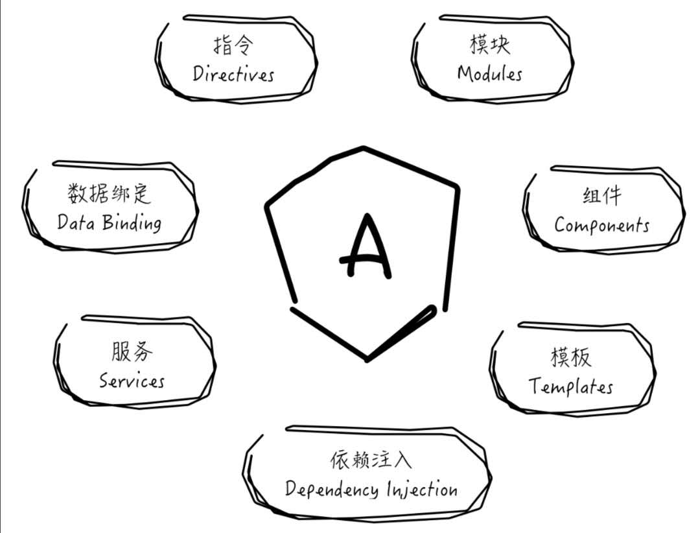
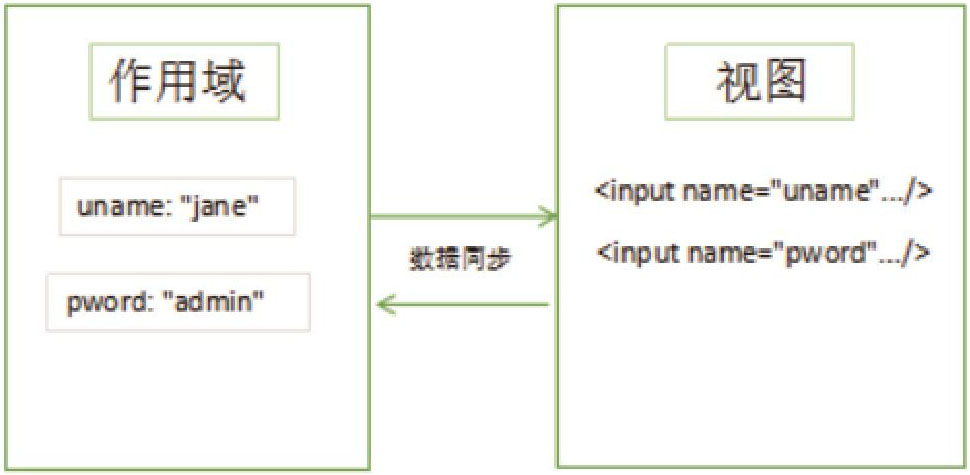
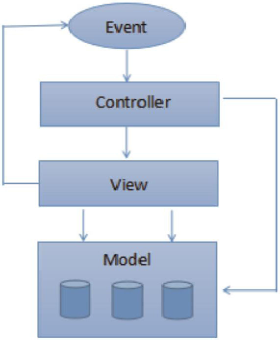
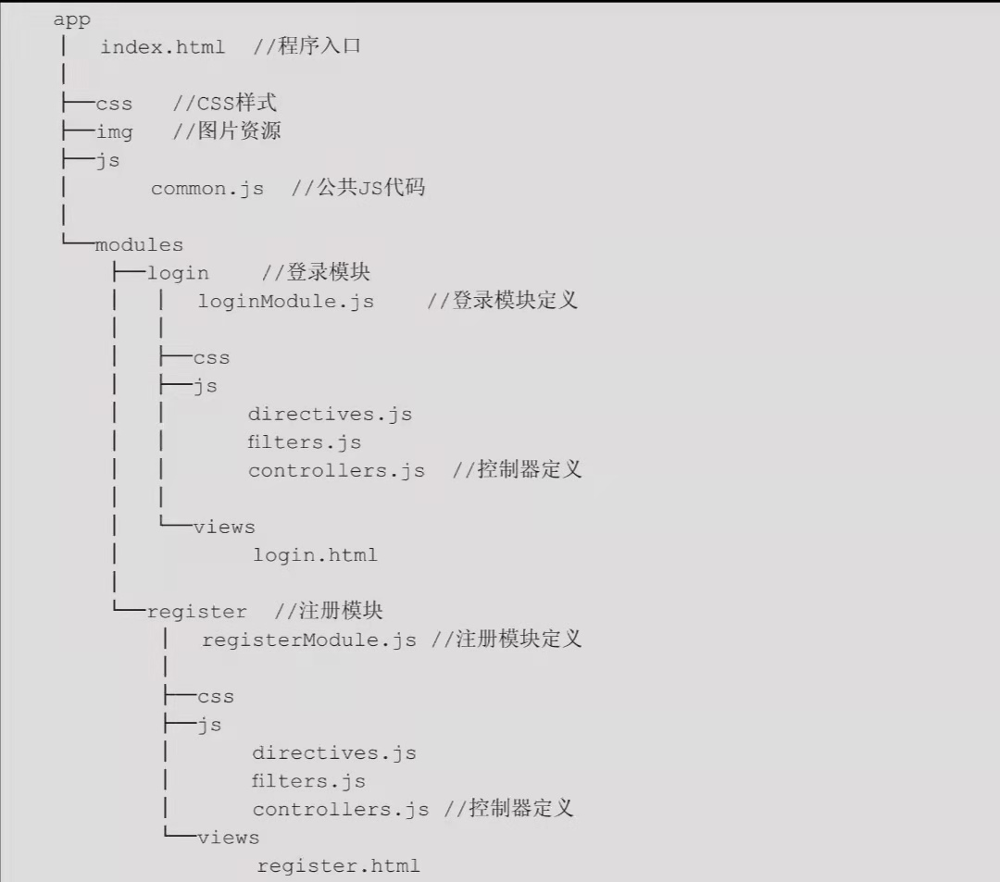
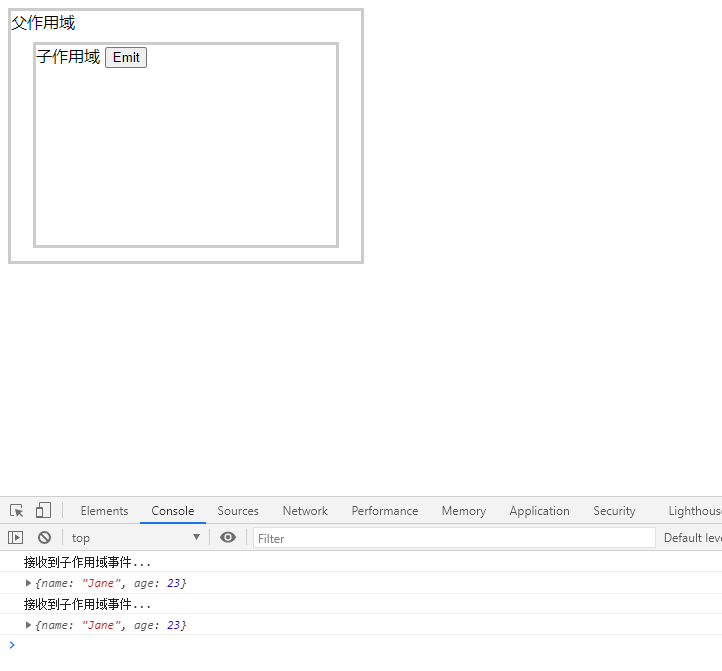
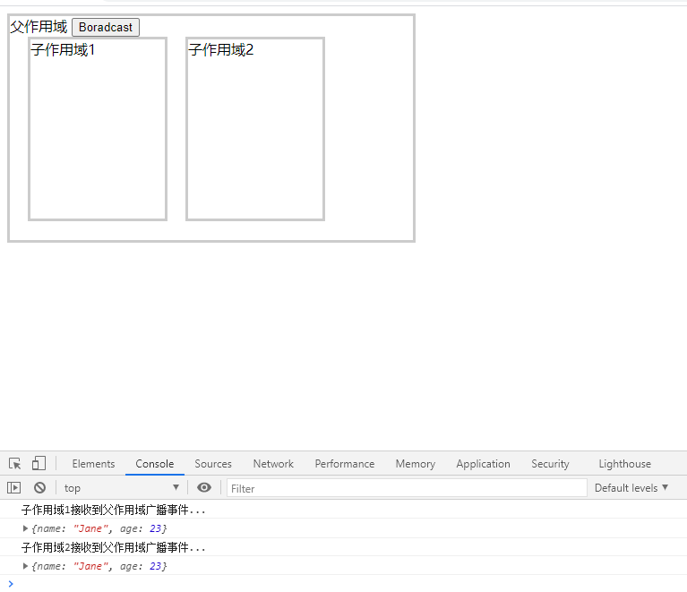

<!-- TOC -->

- [1. Angular简述](#1-angular简述)
  - [1.1 核心概念](#11-核心概念)
  - [1.2 AngularJS应用构成元素](#12-angularjs应用构成元素)
  - [1.3 AngularJS表达式](#13-angularjs表达式)
- [2. 双向数据绑定](#2-双向数据绑定)
  - [2.1 AngularJS双向数据绑定](#21-angularjs双向数据绑定)
  - [2.2 ng-model指令](#22-ng-model指令)
  - [2.3 ng-bind指令](#23-ng-bind指令)
  - [2.4 数据绑定示例：价格计算器](#24-数据绑定示例价格计算器)
- [3. AngularJS与MVC](#3-angularjs与mvc)
  - [3.1 MVC模式简介](#31-mvc模式简介)
  - [3.2 AngularJS中的MVC](#32-angularjs中的mvc)
  - [3.4 控制器的作用域范围](#34-控制器的作用域范围)
  - [3.5 控制器中处理DOM事件](#35-控制器中处理dom事件)
- [4. 应用模块化](#4-应用模块化)
  - [4.1 应用模块划分的重要性](#41-应用模块划分的重要性)
  - [4.2 AngularJS中的模块](#42-angularjs中的模块)
- [5. 作用域与事件](#5-作用域与事件)
  - [5.1 AngularJS作用域详解](#51-angularjs作用域详解)
  - [5.2 AngularJS作用域继承](#52-angularjs作用域继承)
  - [5.3 作用域高级特性](#53-作用域高级特性)
  - [5.4 作用域事件路由域广播](#54-作用域事件路由域广播)

<!-- /TOC -->

# 1. Angular简述

## 1.1 核心概念

Angular框架有7大核心概念，它们是Angular的重要组成部分



Angular以HTML作为模板语言并扩展HTML元素及属性，使得应用组件开发保持高度清晰、一致。

## 1.2 AngularJS应用构成元素

- 模型（Model）：AngularJS程序中用于展示到页面的数据，本质是一个JavaScript对象。
- 视图（View）：从用户角度来看，视图就是用户所看到的网页内容；从AngularJS应用的角度来说，视图则是AngularJS指令与表达式经过解析后的DOM元素。
- 控制器（Controller）：AngularJS应用中用于处理业务逻辑的JavaScript方法。
- 作用域（Scope）：可以把作用域理解为一个容器，在控制器中可以访问这个容器，然后往容器中放入一些模型数据，在视图中就可以通过表达式将数据展现给用户
- 指令（Directives）：扩展的HTML属性或标签，能够被AngularJS框架识别，根据不同的指令执行相应的动作。例如，ng-app指令，作为html元素的扩展属性，能够被AngularJS识别，从而启动Angular框架
- 表达式（Expressions）：用于单向页面输出信息
- 模板（Template）：AngularJS以HTML作为模板语言，AngularJS模板实际上就是HTML片段。

## 1.3 AngularJS表达式

1、表达式的定义式

---
> {{expression}}

---

2、表达式中的四则运算

AngularJS表达式支持加减乘除四则运算及字符串拼接运算。

```html
<!DOCTYPE html>
<html ng-app>
<head>
    <meta charset="UTF-8">
    <title>ch01_05</title>
    <script type="text/javascript" src="../angular-1.5.5-angular.js"></script>
</head>
<body>
    <div>1 + 2 = {{1 + 2}}</div>
    <div>5 - 3 = {{5 - 3}}</div>
    <div>5 * 3 = {{5 * 3}}</div>
    <div>10 / 2 = {{10 / 2}}</div>
    <div>"hello " + "world" = {{"hello " + "world"}}</div>
</body>
</html>
```

3、表达式中的逻辑运算

AngularJS表达式除了支持算术运算外，还支持逻辑运算。

```html
<!DOCTYPE html>
<html ng-app>
<head>
    <meta charset="UTF-8">
    <title>ch01_02</title>
    <script type="text/javascript" src="../angular.js"></script>
</head>
<body>
    <div> 1 || 0 = {{1 || 0}}</div>
    <div>true && false = {{true && false}}</div>
</body>
</html>
```

4、表达式与作用域

AngularJS表达式可以访问作用域中的数据，把数据输出到HTML页面

```html
<!DOCTYPE html>
<html ng-app>
<head>
    <meta charset="UTF-8">
    <title>ch01_03</title>
    <script type="text/javascript" src="../angular.js"></script>
</head>
<body ng-init="person={'name': 'jane'};arr=['angularjs', 'jquery', 'react']">
    <div>{{person.name}}</div>
    <div>{{arr[0]}}</div>
</body>
</html>
```

上述示例中，通过ng-init指令向作用域中增加一个person对象和arr数组。

# 2. 双向数据绑定

## 2.1 AngularJS双向数据绑定

数据绑定是AngularJS框架在视图（DOM元素）与作用域之间建立的数据同步机制。所谓“双向”，是指界面的操作能够实时同步到作用域中，作用域中的数据修改也能够实时回显到界面中。

作用域可以被视为一个容器，里面有一些基于key-value的数据。

如下图，有两个输入框，当输入框内容发生变化时，AngularJS框架就把表单内容同步到作用域中对应的变量中，而当改变作用域中的变量时，AngularJS又会把修改后的变量值同步到表单中，这就是AngularJS的双向数据绑定。



## 2.2 ng-model指令

AngularJS内部为我们提供了一个内置指令ng-model用于建立数据绑定。该指令只能用在表单元素上。

---
> `<input type='text' name="uname" ng-model="uname" />`

---

上述代码中，在input输入框上添加ng-model指令后，AngularJS框架就会子对应的作用域中创建一个uname属性和该输入框进行绑定。

**示例**：原生JS通过document对象的getElementById()方法获取输入框对象，响应输入框keyup事件。

```html
<!DOCTYPE html>
<html>
<head>
    <meta charset="utf-8">
    <title>原生JS操作DOM</title>
</head>
<body>
    <div>用户名：<input = type='text' name='uname' id='uname' /></div>
    <div><span id='info'></span></div>
    <script>
        var uname = document.getElementById('uname');
        var info = document.getElementById('info');
        uname.onkeyup = function(){
            info.innerHTML = uname.value;
        }
    </script>
</body>
</html>
```

**示例**：AngularJS数据绑定机制实现

```html
<!DOCTYPE html>
<html>
<head>
    <meta charset="utf-8">
    <title>AngularJS数据绑定机制</title>
    <script type="text/javascript" src="../angular.js"></script>
</head>
<body>
    <div>用户名：<input type='text' ng-model='uname' /></div>
    <div>{{uname}}</div>
</body>
</html>
```

## 2.3 ng-bind指令

ng-bind指令是和数据绑定相关的另一个指令，其作用是实现作用域到视图的单向数据绑定，和表达式功能类似，可用于向界面中输出作用域中的数据。

AngularJS表达式`{{name}}`会受到网络影响。若遇到网络问题，就会导致AngularJS加载缓慢，浏览器就会直接将AngularJS表达式当作字符串渲染到页面中。ng-bind指令在AngularJS没有加载完毕的时候是不会解析执行的，只有AngularJS架子完毕才会执行。

## 2.4 数据绑定示例：价格计算器

```html
<!DOCTYPE html>
<html ng-app>
<head>
    <meta charset="utf-8">
    <title>价格计算器</title>
    <script type="text/javascript" src="../angular.js"></script>
</head>
<body ng-init="price=10;num=1">
    <div>单价：<input type="number" ng-model="price" /></div><br />
    <div>数量：<input type="number" ng-model="num" /></div><br />
    <div>总价：{{price * num}}</div>
</body>
</html>
```

# 3. AngularJS与MVC

## 3.1 MVC模式简介

MVC是一种软件架构模式，独立于任何一门语言。

MVC是Model（模型）、View（视图）、Controller（控制器）的首字母缩写，MVC核心思想是把数据的管理、业务逻辑控制和数据的展示分离开，使程序的逻辑性和可维护性更强。它们之间的关系如下图



View（视图）为用户可操作的软件界面，用户通过视图和程序进行交互，在视图中会触发不同的事件，例如单击按钮、输入文字等，不同的事件能够触发控制器执行相应的业务逻辑处理。

Controller（控制器）主要用于相应用户请求，在控制器中可操作模型数据，进行业务逻辑处理，根据处理结果分发到不同的视图。

Model（模型）为程序中的模型数据，是控制器与视图之间传递信息的载体。

## 3.2 AngularJS中的MVC

AngularJS中的MVC分别指

- Model（模型）：作用域对象（例如$rootScope对象）中的属性
- View（视图）：DOM元素，从用户角度来看就是HTML页面，在View中可以通过AngularJS表达式访问模型数据
- Controller（控制器）：用户自定义的构造方法，作用域中的模型数据可以通过依赖注入的方式注入控制器中。

1、AngularJS控制器的定义

AngularJS控制器是一个构造方法。JavaScript方法可以作为对象模板实例化对象，当方法作为对象模板时，方法本身即为对象的构造方法。所以可以像定义一个普通方法一样定义一个控制器。

```html
<script type="text/javascript">
 function LoginController($scope, $log){
     $scope.name="admin";
     $scope.pword="123456";
 }
</script>
```

除了上述的方式外，还可以使用模块实例的controller()方法来声明一个控制器。该方法可接收两个参数，第一个参数为控制器名称，第二个参数为一个匿名方法，即控制器的构造方法，具体使用方法如下：

```html
<script type="text/javascript">
    var app = angular.module("app", []);
    app.controller("LoginController", function($scope, $log){
        $scope.name="admin";
        $scope.pword="123456";
    });
</script>
```

上述代码中，AngularJS框架在window对象中增加了一个全局的angular对象，可以调用angular对象的module方法返回一个模块实例，然后调用模块实例的controller()方法来声明一个控制器。在定义控制器时制定了两个参数，即$scope和$log：$scope时作用域对象，是控制器与视图之间传递信息的载体；$log为AngularJS框架内置的日志服务对象，用于向控制台中输入日志信息。当为控制器构造方法指定这两个参数后，表示控制器依赖于这两个对象，控制器实例化时会把这两个对象注入控制器中。

**注**：AngularJS1.3版本之后已不再支持全局控制器，第一种控制器定义方式只适用于AngularJS1.3之前的版本。

2、控制对象的实例化

控制器对象的实例化用的时AngularJS内置的ng-controller指令。ng-controller的使用方法和ng-app指令类似，也是作为标签的扩展性使用。

---
> `<div ng-controller="LoginController"></div>`

---

AngularJS框架遇到ng-controller指令时会根据ng-controller指令指定的控制器名称查找控制器构造方法，然后使用对应的构造方法实例化控制器对象，并将控制器依赖的对象注入控制器对象中。

```html
<!DOCTYPE html>
<html>
<head>
    <meta charset="utf-8">
    <title>价格计算器</title>
    <script src="../angular.js"></script>
</head>
<body>
    <div ng-app='myApp' ng-controller="myCtrl">
        <div>单价：<input type="number" ng-model="price"></div><br>
        <div>数量：<input type="number" ng-model="num"></div><br>
        <div>总价：{{totalPrice()}}</div>
    </div>
    <script>
        function CalcController($scope){
            $scope.price = 10;
            $scope.num = 1;
            $scope.totalPrice = function(){
                return $scope.price * $scope.num;
            }
        }
        var app = angular.module('myApp', []);
        app.controller("myCtrl", CalcController)
    </script>
</body>
</html>
```

## 3.4 控制器的作用域范围

使用ng-controller指令实例化控制器时会产生一个新的作用域对象，而且同一个页面中可以使用多个ng-controller指令来实例化不同的控制器对象。但是需要注意的是，每个控制器对应的作用域对象只能与ng-controller指令所在标签的开始标签与结束标签之间的DOM元素建立数据绑定。

```html
<!doctype html>
<html ng-app="app">
<head>
    <meta charset="UTF-8">
    <title>ch03_02</title>
    <script type="text/javascript" src="../angular.js">
    </script>
</head>
<body>
    <div ng-controller="UserController" style="border:#ccc solid 1px;">
        用户名：<input type="text" ng-model="name" placeholder="用户名"/><br>
        密码：<input type="password" ng-model="pword" placeholder="密码"/><br>
        <button>提交</button><br>
        <p>您输入的用户名：{{name}}</p>
        <p>您输入的密码：{{pword}}</p>
    </div>
    <br/>
    <div ng-controller="InfoContoller" style="border:#ccc solid 1px;">
        个人爱好：<input type="text" ng-model="love" placeholder="个人爱好"/>
        <p>您输入的个人爱好：{{love}}</p>
    </div>
    <script>
        function UserController($scope,$log) {
            $scope.name="admin";
            $scope.pword="123456";
            $log.info("UserController->name:" +$scope.name);
            $log.info("UserController->pword:" + $scope.pword);
        }
        function InfoContoller($scope,$log) {
            $scope.love="足球";
            $log.info("InfoContoller->name:" + $scope.name);
            $log.info("InfoContoller->pword:" + $scope.pword);
            $log.info("InfoContoller->love:" + $scope.love);
        }
        var app = angular.module("app",[]);
        app.controller("UserController",UserController);
        app.controller("InfoContoller",InfoContoller);
    </script>
</body>
</body>
</html>
```

## 3.5 控制器中处理DOM事件

AngularJS应用中的DOM事件处理可以在控制器中完成。AngularJS框架提供了一系列的事件指令，这些指令是在原生的JavaScript事件名称前增加“ng-”前缀，例如：ng-click、ng-keyup等。

```html
<!doctype html>
<html ng-app="app">
<head>
    <meta charset="UTF-8">
    <title>ch03_03</title>
    <script type="text/javascript" src="../angular.js">
    </script>
</head>
<body>
<div class="container" ng-controller="LoginController">
<div class="login-title text-center">
        <h1><small>登录</small></h1>
</div>
<div class="form">
    <div class="form-group">
        <div class="col-xs-12">
            <div class="input-group">
                <span class="input-group-addon">
                <span class="glyphicon glyphicon-user"></span>
                </span>
                <input type="text" ng-model="uname" class="form-control"
                            placeholder="用户名">
            </div>
        </div>
    </div><br/><br/>
    <div class="form-group">
        <div class="col-xs-12">
            <div class="input-group">
                <span class="input-group-addon">
                <span class="glyphicon glyphicon-lock"></span>
                </span>
                <input type="text" ng-model="pword" class="form-control"
                            placeholder="密码">
            </div>
        </div>
    </div><br/><br/>
    <div class="form-group form-actions">
        <div class="col-xs-4 col-xs-offset-4 ">
            <button ng-click="login()" type="submit" class="btn btn-sm btn-info">
                <span class="glyphicon glyphicon-log-in"> </span>
                    登录
            </button>
            <button type="reset" class="btn btn-sm btn-info">
                <span class="glyphicon glyphicon-off"> </span>
                重置
            </button>
        </div>
    </div>
</div>
</div>
<script>
    function LoginController($scope) {
        $scope.login = function(){
            if($scope.uname == "admin"
                && $scope.pword == "admin"){
                alert("登录成功！");
            } else {
                alert("用户名密码错误，请检查！");
            }
        }
    }
    var app = angular.module("app",[]);
    app.controller("LoginController",LoginController);
</script>
</body>
</html>
```

# 4. 应用模块化

## 4.1 应用模块划分的重要性

在软件设计过程中对软件进行模块划分可以拥有以下好处：

- 使程序实现的逻辑更加清晰，可读性强
- 使多人合作开发的分工更加明确，容易控制
- 能充分利用可以重用的代码。
- 抽象出可公用的模块，可维护性强，以避免同一处修改在多个地方出现。
- 系统运行可方便地选择不同的流程。
- 可基于模块化设计优秀的遗留系统，方便组装开发新的相似系统，甚至一个全新的系统。

## 4.2 AngularJS中的模块

1、AngularJS模块的定义

AngularJS框架在window对象下新增了一个全局的angular对象，可以调用angular对象的module()方法返回一个模块实例，具体使用方法如下：

```js
// 定义一个无依赖模块
angular.module('appModule', []);
// 定义一个依赖module1、module2的模块
angular.module('AppModule', ['module1', 'module2']);
```

angular.module()方法能够接收3个参数。第一个参数为模块的名称。第二个参数是一个数组，用于指定该模块依赖的模块名称。如果我们的模块不需要依赖的模块名称。如果我们的模块不需要依赖其他模块，第二个参数传递一个空数组即可。第三个参数为可选参数，该参数接收一个方法，用于对模块进行配置，作用和模块实例的config()方法相同。

angular.module()方法返回一个模块实例对象，可以调用该对象的controller()、directive()、filter()等方法向模块中添加控制器、指令、过滤器等其他组件。

模块定义好之后，我们可以在使用ng-app指令时指定模块名即可，例如：

---
> `<html ng-app="appModule">`

---

2、 使用模块解决命名冲突问题

实例：假设有两个HTML页面，在两个页面中引入一个公共的common.js文件，将控制器的定义放在common.js文件中，当两个页面定义的控制器名称相同时就会产生命名冲突。

登录页面

```html
<!doctype html>
<html ng-app="loginModule">
<head>
    <meta charset="UTF-8">
    <title>登录页面</title>
    <script src='../angular.js'></script>
    <script src='common.js'></script>
</head>
<body>
    <div ng-controller='UserController'>
        <div>用户名：<input type="text" ng-model="uname" placeholder="用户名"></div><br>
        <div>密码：<input type="password" ng-model="pword" placeholder="密码" /></div><br>
        <div><button ng-click="submit()">登录</button></div>
    </div>
</body>
</html>

```

上述代码中，我们使用`ng-controller`实例化名为`UserController`控制器，该控制器在common.js文件中定义。

注册页面

```html
<!DOCTYPE html>
<html ng-app="registerModule">
<head>
    <meta charset="UTF-8">
    <title>注册页面</title>
    <script src="../angular.js"></script>
    <script src="common.js"></script>
</head>
<body>
    <div ng-controller="UserController">
        <div>用户名：<input type="text" ng-model="uname" placeholder="用户名"></div><br>
        <div>密码：<input type="password" ng-model="pword" placeholder="密码"></div><br>
        <div><button ng-click="submit()">注册</button></div>
    </div>
</body>
</html>

```

上述代码中，我们通过`ng-controller`实例化名为`UserController`控制器，该控制器在common.js文件中定义。

common.js

```js
var loginModule = angular.module("loginModule", []);
loginModule.controller("UserController", function($scope, $log){
    $scope.uname = "login";
    $scope.pwrod = "admin";
    $scope.submit = function () { 
        alert("登录模块： UserController");
     };
});

var registerModule = angular.module("registerModule", []);
registerModule.controller("UserController", function ($scope, $log) { 
    $scope.uname = "register";
    $scope.pwrod = "admin";
    $scope.submit = function () {
        alert("注册模块：UserController");
    };
 });
```

上述代码中，我们使用`angular.module()`方法创建了两个模块实例，名称分别为`loginModule`和`registerModule`，然后分别调用这两个模块实例的`controller()`方法创建两个名称均为`UserController`的控制器，这两个控制器属于不同的模块。

3、模块化最佳实践

假设项目名称为app，下面有两个模块，分别为`login`和`register`，参考AngularJS官方建立，可以按照下图目录结构组织项目



# 5. 作用域与事件

## 5.1 AngularJS作用域详解

JavaScript对象是基于key-value键值对的，我们可以把JavaScript对象作为一个map数据结构使用，而AngularJS作用域本质上就是一个普通的JavaScript对象，形式如下：

```js
var obj = {
    name: 'Jane',
    age: 30,
    walk: function(){
        console.info("walk");
    }
}
```

AngularJS作用域对象和普通JavaScript对象一样，都可以子作用对象中增加属性或者方法，不同的是我们不需要手动去构造作用域对象，当HTML页面中出现`ag-app`和`ng-controller`指令时，AngularJS框架会自动创建作用域对象，我们只需将其注入即可。

AngularJS程序中作用域的主要功能是存放模型数据，在控制器中，我们可以修改作用域中的模型数据或在作用域中新增模型数据(例如：$scope.address='China')，然后在视图中通过AngularJS表达式展示模型数据(例如：{{address}})

每个AngularJS应用至少会有一个名为`$rootScope`的作用域，它是AngularJS应用的根作用域，它是AngularJS应用的根作用域。

当AngularJS启动时会自动创建一个根作用域对象`$rootScope`，接着当我们使用`ng-controller`指令实例化控制器对象时，AngularJS框架会为我们创建一个子作用域`$scope`，默认情况下，该子作用域会继承`$rootScope`作用域的所有属性。

## 5.2 AngularJS作用域继承

1、JavaScript对象继承机制

JavaScript构造对象通常有两种方式。第一种方法通过字面量创建，形式如下：

```js
var obj = {
    name: 'jane',
    age: 32
};
```

另一种方式是通过对象的构造方法来创建，需要用到function关键字。

```js
function Person(name,age){
    this.name = name;
    this.age = age;
    this.eat = function(){
        console.log('eat...');
    }
}
```

当使用构造方法创建对象时需要用到JavaScript的`new`关键字，使用方法如下：

---
> var persion = new Person('Jane', 32)

---

在实际项目中，当我们明确地使用function关键字定义一个构造方法时，构造方法名称通常采用帕斯卡命名法，即大驼峰（每个单词首字母大写）；而使用function定义一个普通方法时，方法名称可采用小驼峰的方式来命名。

JavaScript语言实现对象继承的3种方式

(1)、构造方法原型链继承

每个JavaScript构造方式都有一个名称为prototype的属性，可以指向另一个对象。当我们访问对象属性时，JavaScript引擎会从对象的所有属性中查找该属性，如果找到就返回属性值，如果没有找到就继续从prototype属性指向的对象属性种查找，如果仍然没有找到，则会沿着prototype链一直查找下去，直到prototype链结束或找到对象为止。

```html
<!DOCTYPE html>
<html>
<head>
    <meta charset="UTF-8">
    <title>构造方法原型链继承</title>
</head>
<body>
    <script type="text/javascript">
        function Animal(){
            this.eat = function(){
                console.log('eat...');
            }
        }
        function Cat(age){
            this.age = age;
        }
        Cat.prototype = new Animal();
        var cat = new Cat(10);
        console.log('cat.age=' + cat.age);
        cat.eat();
    </script>
</body>
</html>
```

(2)、 使用apply、call方法实现继承

由于JavaScript构造方法的apply()、call()方法可以改变对象构造中"this"的上下文环境，使特定的对象实例具有对象构造中所定义的属性方法，因此我们可以使用apply()、call()方法实现JavaScript对象的继承。

```html
<!DOCTYPE html>
<html>
<head>
    <meta charset="UTF-8">
    <title>使用apply、call方法实现继承</title>
</head>
<body>
    <script type="text/javascript">
        function Person(name, age) { 
            this.name = name;
            this.age = age;
         }
         function Student(name, age, love) { 
             // Person.apply(this, [name, age]);
             Person.call(this, name, age);
             this.love = love;
          }
          var student = new Student('jane', 23, 'ingpong');
          console.log('student.name='+student.name);
          console.log('student.age='+student.age);
          console.log('student.love='+student.love);
    </script>
</body>
</html>
```

(3)、对象实例间继承

JavaScript中，对象可以继承另外一个对象的属性，如下：

```html
<!DOCTYPE html>
<html>
<head>
    <meta charset="utf-8">
    <title>对象实例继承</title>
</head>
<body>
    <script type="text/javascript">
        function Person(name, age){
            this.name = name;
            this.age = age;
        }
        var persion = new Person('jane', 28);
        var student = Object.create(persion);
        student.love = 'pingpong';
        console.log(Object.getPrototypeOf(student));
        console.log('student.name --> ' + student.name);
        console.log('student.age --> ' + student.age);
        console.log('student.love --> ' + student.love);
    </script>
</body>
</html>
```

2、AngularJS作用域对象原型继承

AngularJS作用域构造方法中提供了一个`$new()`成员方法，用于创建子作用域。AngularJS框架创建子作用与的过程达之如下：

```js
var parent = $rootScope;
var child = parent.$new();
```

## 5.3 作用域高级特性

1、`$watch`方法监视作用域

`$watch()`方法，可以帮助我们监视作用域中属性的变化。

```html
<!DOCTYPE html>
<html ng-app='watchModule'>
<head>
    <meta charset="UTF-8">
    <title>watchModule</title>
    <script type="text/javascript" src="../angular.js"></script>
</head>
<body>
    <input ng-model='name' type="text" />
    <div>change count: {{count}}</div>
    <script>
        angular.module('watchModule', []).run(
            ['$rootScope', function ($rootScope) { 
                $rootScope.count=0;
                $rootScope.name = 'xxxx';
                $rootScope.$watch('name', function () { 
                    $rootScope.count ++;
                 })
             }]);
    </script>
</body>
</html>
```

`$watch()`方法可以接收三个参数，第一个参数时需要监视的属性；第二个参数是监视属性发生变化时需要回调的方法；第三个参数默认情况下为false，默认情况下，即不显示指明第三个参数或者将其指明为false时，我们进行的监视叫做“应用监视”，也就是说只要监视的对象引用没有发生变化，就不算它发生变化。如果第三个参数为true，此时进行的监视叫做“全等监视”，此时只要监视的属性发生变化，`$watch`就会执行相应的回调方法。

2、作用域监视解除

```html
<!DOCTYPE html>
<html ng-app='watchModule'>
<head>
    <meta charset="UTF-8">
    <title>watchModule</title>
    <script type="text/javascript" src="../angular.js"></script>
</head>
<body>
    <input ng-model='num' type="number" />
    <div>change count: {{count}}</div>
    <script>
        angular.module('watchModule', []).run(
            ['$rootScope', function ($rootScope) { 
                $rootScope.count=0;
                $rootScope.num = 100;
                var unbindWatcher = $rootScope.$watch('num', function (newValue, oldVaule) { 
                    if (newValue == 2){
                        unbindWatcher();
                    }
                    $rootScope.count ++;
                 })
             }]);
    </script>
</body>
</html>
```

3、`$apply`方法与`$digest`循环

在`$digest`循环中，watchers会被触发。当一个watcher被触发时，AngularJS会检测scope模型，如果它发生了变化，那么关联到该watcher的回到方法就会被调用。

```html
<!DOCTYPE html>
<html ng-app="msgModule">
<head>
    <meta charset="UTF-8">
    <title>msgModule</title>
    <script type="text/javascript" src="../angular.js"></script>
</head>
<body>
    <div ng-controller="MsgController">
        <div>
            <button ng-click="scheduleTask()">3秒后回显信息</button>
        </div>
        <div>
            {{message}}
        </div>
    </div>
    <script>
        angular.module('msgModule', []).controller('MsgController', function($scope){
            $scope.scheduleTask=function(){
                setTimeout(function(){
                    $scope.message='信息内容';
                    console.log('message = ' + $scope.message);
                }, 3000);
            }
        });
    </script>
</body>
</html>
```

上述代码运行后，单击按钮3s后，控制台中输出信息，说明我们在作用域中添加message属性成功，但是页面中并没有回显任何内容，这种情况下AngularJS框架无法自动触发`$digest`循环，需要我们手动调用`$apply()`方法来触发`$digest`循环。`$apply()`方法接收一个方法作为参数。

```html
<!DOCTYPE html>
<html ng-app="msgModule">
<head>
    <meta charset="UTF-8">
    <title>msgModule</title>
    <script type="text/javascript" src="../angular.js"></script>
</head>
<body>
    <div ng-controller="MsgController">
        <div>
            <button ng-click="scheduleTask()">3秒后回显信息</button>
        </div>
        <div>
            {{message}}
        </div>
    </div>
    <script>
        angular.module('msgModule', []).controller('MsgController', function($scope){
            $scope.scheduleTask=function(){
                setTimeout(function(){
                    $scope.$apply(function(){
                        $scope.message='信息内容';
                        console.log('message = ' + $scope.message);
                    });
                }, 3000);
            }
        });
    </script>
</body>
</html>
```

5、`$timeout`与`$interval`服务介绍

JavaScript中setInterval()方法，作用时每隔一段时间调用一次特定的JavaScript方法。setTimeout()和setInterval()两个方法都需要我们手动调用`$apply()`方法来触发`$digest`循环。

## 5.4 作用域事件路由域广播

AngularJS作用域支持下面两种事件传播方式

- 事件从子作用域路由到父作用域中
- 事件从父作用域广播到所有子作用域中。

与AngularJS作用域事件相关的方法有`$on()`、`$emit()`、`broadcast()`

1、`$emit()`方法实现事件路由

`$emit()`方法用于实现事件从子作用域路由到父作用域中，`$emit()`方法第一个参数为事件名称，后面可以传入一个或多个参数，这些参数能够被传递到父作用域注册的事件监听器中。`$emit()`方法使用如下

---
> `$scope.$emit("infoEvent", {name:"Jane", age:23});`

---

消息发送出去以后，我们可以在父作用域中调用AngularJS作用域对象的`$on()`方法，注册一个事件监听器监听子作用域路由的事件

```html
<!DOCTYPE html>
<html ng-app="eventModule">
<head>
    <meta charset="UTF-8">
    <title>eventModule</title>
    <script type="text/javascript" src="../angular.js"></script>
    <style>
        #parent{
            width: 350px;
            height: 250px;
            border: 3px solid #cccccc;
        }
        #child{
            width: 300px;
            height: 200px;
            border: 3px solid #cccccc;
            margin: 10px auto;
        }
    </style>
</head>
<body>
    <div id="parent" ng-controller='ParentController'>
        <!--父级作用域-->
        父作用域
        <div id="child" ng-controller="ChildController">
            <!--子级作用域-->
            子作用域
            <button ng-click="postEvent()">Emit</button>
        </div>
    </div>
    <script>
        var app = angular.module('eventModule', []);
        app.controller('ParentController', function($scope){
            $scope.$on("infoEvent", function(event, data){
                console.log("接收到子作用域事件...");
                console.log(data);
            });
        });
        app.controller('ChildController', function ($scope) { 
            $scope.postEvent=function(){
                $scope.$emit("infoEvent", {name:"Jane", age:23});
            }
         });
    </script>
</body>
</html>
```

上述代码运行结果



2、`$broadcast`方法实现事件广播

`$broadcast()`方法的使用和`$emit()`方法相同，不同的是，`$broadcast()`用于向子作用域广播事件，所有的子作用域只要注册了事件监听器就能收到父作用域的广播事件。

```html
<!DOCTYPE html>
<html ng-app='eventModule'>
<head>
    <meta charset="UTF-8">
    <title>eventModule2</title>
    <script type="text/javascript" src="../angular.js"></script>
    <style>
        #parent{
            width: 450px;
            height: 250px;
            border: 3px solid #cccccc;
        }
        .child{
            width: 150px;
            height: 200px;
            border: 3px solid #cccccc;
            float: left;
            margin-left: 20px;
        }
    </style>
</head>
<body>
    <div id="parent" ng-controller="ParentController">
        <!--父级作用域-->
        <div>父作用域
            <button ng-click="postEvent()">Boradcast</button>
        </div>
        <div class="child" ng-controller="Child1Controller">
            <!--子作用域1-->
            子作用域1
        </div>
        <div class="child" ng-controller="Child2Controller">
            <!--子作用域2-->
            子作用域2
        </div>
    </div>
    <script>
        var app = angular.module('eventModule', []);
        app.controller('ParentController', function($scope){
            $scope.postEvent = function(){
                $scope.$broadcast("infoEvent",{name:"Jane", age:23});
            }
        });
        app.controller('Child1Controller', function($scope){
            $scope.$on("infoEvent", function(event, data){
                console.log("子作用域1接收到父作用域广播事件...");
                console.log(data);
            });
        });
        app.controller('Child2Controller', function($scope){
            $scope.$on("infoEvent", function(event, data){
                console.log("子作用域2接收到父作用域广播事件...");
                console.log(data);
            });
        });
    </script>
</body>
</html>
```

运行结果：



3、作用域对象`$on`方法详解

`$on()`方法用于注册一个事件监听器，该方法接收两个参数，第一个参数是要监听事件的名称，第二个参数是事件处理方法，具体使用如下：

```js
$scope.$on("infoEvent", function(event, data){
});
```

事件处理方法的第一个参数event为事件对象，第二个参数data为调用`$emit()`或`$broadcast()`方法传递的数据。
需要注意的是，event事件对象具有一些实用的属性和方法，我们能够通过它获取更多关于事件的信息，具体如下：

- event.name：事件的名称。
- event.targetScope：事件源作用域对象。
- event.currentScop：当前作用域对象。
- event.stopPropagation()：这个方法用于停止事件的进一步传播。需要注意的是，该方法只对向父作用域路由事件起作用，当在某个事件监听处理方法调用事件对象的stopPropagation()方法后，事件将不会再向上级父作用域路由。它对调用`$broadcast()`方法广播的事件不起作用。
- event.preventDefault()：这个方法实际上不会做什么操作，但是会设置defaultPrevented属性为true，直到事件监听器的实现者采取行动之前才会检查defaultPrevented的值。
- event.defaultPrevented：如果调用了event.preventDefault()方法，那么该属性将被设置为true。
