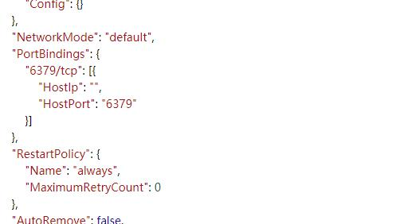

在docker run创建并运行容器的时候，可以通过`-p`参数指定端口映射规则。但是当容器已经运行起来之后，可以通过以下几种方式修改docker容器的端口映射：

<font color='sky blue' size=4>1、删除原来容器，重新构建容器</font>

这种方式最为简单，将原容器删除之后，重新构建一个容器即可。

优缺点：
- 优点：简单快捷，测试环境中使用较多
- 缺点：若是数据库镜像，重建一个要重新配置一次，比较麻烦

<font color='sky blue' size=4>2、修改容器配置文件，重启docker服务</font>

容器的配置文件路径：

```text
/var/lib/docker/containers/[hash_of_the_container]/hostconfig.json
```

其中`hash_of_the_container`是docker镜像的hash值，可以通过docker ps或者docker inspect container name查看



上图中，PortBindings表示的就是端口映射的关系，其中6379/tcp对应的是容器内部的6379端口，HostPort对那个的是映射到宿主主机的端口6379。可以按照需求修改端口，然后重启docker服务，在启动容器服务即可。

```bash
systemctl restart docker
```

优缺点：
- 优点：没有副作用，操作简单
- 缺点：需要重启整个docker服务，回应其它容器服务

<font color='sky blue' size=4>3、利用docker commit新构镜像</font>

docker commit：把一个容器的文件改动和配置信息commit到一个新的镜像。把容器所有的文件改动和配置信息导入成一个新的docker镜像，然后用这个新的镜像重新启动一个容器，对之前的容器不会有任何影响。

1. 停止docker容器

```bash
$ docker stop container1
```

2. commit该docker容器

```bash
$ docker commit container1 new_image:tag
```

3. 用前一步新生成的镜像重启一个容器

```bash
$ docker run --name container2 -p 80:80 new_image:tag
```

优缺点：
- 优点：不会影响统一宿主机上的其他容器
- 缺点：管理起来显得比较乱，没有第二种方法那么直观。
