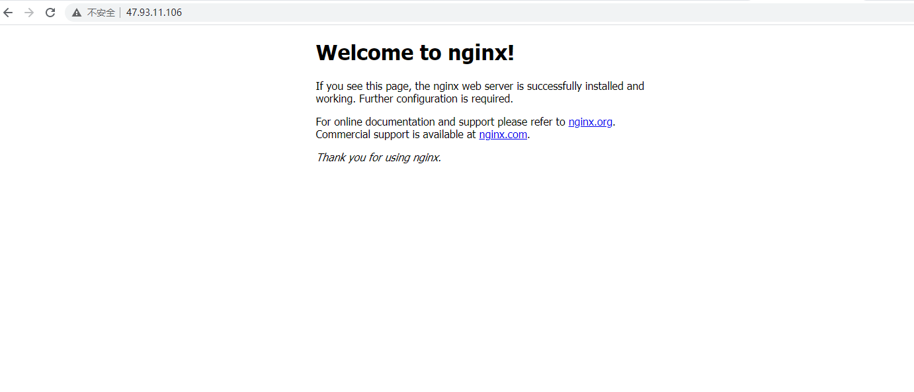

实验环境
- CentOS8.2
- Docker Version：20.10.3

### 1. 拉取nginx最新的版本

```bash
sudo docker pull nginx
```

### 2. 创建需要映射的目录

在`/mnt/docker/nginx/`下创建目录`conf.d`、`logs`和文件`nginx.conf`

```bash
touch nginx.conf
mkdir -p /mnt/docker/nginx/conf.d /mnt/docker/nginx/logs
```

编辑文件`nginx.conf`

```text
user www-data;
worker_processes auto;
pid /run/nginx.pid;

events {
        worker_connections 768;
        # multi_accept on;
}

http {

        ##
        # Basic Settings
        ##

        sendfile on;
        tcp_nopush on;
        tcp_nodelay on;
        keepalive_timeout 65;
        types_hash_max_size 2048;
        # server_tokens off;

        # server_names_hash_bucket_size 64;
        # server_name_in_redirect off;

        include /etc/nginx/mime.types;
        ##
        # SSL Settings
        ##

        ssl_protocols TLSv1 TLSv1.1 TLSv1.2; # Dropping SSLv3, ref: POODLE
        ssl_prefer_server_ciphers on;

        ##
        # Logging Settings
        ##

        access_log /var/log/nginx/access.log;
        error_log /var/log/nginx/error.log;

        ##
        # Gzip Settings
        ##

        gzip on;
        gzip_disable "msie6";

        # gzip_vary on;
        # gzip_proxied any;
        # gzip_comp_level 6;
        # gzip_buffers 16 8k;
        # gzip_http_version 1.1;

        ##
        # Virtual Host Configs
        ##

        include /etc/nginx/conf.d/*.conf;
        include /etc/nginx/sites-enabled/*;
}


#mail {
#       # See sample authentication script at:
#       # http://wiki.nginx.org/ImapAuthenticateWithApachePhpScript
#
#       # auth_http localhost/auth.php;
#       # pop3_capabilities "TOP" "USER";
#       # imap_capabilities "IMAP4rev1" "UIDPLUS";
#
#       server {
#               listen     localhost:110;
#               protocol   pop3;
#               proxy      on;
#       }
#
#       server {
#               listen     localhost:143;
#               protocol   imap;
#               proxy      on;
#       }
#}
```

### 3. 运行容器

```bash
sudo docker run -p 80:80 --name nginx -v /mnt/docker/nginx/nginx.conf:/etc/nginx/nginx.conf -v /mnt/docker/nginx/conf.d:/etc/nginx/conf.d -v /mnt/docker/nginx/logs:/var/log/nginx  -d nginx
```

### 4. 查看结果

在浏览器上访问`47.93.11.106:80`


