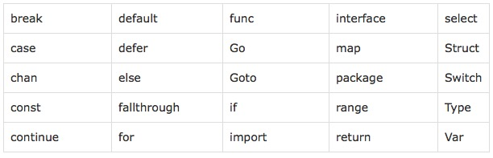

<!-- TOC -->

- [1、Go简介](#1go简介)
  - [1.1 Go语言的介绍](#11-go语言的介绍)
  - [1.2 核心特性](#12-核心特性)
  - [1.3 Go语言的特色](#13-go语言的特色)
  - [1.4 Go的编译](#14-go的编译)
    - [1. 跨平台编译](#1-跨平台编译)
  - [1.5 编码规范](#15-编码规范)
    - [1. 命名规范](#1-命名规范)
    - [2. 注释](#2-注释)
    - [3. 代码风格](#3-代码风格)

<!-- /TOC -->

# 1、Go简介

## 1.1 Go语言的介绍

Go语言具有很强的表达能力，它简洁、清晰而高效。得益于其并发机制， 用它编写的程序能够非常有效地利用多核与联网的计算机，其新颖的类型系统则使程序结构变得灵活而模块化。 Go 代码编译成机器码不仅非常迅速，还具有方便的垃圾收集机制和强大的运行时反射机制。 它是一个快速的、静态类型的编译型语言，感觉却像动态类型的解释型语言。

## 1.2 核心特性

1、并发编程

高并发是Golang语言最大的亮点。

golang的并发执行单元是一种称为goroutine的协程。

Golang是语言级别支持协程(goroutine)并发（协程又称为微线程，比线程更轻量、开销更小，性能更高），操作起来非常简单，语言级别提供关键字(go)用于启动协程，并且在同一台机器上可以启动成千上万个协程。协程经常被理解为轻量级线程，一个线程可以包含多个协程，共享堆不共享栈。协程间一般由应用程序显式实现调度，上下文切换无须下到内核层，高效不少。协程间一般不做同步通讯，而golang中实现协程间通讯有两种
1. 共享内存型，即使用全局变量+mutex锁来实现数据共享
2. 消息传递型，即使用一种独有的channel机制进行异步通讯

2、内存回收(GC)

- 内存自动回收，再也不需要开发人员管理内存
- 开发人员专注业务实现，降低了心智负担
- 只需要new分配内存，不需要释放

3、内存分配

初始化阶段直接分配一块大内存区域，大内存被切分成各个大小等级的块，放入不同的空闲list中，对象分配空间时从空闲list中取出大小合适的内存块。内存回收时，会把不用的内存重放回空闲list。空闲内存会按照一定策略合并，以减少碎片。

4、编译

编译涉及到的两个问题
1. 编译速度。目前两种编译器
   1. 建立在GCC基础上的Gccgo
   2. 针对64位X64和32位X86计算机的一套编译器（6g和8g）
2. 依赖管理。绝大多数第三方开源库都在github上，库会默认下载到工程的pkg目录下

5、网络编程

具备去中心化、分布式等特性，具体表现之一就是提供了丰富便捷的网络编程接口，比如socket用net.dial(基于tcp/udp，封装了传统的connect、listen、accept等接口)、http用http.Get/Post()、rpc用client.Call('class_name.method_name', args, &reply)等

6、函数多返回值

7、语言交互性

go语言可以和C程序交互，但不能和C++交互。有两种替代方案
1. 先将C++编译成动态库，再由go调用一段c代码，c代码通过dlfcn库动态调用动态库（记得export LD_LIBRARY_PATH）
2. 使用swig

8、异常处理

golang不支持try...catch这样的结构化的异常解决方式。golang提倡的异常处理方式是：
- 普通异常：被调用方返回error对象，调用方判断error对象
- 严重异常：指的是中断panic（比如除0），使用`defer...recover...panic`机制来捕获处理。严重异常一般由golang内部自动抛出，不需要用户主动抛出。当然，用户也可以使用panic('xxx')主动抛出，只是这样会使这套机制退化称结构化异常机制了。

9、其他特性

- 类型推导：类型定义：支持`var abc = 9`这样语法，看上去有点像动态类型语言，但是golang是强类型的，前面的定义会被自动推导出是int类型
- 一个类型只要实现了某个interface的所有方法，既可以实现该interface，无需显式去继承
- 不能循环应用
- defer机制：通过该关键字指定需要延迟执行的逻辑体，即在函数体return前或出现panic时执行。
- “包”的概念：将相同功能的代码放在一个目录，称之为包。包可以被其它包引用。main包是用来生成可执行文件，每个程序只有一个main包。
- 编程规范：GO语言的编程规范强制集成在语言中，比如明确规定花括号摆放位置，强制要求一行一句，不允许导入没有使用的包，不允许定义没有使用的变量，提供gofmt工具强制格式化代码等等。
- 交叉编译：比如说你可以在运行 Linux 系统的计算机上开发运行 Windows 下运行的应用程序。这是第一门完全支持 UTF-8 的编程语言，这不仅体现在它可以处理使用 UTF-8 编码的字符串，就连它的源码文件格式都是使用的 UTF-8 编码。

## 1.3 Go语言的特色

- 没有继承多态的面向对象
- 强一致类型
- interface不需要显式声明(Duck Typing)
- 没有异常处理(Error is value)
- 基于首字母的可访问特性
- 不用的import或者变量引起编译错误
- 完整而卓越的标准库包
- Go内置runtime（作用是性能监控、垃圾回收等）

## 1.4 Go的编译

使用`go build`
1. 在项目目录下执行`go build`
2. 在其他路径下执行`go build`，需要在后面加上项目的路径（项目路径从GOPATH/src开始写起，编译之后的可执行文件就保存在当前目录下）
3. `go build -o hello.exe`

### 1. 跨平台编译

默认`go build`的可执行文件都是当前操作系统可以执行的文件，如果在Windows下编译Linux下可执行文件的步骤如下

```bash
SET CGO_ENABLED=0 // 禁用CGO
SET GOOS=linux    // 目标平台是linux
SET GOARCH=adm64  // 目标处理器架构是amd64
```
*使用cgo的代码不支持跨平台编译的*

然后再执行go build命令，得到的就是能够在Linux平台运行的可执行文件了。

Mac 下编译 Linux 和 Windows平台 64位 可执行程序：
```bash
CGO_ENABLED=0 GOOS=linux GOARCH=amd64 go build
CGO_ENABLED=0 GOOS=windows GOARCH=amd64 go build
```

Linux 下编译 Mac 和 Windows 平台64位可执行程序：
```bash
CGO_ENABLED=0 GOOS=darwin GOARCH=amd64 go build
CGO_ENABLED=0 GOOS=windows GOARCH=amd64 go build
```

Windows下编译Mac平台64位可执行程序：
```bash
SET CGO_ENABLED=0
SET GOOS=darwin
SET GOARCH=amd64
go build
```

## 1.5 编码规范

### 1. 命名规范

Go在命名时以字母a到Z或a到Z或下划线开头，后面跟着零或更多的字母、下划线和数字(0到9)。Go不允许在命名时中使用@、$和%等标点符号。Go是一种区分大小写的编程语言。
> 1. 当命名（包括常量、变量、类型、函数名、结构字段等等）以一个大写字母开头，如：Group1，那么使用这种形式的标识符的对象就可以被外部包的代码所使用（客户端程序需要先导入这个包），这被称为导出（像面向对象语言中的 public）；
>
> 2. 命名如果以小写字母开头，则对包外是不可见的，但是他们在整个包的内部是可见并且可用的（像面向对象语言中的 private ）

1、包命名

保持package的名字和目录保持一致，尽量采取有意义的包名，简短，有意义，尽量和标准库不要冲突。包名应该为小写单词，不要使用下划线或者混合大小写。

2、文件命名

尽量采取有意义的文件名，简短，有意义，应该为小写单词，使用下划线分隔各个单词。

3、结构体命名

- 采用驼峰命名法，首字母根据访问控制大写或者小写
- struct 申明和初始化格式采用多行，例如下面

```go
// 多行声明
type User struct{
    Username    string
    Email       string
}

// 多行初始化
u := User{
    Username: "astaxie",
    Email:    "astaxie@gmail.com",
}
```

4、接口命名

- 命名规则基本和上面的结构体类型
- 单个函数的结构名以 “er” 作为后缀，例如 Reader , Writer 。

```go
type Reader interface{
    Read(p []byte)(n int, err error)
}
```

5、变量命名
- 和结构体类似，变量名称一般遵循驼峰法，首字母根据访问控制原则大写或者小写，但遇到特有名词时，需要遵循以下规则：
  - 如果变量为私有，且特有名词为首个单词，则使用小写，如 apiClient
  - 其它情况都应当使用该名词原有的写法，如 APIClient、repoID、UserID
  - 错误示例：UrlArray，应该写成 urlArray 或者 URLArray
- 若变量类型为 bool 类型，则名称应以 Has, Is, Can 或 Allow 开头

6、常量命名

常量均需使用全部大写字母组成，并使用下划线分词。

```go
const APP_VER = "1.0"
```

如果是枚举类型的常量，需要先创建相应类型：

```go
type Scheme string

const (
    HTTP  Scheme = "http"
    HTTPS Scheme = "https"
)
```

7、关键字



### 2. 注释

Go提供C风格的/* */块注释和C ++风格的//行注释。行注释是常态；块注释主要显示为包注释，但在表达式中很有用或禁用大量代码。

- 单行注释是最常见的注释形式，你可以在任何地方使用以 // 开头的单行注释
- 多行注释也叫块注释，均已以 /* 开头，并以 */ 结尾，且不可以嵌套使用，多行注释一般用于包的文档描述或注释成块的代码片段

`go`语言自带的 `godoc` 工具可以根据注释生成文档，生成可以自动生成对应的网站（ golang.org 就是使用 `godoc` 工具直接生成的），注释的质量决定了生成的文档的质量。每个包都应该有一个包注释，在package子句之前有一个块注释。对于多文件包，包注释只需要存在于一个文件中，任何一个都可以。包评论应该介绍包，并提供与整个包相关的信息。它将首先出现在`godoc`页面上，并应设置下面的详细文档。

1、包注释

每个包都应该有一个包注释，一个位于package子句之前的块注释或行注释。包如果有多个go文件，只需要出现在一个go文件中（一般是和包同名的文件）即可。包注释应该包含下面基本信息（严格按照这个顺序，简介，创建人，创建时间）：

- 包的基本简介（包名，简介）
- 创建者，格式：创建人：rtx名
- 创建时间，格式：创建时间：yyyyMMdd

例如 util包的注释示例如下

```go
// util包，该包包含了项目共用的一些常量，封装了项目一些公用函数。
// 创建人：xxx
// 创建时间：20201223
```

2、结构（接口）注释

每个自定义的结构体或者接口都应该有注释说明，该注释对结构及逆行简要介绍，放在结构体定义的前一行，格式位：结构体名，结构体说明。同时结构体的每个成员变量要有说明，该说明放在成员变量的后面（注意对齐），实例如下

```go
// User， 用户对象，定义了用户的基础信息
type User struct{
    Username    string  // 用户名
    Email       string  // 邮箱
}
```

3、函数（方法）注释

每个函数，或者方法（结构体或者接口下的函数称为方法）都应该有注释说明，函数的注释应该包括三个方面

- 简要说明，格式说明：已函数名开头，“，”分隔说明部分
- 参数列表：每行一个参数，参数名开头，“，”分隔说明部分
- 返回值：每行一个返回值

示例如下：

```go
// NewattrModel , 属性数据层操作类的工厂方法
// 参数：
//      ctx ： 上下文信息
// 返回值：
//      属性操作类指针
func NewAttrModel(ctx *common.Context) *AttrModel{

}
```

4、代码逻辑注释

对于一些关键位置的逻辑代码，或者局部较为复杂的逻辑，需要有响应的逻辑说明，方便其他开发者阅读该段代码，实例如下

```go
// 从 Redis 中批量读取属性，对于没有读取到的 id ， 记录到一个数组里面，准备从 DB 中读取
```

5、注释风格

统一使用中文注释，对于中英文字符之间严格使用空格分隔，这个不仅仅是中文和英文之间，英文和中文标点之间也都要使用空间分隔，例如：

```go
// 从 Redis 中批量读取属性，对于没有读取到的 id ， 记录到一个数组里面，准备从 DB 中读取
```

- 建议全部使用单行注释
- 和代码的规范一样，单行注释不要过长，禁止炒股过120字符

### 3. 代码风格

1、缩进和折行

- 缩进直接使用gofmt工具格式化即可（gofmt是使用tab缩进的）
- 折行方面，一行最长不超过120个字符，超过的请使用换行展示，尽量保持格式优雅

2、语句的结尾

Go语言不需要类似Java、C、C++的结尾符号，默认一行就是一条数据

如果打算多个语句写在同一行，它们则必须使用`;`符号

3、括号和空格

括号和空格方面，也可以直接使用gofmt工具格式化（go会强制左大括号不换行，换行会报语法错误），所有的运算符和操作数之间要留空格

```go
// 正确的方式
if a > 0 {

}

// 错误的方式
if a > 0    // a, 0 和 > 之间应该空格
{           // 左大括号不可以换行，会报语法错误

}
```

4、import规范

import在多行的情况下，go imports会自动帮助格式化，如果在一个文件里引入了一个package，建议采用如下格式

```go
import (
    "fmt"
)
```

如果你的包引入了三种类型的包，标准库包，程序内部包，第三方包，建议采用如下方式进行组织你的包：

```go
import (
    "encoding/json"
    "strings"

    "myproject/models"
    "myproject/controller"
    "myproject/utils"

    "github.com/astaxie/beego"
    "github.com/go-sql-driver/mysql"
)
```

有顺序的引入包，不同的类型采用空格分离，第一种实标准库，第二是项目包，第三是第三方包。

项目中不要使用相对路径引入包：

```go
// 这是不好的导入
import “../net”

// 这是正确的做法
import “github.com/repo/proj/src/net”
```

但是如果是引入本项目中的其他包，最好使用相对路径。

5、错误处理

- 错误处理的原则就是不能丢弃任何有返回err的调用，不要使用 _ 丢弃，必须全部处理。接收到错误，要么返回err，或者使用log记录下来
- 尽早return：一旦有错误发生，马上返回
- 尽量不要使用panic，除非你知道你在做什么
- 错误描述如果是英文必须为小写，不需要标点结尾
- 采用独立的错误流进行处理

```go
// 错误写法
if err != nil {
    // error handling
} else {
    // normal code
}

// 正确写法
if err != nil {
    // error handling
    return // or continue, etc.
}
// normal code
```