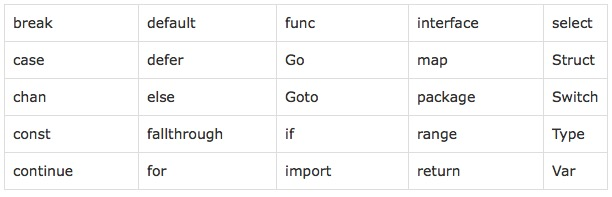
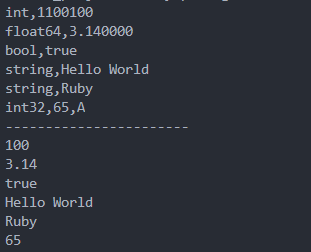

<!-- TOC -->

- [1、Go简介](#1go简介)
  - [1.1 Go语言的核心特性](#11-go语言的核心特性)
  - [1.2 核心特性](#12-核心特性)
  - [1.3 Go语言的特色：](#13-go语言的特色)
  - [1.4 Go的编译](#14-go的编译)
    - [跨平台编译](#跨平台编译)
  - [1.5 编码规范](#15-编码规范)
    - [1. 命名规范](#1-命名规范)
    - [2. 注释](#2-注释)
    - [3. 代码风格](#3-代码风格)
- [2、基本语法](#2基本语法)
  - [2.1 变量](#21-变量)
    - [1. 变量的使用](#1-变量的使用)
      - [1、什么是变量](#1什么是变量)
      - [2、声明变量](#2声明变量)
      - [3、注意事项](#3注意事项)
  - [2.2 常量](#22-常量)
    - [1. 常量的使用](#1-常量的使用)
      - [1、常量声明](#1常量声明)
      - [2、iota](#2iota)
  - [2.3 数据类型](#23-数据类型)
    - [1. 基本数据类型](#1-基本数据类型)
      - [1、布尔型bool](#1布尔型bool)
      - [2、数值型](#2数值型)
      - [3、字符串型](#3字符串型)
      - [4、数据类型转换：Type Convert](#4数据类型转换type-convert)
    - [2. 符合类型（派生类型）](#2-符合类型派生类型)
  - [2.4 运算符](#24-运算符)
    - [1. 运算符](#1-运算符)
      - [1、算术运算符](#1算术运算符)
      - [2、关系运算符](#2关系运算符)
      - [3、逻辑运算符](#3逻辑运算符)
      - [4、位运算符](#4位运算符)
      - [5、赋值运算符](#5赋值运算符)
      - [6、运算符优先级](#6运算符优先级)
  - [2.5 键盘输入和打印输出](#25-键盘输入和打印输出)
    - [1. 打印输出](#1-打印输出)
      - [1、fmt包](#1fmt包)
      - [2、导入包](#2导入包)
      - [3、常用打印函数](#3常用打印函数)
  - [2.6 键盘输入](#26-键盘输入)
    - [1、fmt包读取键盘输入](#1fmt包读取键盘输入)
    - [2. bufio包读取](#2-bufio包读取)
- [3、分支语句](#3分支语句)
  - [3.1 程序的流程结构](#31-程序的流程结构)
  - [3.2 条件语句](#32-条件语句)
    - [1、if语句](#1if语句)
    - [2、if变体](#2if变体)
    - [3、switch语句](#3switch语句)
    - [4、fallthrough](#4fallthrough)
    - [5、Type Switch](#5type-switch)
- [4、循环语句](#4循环语句)
  - [4.1 for语句](#41-for语句)
  - [4.2 for循环变体](#42-for循环变体)
  - [4.3 跳出循环的语句](#43-跳出循环的语句)
    - [1、break语句](#1break语句)
    - [2、continue语句](#2continue语句)
  - [4.4 goto语句](#44-goto语句)
- [5、数组](#5数组)
  - [5.1 什么是数组](#51-什么是数组)
  - [5.2 数组的语法](#52-数组的语法)
  - [5.3 多维数组](#53-多维数组)
  - [5.4 数组的值类型](#54-数组的值类型)
- [6、Slice的使用](#6slice的使用)
  - [6.1 什么是切片](#61-什么是切片)
  - [6.2 切片的语法](#62-切片的语法)
  - [6.3 修改切片](#63-修改切片)
  - [6.4 len()和cap()函数](#64-len和cap函数)
  - [6.5 append()和copy()函数](#65-append和copy函数)
- [7、Map的使用](#7map的使用)
  - [7.1 什么时Map](#71-什么时map)
  - [7.2 Map的使用](#72-map的使用)
    - [1. 使用make()创建map](#1-使用make创建map)
    - [2. delete()函数](#2-delete函数)
    - [3. ok-idiom](#3-ok-idiom)
    - [4. map的长度](#4-map的长度)
    - [5. map是引用类型的](#5-map是引用类型的)
- [8、string](#8string)
  - [8.1 什么时string](#81-什么时string)
  - [8.2 string的使用](#82-string的使用)
    - [1. 访问字符串中的单个字节](#1-访问字符串中的单个字节)
  - [8.3 strings包](#83-strings包)
  - [8.4 strconv包](#84-strconv包)
- [9、函数](#9函数)
  - [9.1 函数的概念](#91-函数的概念)
    - [1. 什么是函数](#1-什么是函数)
    - [2. 函数的声明](#2-函数的声明)
    - [3. 函数的使用](#3-函数的使用)
  - [9.2 函数的参数](#92-函数的参数)
    - [1. 参数的使用](#1-参数的使用)
    - [2. 可变参数](#2-可变参数)
    - [3. 参数传递](#3-参数传递)
  - [9.3 函数的返回值](#93-函数的返回值)
    - [1. 什么是函数的返回值](#1-什么是函数的返回值)
    - [2. 一个函数可以返回多个值](#2-一个函数可以返回多个值)
    - [3. 空白标识符](#3-空白标识符)
  - [9.4 函数的作用域](#94-函数的作用域)
    - [1. 局部变量](#1-局部变量)
    - [2. 全局变量](#2-全局变量)
  - [9.5 函数的本质](#95-函数的本质)
  - [9.6 defer函数](#96-defer函数)
    - [1. 延迟是什么](#1-延迟是什么)
    - [2. 延迟函数](#2-延迟函数)
    - [3. 延迟方法](#3-延迟方法)
    - [4. 延迟参数](#4-延迟参数)
    - [5. 堆栈的推迟](#5-堆栈的推迟)
    - [6. defer注意点](#6-defer注意点)
- [10、包管理](#10包管理)
  - [10.1 main包](#101-main包)
    - [10.2 package](#102-package)
  - [10.3 import](#103-import)
  - [10.4 GOPATH环境变量](#104-gopath环境变量)
  - [10.5 init()包初始化](#105-init包初始化)
  - [10.6 管理外部包](#106-管理外部包)
- [11、指针](#11指针)
  - [11.1 指针的概念](#111-指针的概念)
  - [11.2 获取变量的地址](#112-获取变量的地址)
  - [11.3 声明指针](#113-声明指针)
  - [11.4 空指针](#114-空指针)
  - [11.5 获取指针的值](#115-获取指针的值)
  - [11.6 操作指针改变变量的值](#116-操作指针改变变量的值)
  - [11.7 使用指针传递函数的参数](#117-使用指针传递函数的参数)
  - [11.8 指针的指针](#118-指针的指针)
- [12、结构体](#12结构体)
  - [12.1 什么是结构体](#121-什么是结构体)
  - [12.2 结构体的定义和初始化](#122-结构体的定义和初始化)
  - [12.3 结构体的访问](#123-结构体的访问)
  - [12.4 结构体指针](#124-结构体指针)
  - [12.5 结构体的匿名字段](#125-结构体的匿名字段)
  - [12.6 结构体嵌套](#126-结构体嵌套)
  - [12.7 提升字段](#127-提升字段)
  - [12.8 导出结构体和字段](#128-导出结构体和字段)
  - [12.9 结构体比较](#129-结构体比较)
  - [12.10 结构体作为函数的参数](#1210-结构体作为函数的参数)
- [13、方法、接口、OOP编程、type](#13方法接口oop编程type)
  - [13.1 方法](#131-方法)
    - [1. 什么是方法](#1-什么是方法)
    - [2. 方法的语法](#2-方法的语法)
    - [3. 方法和函数](#3-方法和函数)
    - [4. 变量的作用域](#4-变量的作用域)
    - [5. method继承](#5-method继承)
    - [6. method重写](#6-method重写)
  - [13.2 接口](#132-接口)
    - [1. 什么是接口？](#1-什么是接口)
    - [2. 接口的定义语法](#2-接口的定义语法)
    - [3. interface的值](#3-interface的值)
    - [4. 接口的类型](#4-接口的类型)
    - [5. 接口断言](#5-接口断言)
  - [13.3 OOP编程](#133-oop编程)
    - [1. 定义结构体和方法](#1-定义结构体和方法)
    - [2. New()函数替代了构造函数](#2-new函数替代了构造函数)
    - [3. 组成（Composition）替代了继承（Inheritance）](#3-组成composition替代了继承inheritance)
      - [1、通过嵌入结构体实现组成](#1通过嵌入结构体实现组成)
    - [4. 多态性（Polymorphism）](#4-多态性polymorphism)
  - [13.4 type](#134-type)
    - [1. 类型定义](#1-类型定义)
      - [1、定义结构体](#1定义结构体)
      - [2、定义接口](#2定义接口)
      - [3、定义其他的新类型](#3定义其他的新类型)
      - [4、定义函数的类型](#4定义函数的类型)
    - [2. 类型别名](#2-类型别名)
    - [3. 非本地类型不能定义方法](#3-非本地类型不能定义方法)
    - [4. 在结构体成员嵌入时使用别名](#4-在结构体成员嵌入时使用别名)
- [14、错误处理](#14错误处理)
  - [14.1 什么是错误](#141-什么是错误)
  - [14.2 错误类型表示](#142-错误类型表示)
  - [14.3 自定义错误](#143-自定义错误)
  - [14.4 panic()和recover()](#144-panic和recover)
  - [14.5 错误处理的正确姿势](#145-错误处理的正确姿势)
  - [14.6 异常处理的正确姿势](#146-异常处理的正确姿势)

<!-- /TOC -->

# 1、Go简介

## 1.1 Go语言的核心特性

Go语言具有很强的表达能力，它简洁、清晰而高效。得益于其并发机制， 用它编写的程序能够非常有效地利用多核与联网的计算机，其新颖的类型系统则使程序结构变得灵活而模块化。 Go 代码编译成机器码不仅非常迅速，还具有方便的垃圾收集机制和强大的运行时反射机制。 它是一个快速的、静态类型的编译型语言，感觉却像动态类型的解释型语言。

## 1.2 核心特性

1、并发编程

高并发是Golang语言最大的亮点。

golang的并发执行单元是一种称为goroutine的协程。

Golang是语言级别支持协程(goroutine)并发（协程又称为微线程，比线程更轻量、开销更小，性能更高），操作起来非常简单，语言级别提供关键字(go)用于启动协程，并且在同一台机器上可以启动成千上万个协程。协程经常被理解为轻量级线程，一个线程可以包含多个协程，共享堆不共享栈。协程间一般由应用程序显式实现调度，上下文切换无须下到内核层，高效不少。协程间一般不做同步通讯，而golang中实现协程间通讯有两种
1. 共享内存型，即使用全局变量+mutex锁来实现数据共享
2. 消息传递型，即使用一种独有的channel机制进行异步通讯

2、内存回收(GC)

- 内存自动回收，再也不需要开发人员管理内存
- 开发人员专注业务实现，降低了心智负担
- 只需要new分配内存，不需要释放

3、内存分配

初始化阶段直接分配一块大内存区域，大内存被切分成各个大小等级的块，放入不同的空闲list中，对象分配空间时从空闲list中取出大小合适的内存块。内存回收时，会把不用的内存重放回空闲list。空闲内存会按照一定策略合并，以减少碎片。

4、编译

编译涉及到的两个问题
1. 编译速度。目前两种编译器
   1. 建立在GCC基础上的Gccgo
   2. 针对64位X64和32位X86计算机的一套编译器（6g和8g）
2. 依赖管理。绝大多数第三方开源库都在github上，库会默认下载到工程的pkg目录下

5、网络编程

具备去中心化、分布式等特性，具体表现之一就是提供了丰富便捷的网络编程接口，比如socket用net.dial(基于tcp/udp，封装了传统的connect、listen、accept等接口)、http用http.Get/Post()、rpc用client.Call('class_name.method_name', args, &reply)等

6、函数多返回值

7、语言交互性

go语言可以和C程序交互，但不能和C++交互。有两种替代方案
1. 先将C++编译成动态库，再由go调用一段c代码，c代码通过dlfcn库动态调用动态库（记得export LD_LIBRARY_PATH）
2. 使用swig

8、异常处理

golang不支持try...catch这样的结构化的异常解决方式。golang提倡的异常处理方式是：
- 普通异常：被调用方返回error对象，调用方判断error对象
- 严重异常：指的是中断panic（比如除0），使用`defer...recover...panic`机制来捕获处理。严重异常一般由golang内部自动抛出，不需要用户主动抛出。当然，用户也可以使用panic('xxx')主动抛出，只是这样会使这套机制退化称结构化异常机制了。

9、其他特性

- 类型推导：类型定义：支持`var abc = 9`这样语法，看上去有点像动态类型语言，但是golang是强类型的，前面的定义会被自动推导出是int类型
- 一个类型只要实现了某个interface的所有方法，既可以实现该interface，无需显式去继承
- 不能循环应用
- defer机制：通过该关键字指定需要延迟执行的逻辑体，即在函数体return前或出现panic时执行。
- “包”的概念：将相同功能的代码放在一个目录，称之为包。包可以被其它包引用。main包是用来生成可执行文件，每个程序只有一个main包。
- 编程规范：GO语言的编程规范强制集成在语言中，比如明确规定花括号摆放位置，强制要求一行一句，不允许导入没有使用的包，不允许定义没有使用的变量，提供gofmt工具强制格式化代码等等。
- 交叉编译：比如说你可以在运行 Linux 系统的计算机上开发运行 Windows 下运行的应用程序。这是第一门完全支持 UTF-8 的编程语言，这不仅体现在它可以处理使用 UTF-8 编码的字符串，就连它的源码文件格式都是使用的 UTF-8 编码。

## 1.3 Go语言的特色：

- 没有继承多态的面向对象
- 强一致类型
- interface不需要显式声明(Duck Typing)
- 没有异常处理(Error is value)
- 基于首字母的可访问特性
- 不用的import或者变量引起编译错误
- 完整而卓越的标准库包
- Go内置runtime（作用是性能监控、垃圾回收等）

## 1.4 Go的编译

使用`go build`
1. 在项目目录下执行`go build`
2. 在其他路径下执行`go build`，需要在后面加上项目的路径（项目路径从GOPATH/src开始写起，编译之后的可执行文件就保存在当前目录下）
3. `go build -o hello.exe`

### 跨平台编译

默认`go build`的可执行文件都是当前操作系统可以执行的文件，如果在Windows下编译Linux下可执行文件的步骤如下

```bash
SET CGO_ENABLED=0 // 禁用CGO
SET GOOS=linux    // 目标平台是linux
SET GOARCH=adm64  // 目标处理器架构是amd64
```
*使用cgo的代码不支持跨平台编译的*

然后再执行go build命令，得到的就是能够在Linux平台运行的可执行文件了。

Mac 下编译 Linux 和 Windows平台 64位 可执行程序：
```bash
CGO_ENABLED=0 GOOS=linux GOARCH=amd64 go build
CGO_ENABLED=0 GOOS=windows GOARCH=amd64 go build
```

Linux 下编译 Mac 和 Windows 平台64位可执行程序：
```bash
CGO_ENABLED=0 GOOS=darwin GOARCH=amd64 go build
CGO_ENABLED=0 GOOS=windows GOARCH=amd64 go build
```

Windows下编译Mac平台64位可执行程序：
```bash
SET CGO_ENABLED=0
SET GOOS=darwin
SET GOARCH=amd64
go build
```

## 1.5 编码规范

### 1. 命名规范

Go在命名时以字母a到Z或a到Z或下划线开头，后面跟着零或更多的字母、下划线和数字(0到9)。Go不允许在命名时中使用@、$和%等标点符号。Go是一种区分大小写的编程语言。
> 1. 当命名（包括常量、变量、类型、函数名、结构字段等等）以一个大写字母开头，如：Group1，那么使用这种形式的标识符的对象就可以被外部包的代码所使用（客户端程序需要先导入这个包），这被称为导出（像面向对象语言中的 public）；
>
> 2. 命名如果以小写字母开头，则对包外是不可见的，但是他们在整个包的内部是可见并且可用的（像面向对象语言中的 private ）

1、包命名

保持package的名字和目录保持一致，尽量采取有意义的包名，简短，有意义，尽量和标准库不要冲突。包名应该为小写单词，不要使用下划线或者混合大小写。

2、文件命名

尽量采取有意义的文件名，简短，有意义，应该为小写单词，使用下划线分隔各个单词。

3、结构体命名

- 采用驼峰命名法，首字母根据访问控制大写或者小写
- struct 申明和初始化格式采用多行，例如下面

```go
// 多行声明
type User struct{
    Username    string
    Email       string
}

// 多行初始化
u := User{
    Username: "astaxie",
    Email:    "astaxie@gmail.com",
}
```

4、接口命名

- 命名规则基本和上面的结构体类型
- 单个函数的结构名以 “er” 作为后缀，例如 Reader , Writer 。

```go
type Reader interface{
    Read(p []byte)(n int, err error)
}
```

5、变量命名
- 和结构体类似，变量名称一般遵循驼峰法，首字母根据访问控制原则大写或者小写，但遇到特有名词时，需要遵循以下规则：
  - 如果变量为私有，且特有名词为首个单词，则使用小写，如 apiClient
  - 其它情况都应当使用该名词原有的写法，如 APIClient、repoID、UserID
  - 错误示例：UrlArray，应该写成 urlArray 或者 URLArray
- 若变量类型为 bool 类型，则名称应以 Has, Is, Can 或 Allow 开头

6、常量命名

常量均需使用全部大写字母组成，并使用下划线分词。

```go
const APP_VER = "1.0"
```

如果是枚举类型的常量，需要先创建相应类型：

```go
type Scheme string

const (
    HTTP  Scheme = "http"
    HTTPS Scheme = "https"
)
```

7、关键字



### 2. 注释

Go提供C风格的/* */块注释和C ++风格的//行注释。行注释是常态；块注释主要显示为包注释，但在表达式中很有用或禁用大量代码。

- 单行注释是最常见的注释形式，你可以在任何地方使用以 // 开头的单行注释
- 多行注释也叫块注释，均已以 /* 开头，并以 */ 结尾，且不可以嵌套使用，多行注释一般用于包的文档描述或注释成块的代码片段

`go`语言自带的 `godoc` 工具可以根据注释生成文档，生成可以自动生成对应的网站（ golang.org 就是使用 `godoc` 工具直接生成的），注释的质量决定了生成的文档的质量。每个包都应该有一个包注释，在package子句之前有一个块注释。对于多文件包，包注释只需要存在于一个文件中，任何一个都可以。包评论应该介绍包，并提供与整个包相关的信息。它将首先出现在`godoc`页面上，并应设置下面的详细文档。

1、包注释

每个包都应该有一个包注释，一个位于package子句之前的块注释或行注释。包如果有多个go文件，只需要出现在一个go文件中（一般是和包同名的文件）即可。包注释应该包含下面基本信息（严格按照这个顺序，简介，创建人，创建时间）：

- 包的基本简介（包名，简介）
- 创建者，格式：创建人：rtx名
- 创建时间，格式：创建时间：yyyyMMdd

例如 util包的注释示例如下

```go
// util包，该包包含了项目共用的一些常量，封装了项目一些公用函数。
// 创建人：xxx
// 创建时间：20201223
```

2、结构（接口）注释

每个自定义的结构体或者接口都应该有注释说明，该注释对结构及逆行简要介绍，放在结构体定义的前一行，格式位：结构体名，结构体说明。同时结构体的每个成员变量要有说明，该说明放在成员变量的后面（注意对齐），实例如下

```go
// User， 用户对象，定义了用户的基础信息
type User struct{
    Username    string  // 用户名
    Email       string  // 邮箱
}
```

3、函数（方法）注释

每个函数，或者方法（结构体或者接口下的函数称为方法）都应该有注释说明，函数的注释应该包括三个方面

- 简要说明，格式说明：已函数名开头，“，”分隔说明部分
- 参数列表：每行一个参数，参数名开头，“，”分隔说明部分
- 返回值：每行一个返回值

示例如下：

```go
// NewattrModel , 属性数据层操作类的工厂方法
// 参数：
//      ctx ： 上下文信息
// 返回值：
//      属性操作类指针
func NewAttrModel(ctx *common.Context) *AttrModel{

}
```

4、代码逻辑注释

对于一些关键位置的逻辑代码，或者局部较为复杂的逻辑，需要有响应的逻辑说明，方便其他开发者阅读该段代码，实例如下

```go
// 从 Redis 中批量读取属性，对于没有读取到的 id ， 记录到一个数组里面，准备从 DB 中读取
```

5、注释风格

统一使用中文注释，对于中英文字符之间严格使用空格分隔，这个不仅仅是中文和英文之间，英文和中文标点之间也都要使用空间分隔，例如：

```go
// 从 Redis 中批量读取属性，对于没有读取到的 id ， 记录到一个数组里面，准备从 DB 中读取
```

- 建议全部使用单行注释
- 和代码的规范一样，单行注释不要过长，禁止炒股过120字符

### 3. 代码风格

1、缩进和折行

- 缩进直接使用gofmt工具格式化即可（gofmt是使用tab缩进的）
- 折行方面，一行最长不超过120个字符，超过的请使用换行展示，尽量保持格式优雅

2、语句的结尾

Go语言不需要类似Java、C、C++的结尾符号，默认一行就是一条数据

如果打算多个语句写在同一行，它们则必须使用`;`符号

3、括号和空格

括号和空格方面，也可以直接使用gofmt工具格式化（go会强制左大括号不换行，换行会报语法错误），所有的运算符和操作数之间要留空格

```go
// 正确的方式
if a > 0 {

}

// 错误的方式
if a > 0    // a, 0 和 > 之间应该空格
{           // 左大括号不可以换行，会报语法错误

}
```

4、import规范

import在多行的情况下，go imports会自动帮助格式化，如果在一个文件里引入了一个package，建议采用如下格式

```go
import (
    "fmt"
)
```

如果你的包引入了三种类型的包，标准库包，程序内部包，第三方包，建议采用如下方式进行组织你的包：

```go
import (
    "encoding/json"
    "strings"

    "myproject/models"
    "myproject/controller"
    "myproject/utils"

    "github.com/astaxie/beego"
    "github.com/go-sql-driver/mysql"
)
```

有顺序的引入包，不同的类型采用空格分离，第一种实标准库，第二是项目包，第三是第三方包。

项目中不要使用相对路径引入包：

```go
// 这是不好的导入
import “../net”

// 这是正确的做法
import “github.com/repo/proj/src/net”
```

但是如果是引入本项目中的其他包，最好使用相对路径。

5、错误处理

- 错误处理的原则就是不能丢弃任何有返回err的调用，不要使用 _ 丢弃，必须全部处理。接收到错误，要么返回err，或者使用log记录下来
- 尽早return：一旦有错误发生，马上返回
- 尽量不要使用panic，除非你知道你在做什么
- 错误描述如果是英文必须为小写，不需要标点结尾
- 采用独立的错误流进行处理

```go
// 错误写法
if err != nil {
    // error handling
} else {
    // normal code
}

// 正确写法
if err != nil {
    // error handling
    return // or continue, etc.
}
// normal code
```

# 2、基本语法

## 2.1 变量

### 1. 变量的使用

#### 1、什么是变量

变量是为存储特定类型的值而提供给内存位置的名称。变量的本质就是一小块内存，用于存储数据，在程序运行过程中数值可以发生改变。

#### 2、声明变量

变量声明的几种方式子

1、指定变量类型，声明后若不赋值，使用默认值

```go
var name type
name = value
```

2、根据值自行判断变量类型（类型推断Type inference）

如果变量有初始值，Go将自动能够使用初始值来推断该变量的类型。因此，如果变量具有初始值，则可以省略变量生命中的类型

```go
var name = value
```

3、省略`var`，注意`:=`左侧的变量不应该是已经声明过的（多个变量同时声明时，至少保证一个是新变量），否则会导致编译错误（简单声明）

```go
name := vlaue

// 例如
var a int = 10
var b = 10
c := 10
```

这种方式只能被用在函数体内，而不可以用于全局变量的声明和赋值

```go
package main

var a = "Hello"
var b string = "world"
var c bool

func main(){
    printIn(a, b, c)
}

// 运行结果
// hello world false
```

4、多变量声明

1)、以逗号分隔，声明与赋值分开，若不赋值，存在默认值

```go
var name1, name2, name3 type
name1, name2, name3 = v1, v2, v3
```

2)、直接赋值，下面的变量类型可以是不同的类型

`var name1, name2, name3 = v1, v2, v3`

3)、批量声明

```go
var (
    name1 type1
    name2 type2
)
```

#### 3、注意事项

- 变量必须先定义才能使用
- go语言是静态语言，要求变量的类型和赋值的类型必须一致
- 变量名不能冲突。（同一个作用域内不能冲突）
- 简短定义方式，左边的变量名至少有一个是新的
- 简短定义凡是，不能定义全局变量
- 变量的零值。也叫默认值
- 变量定义了就要使用，否则无法通过编译

在相同的代码块内，不可以再次对相同名称的变量使用初始化声明，例如：`a:=20`就是不被允许的，编译器会提示错误`no new variables on left side of :=`，但是`a=20`是可以的，因为这是给相同的变量赋予一个新的值。

如果在定义变量a之前使用它，则会提示`undefined: a`错误。如果声明了一个局部变量却没有在相同的代码块中使用它，同样会编译不通过。

在同一个作用域中，已存在同名的变量，则之后的声明初始化，则退化位赋值操作，但是这个前提是，最少要有一个新的变量被定义，且在同一作用域。

```go
package main

import (
    "fmt"
)

func main() {
	x := 100
	println(&x, x)
	x = 200
	println(&x, x)
	x, y := 300, 400
	println(&x, x, y)
}

// 运行结果
// 0xc000041f48 100
// 0xc000041f48 200
// 0xc000041f48 300 400
```

## 2.2 常量

### 1. 常量的使用

#### 1、常量声明

常量是一个简单的标识符，在程序运行时，不会被修改的量

定义语句格式：

`const identifier [type] = value`

```go
// 显式类型定义
const b string = "abc"
// 隐式类型定义
const b = "abc"
```

```go
package main

import (
	"fmt"
)

func main() {
	const LENGTH int = 10
	const WIDTH int = 5
	var area int
	const a, b, c = 1, false, "str" // 多重赋值

	area = LENGTH * WIDTH
	fmt.Println("面积为：%d", area)
	println()
	println(a, b, c)
}

// 运行结果
// 面积为：%d 50
// 
// 1 false str
```

常量可以作为枚举，常量组

```go
const (
    Unknown = 0
    Female = 1
    Male = 2
)
```

常量组中若不指定类型和初始值，则与上一行非空常量右值相同

```go
package main

import (
	"fmt"
)

func main() {
	const (
		x uint16 = 16
		y
		s = "abc"
		z
	)
	fmt.Printf("%T, %v", y, y)
	fmt.Printf("%T, %v", z, z)
}

// 运行结果
// uint16, 16string, abc
```

常量的注意事项：
- 常量中的数据类型只可以是布尔型、数据型（如整数、浮点型和复数）和字符串型。
- 不曾使用的常量，在编译时不会报错
- 显示指定类型的时候，必须确保常量左右值类型一致，需要时可做显示类型转换。

#### 2、iota

iota，特殊常量，可以认为是一个可以被编译器修改的常量

iota可以别用于枚举值

```go
const (
    a = iota
    b = iota
    c = iota
)
```

第一个iota等于0， 每当iota在新的一行被使用时，它的值都会自动加1；所以a=0,b=1,c=2可以简写为如下形式

```go
const (
    a = iota
    b
    c
)
```

iota用法

```go
package main

import "fmt"

func main() {
	const (
		a = iota // 0
		b        // 1
		c        // 2
		d = "ha" // "ha"
		e        // "ha"
		f = 100  // 100
		g        // 100
		h = iota // 7
		i        // 8
	)
	fmt.Println(a, b, c, d, e, f, g, h, i)
}

// 运行结果：
// 0 1 2 ha ha 100 100 7 8
```

如果中断iota自增，则必须显式恢复。且后续自增值按行序递增

自增默认是int类型，可以自行进行显示指定类型

数字常量不会分配存储空间，无须像变量那样通过内存寻址来取值，因此无法获取地址

## 2.3 数据类型

### 1. 基本数据类型

- bool
- Numeric Types
  - int8, int16, int32, int64, int
  - uint8, uint16, uint32, uint64, uint
  - float32, float64
  - complex64, compliex128
  - byte
  - rune
- string

#### 1、布尔型bool

布尔型的值只可以是常量`true`和`false`。

#### 2、数值型

1、整数型

- int8：有符号 8 位整数（-128 ~ 127）长度：8bit
- int16：有符号 16 位整数 (-32768 ~ 32767)
- int32：有符号 32 位整型 (-2147483648 ~ 2147483647)
- int64：有符号 64 位整型 (-9223372036854775808 ~ 9223372036854775807)
- uint8：无符号 8 位整型 (0 ~ 255) 
- uint16：无符号 16 位整型 (0 ~ 65535)
- uint32：无符号 32 位整型 (0 ~ 4294967295)
- uint64：无符号 64 位整型 (0 ~ 18446744073709551615)

> int和uint:根据底层平台，表示32或64位整数。除非需要使用特定大小的整数，否则通常应该使用int来表示整数。 大小:32位系统32位，64位系统64位。 范围:-2147483648到2147483647的32位系统和-9223372036854775808到9223372036854775807的64位系统。

2、浮点型

- float32：IEEE-754 32位浮点型数
- float64：IEEE-754 64位浮点型数
- complex64：32 位实数和虚数
- complex128：64 位实数和虚数

3、其他

- byte：类似uint8
- rune：类似int32
- uint：32或64位
- int：与uint一样大小
- uintptr：无符号整型，用于存放一个指针

#### 3、字符串型

字符串就是一串固定长度的字符连接起来的字符序列。Go的字符串是由单个字节连接起来的。Go语言的字符串的字节使用UTF-8编码表示Unicode文本

```go
var str string
str = "Hello World"
```

#### 4、数据类型转换：Type Convert

语法格式：Type(value)

常数：在有需要的时候，会自动转型

变量：需要手动转型T(v)

注意：兼容类型可以转换

### 2. 符合类型（派生类型）

1. 指针类型（Pointer）
2. 数组类型
3. 结构化类型（struct）
4. Channel类型
5. 函数类型
6. 切片类型
7. 接口类型（interface）
8. Map类型

## 2.4 运算符

### 1. 运算符

#### 1、算术运算符

| 运算符 | 描述 |
| --- | --- |
| + | 加 |
| - | 减 |
| * | 乘 |
| / | 除 |
| % | 求余 |
| ++ | 自增 | 
| -- | 自减 |

#### 2、关系运算符

| 运算符 | 描述 |
| --- | --- |
| == | 等于 | 
| != | 不等于 |
| > | 大于 |
| < | 小于 |
| >= | 大于等于 |
| <= | 小于等于 |

#### 3、逻辑运算符

| 运算符 | 描述 |
| --- | --- |
| && | 逻辑与运算符。如果两个操作数都非零，则条件变为真 |
| \|\| | 逻辑或运算符。如果任何两个操作数都是非零，则条件变为真 |
| ! | 逻辑非运算符。使用反转操作数的逻辑状态。如果条件为真，那么逻辑非操作结果为假。 |

#### 4、位运算符

| A | B | A&B | A\|B | A^B |
| --- | --- | --- | --- | --- |
| 0 | 0 | 0 | 0 | 0 |
| 0 | 1 | 0 | 1 | 1 |
| 1 | 0 | 0 | 1 | 1 |
| 1 | 1 | 1 | 1 | 0 |

`^`只要AB两者都相同的时候为0，其他都为1

设`A=60,B=13`
| 运算符 | 描述 | 示例 |
| --- | --- | --- |
| & | 二进制与操作副本位的结果，如果它存在于两个操作数 | (A & B) = 12, 也就是 0000 1100 |
| \| | 二进制或操作副本，如果它存在一个操作数 | (A | B) = 61, 也就是 0011 1101 |
| ^ | 二进制异或操作副本，如果它被设置在一个操作数就是按位取非 | (A ^ B) = 49, 也就是 0011 0001 |
| &^ | 二进制位清空&^ | (A&^B)=48，也就是110000 |
| << | 二进制左移位运算符。左边的操作数的值向左移动由右操作数指定的位数 | A << 2 =240 也就是 1111 0000 |
| >> | 二进制向右移位运算符。左边的操作数的值由右操作数指定的位数向右移动 | A >> 2 = 15 也就是 0000 1111 |

#### 5、赋值运算符

| 运算符 | 描述 | 示例 |
| --- | --- | --- |
| = | 简单的赋值操作符，分配值从右边的操作数左侧的操作数 | C = A + B 将分配A + B的值到C |
| += | 相加并赋值运算符，它增加了右操作数左操作数和分配结果左操作数 | C += A 相当于 C = C + A |
| -= | 减和赋值运算符，它减去右操作数从左侧的操作数和分配结果左操作数 | 	C -= A 相当于 C = C - A |
| *= | 乘法和赋值运算符，它乘以右边的操作数与左操作数和分配结果左操作数 | C *= A 相当于 C = C * A |
| /= | 除法赋值运算符，它把左操作数与右操作数和分配结果左操作数 | C /= A 相当于 C = C / A |
| %= | 模量和赋值运算符，它需要使用两个操作数的模量和分配结果左操作数 | 	C %= A 相当于 C = C % A |
| <<= | 左移位并赋值运算符 | C <<= 2 相同于 C = C << 2 |
| >>= | 向右移位并赋值运算符 | C >>= 2 相同于 C = C >> 2 |
| &= | 按位与赋值运算符 | C &= 2 相同于 C = C & 2 |
| ^= | 按位异或并赋值运算符 | C ^= 2 相同于 C = C ^ 2 |
| \|= | 按位或并赋值运算符 | C \|= 2 相同于 C = C \| 2 |

#### 6、运算符优先级

二元运算符的运算方向均是从左到右。下标列出所有运算符以及它们的优先级，由上到下代表优先级由高到低：

| 优先级 | 运算符 |
| --- | --- |
| 7 | ~、!、++、-- |
| 6 | *、/、%、<<、>>、&、&^ |
| 5 | +、-、^ |
| 4 | ==、!=、<、<=、>=、> |
| 3 | <- |
| 2 | && |
| 1 | \|\| |

## 2.5 键盘输入和打印输出

### 1. 打印输出

#### 1、fmt包

fmt包实现了类似C语言printf和scanf的格式化I/O。


#### 2、导入包

`import "fmt"`

#### 3、常用打印函数

**打印**：

`func Print(a ...interface{}) (n int, err error)`

**格式化打印**：

`func Printf(format string, a ...interface{}) (n int, err error)`

**打印后换行**：

`func Println(a ...interface{}) (n int, err error)`

格式化打印中的常用占位符：

```text
格式化打印占位符：
			%v,原样输出
			%T，打印类型
			%t,bool类型
			%s，字符串
			%f，浮点
			%d，10进制的整数
			%b，2进制的整数
			%o，8进制
			%x，%X，16进制
				%x：0-9，a-f
				%X：0-9，A-F
			%c，打印字符
			%p，打印地址
```

```go
package main

import (
	"fmt"
)

func main() {
	a := 100           //int
	b := 3.14          //float64
	c := true          // bool
	d := "Hello World" //string
	e := `Ruby`        //string
	f := 'A'
	fmt.Printf("%T,%b\n", a, a)
	fmt.Printf("%T,%f\n", b, b)
	fmt.Printf("%T,%t\n", c, c)
	fmt.Printf("%T,%s\n", d, d)
	fmt.Printf("%T,%s\n", e, e)
	fmt.Printf("%T,%d,%c\n", f, f, f)
	fmt.Println("-----------------------")
	fmt.Printf("%v\n", a)
	fmt.Printf("%v\n", b)
	fmt.Printf("%v\n", c)
	fmt.Printf("%v\n", d)
	fmt.Printf("%v\n", e)
	fmt.Printf("%v\n", f)
}
```

运行结果



## 2.6 键盘输入

### 1、fmt包读取键盘输入

常用方法：

```go
func Scan(a ...interface{}) (n int, err error)

func Scanf(format string, a ...interface{}) (n int, err error)

func Scanln(a ...interface{}) (n int, err error)
```

```go
package main

import (
    "fmt"
)

func main(){
    var x int
    var y float64
    fmt.Println("请输入一个整数,一个浮点数")
    fmt.Scanln(&x, &y)  // 读取键盘的输入，通过操作地址，赋值给x和y 阻塞式
    fmt.Printf("x的数值：%d, y的数值：%f\n", x, y)
    fmt.Scanf("%d, %f", &x, &y)
    fmt.Printf("x: %d, y: %f\n", x, y)
}
```

### 2. bufio包读取

https://golang.google.cn/pkg/bufio/

bufio包中都是IO操作的方法：

先创建Reader对象：


然后就可以各种读取了：


```go
package main

import (
	"fmt"
	"os"
	"bufio"
)

func main() {
	fmt.Println("请输入一个字符串：")
	reader := bufio.NewReader(os.Stdin)
	s1, _ := reader.ReadString('\n')
	fmt.Println("读到的数据：", s1)
}
```

# 3、分支语句

## 3.1 程序的流程结构

程序的流程控制结构一共有三种：顺序结构，选择结构，循环结构
- 顺序结构：从上向下，逐行执行
- 选择结构：条件满足，某些代码才会执行。0-1次
  - 分支语句：if，switch，select
- 循环结构：条件满足，某些代码会被反复的执行多次。0-N次
  - 循环语句：for

## 3.2 条件语句

### 1、if语句

语法格式：

```go
if 布尔表达式{
  /* 在布尔表达式为 true 时执行 */
}
```

```go
if 布尔表达式{
  /* 在布尔表达式为 true 时执行 */
} else {
  /* 在布尔表达式为 false 时执行 */
}
```

```go
if 布尔表达式1{
  /* 在布尔表达式1为 true 时执行 */
} else if 布尔表达式2 {
  /* 在布尔表达式2为 true 时执行 */
} else {
  /* 在两个表达式都为false时，执行 */
}
```

实例代码

```go
package main

import "fmt"

func main(){
  /* 定义局部变量 */
  var a int = 10

  /* 使用 if 语句判断布尔表达式 */
  if a < 20{
    /* 如果条件为 true ，则执行下面语句 */
    fmt.Print("a 小于 20\n")
  }
  fmt.Print("a 的值为：%d\n", a)
}
```

### 2、if变体

如果其中包含一个可选的语句组件（在评估条件之前执行），则还有一个变体。它的语法是

```go
if statement; condition{
}

if condition{
}
```

实例代码
```go
package main

import "fmt"

func main(){
  if num := 10; num % 2 == 0{
    fmt.Println(num, "is even")
  } else {
    fmt.Println(num, "is odd")
  }
}
```

### 3、switch语句

switch是一个条件语句，它计算表达式并将其与可能匹配的列表进行比较，并根据匹配执行相应的代码块。它可以以被认为是一种惯用的方式来写多个if else子句。

switch语句用于基于不条件执行不同动作，每一个case分支都是唯一的，从上至下逐一测试，直到匹配为止。switch语句执行的过程从上至下，直到直到匹配项，匹配项后面也不需要再加break。

而若switch没有表达式，它会匹配true。

Go中switch默认相当于每个case最后带有break，匹配成功后不会自动向下执行其他case，而是跳出整个switch，但是可以使用fallthrough强制执行后面的case代码。

变量var1可以是任何类型，而val1和val2则可以是同类型的任意值。类型不被局限于常量或整数，但必须是相同的类型；或者最终结果为相同类型的表达式。可以同时测试多个可能符合条件的值，使用逗号分割它们，例如：case val1, val2, val3。

```go
switch var1 {
  case val1:
    ...
  case val2:
    ...
  default:
    ...
}
```

实例代码
```go
package main

import "fmt"

func main(){
  /* 定义局部变量 */
  var grade string = "B"
  var marks int = 90

  switch marks {
    case 90: grade = "A"
    case 80: grade = "B"
    case 50, 60, 70: grade = "C"
    default: grade = "D"
  }

  switch {
    case grade == "A" :
      fmt.Printf("优秀!\n" )     
    case grade == "B", grade == "C" :
      fmt.Printf("良好\n" )      
    case grade == "D" :
      fmt.Printf("及格\n" )      
    case grade == "F":
      fmt.Printf("不及格\n" )
    default:
      fmt.Printf("差\n" );
  }
  fmt.Printf("你的等级是 %s\n", grade );
}
```

### 4、fallthrough

如果贯通后续的case，就添加fallthrough

```go
package main

import (
  "fmt"
)

type data [2]int

func main(){
  switch x := 5; x{
    default:
      fmt.Println(x)
    case 5:
      x += 10
      fmt.Println(x)
      fallthrough
    case 6:
      x += 20
      fmt.Println(x)
  }
}
```

case中的表达式是可选的，可以省略。如果该表达式被省略，则被认为是switch true，并且每个case表达式都被计算为true，并执行相应的代码块。

示例代码：

```go
package main

import (  
    "fmt"
)

func main() {  
    num := 75
    switch { // expression is omitted
    case num >= 0 && num <= 50:
        fmt.Println("num is greater than 0 and less than 50")
    case num >= 51 && num <= 100:
        fmt.Println("num is greater than 51 and less than 100")
    case num >= 101:
        fmt.Println("num is greater than 100")
    }

}
```

switch的注意事项
1. case后的常量值不能重复
2. case后可以有多个常量值
3. fallthrough应该是某个case的最后一行。如果它出现在中间的某个地方，编译器就会抛出错误。

### 5、Type Switch

switch语句还可以被用于type-switch来判断某个interface变量中实际存储的变量类型。

```go
switch x.(type){
    case type:
        statement(s);
    case type:
        statement(s);
    /* 可以定义任意多个case */
    default:
        statement(s);
}
```

实例代码

```go
package main

import (
    "fmt"
)

func main(){
  var x interface{}

    switch i := x.(type){
      case nil:
        fmt.Printf("x 的类型：%T", i)              
      case int:	  
         fmt.Printf("x 是 int 型")                       
      case float64:
         fmt.Printf("x 是 float64 型")           
      case func(int) float64:
         fmt.Printf("x 是 func(int) 型")                      
      case bool, string:
         fmt.Printf("x 是 bool 或 string 型" )       
      default:
         fmt.Printf("未知型") 
  }
}
```

# 4、循环语句

循环语句表示条件满足，可以反复的执行某些代码

for是唯一的循环语句。（Go没有while循环）

## 4.1 for语句

语法结构

```go
for init; condition; post{}
```

初始化语句只执行一次。在初始化循环之后，将检查该条件。如果条件计算为True，那么{}中的循环体将被执行，然后是post语句。post语句将在循环的每次成功迭代之后执行。在执行post语句之后，该条件将被重新检查。如果它是正确的，循环将继续执行，否则循环终止。

实例代码
```go
package main

import (
  "fmt"
)

func main(){
    for i := 1; i <= 10; i++ {
        fmt.Printf(" %d", i)
    }
}
```

在for循环中声明的变量仅在循环范围内可用。因此，i不能在外部访问循环。

## 4.2 for循环变体

所有的三个组成部分，即初始化、条件和post都是可选的。

```go
for condition {}
```

效果类似while

```go
for {}
```

效果与for(;;)一样

for循环的range格式可以对slice、map、数组、字符串等进行迭代循环

```go
for key, value := range oldMap {
    newMap[key] = value
}
```

实例代码

```go
package main

import "fmt"

func main(){
  var b int = 15
  var a int

  numbers := [6]int{1, 2, 3, 5}

  /* for循环 */
  for a := 0; a < 10; a++ {
    fmt.Printf("a 的值为：%d\n", a)
  }

  for a < b{
    a++
    fmt.Printf("a 的值为：%d\n", a)
  }

  for i, x := range(numbers) {
    fmt.Printf("第 %d 位 x 的值 = %d\n", i,x)
  }
}
```

## 4.3 跳出循环的语句

### 1、break语句

break：跳出循环体。break语句用于在结束其正常执行之前突然终止for循环

实例代码
```go
package main

import "fmt"

func main(){
  for i := 1; i <= 10; i++ {
    if i > 5 {
      break
    }
    fmt.Printf("%d ", i)
  }
  fmt.Printf("\nline arter for loop")
}
```

### 2、continue语句

continue：跳出一次循环。continue语句用于跳出for循环的当前迭代。在continue语句后面的for循环中的所有代码将不会在当前迭代中执行。循环将继续到下一个迭代

实例代码
```go
package main

import (
  "fmt"
)

func main(){
  for i := 1; i <= 10; i++ {
    if i%2 == 0 {
      continue
    }
    fmt.Printf("%d ", i)
  }
}
```

## 4.4 goto语句

goto：可以无条件地转移到过程中指定的行

语法结构：

```go
goto label;
...
...
label: statement;
```

示例代码
```go
package main

import "fmt"

func main(){
  /* 定义局部变量 */
  var a int = 10
  
  /* 循环 */
  LOOP: for a < 20 {
    if a == 15 {
      /* 跳过迭代 */
      a = a + 1
      goto LOOP
    }
    fmt.Printf("a的值为：%d\n", a)
    a++
  }
}
```

# 5、数组

## 5.1 什么是数组

Go语言提供了数组类型的数据结构。数组是具有相同唯一类型的一组已编号且长度固定的数据项序列，这种类型可以是任意的原始类型，例如整型、字符串或者自定义类型。

数组元素可以通过索引（位置）来读取（或者修改），索引从0开始，第一个元素索引为0，第二个索引为1，依次类推。数组的下标取值范围是从0开始，到长度减1.

数组一旦定义后，大小不能更改。

## 5.2 数组的语法

**声明和初始化数组**

需要指明数组的大小和存储的数据类型

```go
var variable_name [SIZE] variable_type
```

实例代码：

```go
var balance [10] float32
var balance  = [5] float32{1000.0, 2.0, 3.4, 7.0, 50.0}
```

初始化数组中 *{}* 中的元素个数不饿能大于 *[]* 中的数字。如果忽略 *[]* 中的数字不设置数组大小，Go语言会根据元素的个数来设置数组的大小。

```go
var balance = []float32 {1000.0, 2.0, 3.4, 7.0, 50.0}
```

数组的其他创建方式

```go
  var a [4] float32 // 等价于：var arr2 = [4]float32{}
  fmt.Println(a) // [0 0 0 0]
  var b = [5] string{"ruby", "王二狗", "rose"}
  fmt.Println(b) // [ruby 王二狗 rose  ]
  var c = [5] int{'A', 'B', 'C', 'D', 'E'} // byte
  fmt.Println(c) // [65 66 67 68 69]
  d := [...] int{1,2,3,4,5}// 根据元素的个数，设置数组的大小
  fmt.Println(d)//[1 2 3 4 5]
  e := [5] int{4: 100} // [0 0 0 0 100]
  fmt.Println(e)
  f := [...] int{0: 1, 4: 1, 9: 1} // [1 0 0 0 1 0 0 0 0 1]
  fmt.Println(f)
```

**访问数组元素**

```go
float32 salary = balance[9]
```

实例代码

```go
package main

import "fmt"

func main() {
	var n [10]int /* n 是一个长度为 10 的数组 */
	var i, j int

	/* 为数组 n 初始化元素 */
	for i = 0; i < 10; i++ {
		n[i] = i + 100
	}

	/* 输出每个数组元素的值 */
	for j = 0; j < 10; j++ {
		fmt.Printf("Element[%d] = %d\n", j, n[j])
	}
}
```
运行结果：
```text
Element[0] = 100
Element[1] = 101
Element[2] = 102
Element[3] = 103
Element[4] = 104
Element[5] = 105
Element[6] = 106
Element[7] = 107
Element[8] = 108
Element[9] = 109
```

**数组的长度**

通过将数组作为参数传递给len函数，可以获取数组的长度

```go
package main

import "fmt"

func main() {
	a := [...]float64{67.7, 89.8, 21, 78}
	fmt.Println("length of a is ", len(a))
}

```
运行结果
```text
length of a is 4
```

设置可以忽略声明中数组的长度并将其替换为`...`，让编译器为你找到长度。

```go
package main

import (  
    "fmt"
)

func main() {  
    a := [...]int{12, 78, 50} // ... makes the compiler determine the length
    fmt.Println(a)  // [12 78 50]
}
```

遍历数组
```go
package main

import "fmt"

func main() {
	a := [...]float64{67.7, 89.8, 21, 78}
	for i := 0; i < len(a); i++ { // lopping from 0 to the length of the array
		fmt.Printf("%d the element of a is %.2f\n", i, a[i])
	}
}
```
运行结果
```text
0 the element of a is 67.70
1 the element of a is 89.80
2 the element of a is 21.00
3 the element of a is 78.00
```

使用range遍历数组
```go
package main

import "fmt"

func main() {
	a := [...]float64{67.7, 89.8, 21, 78}

	sum := float64(0)
	for i, v := range a {
		fmt.Printf("%d the element of a is %.2f\n", i, a[i])
		sum += v
	}
	fmt.Printf("\nsum of all elements of a ", sum)
}
```
运行结果
```text
0 the element of a is 67.70
1 the element of a is 89.80
2 the element of a is 21.00
3 the element of a is 78.00

sum of all elements of a %!(EXTRA float64=256.5)
```

如果只需要值并希望可以忽略索引，那么可以通过使用`_`标识符来替换索引来实现这一点
```go
for _, v := range a{//igores index
}
```

## 5.3 多维数组

Go语言支持多维数组，以下为常用的多维数组声明语法方式：

```go
var bariable_name [SIZE][SIZE2]...[SIZEN] variable_type
```

示例
```go
var threedim [5][10][4]int
```

三维数组
```go
a = [3][4]int{
  {0,1,2,3},    /* 第一行索引为 0 */
  {4,5,6,7},    /* 第二行索引为 0 */
  {8,9,10,11}   /* 第三行索引为 0 */
}
```

## 5.4 数组的值类型

数组是值类型，Go中的数组是值类型，而不是引用类型。这意味着当他们被分配给一个新变量时，将把原始数组的分本分配给新的变量。如果对新的变量进行了更改，则不会在原始数组中反映。

```go
package main

import "fmt"

func main() {
  a := [...]string{"USA", "China", "India", "Germany", "France"}
  b := a  // a copy of a is assigned to b
  b[0] = "Singapore"
  fmt.Println("a is ", a)
  fmt.Println("b is ", b)
}
```
运行结果：

```go
a is [USA China India Germany France]  
b is [Singapore China India Germany France] 
```

数组的大小是类型的一部分。因此`[5]int`和`[25]int`是不同的类型。因此，数组不能被调正大小。不要担心这个限制，因为切片的存在是为了解决这个问题。

```go
package main

func main() {
  a := [3]int(5, 78, 8)
  var b[5]int
  b = a //not possible since [3]int and [5]int are distinct types
}
```

# 6、Slice的使用

## 6.1 什么是切片

Go语言切片是对数组的抽象。Go数组的长度不可改变，在特定场景中这样的集合就不太适用，Go中提供了一种灵活功能强悍的内置类型切片（“动态数组”），与数组相比切片的长度是不固定的，可以追加元素，在追加时可能使切片的容量增大。

切片是一种方便、灵活且强大的包装器。切片本身没有任何数据。它们只是对现有数组的引用。

切片与数组相比，不需要设定长度，在 *[]* 中不用设定值，相对来说比较自由。

从概念上讲，slice更像一个结构体，这个结构体包含了三个元素：
1. 指针，指向数组中slice指定的开始位置
2. 长度，即slice的长度
3. 最大长度，也就是slice开始位置到数组的最后位置的长度

## 6.2 切片的语法

**定义切片**

```go
var identifier []type
```

切片不需要说明长度，或适用make()函数来创建切片：

```go
var slice1 []type = make([]type, len)
// 也可以简写为
slice1 := make([]type, len)
```

```go
make([]T, length, capacity)
```
**初始化**

```go
s[0] = 1
s[1] = 2
s[2] = 3
```

```go
s :=[] int {1, 2, 3}
```

```go
s := arr[startIndex: endIndex]
```

将arr中从下标 startIndex 到 endIndex-1 下的元素创建为一个新的切片（前闭后开），长度为 endIndex-startIndex

```go
s := arr[startIndex: ]
```

缺省endIndex时将表示一直到arr的最后一个元素

```go
s := arr[: endIndex]
```

缺省startIndex时将表示从arr的第一个元素开始

```go
package main

import (
	"fmt"
)

func main() {
	a := [5]int{76, 77, 78, 79, 80}
	var b []int = a[1:4] // creates a slice from a[1] to a[3]
	fmt.Println(b)
}
```

## 6.3 修改切片

slice没有自己的任何数据。它只是底层数组的一个表示。对slice所做的任何修改都将反映在底层数组中。

```go
package main

import "fmt"

func main() {
	darr := [...]int{57, 89, 90, 82, 100, 78, 67, 69, 59}
	dslice := darr[2:5]
	fmt.Println("array before ", darr)
	for i := range dslice {
		dslice[i]++
	}
	fmt.Println("array after ", darr)
}
```
运行结果：
```text
array before  [57 89 90 82 100 78 67 69 59]
array after  [57 89 91 83 101 78 67 69 59]
```
当多个片共享相同的底层数组时，每个元素所做的更改将在数组中反映出来。

```go
package main

import (
	"fmt"
)

func main() {
	numa := [3]int{78, 79, 80}
	nums1 := numa[:]	// creates a slice which contains all elements of the array
	nums2 := numa[:]
	fmt.Println("array before change 1", numa)
	nums1[0] = 100
	fmt.Println("array after modification to slice nums1", numa)
	nums2[1] = 101
	fmt.Println("array after modification to slice nums2", numa)
}
```
运行结果
```text
array before change 1 [78 79 80]
array after modification to slice nums1 [100 79 80]
array after modification to slice nums2 [100 101 80]
```

## 6.4 len()和cap()函数

切片的长度是切片中元素的数量。切片的容量是从创建切片的索引开始的底层数组中元素的数量。

切片是可以索引的，并且可以有`len()`方法获取长度，切片提供了计算容量的方法`cap()`，可以测量切片最长可以达到多少

```go
package main

import (
	"fmt"
)

func main() {
	var numbers = make([]int, 3, 5)
	printSlice(numbers)
}

func printSlice(x []int) {
	fmt.Printf("len=%d cap=%d slice=%v\n", len(x), cap(x), x)
}
```
运行结果
```text
len=3 cap=5 slice=[0 0 0]
```

**空切片**

一个切片在未初始化之前默认未nil，长度为0

```go
package main

import (
	"fmt"
)

func main() {
	var numbers []int

	printSlice(numbers)

	if numbers == nil {
		fmt.Println("切片是空的")
	}
}

func printSlice(x []int) {
	fmt.Printf("len=%d cap=%d slice=%v\n", len(x), cap(x), x)
}
```
运行结果
```text
len=0 cap=0 slice=[]
切片是空的
```

```go
package main

import (
	"fmt"
)

func main() {
	/* 创建切片 */
	numbers := []int{0, 1, 2, 3, 4, 5, 6, 7, 8, 0}
	printSlice(numbers)

	/* 打印原始切片 */
	fmt.Println("numbers == ", numbers)

	/* 打印子切片从索引1（包含）到索引4（不包含） */
	fmt.Println("numbers[1:4] == ", numbers[1:4])

	/* 默认下限为 0 */
	fmt.Println("numbers[:3] == ", numbers[:3])

	/* 默认上限为 len(s) */
	fmt.Println("numbers[4:] == ", numbers[4:])

	numbers1 := make([]int, 0, 5)
	printSlice(numbers1)

	/* 打印子切片从索引  0(包含) 到索引 2(不包含) */
	number2 := numbers[:2]
	printSlice(number2)

	/* 打印子切片从索引 2(包含) 到索引 5(不包含) */
	number3 := numbers[2:5]
	printSlice(number3)
}

func printSlice(x []int) {
	fmt.Printf("len=%d cap=%d slice=%v\n", len(x), cap(x), x)
}
```
运行结果
```text
len=10 cap=10 slice=[0 1 2 3 4 5 6 7 8 0]
numbers ==  [0 1 2 3 4 5 6 7 8 0]
numbers[1:4] ==  [1 2 3]
numbers[:3] ==  [0 1 2]
numbers[4:] ==  [4 5 6 7 8 0]
len=0 cap=5 slice=[]
len=2 cap=10 slice=[0 1]
len=3 cap=8 slice=[2 3 4]
```

## 6.5 append()和copy()函数

append向slice里面追加一个或者多个元素，然后返回一个和slice一样类型的slice；

copy从源slice的src中复制元素到目标dst，并且返回复制的元素的个数。

append函数会改变slice所引用的数组的内容，从而影响到引用同一数组的其它slice。但当slice没有剩余空间（即cap-len===0）时，此时将动态分配新的数组空间。返回的slice数组指针将指向这个空间，而原数组的内容将保持不变；其它引用此数组的slice则不受影响

```go
package main

import "fmt"

func main() {
	var numbers []int
	printSlice(numbers)

	/* 允许追加空切片 */
	numbers = append(numbers, 0)
	printSlice(numbers)

	/* 向切片添加一个元素 */
	numbers = append(numbers, 1)
	printSlice(numbers)

	/* 同时添加多个元素 */
	numbers = append(numbers, 2, 3, 4)
	printSlice(numbers)

	/* 创建切片 numbers1 是之前切片的两倍容量*/
	numbers1 := make([]int, len(numbers), (cap(numbers))*2)

	/* 拷贝 numbers 的内容到 numbers1 */
	copy(numbers1, numbers)
	printSlice(numbers1)
}

func printSlice(x []int) {
	fmt.Printf("len=%d cap=%d slice=%v\n", len(x), cap(x), x)
}
```
运行结果
```text
len=0 cap=0 slice=[]
len=1 cap=1 slice=[0]
len=2 cap=2 slice=[0 1]
len=5 cap=6 slice=[0 1 2 3 4]
len=5 cap=12 slice=[0 1 2 3 4]
```

> numbers1与numbers两者不存在联系，numbers发生变化时，numbers1是不会随着变化的。也就是说copy方法是不会建立两个切片的联系的

# 7、Map的使用

## 7.1 什么时Map

Map是Go中的内置类型，他将一个值与一个键关联起来。可以使用相应的键检索值。

Map是一种无须的键值对的集合。Map最重要的一点是通过key来快速建锁数据，key类似于索引，直线数据的值；Map是一种集合，所以我们可以像迭代数组和切片那样迭代它。不过，Map是无序的，我们无法决定他的返回顺序，这是因为Map是使用hash表来实现的，也是应用类型

使用map过程中需要注意的几点
- map是无序的，每次打印出来的map都可能会不一样，他不能通过index获取，而必须通过key获取
- map的长度是不固定的，也就是和slice一样，也是一种引用类型
- 内置的len函数同样适用于map，返回map拥有的key 的数量
- map的key可以是所有课比较的类型，如布尔型、整数型、浮点型、复杂型、字符串型...

## 7.2 Map的使用

### 1. 使用make()创建map

可以使用内建函数 make，也可以使用map关键字来定义Map：

```go
/* 声明变量， 默认 map 是 nil */
var map_variable map[key_data_type]value_data_type

/* 使用 make 函数 */
map_variable = make(map[key_data_type]value_data_type)
```

```go
rating := map[string]float32 {"C":5, "Go":4.5, "Python":4.5, "C++":2 }
```

如果不初始化map，那么就会创建一个nil map。nil map不能用了来存放键值对。

```go
package main

import "fmt"

func main() {
	/* 创建集合 */
	var countryCapitalMap map[string]string
	countryCapitalMap = make(map[string]string)

	/* map 插入 key-value 对，各个国家对应的首都 */
	countryCapitalMap["France"] = "Paris"
	countryCapitalMap["Italy"] = "Rome"
	countryCapitalMap["Japan"] = "Tokyo"
	countryCapitalMap["India"] = "New Delhi"

	/* 使用 key 输出 map 值 */
	for country := range countryCapitalMap {
		fmt.Println("Capital of ", country, "is ", countryCapitalMap[country])
	}

	/* 查看元素在集合中是否存在 */
	captial, ok := countryCapitalMap["United States"]
	/* 如果 ok 是 true， 则存在，否则不存在 */
	if ok {
		fmt.Println("Capital of United States is ", captial)
	} else {
		fmt.Println("Capital of United States is not paresent")
	}
}
```
运行结果
```text
Capital of  Japan is  Tokyo
Capital of  India is  New Delhi
Capital of  France is  Paris
Capital of  Italy is  Rome
Capital of United States is not paresent
```

### 2. delete()函数

`delete(map, key)`函数用于删除集合的元素，参数为map和其对应的key。删除函数不返回任何值。

```go
package main

import (
	"fmt"
)

func main() {
	/* 创建 map */
	countryCapitalMap := map[string]string{"France": "Paris", "India": "New Delhi", "Italy": "Rome", "Japan": "Tokyo"}

	fmt.Println("原始 map")

	/* 打印 map */
	for country := range countryCapitalMap {
		fmt.Println("Capital of", country, "is", countryCapitalMap[country])
	}

	/* 删除元素 */
	delete(countryCapitalMap, "China")
	fmt.Println("Entry for France is deleted")

	fmt.Println("删除元素后 map")

	/* 打印 map */
	for country := range countryCapitalMap {
		fmt.Println("Capital of", country, "is", countryCapitalMap[country])
	}
}
```
运行结果：
```text
原始 map
Capital of France is Paris
Capital of Italy is Rome
Capital of Japan is Tokyo
Capital of India is New Delhi
Entry for France is deleted
删除元素后 map
Capital of Italy is Rome
Capital of Japan is Tokyo
Capital of India is New Delhi
```
### 3. ok-idiom

可以通过key获取map中对应的value值。语法为：

```go
map[key]
```

但是当key如果不存在的时候，我们会得到该value值类型的默认值，比如string类型得到空字符串，int类型得到0。但是程序不会报错。

所以我们可以使用ok-idiom获取值，可以直到key/value是否存在

```go
value, ok := map[key]
```

```go
package main

import (
	"fmt"
)

func main() {
	m := make(map[string]int)
	m["a"] = 1
	x, ok := m["b"]
	fmt.Println(x, ok)
	x, ok = m["a"]
	fmt.Println(x, ok)
}
```
运行结果：
```text
0 false
1 true
```

### 4. map的长度

使用len函数可以确定map的长度

> `len(map)`  // 可以得到map的长度

### 5. map是引用类型的

与切片相似，映射是引用类型。当将映射分配给一个新的变量时，我们都指向相同的内部数据结构。因此，一个的变化会反映另一个。

```go
package main

import (  
    "fmt"
)

func main() {  
    personSalary := map[string]int{
        "steve": 12000,
        "jamie": 15000,
    }
    personSalary["mike"] = 9000
    fmt.Println("Original person salary", personSalary)
    newPersonSalary := personSalary
    newPersonSalary["mike"] = 18000
    fmt.Println("Person salary changed", personSalary)

}
```
运行结果：
```text
Original person salary map[steve:12000 jamie:15000 mike:9000]  
Person salary changed map[steve:12000 jamie:15000 mike:18000] 
```

> map不能使用==操作符进行比较。==只能用来检查map是否为空。否则会报错：invalid operation: map1 == map2 (map can only be comparedto nil)

# 8、string

## 8.1 什么时string

Go中字符串是一个字节的切片。可以通过将其内容封装在""中来创建字符串。Go中的字符串是Unicode兼容的，并且是UTF-8编码的。

```go
package main

import (
	"fmt"
)

func main()  {
	name := "Hello world"
	fmt.Println(name)
}
```

## 8.2 string的使用

### 1. 访问字符串中的单个字节

```go
package main

import (  
    "fmt"
)

func main() {  
    s := "Hello World"
    for i:= 0; i < len(s); i++ {
        fmt.Printf("%d ", s[i])
    }
    fmt.Printf("\n")
    for i:= 0; i < len(s); i++ {
        fmt.Printf("%c ",s[i])
    }
}
```
运行结果：
```text
72 101 108 108 111 32 119 111 114 108 100
H e l l o   w o r l d
```

## 8.3 strings包
strings包有许多关于string操作的函数

## 8.4 strconv包
访问strconv包，可以实现string和其它数值类型之家的转换。

# 9、函数

## 9.1 函数的概念

### 1. 什么是函数

函数就是一个执行特定任务的代码块。

### 2. 函数的声明

Go语言中至少有一个main函数

语法格式

```go
func funcName(parametername1 type1, parametername2 type2)(output1 type1, output2 type2) {
  // 这里是处理逻辑代码
  // 返回多个值
  return value1, value2
}
```

- func：函数由func开始声明
- funcName：函数名称，函数名和参数列表一起构成了函数签名
- parametername type：参数列表，参数就像占位符，当函数被调用时，可以将值传递给参数，这个值叫作**实际参数**；参数列表指定的是参数类型、顺序、参数个数。参数是可选的，即函数可以没有参数。
- output1 type1, output2 type2：返回类型，函数返回一列值。return_types是该列值的数据类型。有些功能不需要返回值，这种情况下return_types不是必须的。
- 上面返回值声明了两个变量output1和output2，如果不想声明也可以，直接就两个类型。
- 如果只有一个返回值且不声明返回值变量，那么可以省略包括返回值的括号（即一个返回值可以不声明返回类型）
- 函数体：函数定义的代码集合

### 3. 函数的使用

```go
package main

import "fmt"

func main() {
	/* 定义局部变量 */
	var a int = 100
	var b int = 200
	var ret int

	/* 调用函数并返回最大值 */
	ret = max(a, b)
	fmt.Printf("最大值是：%d", ret)   // 最大值是 : 200
}

/* 函数返回两个数的最大值 */
func max(num1, num2 int) int {
	/* 定义局部变量 */
	var result int

	if num1 > num2 {
		result = num1
	} else {
		result = num2
	}
	return result
}
```

## 9.2 函数的参数

### 1. 参数的使用

形式参数：定义函数时，用于接收外部传入的数据，叫做形式参数，简称形参。

实际参数：调用函数时，传给形参的实际的数据，叫做实际参数，简称实参。

函数调用：
```text
A: 函数名称必须匹配
B：实参与形参必须一一对应：顺序，个数，类型
```

### 2. 可变参数

Go函数支持变参。接收变参的函数是有着不定数量的参数的。为了做到这点，首先要定义函数使其接受变参：

```go
func myfunc(arg ...int) {}
```

`arg ...int`告诉Go这个函数接受不定数量的参数。注意，这些参数的类型全部都是int。在函数体总，变量arg时一个int的slice

```go
for _, n := range arg {
  fmt.Printf("And the number is: %d\n", n)
}
```

### 3. 参数传递

Go函数的参数也是存在**值传递**和**引用传递**

**值传递**
```go
package main

import (
	"fmt"
	"math"
)

func main() {
	/* 声明函数变量 */
	getSquareRoot := func(x float64) float64 {
		return math.Sqrt(x)
	}

	/* 使用函数 */
	fmt.Println(getSquareRoot(9))
}
```

**引用传递**

变量在内存中时存放于一定地址上的，修改变量实际是修改变量地址外的内存。

```go
package main

import "fmt"

// 实现参数 +1 操作
func add1(a *int) int { // 参数使用指针类型
	*a = *a + 1 // 修改a的值
	return *a   // 返回新的值
}

func main() {
	x := 3
	fmt.Println("x = ", x)    // x = 3
	x1 := add1(&x)      // 传 x 的地址
	fmt.Println("x1 = ", x1)  // x1 = 4
	fmt.Println("x = ", x)    // x = 4
}
```

- 传指针使得多个函数能操作同一个对象
- 传指针比较轻量级（8bytes），只是传内存地址，可以用指针传递体积大的结构体。如果用参数传递的话，在每次copy上面就会花费相对较多的系统开销（内存和时间）。所以当你要传递大的结构体的时候，用指针是一个明智的选择。
- Go语言中slice，map的实现机制类似指针，所以可以直接传递，而不用取地址后传递指针。（注：若函数需改变slice的长度，则仍需要去地址传递指针）

## 9.3 函数的返回值

### 1. 什么是函数的返回值

一个函数被调用后，返回给调用处的执行结果，叫作函数的返回值

### 2. 一个函数可以返回多个值

一个函数可以没有返回值，也可以有一个返回值，也可以有多个返回值

```go
package main

import "fmt"

func swap(x, y string) (string, string) {
	return y, x
}

func main() {
	a, b := swap("Mahesh", "Kumar")
	fmt.Println(a, b)   // Kumar Mahesh
}
```

```go
func SumAndProduct(A, B int) (add int, Multiplied int) {
	add = A + B
	Multiplied = A * B
	return
}
```

### 3. 空白标识符

`_`是Go中的空白标识符。它可以代替任何类型的任何值。

```go
package main

import (
  "fmt"
)

func rectProps(length, width float64)(float64 float64){
  var area = length * width
  var primeter = (length + width) * 2
  return area, perimeter
}
func main(){
  area, _ := rectProps(10.8, 5.6)
  fmt.Printf("Area %f ", area)
}
```

## 9.4 函数的作用域

作用域：变量可以使用的范围

### 1. 局部变量

一个函数内部定义的变量，就叫局部变量

变量在哪里定义，就只能在那个范围使用，超出这个范围，我们认为变量就被销毁了。

### 2. 全局变量

一个函数外部定义的变量，就叫做全局变量

所有函数都可以使用，而且共享这一份数据

## 9.5 函数的本质

函数也是Go语言中的一种数据类型，可以作为另一个函数的参数，也可以u欧维另一个函数的返回值

## 9.6 defer函数

### 1. 延迟是什么

延迟（defer）语句，延迟语句被用于执行一个函数调用，在这个函数之前，延迟语句返回

### 2. 延迟函数

可以在函数中添加多个defer语句。当函数执行到最后时，这些defer语句会按照逆序执行，最后该函数返回。特别是当你在进行一些打开资源的操作时，遇到错误需要提前返回，在返回前你需要关闭相应的资源，不然很容易造成资源泄漏等问题

- 如果有很多调用defer，那么defer是采用`后进先出`模式
- 在离开所在的方法时执行（报错的时候也会执行）

```go
func ReadWrite() bool {
  file.Open("file")
  defer file.Close()
  if failureX {
    return false
  }
  if failureY {
    return false
  }
  return true
}
```
最后才执行`file.Close()`

```go
package main

import "fmt"

func main() {
	a := 1
	b := 2
	defer fmt.Println("b = ", b)
	fmt.Println("a = ", a)
}
```
运行结果
```text
a =  1
b =  2
```

```go
package main

import (
	"fmt"
)

func finished() {
	fmt.Println("Finished finding largest")
}

func largest(nums []int) {
	defer finished()
	fmt.Println("Started finding largest")
	max := nums[0]
	for _, v := range nums {
		if v > max {
			max = v
		}
	}
	fmt.Println("Largest number in", nums, "is", max)
}

func main() {
	nums := []int{78, 109, 2, 563, 300}
	largest(nums)
}
```
运行结果
```text
Started finding largest
Largest number in [78 109 2 563 300] is 563
Finished finding largest
```

### 3. 延迟方法

延迟并不仅仅局限于函数。延迟一个方法调用也是完全合法。

```go
package main

import (
  "fmt"
)

type person struct {
	firstName string
	lastName  string
}

func (p person) fullName() {
	fmt.Printf("%s %s", p.firstName, p.lastName)
}

func main() {
	p := person{
		firstName: "John",
		lastName:  "Smith",
	}
	defer p.fullName()
	fmt.Printf("Welcome ")
}
```
运行结果：
```text
Welcome John Smith 
```

### 4. 延迟参数

延迟函数的参数在执行延迟语句时被执行，而不是在执行实际的函数调用时执行。

```go
package main

import (
  "fmt"
)

func printA(a int){
	fmt.Println("value of a in deferred function", a)
}

func main(){
	a := 5
	defer printA(a)
	a = 10
	fmt.Println("value of a in deferred function call", a)
}
```
运行结果：
```text
value of a in deferred function call 10
value of a in deferred function 5
```

### 5. 堆栈的推迟

当一个函数有多个延迟调用时，它们被添加到一个堆栈中，并在Last In First Out（LIFO）后进先出的顺序中执行。

```go
package main

import (
  "fmt"
)

func main() {
	name := "Naveen"
	fmt.Printf("Orignal String: %s\n", string(name))
	fmt.Printf("Reversed String: ")
	for _, v := range []rune(name) {
		defer fmt.Printf("%c", v)
	}
}
```
运行结果：
```text
Orignal String: Naveen
Reversed String: neevaN
```

### 6. defer注意点
```
defer函数：
当外围函数中的语句正常执行完毕时，只有其中所有的延迟函数都执行完毕，外围函数才会真正的结束执行。
当执行外围函数中的return语句时，只有其中所有的延迟函数都执行完毕后，外围函数才会真正返回。
当外围函数中的代码引发运行恐慌时，只有其中所有的延迟函数都执行完毕后，该运行时恐慌才会真正被扩展至调用函数。
```

# 10、包管理

## 10.1 main包

Go语言的入口main()函数所在的包（package）叫作main，main包想用引用别的代码，需要import 导入

### 10.2 package

src目录是以代码包的形式组织并保存Go源码文件的。每个代码包都和src目录下的文件夹一一对应。每个子目录都是一个代码包。

> 代码包包名和文件目录名，不要求一致。比如文件目录叫hello，但是代码包包名可以声明为"main"，但是同一个目录下的源码文件第一行声明的所属包，必须一致

同一个目录下的所有`.go`文件的第一行添加包定义，以标记该文件归属的包

`package 包名`

包需要满足
- 一个目录下的同级文件归属一个包。也就是说，在同一个包下面的所有文件的package名，都是一样的
- 在同一包下面的文件`package`名都建议设为该目录名，但也可以不是。也就是说，包名可以与其目录不同名。
- 包名为main的包为应用程序的入口包，其他包不能使用

> 同一个包下面的文件属于同一个工程文件，不用import包，可以直接使用

包可以嵌套定义，对应的就是嵌套目录，但包名应该与所在的目录一致

```go
// 文件： qf/ruby/tool.go
package ruby
// 可以被导出的函数
func FuncPublic(){
}
// 不可以被导出的函数
func funcPrivate(){
}
```
包中，通过标识符首字母是否大写，来确定是否可以被导出。首字母大写才可以被导出，视为 public 公共的资源。

## 10.3 import

要引用其他包，可以使用 import 关键字，可以的那个导入或者批量导入

1、通常导入
```go
// 单个导入
import "package"
// 批量导入
import (
  "pakcage1"
  "package2"
)
```

2、点操作
```go
import (
  . "fmt"
)
```
这个点操作的含义就是这个包导入之后在你调用这个包的函数时，你可以省略前缀的包名，也就是前面你调用的`fmt.Println("hello world")`可以省略的写成`Println("hello world")`

3、起别名
```go
import (
  p1 "package1"
  p2 "package2"
)
// 使用时：别名操作，调用包函数时前缀变成了我们的前缀
p1.Method()
```

4、`_`操作，如果仅仅需要导入包时执行初始化操作，并不需要使用包内的其他函数，常量等资源。则可以在导入包时，匿名导入。

```go
import (
  "database/sql"
  _ "github.com/ziutek/mymysql/godrv"
)
```
`_`操作其实是引入该包，而不直接使用包里面的函数，而是调用了该包里面的init函数。也就是说，使用下划线作为包的别名，会仅仅执行init()。

> 导入的包的路径名，可以是相对路径也可以是绝对路径，推荐使用绝对路径（起始于工程根目录）。

## 10.4 GOPATH环境变量

import导入时，会从GO的安装目录（也就是GOROOT环境变量设置的目录）和GOPATH环境变量设置的目录中，检索src/package来导入包。如果不存在，则导入失败。GOROOT，就是GO内置的包所在的位置。GOPATH，就是我们自己定义的包的位置。

通常我们在开发GO项目时，调试或者编译构建时，需要设置GOPATH执行我们的项目目录，目录中的src目录中的包就可以被导入了。

## 10.5 init()包初始化

init()、main()是go语言中的保留函数。可以在源码中，定义init()函数。此函数会在包被导入时执行，例如如果是在 main 中导入包，包中存在init()，那么init()中的代码会在main()函数执行前执行，用于初始化包所需要的特定资源。

```go
// src/userPackage/tool.go
package userPackage
import "fmt"
func init(){
  fmt.Println("tool init")
}
```
主函数源码：
```go
src/main.go

package main
import (
  "userPackage"
  )
func main() {
  fmt.Println("main run")
  // 使用userPackage
  userPackage.SomeFunc()
}
```
上述代码执行时，会先输出 "tool init"，再输出 "main run"。

init()、main() 这两个函数。在 go 语言中的区别如下：
- 相同点：
  - 两个函数在定义时不能有任何的参数和返回值。 该函数只能由 go 程序自动调用，不可以被引用。
- 不同点：
  - init 可以应用于任意包中，且可以重复定义多个。 main 函数只能用于 main 包中，且只能定义一个。

两个函数的执行顺序：
- 在 main 包中的 go 文件默认总是会被执行。
- 对同一个 go 文件的 init( ) 调用顺序是从上到下的。
- 对同一个 package 中的不同文件，将文件名按字符串进行“从小到大”排序，之后顺序调用各文件中的init()函数。
- 对于不同的 package，如果不相互依赖的话，按照 main 包中 import 的顺序调用其包中的 init() 函数。如果 package 存在依赖，调用顺序为最后被依赖的最先被初始化，例如：导入顺序 main –> A –> B –> C，则初始化顺序为 C –> B –> A –> main，一次执行对应的 init 方法。main 包总是被最后一个初始化，因为它总是依赖别的包

一个包被其它多个包 import，但只能被初始化一次

## 10.6 管理外部包

go允许import不同代码库的代码。对于import要导入的外部的包，可以使用 go get 命令取下来放到GOPATH对应的目录中去。

如想通过go语言连接mysql数据库，那么需要先下载mysql的数据包，打开终端并输入以下命令：
```
localhost:~ ruby$ go get github.com/go-sql-driver/mysql
```
安装之后，就可以在gopath目录的src下，看到对应的文件包目录

> 对于go语言来讲，其实并不关心你的代码是内部还是外部的，总之都在GOPATH里，任何import包的路径都是从GOPATH开始的；唯一的区别，就是内部依赖的包是开发者自己写的，外部依赖的包是go get下来的。

# 11、指针

## 11.1 指针的概念

指针式存储另一个变量的内存地址的变量

变量式一种使用方便的占位符，用于引用计算机内存地址，一个指针变量可以指向任何一个值的内存地址。

## 11.2 获取变量的地址

Go语言的取地址符式`&`，放到一个变量前使用就会返回相应的内存地址

```go
package main

import "fmt"

func main(){
  var a int = 10
  fmt.Printf("变量的地址：%x\n", &a)
}
```

## 11.3 声明指针

声明指针，`*T`是指针变量的类型，它指向T类型的值。

`var var_name *var-type`

var-type为指针类型，var_name为指针变量名，`*`号用于指定变量是中作为一个指针。

```go
var ip *int       /* 指向整型 */
var fp *float32   /* 指向浮点型 */
```

示例
```go
package main

import "fmt"

func main(){
	var a int = 20 	/* 声明实际变量 */
	var ip *int 	/* 声明指针变量 */

	ip = &a 		/* 指针变量的存储地址 */

	fmt.Printf("a 变量的地址是：%x\n", &a)

	/* 指针变量的存储地址 */
	fmt.Printf("ip 变量的存储地址：%x\n", ip)

	/* 使用指针访问值 */
	fmt.Printf("*ip 变量的值：%d\n", *ip)
}
```
运行结果
```text
a 变量的地址是：c000092018
ip 变量的存储地址：c000092018
*ip 变量的值：20
```

```go
package main

import "fmt"

type name int8
type first struct {
	a int
	b bool
	name
}

func main() {
	a := new(first)
	a.a = 1
	a.name = 11
	fmt.Println(a.b, a.a, a.name)
}

```
运行结果
```text
false 1 11
```
未初始化的变量自动赋上初始值

```go
package main

import "fmt"

type name int8
type first struct {
	a int
	b bool
	name
}

func main() {
	var a = first{1, false, 2}
	var b *first = &a
	fmt.Println(a.b, a.a, a.name, &a, b.a, &b, (*b).a)
}
```
运行结果
```text
false 1 2 &{1 false 2} 1 0xc000006028 1
```

## 11.4 空指针

**Go空指针**当一个指针被定义后没有分配到任何变量时，它的值为nil。nil指针也称为空指针。nil在概念上和其他语言的null、None、nil、NULL一样，都指代零值或空值。一个指针变量通常缩写为ptr

空指针判断：
```go
if(ptr != nil)  /* ptr 不是空指针 */
if(ptr == nil)  /* ptr 是 空指针 */
```

## 11.5 获取指针的值

获取一个指针意味着访问指针指向的变量的值。语法是：`*a`

```go
package main
import (
  "fmt"
)

func main(){
  b := 255
  a := &b
  fmt.Println("address of b is", a) // address of b is 0xc0000120b0
  fmt.Println("value of b is", *a)  // value of b is 255
}
```

## 11.6 操作指针改变变量的值

```go
package main

import (
  "fmt"
)

func main() {
  b := 255
  a := &b
  fmt.Println("address of b is", a) // address of b is 0xc0000120b0
  fmt.Println("value of b is", *a)  // value of b is 255
  *a++
  fmt.Println("new value of b is", b) // new value of b is 256
}
```

## 11.7 使用指针传递函数的参数

```go
package main

import (
  "fmt"
)

func change(val *int) {
  *val = 55
}

func main() {
  a := 58
  fmt.Printfl("value of a before function call is", a)
  b := &a
  change(b)
  fmt.Println("value of a after function call is", a)
}
```
运行结果
```text
value of a before function call is 58  
value of a after function call is 55 
```

**不要将一个指向数组的指针传递给函数。使用切片。**

假设我们想对函数内的数组进行一些修改，并且对调用者可以看到函数内的数组所做的更改。一种方法是将一个指向数组的指针传递给函数。

```go
package main

import (  
    "fmt"
)

func modify(arr *[3]int) {  
    (*arr)[0] = 90  // or arr[0] = 90
}

func main() {  
    a := [3]int{89, 90, 91}
    modify(&a)
    fmt.Println(a)
}
```
运行结果
```text
[90 90 91]
```

**虽然将指针传递给一个数组作为函数的参数并对其进行修改，但这并不是实现这一目标的惯用方法。也可以使用切片**

```go
package main

import (  
    "fmt"
)

func modify(sls []int) {  
    sls[0] = 90
}

func main() {  
    a := [3]int{89, 90, 91}
    modify(a[:])
    fmt.Println(a)
}
```
运行结果：
```text
[90 90 91]
```

> Go不支持指针算法

```go
package main

func main(){
  b := [...]int{109, 110, 111}
  p := &b
  p++
}
```
上述代码会报错：nvalid operation: p++ (non-numeric type *[3]int)

**指针数组**

```go
package main

import "fmt"

const MAX int = 3

func main() {
  a := []int{10, 100, 200}
  var i int

  for i = 0; i< MAX; i++ {
    fmt.Printf("a[%d] = %d\n", i, a[i])
  }
}
```
结果
```test
a[0] = 10
a[1] = 100
a[2] = 200
```

有种情况，我们需要保存数组，这样我们就需要使用到指针

```go
package main

import "fmt"

const MAX int = 3

func main() {
  a := []int{10, 100, 200}
  var i int
  var ptr [MAX]*int;

  for i = 0; i < MAX; i++ {
    ptr[i] = &a[i]  /* 整数地址赋值给指针数组 */
  }

  for i = 0; i < MAX; i++ {
    fmt.Printf("a[%d] = %d\n", i, *ptr[i])
  }
}
```
结果
```test
a[0] = 10
a[1] = 100
a[2] = 200
```

## 11.8 指针的指针

**指针的指针**

如果一个指针变量存放的又是另一个指针变量的地址，则称这个指针变量为**指向指针的指针变量**。

`var ptr **int`

```go
package main

import "fmt"

func main() {
	var a int
	var ptr *int
	var pptr **int

	a = 3000

	/* 指针 ptr 地址 */
	ptr = &a

	/* 指向指针 ptr 地址 */
	pptr = &ptr

	/* 获取 pptr 的值 */
	fmt.Printf("变量 &a = %x a = %d\n", &a, a)
	fmt.Printf("指针变量 ptr = %x *ptr = %d &ptr = %x\n", ptr, *ptr, &ptr)
	fmt.Printf("指向指针的指针变量 pptr = %x **pptr = %d\n", pptr, **pptr)
}
```
结果
```test
变量 &a = c0000120b0 a = 3000
指针变量 ptr = c0000120b0 *ptr = 3000 &ptr = c000006028
指向指针的指针变量 pptr = c000006028 **pptr = 3000
```

**指针作为函数参数**

```go
package main

import "fmt"

func main() {
  /* 定义局部变量 */
  var a int = 100
  var b int= 200

  fmt.Printf("交换前 a 的值 : %d\n", a )
  fmt.Printf("交换前 b 的值 : %d\n", b )

  /* 调用函数用于交换值
  * &a 指向 a 变量的地址
  * &b 指向 b 变量的地址
  */
  swap(&a, &b);

  fmt.Printf("交换后 a 的值 : %d\n", a )
  fmt.Printf("交换后 b 的值 : %d\n", b )
}

func swap(x *int, y *int) {
  var temp int
  temp = *x    /* 保存 x 地址的值 */
  *x = *y      /* 将 y 赋值给 x */
  *y = temp    /* 将 temp 赋值给 y */
}
```
结果
```test
交换前 a 的值 : 100
交换前 b 的值 : 200
交换后 a 的值 : 200
交换后 b 的值 : 100
```

# 12、结构体

## 12.1 什么是结构体

Go语言中数组可以存储同一类型的数据，但在结构体中我们可以为不同项定义不同的数据类型。结构体是由一系列具有相同类型或不同类型的数据构成的数据集合

## 12.2 结构体的定义和初始化

```go
type struct_variable_type struct {
  memeber definition;
  memeber definition;
  ...
  memeber definition;
}
```

一旦定义了结构体类型，他就能用于变量的声明

`variable_name := structure_variable_type {value1, value2, ...valuen}`

**初始化结构体**

```text
// 1.按照顺序提供初始化值
P := person{"Tom", 25}
// 2.通过field:value的方式初始化，这样可以任意顺序
P := person{age:24, name:"Tom"}
// 3.new方式,未设置初始值的，会赋予类型的默认初始值
p := new(person)
p.age=24
```

## 12.3 结构体的访问

通过点(`.`)操作符用于访问结构体的各个字段

```go
package main

import "fmt"

type Books struct {
	title   string
	author  string
	subject string
	book_id int
}

func main() {
	var Book1 Books /* 声明 Book1 为 Books 类型 */
	var Book2 Books /* 声明 Book2 为 Books 类型 */

	/* Book1 描述 */
	Book1.title = "Go 语言"
	Book1.author = "www.runoob.com"
	Book1.subject = "Go 语言教程"
	Book1.book_id = 6495407

	/* Book2 描述 */
	Book2.title = "Python 语言"
	Book2.author = "www.runoob.com"
	Book2.subject = "Python 语言教程"
	Book2.book_id = 6495700

	/* 打印 Book1 信息 */
	fmt.Printf("Book 1 title : %s\n", Book1.title)
	fmt.Printf("Book 1 author : %s\n", Book1.author)
	fmt.Printf("Book 1 subject : %s\n", Book1.subject)
	fmt.Printf("Book 1 book_id : %d\n", Book1.book_id)

	/* 打印 Book2 信息 */
	fmt.Printf("Book 2 title : %s\n", Book2.title)
	fmt.Printf("Book 2 author : %s\n", Book2.author)
	fmt.Printf("Book 2 subject : %s\n", Book2.subject)
	fmt.Printf("Book 2 book_id : %d\n", Book2.book_id)
}
```
运行结果
```text
Book 1 title : Go 语言
Book 1 author : www.runoob.com
Book 1 subject : Go 语言教程
Book 1 book_id : 6495407
Book 2 title : Python 语言
Book 2 author : www.runoob.com
Book 2 subject : Python 语言教程
Book 2 book_id : 6495700
```

## 12.4 结构体指针

指针指向一个结构体，也可以创建指向结构体的指针

结构体指针

```go
var struct_pointer *Books
```

上卖弄定义的指针变量可以存储结构体变量的地址。查看结构体变量地址，可以将&符号放置于结构体变量前

```go
struct_pointer = &Book1
```

使用结构体指针访问结构体成员，使用"`.`"操作符

`struct_pointer.title`

```go
package main

import "fmt"

type Books struct {
	title   string
	author  string
	subject string
	book_id int
}

func main() {
	var Book1 Books /* 声明 Book1 为 Books 类型 */
	var Book2 Books /* 声明 Book2 为 Books 类型 */

	/* Book1 描述 */
	Book1.title = "Go 语言"
	Book1.author = "www.runoob.com"
	Book1.subject = "Go 语言教程"
	Book1.book_id = 6495407

	/* Book2 描述 */
	Book2.title = "Python 语言"
	Book2.author = "www.runoob.com"
	Book2.subject = "Python 语言教程"
	Book2.book_id = 6495700

  /* 打印 Book1 信息 */
  printBook(&Book1)

  /* 打印 Book2 信息 */
  printBook(&Book2)
}

func printBook(book *Books) {
	fmt.Printf("Book title : %s\n", book.title)
	fmt.Printf("Book author : %s\n", book.author)
	fmt.Printf("Book subject : %s\n", book.subject)
	fmt.Printf("Book book_id : %d\n", book.book_id)
}
```
运行结果
```text
Book title : Go 语言
Book author : www.runoob.com
Book subject : Go 语言教程
Book book_id : 6495407
Book title : Python 语言
Book author : www.runoob.com
Book subject : Python 语言教程
Book book_id : 6495700
```

结构体实例化也可以像下列这样
```go
package main

import "fmt"

type Books struct {
}

func (s Books) String() string {
  return "data"
}

func main() {
  fmt.Printf("%v\n", Books{})
}
```

## 12.5 结构体的匿名字段

**结构体的匿名字段**

可以用字段来创建结构，这些字段只包含一个没有字段名的类型。这些字段称为**匿名字段**。

在类型中，使用不写字段名的方式，使用另一个类型

```go
package main

import (
	"fmt"
)

type Human struct {
	name   string
	age    int
	weight int
}

type Student struct {
	Human      // 匿名字段，默认Student就包含了Human的所有字段
	speciality string
}

func main() {
	// 初始化一个学生
	mark := Student{Human{"Mark", 25, 120}, "Computer Science"}
	// 访问相应字段
	fmt.Println("His name is ", mark.name)
	fmt.Println("His age is ", mark.age)
	fmt.Println("His weight is ", mark.weight)
	fmt.Println("His speciality is ", mark.speciality)

	// 修改对应的备注信息
	mark.speciality = "AI"
	fmt.Println("Mark changed his speciality")
	fmt.Println("His speciality is ", mark.speciality)

	// 修改他的年龄
	fmt.Println("Mark become old")
	mark.age = 46
	fmt.Println("His age is", mark.age)

	// 修改他的体重信息
	fmt.Println("Mark is not an athlet anymore")
	mark.weight += 60
	fmt.Println("His weigth is", mark.weight)
}
```

> 可以使用 "." 的方式进行调用匿名字段中的属性值
> 
> 实际就是字段的继承
> 
> 其中可以将匿名字段理解为字段名和字段类型都是同一个
> 
> 基于上面的理解，所以可以`mark.Human = Human{"Marcus", 55, 220}`和`mark.Human.age -= 1`
> 
> 若存在匿名字段中的字段于非匿名字段名相同，则最外层的优先访问，就近原则

所有的内置类型和自定义类型都是可以作为匿名字段的

## 12.6 结构体嵌套

结构体中的一个字段是另外一个结构体，这样的结构体被称为嵌套结构体

```go
package main

import "fmt"

type Address struct {
  city, state string
}

type Person struct {
  name string
  age int
  address Address
}

func main() {
  var p Person
  p.name = "Naveen"
  p.age = 40
  p.address = Address{
    city: "Chicago",
    state:  "Illinois",
  }
  fmt.Println("Name: ", p.name)
  fmt.Println("Age: ", p.age)
  fmt.Println("City: ", p.address.city)
  fmt.Println("State: ", p.address.state)
}
```

## 12.7 提升字段

在结构体中属于匿名结构体的字段称为**提升字段**，因为它们可以被访问，就好像它们属于拥有匿名结构字段的结构一样。

```go
package main

import (  
    "fmt"
)

type Address struct {  
    city, state string
}
type Person struct {  
    name string
    age  int
    Address
}

func main() {  
    var p Person
    p.name = "Naveen"
    p.age = 50
    p.Address = Address{
        city:  "Chicago",
        state: "Illinois",
    }
    fmt.Println("Name:", p.name)
    fmt.Println("Age:", p.age)
    fmt.Println("City:", p.city) //city is promoted field
    fmt.Println("State:", p.state) //state is promoted field
}
```
运行结果
```text
Name: Naveen  
Age: 50  
City: Chicago  
State: Illinois
```

## 12.8 导出结构体和字段

如果结构体类型以大写字母开头，那么它是一个导出类型，可以从其他包访问它。类似地，如果结构体的字段以大写开头，则可以从其他包访问它们

1. 在computer目录下，创建文件spec.go

```go
package computer

type Spec struct {  // exported struct
  Maker string  // exported field
  model string  // unexported field
  Price int     // exported field
}
```
2. 创建main.go文件

```go
package main

import "structs/computer"
import "fmt"

func main() {
  var spec computer.Spec
  spec.Maker = "apple"
  specPrice = 50000
  fmt.Println("Spec: ", spec)
}
```

---

目录结构如下：
```text
src  
	structs
		computer
			spec.go
		main.go
```

---

## 12.9 结构体比较

结构体是值类型，如果每个字段据具有可比性，则是可比较的。如果它们对应的字段相等，则认为两个结构体变量是相等的

```go
package main

import (
  "fmt"
)

type name struct {
  firstName string
  lastName string
}

func main() {  
    name1 := name{"Steve", "Jobs"}
    name2 := name{"Steve", "Jobs"}
    if name1 == name2 {
        fmt.Println("name1 and name2 are equal")
    } else {
        fmt.Println("name1 and name2 are not equal")
    }

    name3 := name{firstName:"Steve", lastName:"Jobs"}
    name4 := name{}
    name4.firstName = "Steve"
    if name3 == name4 {
        fmt.Println("name3 and name4 are equal")
    } else {
        fmt.Println("name3 and name4 are not equal")
    }
}
```
运行结果
```test
name1 and name2 are equal  
name3 and name4 are not equal  
```

如果结构体变量包含的字段是不可比较的，那么结构变量是不可比较的

```go
package main

import (  
    "fmt"
)

type image struct {  
    data map[int]int
}

func main() {  
    image1 := image{data: map[int]int{
        0: 155,
    }}
    image2 := image{data: map[int]int{
        0: 155,
    }}
    if image1 == image2 {
        fmt.Println("image1 and image2 are equal")
    }
}
```

## 12.10 结构体作为函数的参数

结构体作为函数参数使用

```go
ackage main

import "fmt"

type Books struct {
  title string
  author string
  subject string
  book_id int
}

func main() {
  var Book1 Books        /* 声明 Book1 为 Books 类型 */
  var Book2 Books        /* 声明 Book2 为 Books 类型 */

  /* book 1 描述 */
  Book1.title = "Go 语言"
  Book1.author = "www.runoob.com"
  Book1.subject = "Go 语言教程"
  Book1.book_id = 6495407

  /* book 2 描述 */
  Book2.title = "Python 教程"
  Book2.author = "www.runoob.com"
  Book2.subject = "Python 语言教程"
  Book2.book_id = 6495700

  /* 打印 Book1 信息 */
  printBook(Book1)

  /* 打印 Book2 信息 */
  printBook(Book2)
}

func printBook( book Books ) {
  fmt.Printf( "Book title : %s\n", book.title);
  fmt.Printf( "Book author : %s\n", book.author);
  fmt.Printf( "Book subject : %s\n", book.subject);
  fmt.Printf( "Book book_id : %d\n", book.book_id);
}
```

**make、new操作**

make用于内建类型（map、slice和channel）的内存分配。new用于各种内存分配。内建函数new本质上说跟其它语言中的同名函数功能一样：`new(T)`分配了零值填充的T类型的内存空间，并且返回其地址，即一个`*T`类型的值。它返回了一个指针，指向新分配的类型T的零值。**new返回指针**

内建函数`make(T, args)`与`new(T)`有着不同的功能，make只能创建slice、map和channel，并且返回一个有初始值（非零）的T类型，而不是*T。本质来将，导致这三个类型有所不同的原因是指向数据结构体的引用在使用前必须被初始化。例如，一个slice，是一个包含指向数据（内部array）的指针、长度和容量的三项描述符；在这些项目被初始化前，slice为nil。对于slice、map和channel来说，make初始化了内部的数据结构体，填充适当的值。**make返回初始化后的（非零）值**

# 13、方法、接口、OOP编程、type

## 13.1 方法

### 1. 什么是方法

Go语言中同时有函数和方法。一个方法就是一个包含了接受者的函数，接受者可以是命名类型或者结构体类型的一个值或者是一个指针。所有给定类型的方法属于该类型的方法集

方法只是一个函数，它带有一个特殊的接收器类型，它是在func关键字和方法名之间编写的。接收器可以是struct类型或非struct类型。接收方可以在方法内部访问。

方法能给用户自定义的类型添加新的行为。它和函数的区别在于方法有一个接收者，给一个函数添加一个接收者，那么它就变成了方法。接收者可以是值接收者，也可以是指针接收者。

在调用方法的时候，值类型既可以调用值接收者的方法，也可以调用指针接收者的方法；指针类型即可以调用指针接收者的方法，也可以调用值接收者的方法。

也就是说，不管方法的接收者是什么类型，该类型的值和指针都可以调用，不必严格符合接收者的类型。

### 2. 方法的语法

定义方法的语法

```go
func (t Type) methodName(parameter list)(return list) {

}
func funcName(paramter list)(return list) {

}
```

示例
```go
package main

import (
	"fmt"
)

type Employee struct {
	name string
	salary int
	currency string
}

/*
displaySalary() method has Employee as the receiver type 
*/
func (e Employee)displaySalary(){
	fmt.Printf("Salary of %s is %s%d", e.name, e.currency, e.salary)
}

func main(){
	emp1 := Employee{
		name: "Sam Adolf",
		salary: 5000,
		currency: "$",
	}
	emp1.displaySalary()		// calling displaySalary() method of Employee type
}
```

**可以定义相同的方法名**
```go
package main

import (
	"fmt"
	"math"
)

type Rectangle struct {
	width, height float64
}

type Circle struct {
	radius float64
}

func (r Rectangle) area() float64 {
	return r.width * r.height
}

// 该 method 属于 Circle 类型对象中的方法
func (c Circle) area() float64 {
	return c.radius * c.radius * math.Pi
}

func main() {
	r1 := Rectangle{12, 2}
	r2 := Rectangle{9, 4}
	c1 := Circle{10}
	c2 := Circle{25}
	fmt.Println("Area of r1 is: ", r1.area())
	fmt.Println("Area of r2 is: ", r2.area())
	fmt.Println("Area of c1 is: ", c1.area())
	fmt.Println("Area of c2 is: ", c2.area())
}
```
运行结果
```text
Area of r1 is:  24
Area of r2 is:  36
Area of c1 is:  314.1592653589793
Area of c2 is:  1963.4954084936207
```

- 虽然method的名字一摸一样，但是如果接收者不一样，那么method就不一样
- method里面可以访问接收者字段
- 调用method通过`.`访问，就像struct里面访问字段一样

### 3. 方法和函数
```go
package main

import (
	"fmt"
)

type Employee struct {
	name string
	salary int
	currency string
}

/*
displaySalary() method converted to function with Employee as parameter
*/

func displaySalary(e Employee){
	fmt.Printf("Salary of %s is %s%d", e.name, e.currency, e.salary)
}

func main(){
	emp1 := Employee{
		name: "Sam Adolf",
		salary: 5000,
		currency: "$",
	}
	displaySalary(emp1)
}
```

> 在上面的程序中国，displaySalary方法被转换为一个函数，而Employee struct作为参数传递给它。这个程序也产生了相同的输出：Salary of Sam Adolf is $5000

1. Go不是一种纯粹面向对象的编程语言，它不支持类。因此，类型的方法是一种实现类似于类的行为的方法
2. 相同名称的方法可以在不同的类型上定义，而具有相同名称的函数是不允许的。假设我们有一个正方形和圆形的结构。可以在正方形和圆形上定义一个名为Area的方法。

### 4. 变量的作用域

作用域为已声明标识符所表示的常量、类型、函数或包在源码中的作用范围

Go语言中变量可以在三个地方声明：
- 函数内定义的变量称为局部变量
- 函数外定义的变量称为全局变量
- 函数定义中的变量称为形式变量

**局部变量**

在函数体内声明的变量称之为局部变量，它们的作用域只在函数体内，参数和返回值变量也是局部变量

**全局变量**

在函数体外声明的变量称之为全局变量，首字母大写全局变量可以在整个包升值外部包（被导出后）使用。

```go
package main

import "fmt"

/* 声全局变量 */
var g int

func main() {
  /* 声明局部变量 */
  var a, b int

  /* 初始化参数 */
  a = 10
  b = 20
  g = a + b
  fmt.Printf("结果： a = %d, b = %d and g = %d\n", a, b, g)
}
```

**形式参数**

形式参数会作为函数的局部变量来使用

**指针作为接收者**

若不是以指针作为接收者，实际只是获取了一个copy，而不能真正改变接收者中的数据

```go
func (b *Box) SetColor(c Color) {
    b.color = c
}
```

```go
package main

import "fmt"

type Rectangle struct {
	width, height int
}

func (c *Rectangle) setVal() {
	c.height = 20
}

func main() {
	p := Rectangle{1, 2}
	s := p
	p.setVal()
	fmt.Println(p.height, s.height)
}
```
运行结果：
```text
20 2
```

### 5. method继承

method是可以继承的，如果匿名字段实现了一个method，那么包含这个匿名字段的struct也能调用该method

```go
package main

import "fmt"

type Human struct {
	name string
	age int
	phone string
}

type Student struct {
	Human		// 匿名字段
	school string
}

type Employee struct {
	Human	// 匿名字段
	company string
}

func (h *Human) SayHi(){
	fmt.Printf("Hi, I am %s you can call me on %s\n", h.name, h.phone)
}

func main() {
	mark := Student{Human{"Mark", 25, "222-222-YYYY"}, "MIT"}
	sam := Employee{Human{"Sam", 45, "111-888-xxxx"}, "Golang Inc"}
	mark.SayHi()
	sam.SayHi()
}
```
运行结果
```text
Hi, I am Mark you can call me on 222-222-YYYY
Hi, I am Sam you can call me on 111-888-xxxx
```

### 6. method重写
```go
package main

import "fmt"

type Human struct {
	name string
	age int
	phone string
}

type Student struct {
	Human		// 匿名字段
	school string
}

type Employee struct {
	Human	// 匿名字段
	company string
}

func (h *Human) SayHi(){
	fmt.Printf("Hi, I am %s you can call me on %s\n", h.name, h.phone)
}
// Employee 的method重写Human的method
func (e *Employee) SayHi（）{
  fmt.Printf("Hi, I am %s, I work at %s.Call me on %s\n", e.name, e.company, e.phone)
}

func main() {
	mark := Student{Human{"Mark", 25, "222-222-YYYY"}, "MIT"}
	sam := Employee{Human{"Sam", 45, "111-888-xxxx"}, "Golang Inc"}
	mark.SayHi()
	sam.SayHi()
}
```
运行结果
```text
Hi, I am Mark you can call me on 222-222-YYYY
Hi, I am Sam, I work at Golang Inc, Call me on 111-888-xxxx
```

- 方法是可以继承和重写的
- 存在继承关系时，按照就近原则，进行调用

## 13.2 接口

### 1. 什么是接口？

面向对象世界中的接口的一般定义是”接口定义对象的行为“。它表示让指定对象应该做什么。实现着各种行为的方法（实现细节）是针对对象的。

Go中，接口时一组方法标签。当类型为接口中的所有方法提供定义时，它被称为实现接口。它于OOP非常相似。接口指定了类型应该具有的方法，类型决定了如何实现这些方法。

> 它将所有的具有共性的方法定义在一起，任何其他类型只要实现了这些方法就是实现了这个接口。
> 
> 接口定义了一组方法，如果某个对象实现了某个接口的所有方法，则此对象就实现了该接口

### 2. 接口的定义语法

定义接口

```go
/* 定义接口 */
type interface_name interface {
  method_name1 [return_type]
  method_name1 [return_type]
  ...
  method_name1 [return_type]
}

/* 定义结构体 */
type struct_name struct {
  /* variables */
}

/* 实现接口方法 */
func (struct_name_variable struct_name) method_name1() [return_type] {
  /*方法实现 */
}
```
示例代码
```go
package main

import (
	"fmt"
)

type Phone interface {
	call()
}

type NokiaPhone struct {
}

func (nikiaPhone NokiaPhone) call() {
	fmt.Println("I am Nokia, I can call you！")
}

type IPhone struct {
}

func (iPhone IPhone) call() {
	fmt.Println("I am iPhone, I can call you!")
}

func main() {
	var phone Phone

	phone = new(NokiaPhone)
	phone.call()

	phone = new(IPhone)
	phone.call()
}
```
运行结果
```text
I am Nokia, I can call you！
I am iPhone, I can call you!
```

- interface可以被任意的对象实现
- 一个对象可以实现任意多个interface
- 任意的类型都实现了空interface，也就是包含0个method的interface

### 3. interface的值

```go
package main

import "fmt"

type Human struct {
	name  string
	age   int
	phone string
}

type Student struct {
	Human  // 匿名字段
	school string
	loan   float32
}

type Employee struct {
	Human   // 匿名字段
	company string
	money   float32
}

// Human实现Sayhi方法
func (h Human) SayHi() {
	fmt.Printf("Hi, I am %s , you cna call me on %s\n", h.name, h.phone)
}

// Human 实现sing方法
func (h Human) Sing(lyrics string) {
	fmt.Println("la la la...", lyrics)
}

// Employee重写Human的SayHi方法
func (e Employee) SayHi() {
	fmt.Printf("Hi, I am %s, I work at %s. Call me on %s\n", e.name, e.company, e.phone)
}

type Men interface {
	SayHi()
	Sing(lyrics string)
}

func main() {
	mike := Student{Human{"Mike", 25, "222-222-XXX"}, "MIT", 0.00}
	paul := Student{Human{"Paul", 26, "111-222-XXX"}, "Harvard", 100}
	sam := Employee{Human{"Sam", 36, "444-222-XXX"}, "Golang Inc.", 1000}
	Tom := Employee{Human{"Sam", 36, "444-222-XXX"}, "Things Ltd.", 5000}

	// 定义Men类型的变量1
	var i Men
	// i能存储Student
	i = mike
	fmt.Println("This is Mike, a Student:")
	i.SayHi()
	i.Sing("November rain")
	// i 存储 Employee
	i = Tom
	fmt.Println("This is Tom, an Employee:")
	i.SayHi()
	i.Sing("Born to be wild")

	// 定义了slice Men
	fmt.Println("Let's use a slice of Men and see what happens")
	x := make([]Men, 3)
	// T这三个都是不同类型的元素，但是他们是实现了interface同一个接口
	x[0], x[1], x[2] = paul, sam, mike
	for _, value := range x {
		value.SayHi()
	}
}

```
运行结果
```text
This is Mike, a Student:
Hi, I am Mike , you cna call me on 222-222-XXX
la la la... November rain
This is Tom, an Employee:
Hi, I am Sam, I work at Things Ltd.. Call me on 444-222-XXX
la la la... Born to be wild
Let's use a slice of Men and see what happens
Hi, I am Paul , you cna call me on 111-222-XXX
Hi, I am Sam, I work at Golang Inc.. Call me on 444-222-XXX
Hi, I am Mike , you cna call me on 222-222-XXX
```

如果定义了一个interface的变量，那个这个变量里面可以存实现这个interface的任意类型的对象。

> 当然，使用指针的方式也是可以的
>
> 但是，接口对象不能调用实现对象的属性

**interface函数参数**

interface的变量可以持有任意实现该interface类型的对象，这给我们编写寒素（包括method）提供了一些额外的思考，我们可以通过定义interface参数，让函数接口各种类型的参数

**嵌入interface**

```go
package main

import "fmt"

type Human interface {
  Len()
}

type Student interface {
  Human
}
type Test struct {

}

func (h *Test) Len() {
  fmt.Println("成功")
}
func main() {
  var s Student
  s = new(Test)
  s.Len()
}
```

示例代码
```go
package test

import (
  "fmt"
)

type Controller struct {
  M int32
}

type Something interface {
  Get()
  Post()
}

func (c *Controller) Get() {
  fmt.Print("Get")
}

func (c *Controller) Post() {
  fmt.Print("Post")
}
```

```go
package main

import (
  "fmt"
  "test"
)

type T struct {
  test.Controller
}

func (t *T) Get() {
  // new(test.Controller).Get()
  fmt.Print("T")
}

func (t *T) Post() {
  fmt.Print("T")
}
func main() {
  var something test.Something
  something = new(T)
  var t T
  t.M = 1
  // t.Controller.M = 1
  something.Get()
}
```
Controller实现了所有的Something接口方法，当结构体T中调用Controller结构体的时候，T就相当于Java中的继承，T继承了Controller，因此，T可以不用重写所有的Something接口中的方法，因为父构造器已经实现了接口。

如果Controller没有实现Something接口方法，则T要调用Something中方法，就要实现其所有方法。

如果`something = new(test.Controller)`则调用的是Controller中的Get方法。

T可以使用Controller结构体中定义的变量

### 4. 接口的类型

接口于鸭子类型

Duck Typing，鸭子类型，是动态编程语言的一种对象推断策略，它更关注对象能如何被使用，而不是对象的本身类型。Go语言作为一门静态语言，它通过接口的方式完美的支持鸭子类型。

**Go语言的多态性：**

Go中的多态性是在接口的帮助下实现的。正如我们已经讨论过的，接口可以在Go中隐式地实现。如果类型为接口中声明的所有方法提供了定义，则实现一个接口。让我们看看在接口的帮助下如何实现多态。

任何定义接口所有方法的类型都被称为隐式地实现该接口。

类型接口的变量可以保存实现接口的任何值。接口的这个属性用于实现Go中的多态性。

### 5. 接口断言

空接口interface{}没有定义任何函数，因此Go中所有类型都实现了空接口。当一个而函数的形参是interface{}，那么在函数中，需要对形参进行断言，从而得到它的真实类型

语法格式：
```go
// 安全类型断言
<目标类型的值>, <布尔参数> := <表达式>.(目标类型)
// 非安全类型断言
<目标类型的值> := <表达式>.(目标类型)
```
示例代码
```go
package main

import "fmt"

func main() {

	var i1 interface{} = new(Student)
	s := i1.(Student) //不安全，如果断言失败，会直接panic

	fmt.Println(s)

	var i2 interface{} = new(Student)
	s, ok := i2.(Student) //安全，断言失败，也不会panic，只是ok的值为false
	if ok {
		fmt.Println(s)
	}
}

type Student struct {
}
```
断言其实还有另一种形式，就是用在利用switch语句判断接口的类型，每一个case会被顺序地考虑。当命中一个case时，就会执行case中的语句，因此case语句的顺序是很重要的，因为很有可能会有多个case匹配的情况

```go
switch ins := s.(type){
  case Triangle:
    fmt.Println("三角形...", ins.a, ins.b, ins.c)
  case Circle:
    fmt.Println("圆形...", ins.radius)
  case int:
    fmt.Println("整型数据...")
}
```

## 13.3 OOP编程

> go并不是一个纯面向对象的编程语言。在go中的面向对象，结构体替换了类。
>
> Go并没有提供类class，但是它提供了结构体struct，方法method，可以在结构体上添加。提供了捆绑数据和方法的行为，这些数据和方法于类类似。

### 1. 定义结构体和方法

首先在src目录下创建一个package命名为oop的目录，然后在oop目录下再创建一个子目录命名为employee，在改目录下创建一个go文件命名为emplyee.go

目录结构体：src -> oop -> employee -> employee.go

在employee.go文件中保存以下代码
```go
package employee

import (
	"fmt"
)

type Employee struct {
	FirstName   string
	LastName    string
	TotalLeaves int
	LeavesTaken int
}

func (e Employee) LeavesRemaining() {
	fmt.Printf("%s %s has %d leaves remaining", e.FirstName, e.LastName, (e.TotalLeaves - e.LeavesTaken))
}
```
然后在oop目录下，创建文件并命名为main.go
```go
package main

import "oop/employee"

func main() {
	e := employee.Employee{
		FirstName:   "Sam",
		LastName:    "Adolf",
		TotalLeaves: 30,
		LeavesTaken: 20,
	}
	e.LeavesRemaining()
}
```
运行结果
```test
Sam Adolf has 10 leaves remaining 
```

### 2. New()函数替代了构造函数

如果我们将上述main.go中的代码替换如下，会发生什么呢？
```go
package main

import "oop/employee"

func main() {
  var e employee.Employee
  e.LeavesRemaining()
}
```
运行结果
```text
  has 0 leaves remaining
```
通过运行的结果可以知道，使用Employee的零值创建的变量是不可用的。他没有有效的名、姓，也没有有效的保留细节。在其他OOP语言中，比如Java，C++，这个问题可以通过构造函数来解决。使用参数化构造函数可以创建一个有效的对象。

go不支持构造函数。如果某个类型的零值不可用，则程序员的任务是不导出该类型以放置其他包的访问，并提供一个名为`NewT(parameters)`的函数，该函数初始化类型T和所需的值。在go中，它是命名一个函数的约定，它创建了一个T类型的值给NewT(parameters)。这就像一个构造函数。如果包只定义了一个类型，那么它的一个约定就是将这个函数命名为`New(parameters)`而不是`NewT(parameters)`

更改employee.go的代码

首先修改employee结构体为非导除，并创建一个函数New()，它将创建一个新的Employee。代码如下：

```go
package employee

import (
	"fmt"
)

type employee struct {
	firstName   string
	lastName    string
	totalLeaves int
	leavesTaken int
}

func New(firstName string, lastName string, totalLeaves int, leavestaken int) employee{
	e := employee{firstName, lastName, totalLeaves, leavesTaken}
	return e
}

func (e employee) LeavesRemaining(){
	fmt.Printf("%s %s has %d leaves remaining", e.firstName, e.lastName, (e.totalLeaves - e.leavesTaken))
}
```

上述代码中，我们做出的改变有：将`type Employee struct`的其实字母设置为小写；为了可以使得程序正常运行，我们还需要修改main.g文件中的部分代码

修改main.go代码
```go
package main

import "oop/employee"

func main() {
  e := employee.New("Sam", "Adolf", 30, 20)
  e.LeavesRemaining()
}
```
运行结果：
```text
Sam Adolf has 10 leaves remaining
```

### 3. 组成（Composition）替代了继承（Inheritance）

Go不支持继承，的它支持组合。组合的一般定义是“放在一起”。构图的一个例子就是汽车。

#### 1、通过嵌入结构体实现组成

可以通过将一个struct类型嵌入到另一个结构体中实现

```go
package main

import "fmt"

/*
我们创建了一个author struct，它包含字段名、lastName和bio。我们还添加了一个方法fullName()，将作者作为接收者类型，这将返回作者的全名。
*/
type author struct {
	firstName string
	lastName  string
	bio       string
}

func (a author) fullName() string {
	return fmt.Sprintf("%s %s", a.firstName, a.lastName)
}

/*
post struct有字段标题、内容。它还有一个嵌入式匿名字段作者。这个字段表示post struct是由author组成的。现在post struct可以访问作者结构的所有字段和方法。我们还在post struct中添加了details()方法，它打印出作者的标题、内容、全名和bio。
*/
type post struct {
	title   string
	content string
	author
}

func (p post) details() {
	fmt.Println("Title: ", p.title)
	fmt.Println("Content: ", p.content)
	fmt.Println("Author: ", p.author.fullName())
	fmt.Println("Bio: ", p.bio)
}

func main() {
	author1 := author{
		"Naveen",
		"Ramanathan",
		"Golang Enthusiast",
	}
	post1 := post{
		"Inheritance in Go",
		"Go supports composition instead of inheritance",
		author1,
	}
	post1.details()
}
```
运行结果
```text
Title:  Inheritance in Go
Content:  Go supports composition instead of inheritance
Author:  Naveen Ramanathan
Bio:  Golang Enthusiast
```

**嵌入结构体的切片**

上述程序的main函数下增加代码 # TODO
```go
type website struct {
	[]post
}
func (w website) contents() {
	fmt.Println("Contents of Website\n")
	for _, v : range w.posts {
		v.details()
		fmt.Println()
	}
}
```
运行之后会报错
```text
main.go:31:9: syntax error: unexpected [, expecting field name or embedded type 
```
上述错误指向structs []post的嵌入部分。原因是不可能匿名嵌入一片。需要一个字段名。
```go
type website struct {
  posts []post
}
```
修改之后的完整代码如下
```go
package main

import (  
    "fmt"
)

type author struct {  
    firstName string
    lastName  string
    bio       string
}

func (a author) fullName() string {  
    return fmt.Sprintf("%s %s", a.firstName, a.lastName)
}

type post struct {  
    title   string
    content string
    author
}
func (p post) details() {  
    fmt.Println("Title: ", p.title)
    fmt.Println("Content: ", p.content)
    fmt.Println("Author: ", p.fullName())
    fmt.Println("Bio: ", p.bio)
}

type website struct {  
	posts []post
}
func (w website) contents() {  
    fmt.Println("Contents of Website\n")
    for _, v := range w.posts {
        v.details()
        fmt.Println()
    }
}
func main() {  
    author1 := author{
        "Naveen",
        "Ramanathan",
        "Golang Enthusiast",
    }
    post1 := post{
        "Inheritance in Go",
        "Go supports composition instead of inheritance",
        author1,
    }
    post2 := post{
        "Struct instead of Classes in Go",
        "Go does not support classes but methods can be added to structs",
        author1,
    }
    post3 := post{
        "Concurrency",
        "Go is a concurrent language and not a parallel one",
        author1,
    }
    w := website{
        posts: []post{post1, post2, post3},
    }
    w.contents()
}   
```
运行结果：
```text
Contents of Website

Title:  Inheritance in Go
Content:  Go supports composition instead of inheritance
Author:  Naveen Ramanathan
Bio:  Golang Enthusiast

Title:  Struct instead of Classes in Go
Content:  Go does not support classes but methods can be added to structs
Author:  Naveen Ramanathan
Bio:  Golang Enthusiast

Title:  Concurrency
Content:  Go is a concurrent language and not a parallel one
Author:  Naveen Ramanathan
Bio:  Golang Enthusiast
```

### 4. 多态性（Polymorphism）

Go中的多态性是在接口的帮助下实现的。接口可以在Go中隐式的实现。如果类型为接口中声明的所有方法提供了定义，则实现一个接口。让我们看看在接口的帮助下如何实现多态。

任何定义接口所有方法的类型都被称为隐式地实现该接口

类型接口的变量可以保存实现接口的任何值。接口的这个属性用于实现Go中的多态性。

例如：一个虚构的组织有两种项目的收入：固定的账单和时间和材料。组织的净收入是由这些项目的收入之和计算出来的。

首先定义接口：Income
```go
type Income interface{
  calculate() int
  source() string
}
```

接下来，定义两个接口体：FixedBilling和TimeAndMaterial
```go
type FixedBilling struct {
  projectName string
  biddedAmount int
}
type TimeAndMaterial struct{
  projectName string
  noOfHours int
  hourlyRate int
}
```
下面是定义这些结构体类型的方法。计算并返回实际收入和收入来源
```go
func (fb FixedBilling) calculate() int {
  return fb.biddedAmount
}
func (fb FixedBilling) source() string {
  return fb.projcetName
}
func (tm TimeAndMaterial) calculate() int {
  return tm.noOfhours * tm.hourlyRate
}
func (tm TimeAndMaterial) source() string {
  return tm.prjcetName
}
```
声明计算和打印总收入的calculateNetIncome函数

```go
func calculateNetIncome(ic []Income){
  var netincome int = 0
  for _, income := range ic {
    fmt.Printf("Income From %s = $%d\n", income.source(), income.calculate())
    netincome = income.calculate()
  }
  fmt.Printf("Net income of organisation = $%d", netincome)
}
```
上面的calculateNetIncome函数接受一部分Income接口作为参数。它通过遍历切片和调用calculate()方法来计算总收入。它还通过调用source()方法来显示收入来源。根据收入接口的具体类型，将调用不同的calculate()和source()方法。因此，我们在calculateNetIncome函数中实现了多态。

在未来，如果组织增加了一种新的收入来源，这个函数仍然可以正确地计算总收入，而没有一行代码更改。

最后我们写以下主函数：
```go
func main() {  
    project1 := FixedBilling{projectName: "Project 1", biddedAmount: 5000}
    project2 := FixedBilling{projectName: "Project 2", biddedAmount: 10000}
    project3 := TimeAndMaterial{projectName: "Project 3", noOfHours: 160, hourlyRate: 25}
    incomeStreams := []Income{project1, project2, project3}
    calculateNetIncome(incomeStreams)
}
```
运行结果：
```text
Income From Project 1 = $5000  
Income From Project 2 = $10000  
Income From Project 3 = $4000  
Net income of organisation = $19000  
```
假设该组织通过广告找到了新的收入来源。让我们看看如何简单地添加新的收入方式和计算总收入，而不用对calculateNetIncome函数做任何更改。由于多态性，这样是可行的。

首先让我们定义Advertisement类型和calculate()和source()方法。

```go
type Advertisement struct {  
    adName     string
    CPC        int
    noOfClicks int
}

func (a Advertisement) calculate() int {  
    return a.CPC * a.noOfClicks
}

func (a Advertisement) source() string {  
    return a.adName
}
```

广告类型有三个字段adName, CPC(cost per click)和noof点击数(cost per click)。广告的总收入是CPC和noOfClicks的产品。

修改主函数：
```go
func main() {  
    project1 := FixedBilling{projectName: "Project 1", biddedAmount: 5000}
    project2 := FixedBilling{projectName: "Project 2", biddedAmount: 10000}
    project3 := TimeAndMaterial{projectName: "Project 3", noOfHours: 160, hourlyRate: 25}
    bannerAd := Advertisement{adName: "Banner Ad", CPC: 2, noOfClicks: 500}
    popupAd := Advertisement{adName: "Popup Ad", CPC: 5, noOfClicks: 750}
    incomeStreams := []Income{project1, project2, project3, bannerAd, popupAd}
    calculateNetIncome(incomeStreams)
}
```
运行结果：
```text
Income From Project 1 = $5000  
Income From Project 2 = $10000  
Income From Project 3 = $4000  
Income From Banner Ad = $1000  
Income From Popup Ad = $3750  
Net income of organisation = $23750
```
综上，我们没有对calculateNetIncome函数做任何更改，尽管我们添加了新的收入方式。它只是因为多态性而起作用。由于新的Advertisement类型也实现了Income接口，我们可以将它添加到incomeStreams切片中。calculateNetIncome函数也在没有任何更改的情况下工作，因为它可以调用Advertisement类型的calculate()和source()方法。

## 13.4 type

> type是go语法里的重要而且常用的关键字，type绝不只是对应C/C++中的typedef

### 1. 类型定义

#### 1、定义结构体

使用type可以定义结构体类型：
```go
// 1、定义结构体
// 结构体定义
type person struct {
  name string // 不能有逗号
  age int
}
```

#### 2、定义接口

使用type可以i定义接口类型

```go
type USB interface {
  start()
  end()
}
```

#### 3、定义其他的新类型

使用type，还可以定义新类型

语法

```go
type 类型名 Type
```

示例代码

```go
package main

import "fmt"

type myint int
type mystr string

func main() {

	 var i1 myint
	 var i2 = 100
	 i1 = 100
	 fmt.Println(i1)
	 //i1 = i2 //cannot use i2 (type int) as type myint in assignment
	 fmt.Println(i1,i2)
	 
	 var name mystr
	 name = "王二狗"
	 var s1 string
	 s1 = "李小花"
	 fmt.Println(name)
	 fmt.Println(s1)
	 name = s1 //cannot use s1 (type string) as type mystr in assignment
}
```

#### 4、定义函数的类型

Go语言支持函数式编程，可以使用高阶编程语法。一个函数可以作为另一个函数的返回值，那么在定义这个高阶函数的时候，如果函数的类型比较复杂，可以使用type来定义这个函数的类型

```go
package main

import (
	"fmt"
	"strconv"
)

func main() {

	 res1 := fun1()
	 fmt.Println(res1(10,20))
}


type my_fun  func (int,int)(string)

//fun1()函数的返回值是my_func类型
func fun1 () my_fun{
	fun := func(a,b int) string {
		s := strconv.Itoa(a) + strconv.Itoa(b)
		return s
	}
	return fun
}
```

### 2. 类型别名

类型别名的写法为：

`type 别名 = Type`

类型别名规定：TypeAlias 只是 Type 的别名，本质上 TypeAlias 与 Type 是同一个类型。就像一个孩子小时候有小名、乳名，上学后用学名，英语老师又会给他起英文名，但这些名字都指的是他本人

示例代码
```go
package main

import (
	"fmt"
)

func main() {

	var i1 myint
	var i2 = 100
	i1 = 100
	fmt.Println(i1)
	//i1 = i2 //cannot use i2 (type int) as type myint in assignment
	fmt.Println(i1,i2)
	var i3 myint2
	i3 = i2
	fmt.Println(i1,i2,i3)

}

type myint int
type myint2 = int //不是重新定义类型，只是给int起别名
```

### 3. 非本地类型不能定义方法

能够随意地为各种类型起名字，是否意味着可以在自己包里为这些类型任意添加方法？
```go
package main
import (
    "time"
)
// 定义time.Duration的别名为MyDuration
type MyDuration = time.Duration
// 为MyDuration添加一个函数
func (m MyDuration) EasySet(a string) { //cannot define new methods on non-local type time.Duration
}
func main() {
}
```
以上代码报错。报错信息：cannot define new methods on non-local type time.Duration

编译器提示：不能在一个非本地的类型 time.Duration 上定义新方法。非本地方法指的就是使用 time.Duration 的代码所在的包，也就是 main 包。因为 time.Duration 是在 time 包中定义的，在 main 包中使用。time.Duration 包与 main 包不在同一个包中，因此不能为不在一个包中的类型定义方法。

解决这个问题有下面两种方法：
- 将类型别名改为类型定义： type MyDuration time.Duration，也就是将 MyDuration 从别名改为类型。
- 将 MyDuration 的别名定义放在 time 包中。

### 4. 在结构体成员嵌入时使用别名

当类型别名作为结构体嵌入的成员时会发生什么情况？

```go
package main

import (
	"fmt"
)

type Person struct {
	name string
}

func (p Person) Show() {
	fmt.Println("Person-->",p.name)
}

//类型别名
type People = Person

type Student struct {
	// 嵌入两个结构
	Person
	People
}

func (p People) Show2(){
	fmt.Println("People------>",p.name)
}

func main() {
	//
	var s Student

	//s.name = "王二狗" //ambiguous selector s.name
	s.People.name = "李小花"
	s.Person.name = "王二狗"
	//s.Show() //ambiguous selector s.Show
	s.Person.Show()
	s.People.Show2()
	fmt.Printf("%T,%T\n",s.Person,s.People) //main.Person,main.Person

}
```
在通过s直接访问name的时候，或者s直接调用Show()方法，因为两个类型都有 name字段和Show() 方法，会发生歧义，证明People 的本质确实是Person 类型。

# 14、错误处理

## 14.1 什么是错误

错误指的是可能出现问题的地方初心了问题。比如打开一个文件时失败，这种情况在人们的意料之中

而异常值得是不应该出现问题的地方出现了问题。比如引用了空指针，这种情况在人们的意料之外。

Go中的错误也是一种类型。错误用内置的`error`类型表示。就像其他类型道，如int，float64.错误值可以存储在变量中，从函数中返回，等等

```go
package main

import (
  "fmt"
  "os"
)

func main() {
  f, err := os.Open("/test.txt")
  if err != nil {
    fmt.Println(err)
    return
  }
  // 根据f进行文件的读或写
  fmt.Println(f.Name(), "Opened successfully")
}
```

> os包中有打开文件的功能函数：
> 
> func Open(name string)(file *File, err error)
> 
> 如果文件已经成功打开，那么Open函数将返回文件处理。如果在打开文件时出现错误，将返回一个非nil错误

如果一个函数或方法返回一个错误，那么按照惯例，它必须是函数返回的最后一个值。因此，`Open` 函数返回的值是最后一个值。

处理错误的惯用方法是将返回的错误与nil进行比较。nil值表示没有发生错误，而非nil值表示出现错误。在我们的例子中，我们检查错误是否为nil。如果它不是nil，我们只需打印错误并从主函数返回。

运行结果：

`open /test.txt: No such file or directory`

我们得到一个错误，说明该文件不存在。

## 14.2 错误类型表示

Go语言通过内置的错误接口提供了非常简单的错误处理机制

错误时一个带有以下定义的接口类型，

```go
type error interface {
  Error() string
}
```
它包含一个带有Error()字符串的方法。任何实现这个接口的类型都可以作为一个错误使用。这个方法提供了对错误的描述。

当打印错误时，fmt.Println函数在内部调用Error()方法来获取错误的描述。这就是错误描述时如何在一行打印出来的。

**从错误中提取更多信息的而不同方法**

1、断言底层结构类型并从结构字段获取更多信息

在打开函数的文档中可以看到它返回的是PathError类型错误。PathError是一个struct类型，它在标准库中的实现
```go
type PathError struct {
  Op   string
  Path string
  Err  error
}

func (e *PathError) Error() string {return e.Op + " " + e.Path + ": " + e.err.Error()}
```
从上面的代码中，可以理解PathError通过声明`Error() string`方法实现了错误接口。该方法连接操作、路径和实现错误并返回它。这样我们就得到了错误信息。

```text
open /test.txt: No such file or directory 
```

PathError结构的路径字段包含导致错误的文件的路径。让我们修改上面写的程序，并打印出路径。

```go
package main

import (
  "fmt"
  "os"
)

func main() {
  f, err := os.Open("/test.txt")
  if err, ok := err.(*os.PathError); ok{
    fmt.Println("File at path", err.Path, "failed to open")
    return
  }
  fmt.Println(f.Name(), "opended successfully")
}
```
在上面的程序中，我们使用类型断言获得错误接口的基本值。然后我们用错误来打印路径.这个程序输出,
```text
File at path /test.txt failed to open 
```

2、断言底层结构类型，并使用方法获取更多信息

获得更多信息的第二种方法是断言底层类型，并通过调用struct类型的方法获取更多信息。

示例代码
```go
type DNSError struct {
  ...
}
func (e *DNSError) Error() string {  
    ...
}
func (e *DNSError) Timeout() bool {  
    ... 
}
func (e *DNSError) Temporary() bool {  
    ... 
}
```
从上面的代码中可以看到，DNSError struct有两个方法Timeout() bool和Temporary() bool，它们返回一个布尔值，表示错误是由于超时还是临时的。

让我们编写一个断言*DNSError类型的程序，并调用这些方法来确定错误是临时的还是超时的。
```go
package main

import (
  "fmt"
  "net"
)

func main() {
  addr, err := net.LookupHost("golangbot123.com")
  if err, ok:= err.(*net.DNSError); ok{
    if err.Timeout(){
      fmt.Println("operation timedout")
    }else if err.Temporary(){
      fmt.Println("temporary error")
    }else{
      fmt.Println("generic error: ", err)
    }
    return
  }
  fmt.Println(addr)
}
```
在上面的程序中，我们正在尝试获取一个无效域名的ip地址，这是一个无效的域名。golangbot123.com。我们通过声明它来输入*net.DNSError来获得错误的潜在价值。

在我们的例子中，错误既不是暂时的，也不是由于超时，因此程序会打印出来，

`generic error:  lookup golangbot123.com: no such host`

如果错误是临时的或超时的，那么相应的If语句就会执行，我们可以适当地处理它。

3、直接比较

获得更多关于错误的详细信息的第三种方法是直接与类型错误的变量进行比较。让我们通过一个例子来理解这个问题。

filepath包的Glob函数用于返回与模式匹配的所有文件的名称。当模式出现错误时，该函数将返回一个错误ErrBadPattern。

在filepath包中定义了ErrBadPattern，如下所述：

`var ErrBadPattern = errors.New("syntax error in pattern")`

errors.New()用于创建新的错误。

当模式出现错误时，由Glob函数返回ErrBadPattern。

让我们写一个小程序来检查这个错误：
```go
package main

import (  
    "fmt"
    "path/filepath"
)

func main() {  
    files, error := filepath.Glob("[")
    if error != nil && error == filepath.ErrBadPattern {
        fmt.Println(error)
        return
    }
    fmt.Println("matched files", files)
}
```
运行结果：
```go
syntax error in pattern
```

不要忽略错误

永远不要忽略一个错误。忽视错误会招致麻烦。让我重新编写一个示例，该示例列出了与模式匹配的所有文件的名称，而忽略了错误处理代码。
```go
package main

import (  
    "fmt"
    "path/filepath"
)

func main() {  
    files, _ := filepath.Glob("[")
    fmt.Println("matched files", files)
}
```

我们从前面的例子中已经知道模式是无效的。我忽略了Glob函数返回的错误，方法是使用行号中的空白标识符。

`matched files []`

由于我们忽略了这个错误，输出看起来好像没有文件匹配这个模式，但是实际上这个模式本身是畸形的。所以不要忽略错误。

## 14.3 自定义错误

创建自定义错误可以使用errors包下的New()函数，以及fmt包下的：Errorf()函数。

```go
//errors包：
func New(text string) error {}

//fmt包：
func Errorf(format string, a ...interface{}) error {}
```
在使用New()函数创建自定义错误之前，让我们了解它是如何实现的。下面提供了错误包中的新功能的实现。
```go
// Package errors implements functions to manipulate errors.
  package errors

  // New returns an error that formats as the given text.
  func New(text string) error {
      return &errorString{text}
  }

  // errorString is a trivial implementation of error.
  type errorString struct {
      s string
  }

  func (e *errorString) Error() string {
      return e.s
  }
```
既然我们知道了New()函数是如何工作的，那么就让我们在自己的程序中使用它来创建一个自定义错误。

我们将创建一个简单的程序，计算一个圆的面积，如果半径为负，将返回一个错误。
```go
package main

import (  
    "errors"
    "fmt"
    "math"
)

func circleArea(radius float64) (float64, error) {  
    if radius < 0 {
        return 0, errors.New("Area calculation failed, radius is less than zero")
    }
    return math.Pi * radius * radius, nil
}

func main() {  
    radius := -20.0
    area, err := circleArea(radius)
    if err != nil {
        fmt.Println(err)
        return
    }
    fmt.Printf("Area of circle %0.2f", area)
}
```
运行结果：
```
Area calculation failed, radius is less than zero 
```
使用Errorf向错误添加更多信息

上面的程序运行得很好，但是如果我们打印出导致错误的实际半径，那就不好了。这就是fmt包的Errorf函数的用武之地。这个函数根据一个格式说明器格式化错误，并返回一个字符串作为值来满足错误。

使用Errorf函数，修改程序。
```go
package main

import (  
    "fmt"
    "math"
)

func circleArea(radius float64) (float64, error) {  
    if radius < 0 {
        return 0, fmt.Errorf("Area calculation failed, radius %0.2f is less than zero", radius)
    }
    return math.Pi * radius * radius, nil
}

func main() {  
    radius := -20.0
    area, err := circleArea(radius)
    if err != nil {
        fmt.Println(err)
        return
    }
    fmt.Printf("Area of circle %0.2f", area)
}
```
运行结果：
```
Area calculation failed, radius -20.00 is less than zero
```

使用struct类型和字段提供关于错误的更多信息

还可以使用将错误接口实现为错误的struct类型。这给我们提供了更多的错误处理的灵活性。在我们的示例中，如果我们想要访问导致错误的半径，那么现在唯一的方法是解析错误描述区域计算失败，半径-20.00小于零。这不是一种正确的方法，因为如果描述发生了变化，我们的代码就会中断。

我们将使用在前面的教程中解释的标准库的策略，在“断言底层结构类型并从struct字段获取更多信息”，并使用struct字段来提供对导致错误的半径的访问。我们将创建一个实现错误接口的struct类型，并使用它的字段来提供关于错误的更多信息。

第一步是创建一个struct类型来表示错误。错误类型的命名约定是，名称应该以文本Error结束。让我们把struct类型命名为areaError

```go
type areaError struct {  
    err    string
    radius float64
}
```
上面的struct类型有一个字段半径，它存储了为错误负责的半径的值，并且错误字段存储了实际的错误消息。

下一步，是实现error 接口
```go
func (e *areaError) Error() string {  
    return fmt.Sprintf("radius %0.2f: %s", e.radius, e.err)
}
```
在上面的代码片段中，我们使用一个指针接收器区域错误来实现错误接口的Error() string方法。这个方法打印出半径和错误描述。

```go
package main

import (  
    "fmt"
    "math"
)

type areaError struct {  
    err    string
    radius float64
}

func (e *areaError) Error() string {  
    return fmt.Sprintf("radius %0.2f: %s", e.radius, e.err)
}

func circleArea(radius float64) (float64, error) {  
    if radius < 0 {
        return 0, &areaError{"radius is negative", radius}
    }
    return math.Pi * radius * radius, nil
}

func main() {  
    radius := -20.0
    area, err := circleArea(radius)
    if err != nil {
        if err, ok := err.(*areaError); ok {
            fmt.Printf("Radius %0.2f is less than zero", err.radius)
            return
        }
        fmt.Println(err)
        return
    }
    fmt.Printf("Area of circle %0.2f", area)
}
```
程序输出：

`Radius -20.00 is less than zero`

使用结构类型的方法提供关于错误的更多信息

在本节中，我们将编写一个程序来计算矩形的面积。如果长度或宽度小于0，这个程序将输出一个错误。

第一步是创建一个结构来表示错误。

```go
type areaError struct {  
    err    string //error description
    length float64 //length which caused the error
    width  float64 //width which caused the error
}
```

上面的错误结构类型包含一个错误描述字段，以及导致错误的长度和宽度。

现在我们有了错误类型，让我们实现错误接口，并在错误类型上添加一些方法来提供关于错误的更多信息。
```go
func (e *areaError) Error() string {  
    return e.err
}

func (e *areaError) lengthNegative() bool {  
    return e.length < 0
}

func (e *areaError) widthNegative() bool {  
    return e.width < 0
}
```
在上面的代码片段中，我们返回Error() string 方法的错误描述。当长度小于0时，lengthNegative() bool方法返回true;当宽度小于0时，widthNegative() bool方法返回true。这两种方法提供了更多关于误差的信息，在这种情况下，他们说面积计算是否失败，因为长度是负的，还是宽度为负的。因此，我们使用了struct错误类型的方法来提供更多关于错误的信息。

下一步是写出面积计算函数。
```go
func rectArea(length, width float64) (float64, error) {  
    err := ""
    if length < 0 {
        err += "length is less than zero"
    }
    if width < 0 {
        if err == "" {
            err = "width is less than zero"
        } else {
            err += ", width is less than zero"
        }
    }
    if err != "" {
        return 0, &areaError{err, length, width}
    }
    return length * width, nil
}
```
上面的rectArea函数检查长度或宽度是否小于0，如果它返回一个错误消息，则返回矩形的面积为nil。

主函数：
```go
func main() {  
    length, width := -5.0, -9.0
    area, err := rectArea(length, width)
    if err != nil {
        if err, ok := err.(*areaError); ok {
            if err.lengthNegative() {
                fmt.Printf("error: length %0.2f is less than zero\n", err.length)

            }
            if err.widthNegative() {
                fmt.Printf("error: width %0.2f is less than zero\n", err.width)

            }
        }
        fmt.Println(err)
        return
    }
    fmt.Println("area of rect", area)
}
```
运行结果：
```
error: length -5.00 is less than zero  
error: width -9.00 is less than zero 
```

## 14.4 panic()和recover()
Golang中引入两个内置函数panic和recover来触发和终止异常处理流程，同时引入关键字defer来延迟执行defer后面的函数。 一直等到包含defer语句的函数执行完毕时，延迟函数（defer后的函数）才会被执行，而不管包含defer语句的函数是通过return的正常结束，还是由于panic导致的异常结束。你可以在一个函数中执行多条defer语句，它们的执行顺序与声明顺序相反。 当程序运行时，如果遇到引用空指针、下标越界或显式调用panic函数等情况，则先触发panic函数的执行，然后调用延迟函数。调用者继续传递panic，因此该过程一直在调用栈中重复发生：函数停止执行，调用延迟执行函数等。如果一路在延迟函数中没有recover函数的调用，则会到达该协程的起点，该协程结束，然后终止其他所有协程，包括主协程（类似于C语言中的主线程，该协程ID为1）

**panic：** 
1. 内建函数
2. 假如函数F中书写了panic语句，会终止其后要执行的代码，在panic所在函数F内如果存在要执行的defer函数列表，按照defer的逆序执行
3. 返回函数F的调用者G，在G中，调用函数F语句之后的代码不会执行，假如函数G中存在要执行的defer函数列表，按照defer的逆序执行，这里的defer 有点类似 try-catch-finally 中的 finally 
4. 直到goroutine整个退出，并报告错误

**recover：**
1. 内建函数
2. 用来控制一个goroutine的panicking行为，捕获panic，从而影响应用的行为
3. 一般的调用建议
   1. 在defer函数中，通过recever来终止一个gojroutine的panicking过程，从而恢复正常代码的执行
   2. 可以获取通过panic传递的error

简单来讲：go中可以抛出一个panic的异常，然后在defer中通过recover捕获这个异常，然后正常处理。

错误和异常从Golang机制上讲，就是error和panic的区别。很多其他语言也一样，比如C++/Java，没有error但有errno，没有panic但有throw。

Golang错误和异常是可以互相转换的：
- 错误转异常，比如程序逻辑上尝试请求某个URL，最多尝试三次，尝试三次的过程中请求失败是错误，尝试完第三次还不成功的话，失败就被提升为异常了。
- 异常转错误，比如panic触发的异常被recover恢复后，将返回值中error类型的变量进行赋值，以便上层函数继续走错误处理流程。

**什么情况下用错误表达，什么情况下用异常表达，就得有一套规则，否则很容易出现一切皆错误或一切皆异常的情况。**

以下给出异常处理的作用域（场景）：
```
1. 空指针引用
2. 下标越界
3. 除数为0
4. 不应该出现的分支，比如default
5. 输入不应该引起函数错误
```
其他场景我们使用错误处理，这使得我们的函数接口很精炼。对于异常，我们可以选择在一个合适的上游去recover，并打印堆栈信息，使得部署后的程序不会终止。

**说明： Golang错误处理方式一直是很多人诟病的地方，有些人吐槽说一半的代码都是"if err != nil { / 打印 && 错误处理 / }"，严重影响正常的处理逻辑。当我们区分错误和异常，根据规则设计函数，就会大大提高可读性和可维护性。**

## 14.5 错误处理的正确姿势

**姿势一：失败的原因只有一个时，不使用error**

```go
func (self *AgentContext) CheckHostType(host_type string) error {
    switch host_type {
    case "virtual_machine":
        return nil
    case "bare_metal":
        return nil
    }
    return errors.New("CheckHostType ERROR:" + host_type)
}
```
我们可以看出，该函数失败的原因只有一个，所以返回值的类型应该为bool，而不是error，重构一下代码：
```go
func (self *AgentContext) IsValidHostType(hostType string) bool {
    return hostType == "virtual_machine" || hostType == "bare_metal"
}
```
说明：大多数情况，导致失败的原因不止一种，尤其是对I/O操作而言，用户需要了解更多的错误信息，这时的返回值类型不再是简单的bool，而是error。

**姿势二：没有失败时，不使用error**

error在Golang中是如此的流行，以至于很多人设计函数时不管三七二十一都使用error，即使没有一个失败原因。 我们看一下示例代码：

```go
func (self *CniParam) setTenantId() error {
    self.TenantId = self.PodNs
    return nil
}
```

对于上面的函数设计，就会有下面的调用代码：

```go
err := self.setTenantId()
if err != nil {
    // log
    // free resource
    return errors.New(...)
}
```
根据我们的正确姿势，重构一下代码：
```go
func (self *CniParam) setTenantId() {
    self.TenantId = self.PodNs
}
```
于是调用代码变为：
```go
self.setTenantId()
```

**姿势三：error应放在返回值类型列表的最后**

对于返回值类型error，用来传递错误信息，在Golang中通常放在最后一个。
```go
resp, err := http.Get(url)
if err != nil {
    return nill, err
}
```
bool作为返回值类型时也一样。
```go
value, ok := cache.Lookup(key) 
if !ok {
    // ...cache[key] does not exist… 
}
```

**姿势四：错误值统一定义，而不是跟着感觉走**

很多人写代码时，到处return errors.New(value)，而错误value在表达同一个含义时也可能形式不同，比如“记录不存在”的错误value可能为：
```text
1. "record is not existed."
2. "record is not exist!"
3. "###record is not existed！！！"
4. ...
```
这使得相同的错误value撒在一大片代码里，当上层函数要对特定错误value进行统一处理时，需要漫游所有下层代码，以保证错误value统一，不幸的是有时会有漏网之鱼，而且这种方式严重阻碍了错误value的重构。

于是，我们可以参考C/C++的错误码定义文件，在Golang的每个包中增加一个错误对象定义文件，如下所示：

```go
var ERR_EOF = errors.New("EOF")
var ERR_CLOSED_PIPE = errors.New("io: read/write on closed pipe")
var ERR_NO_PROGRESS = errors.New("multiple Read calls return no data or error")
var ERR_SHORT_BUFFER = errors.New("short buffer")
var ERR_SHORT_WRITE = errors.New("short write")
var ERR_UNEXPECTED_EOF = errors.New("unexpected EOF")
```

**姿势五：错误逐层传递时，层层都加日志**

层层都加日志非常方便故障定位。

说明：至于通过测试来发现故障，而不是日志，目前很多团队还很难做到。如果你或你的团队能做到，那么请忽略这个姿势。

**姿势六：错误处理使用defer**

我们一般通过判断error的值来处理错误，如果当前操作失败，需要将本函数中已经create的资源destroy掉，示例代码如下：
```go
func deferDemo() error {
    err := createResource1()
    if err != nil {
        return ERR_CREATE_RESOURCE1_FAILED
    }
    err = createResource2()
    if err != nil {
        destroyResource1()
        return ERR_CREATE_RESOURCE2_FAILED
    }

    err = createResource3()
    if err != nil {
        destroyResource1()
        destroyResource2()
        return ERR_CREATE_RESOURCE3_FAILED
    }

    err = createResource4()
    if err != nil {
        destroyResource1()
        destroyResource2()
        destroyResource3()
        return ERR_CREATE_RESOURCE4_FAILED
    } 
    return nil
}
```
当Golang的代码执行时，如果遇到defer的闭包调用，则压入堆栈。当函数返回时，会按照后进先出的顺序调用闭包。 **对于闭包的参数是值传递，而对于外部变量却是引用传递，所以闭包中的外部变量err的值就变成外部函数返回时最新的err值。** 根据这个结论，我们重构上面的示例代码：
```go
func deferDemo() error {
    err := createResource1()
    if err != nil {
        return ERR_CREATE_RESOURCE1_FAILED
    }
    defer func() {
        if err != nil {
            destroyResource1()
        }
    }()
    err = createResource2()
    if err != nil {
        return ERR_CREATE_RESOURCE2_FAILED
    }
    defer func() {
        if err != nil {
            destroyResource2()
                   }
    }()

    err = createResource3()
    if err != nil {
        return ERR_CREATE_RESOURCE3_FAILED
    }
    defer func() {
        if err != nil {
            destroyResource3()
        }
    }()

    err = createResource4()
    if err != nil {
        return ERR_CREATE_RESOURCE4_FAILED
    }
    return nil
}
```

**姿势七：当尝试几次可以避免失败时，不要立即返回错误**

如果错误的发生是偶然性的，或由不可预知的问题导致。一个明智的选择是重新尝试失败的操作，有时第二次或第三次尝试时会成功。在重试时，我们需要限制重试的时间间隔或重试的次数，防止无限制的重试。

两个案例：
1. 我们平时上网时，尝试请求某个URL，有时第一次没有响应，当我们再次刷新时，就有了惊喜。
2. 团队的一个QA曾经建议当Neutron的attach操作失败时，最好尝试三次，这在当时的环境下验证果然是有效的。

**姿势八：当上层函数不关心错误时，建议不返回error**

对于一些资源清理相关的函数（destroy/delete/clear），如果子函数出错，打印日志即可，而无需将错误进一步反馈到上层函数，因为一般情况下，上层函数是不关心执行结果的，或者即使关心也无能为力，于是我们建议将相关函数设计为不返回error。

**姿势九：当发生错误时，不忽略有用的返回值**

通常，当函数返回non-nil的error时，其他的返回值是未定义的(undefined)，这些未定义的返回值应该被忽略。然而，有少部分函数在发生错误时，仍然会返回一些有用的返回值。比如，当读取文件发生错误时，Read函数会返回可以读取的字节数以及错误信息。对于这种情况，应该将读取到的字符串和错误信息一起打印出来。

说明：对函数的返回值要有清晰的说明，以便于其他人使用。

## 14.6 异常处理的正确姿势

**姿势一：在程序开发阶段，坚持速错**

速错，简单来讲就是“让它挂”，只有挂了你才会第一时间知道错误。在早期开发以及任何发布阶段之前，最简单的同时也可能是最好的方法是调用panic函数来中断程序的执行以强制发生错误，使得该错误不会被忽略，因而能够被尽快修复。

**姿势二：在程序部署后，应恢复异常避免程序终止**

在Golang中，某个Goroutine如果panic了，并且没有recover，那么整个Golang进程就会异常退出。所以，一旦Golang程序部署后，在任何情况下发生的异常都不应该导致程序异常退出，我们在上层函数中加一个延迟执行的recover调用来达到这个目的，并且是否进行recover需要根据环境变量或配置文件来定，默认需要recover。 这个姿势类似于C语言中的断言，但还是有区别：一般在Release版本中，断言被定义为空而失效，但需要有if校验存在进行异常保护，尽管契约式设计中不建议这样做。在Golang中，recover完全可以终止异常展开过程，省时省力。

我们在调用recover的延迟函数中以最合理的方式响应该异常：
1. 打印堆栈的异常调用信息和关键的业务信息，以便这些问题保留可见；
2. 将异常转换为错误，以便调用者让程序恢复到健康状态并继续安全运行。

```go
func funcA() error {
    defer func() {
        if p := recover(); p != nil {
            fmt.Printf("panic recover! p: %v", p)
            debug.PrintStack()
        }
    }()
    return funcB()
}

func funcB() error {
    // simulation
    panic("foo")
    return errors.New("success")
}

func test() {
    err := funcA()
    if err == nil {
        fmt.Printf("err is nil\\n")
    } else {
        fmt.Printf("err is %v\\n", err)
    }
}
```
我们期望test函数的输出是：
```
err is foo
```
实际上test函数的输出是：
```
err is nil
```
原因是panic异常处理机制不会自动将错误信息传递给error，所以要在funcA函数中进行显式的传递，代码如下所示：
```go
func funcA() (err error) {
    defer func() {
        if p := recover(); p != nil {
            fmt.Println("panic recover! p:", p)
            str, ok := p.(string)
            if ok {
                err = errors.New(str)
            } else {
                err = errors.New("panic")
            }
            debug.PrintStack()
        }
    }()
    return funcB()
}
```

**姿势三：对于不应该出现的分支，使用异常处理**

当某些不应该发生的场景发生时，我们就应该调用panic函数来触发异常。比如，当程序到达了某条逻辑上不可能到达的路径：

```go
switch s := suit(drawCard()); s {
    case "Spades":
    // ...
    case "Hearts":
    // ...
    case "Diamonds":
    // ... 
    case "Clubs":
    // ...
    default:
        panic(fmt.Sprintf("invalid suit %v", s))
}
```

**姿势四：针对入参不应该有问题的函数，使用panic设计**

入参不应该有问题一般指的是硬编码，我们先看这两个函数（Compile和MustCompile），其中MustCompile函数是对Compile函数的包装：

```go
func MustCompile(str string) *Regexp {
    regexp, error := Compile(str)
    if error != nil {
        panic(`regexp: Compile(` + quote(str) + `): ` + error.Error())
    }
    return regexp
}
```

所以，对于同时支持用户输入场景和硬编码场景的情况，一般支持硬编码场景的函数是对支持用户输入场景函数的包装。 对于只支持硬编码单一场景的情况，函数设计时直接使用panic，即返回值类型列表中不会有error，这使得函数的调用处理非常方便（没有了乏味的"if err != nil {/ 打印 && 错误处理 /}"代码块）。