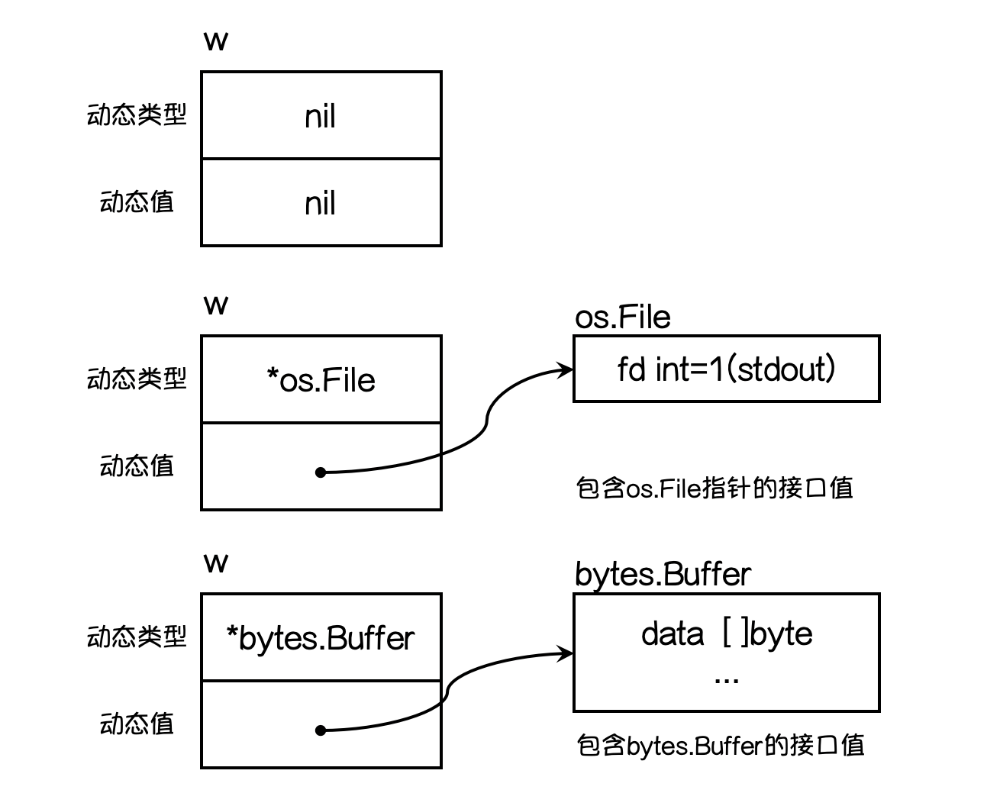

<!-- TOC -->

- [接口](#接口)
  - [1.1 接口类型](#11-接口类型)
  - [1.2 什么是接口](#12-什么是接口)
  - [1.3 接口定义](#13-接口定义)
  - [1.4 实现接口的条件](#14-实现接口的条件)
  - [1.5 接口类型变量](#15-接口类型变量)
  - [1.6 值接收者和指针接收者实现接口的区别](#16-值接收者和指针接收者实现接口的区别)
  - [1.7 类型与接口的关系](#17-类型与接口的关系)
  - [1.8 接口嵌套](#18-接口嵌套)
  - [1.9 空接口](#19-空接口)
  - [1.10 类型断言](#110-类型断言)

<!-- /TOC -->
# 接口

## 1.1 接口类型

Go语言中接口(interface)是一种类型，一种抽象的类型。

`interface`是一组`method`的集合，是`duck-type programming`的一种体现。接口做的事情就像是定义一个协议(规则)，只要一台机器有洗衣服和甩干的功能，我就称它为洗衣机。不关心属性(数据)，只关心行为(方法).

## 1.2 什么是接口

面向对象世界中的接口的一般定义是“接口定义对象的行为”。它表示让指定对象应该做什么。实现这种行为的方法是针对对象的。

Go中，接口是一组方法签名。当类型为接口中的所有方法提供定义时，它被称为实现接口。它于OOP非常相似。接口指定了类型应该具有的方法，类型决定了如何实现这些方法。

> 它把所有的具有共性的方法定义在一起，任何其它类型只要实现了这些方法就是实现了这个接口
>
> 接口定义了一组方法，如果某个对象实现了某个接口的所有方法，则此对象就实现了该接口。

## 1.3 接口定义

Go语言提供面向接口编程

每个接口有数个方法组成，接口的i当以格式如下：

```go
type 接口类型名 interface {
    方法名1(参数列表1) 返回值列表1
    方法名2(参数列表2) 返回值列表2
    ...
}
```
其中
- 接口名：使用`type`将接口定义为自定义的类型名。Go语言的接口在命名时，一般会在单词后面添加`er`，如有写操作的接口叫`Writer`，有字符串功能的接口叫`Stringer`等。接口名最好要能突出该接口的类型含义
- 方法名：当方法名首字母时大写且这个接口类型首字母也是大写时，这个方法可以被接口所在的包(package)之外的代码访问
- 参数列表、返回值列表：参数列表和返回值列表中的参数变量可以省略

例如：
```go
package main

import "fmt"

type Phone interface {
    call()
}

type NokiaPhone struct {
}

func (nokiaPhone NokiaPhone) call() {
    fmt.Println("I am Nokia, I can call you!")
}

type IPhone struct {
}

func (iPhone IPhone) call() {
    fmt.Println("I am IPhone, I can call you!")
}

func main() {
    var phone Phone

    phone = new(NokiaPhone)
    phone.call()

    phone = new(IPhone)
    phone.call()
}
```
运行结果
```
I am Nokia, I can call you!
I am iPhone, I can call you!
```

- interface可以被任意的对象实现
- 一个对象可以实现任意多个interface
- 任意的类型都实现了空interface，也就是包含0个method的interface

## 1.4 实现接口的条件

一个对象只要全部实现了接口中的方法，那么就实现了这个接口。接口就是一个<font color='red'>需要实现的方法列表</font>

```go
// 定义Sayer接口
type Sayer interface {
    say()
}

// 定义 dog 和 cat 两个结构体
type dog struct {}
type cat struct {}

// dog 实现 Sayer接口
func (d dog) say() {
    fmt.Println("汪汪汪")
}

// cat 实现 Sayer接口
func (c cat) say() {
    fmt.Println("喵喵喵")
}
```

## 1.5 接口类型变量

接口类型变量能够存储所有实现了该接口的实例。

```go
func main() {
    var x Sayer // 声明一个Sayer类型的变量x
    a := cat() // 实例化一个cat
    d := dog() // 实例化一个dog
    x = a   // 可以把cat实例直接赋值给x
    x.say() // 喵喵喵
    x = b   // 可以把dog实例直接赋值给x
    x.say() // 汪汪汪
}
```

## 1.6 值接收者和指针接收者实现接口的区别

```go
type Mover interface {
    move()
}

type dog struct {}
```

<font color='#cf4029' size='4px'>值接收者实现接口</font>

```go
func (d dog) move() {
    fmt.Println("狗会动")
}
```
此时实现接口的时`dog`类型
```go
func main() {
    var x Mover
    var wangcai = dog {} // 旺财是dog类型
    x = wangcai
    var fugui = &dog{} // 富贵是*dog类型
    x = fugui
    x.move()
}
```
上述代码中可以发现，使用值类型实现接口之后，不管是dog结构体还是结构体指针*dog类型的变量都可以赋值给该接口变量。因为Go中有对指针类型变量求职的语法糖，dog指针`fugui`内部会自动求值`*fugui`

<font color='#cf4029' size='4px'>指针接收者实现接口</font>

```go
func (d *dog) move() {
    fmt.Println("狗会动")
}

func main() {
    var x Mover
    var wangcai = dog{} // 旺财dog类型
    x = wangcai // x不可以接收dog类型
    var fugui = &dog{} // 富贵是*dog类型
    x =fugui    // x可以接收*dog类型
}
```
此时实现`Mover`接口的是`*dog`类型，所以不能给`x`传入`dog`类型的wangcai，此时`x`只能存储`*dog`类型的值。

## 1.7 类型与接口的关系

<font color='#cf4029' size='4px'>一个类型实现多个接口</font>

一个类型可以同时实现多个接口，而接口间彼此独立，不知道对方的实现。

```go
// Sayer 接口
type Sayer interface {
    say()
}

// Mover 接口
type Mover interface {
    move()
}

type dog struct {
    name string
}

// 实现Sayer接口
func (d dog) say() {
    fmt.Printf("%s 会叫汪汪汪\n", d.name)
}

// 实现Mover接口
func (d dog) move() {
    fmt.Printf("%s 会动\n", d.name)
}

func main() {
    var x Sayer
    var y Mover

    var a = dog{name: "旺财"}
    x = a
    y = a
    x.say()
    y.move()
}
```

<font color='#cf4029' size='4px'>多个类型实现一个接口</font>

Go语言中不同的类型还可以实现同一接口首先我们定义一个`Mover`接口，它要求必须由一个`move`方法

```go
// Mover 接口
type Mover interface {
    move()
}

type dog struct {
    name string
}

type car struct {
    brand string
}

// dog类型实现Mover接口
func (d dog) move() {
    fmt.Printf("%s会跑\n", d.name)
}

// car类型实现Mover接口
func (c car) move() {
    fmt.Printf("%s速度70迈\n", c.brand)
}

func main() {
    var x Mover
    var a = dog{name: "旺财"}
    var b = car{brand: "保时捷"}
    x = a
    x.move()
    x = b
    x.mover()
}
```
执行结果
```
旺财会跑
保时捷速度70迈
```

一个接口的方法，不一定需要有一个类型完全实现，接口的方法可以通过在类型中嵌入其它类型或者结构体来实现。

```go
// WashingMachine 洗衣机
type WashingMachine interface {
    wash()
    dry()
}

// 甩干器
type dryer struct {}

// 实现WashingMachine接口的dry()方法
func (d dryer) dry() {
    fmt.Println("甩一甩")
}

// 海尔洗衣机
type haier struct {
    dyer // 嵌入甩干器
}

// 实现WashingMachine接口的wash()方法
func (h haier) wash() {
    fmt.Println("喜刷刷")
}
```

## 1.8 接口嵌套

接口于接口间可以通过嵌套创造出新的接口

```go
// Sayer 接口
type Sayer interface {
    say()
}

// Mover接口
type Mover interface {
    move()
}

// 嵌套接口
type animal interface {
    Sayer
    Mover
}
```
嵌套得到的接口的使用于普通接口一样。

```go
// Sayer 接口
type Sayer interface {
    say()
}

// Mover接口
type Mover interface {
    move()
}

// 嵌套接口
type animal interface {
    Sayer
    Mover
}

type cat struct {
    name string
}

func (c cat) say() {
    fmt.Println("cat can say")
}

func (c cat) move() {
    fmt.Println("cat can move")
}

func main() {
    var x animal
    x = cat{name: "花花"}
    x.move()
    x.say()
}
```

## 1.9 空接口

<font color='#cf4029' size='4px'>空接口的定义</font>

空接口是指没有定义任何方法的接口，因此任何类型都实现了空接口。

空接口 类型的变量可以存储任何类型的变量。

```go
func main() {
    // 定义一个空接口x
    var x interface {}
    s := "hello world"
    x = s
    fmt.Printf("type:%T value:%v\n", x, x)
    i := 100
    x = i
    fmt.Printf("type:%T value:%v\n", x, x)
    b := true
    x = b
    fmt.Printf("type:%T value:%v\n", x, x)
}
```

<font color='#cf4029' size='4px'>空接口的应用</font>

<font color='#cf4029' size='3px'>空接口作为函数的参数</font>

使用空接口可以接收任意类型的函数参数

```go
// 空接口作为函数参数
func show(a interface{}) {
    fmt.Printf("type:%T value:%v\n", a, a)
}
```

<font color='#cf4029' size='3px'>空接口作为map的值</font>

使用空接口实现可以保存任意值的字典

```go
// 空接口作为map的值
var studentInfo = make(map[string]interface{})
studentInfo["name"] = "沙河娜扎"
studentInfo["age"] = 18
studentInfo["married"] = false
fmt.Println(studentInfo)
```

## 1.10 类型断言

<font color='#cf4029' size='4px'>接口值</font>

一个接口的值（简称接口值）是由`一个具体类型`和`具体类型的值`两部分组成的。这两部分分别称为接口的`动态类型`和`动态值`.

```go
var w io.Writer
w = os.Stdout
w = new(bytes.Buffer)
w = nil
```

图解



想要判断空接口中的值这个时候就可以使用类型断言，其语法格式：

```go
x.(T)
```
其中
- x：表示类型为interface{}的变量
- T：表示断言x可能是的类型

该语法返回两个参数，第一个参数是`x`转化为`T`类型后的变量，第二个值是一个布尔值，若为`true`则表达式断言成功，为`false`则表示断言失败。

```go
func main() {
    var x interface{}
    x = "hello world"
    v, ok := x.(string)
    if ok {
        fmt.Println(v)
    } else {
        fmt.Println("类型断言失败")
    }
}
```
上面的示例中如果要断言多次就需要写个`if`判断，这个时候可以使用`switch`语句实现

```go
func justifyType(x interface{}) {
    switch v := x.(type) {
        case string:
            fmt.Println("x is a string, value is %v\n", v)
        case int:
            fmt.Println("x is a int, value is %v\n", v)
        case bool:
            fmt.Println("x is a bool, value is %v\n", v)
        default:
            fmt.Println("unsupport type!")
    }
}
```
