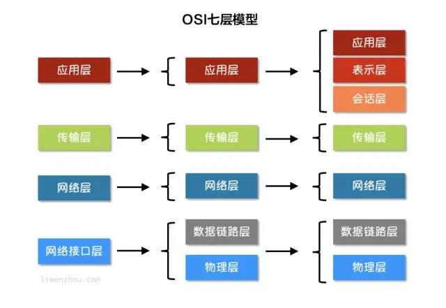

<!-- TOC -->

- [1 互联网协议介绍](#1-互联网协议介绍)
  - [1.1 互联网分层模型](#11-互联网分层模型)
    - [1.1.1 物理层](#111-物理层)
    - [1.1.2 数据链路层](#112-数据链路层)
    - [1.1.3 网络层](#113-网络层)
    - [1.1.4 传输层](#114-传输层)
    - [1.1.5 应用层](#115-应用层)
- [2 socket编程](#2-socket编程)
  - [2.1 socket图解](#21-socket图解)
  - [2.2 Go语言实现TCP通信](#22-go语言实现tcp通信)
    - [2.2.1 TCP协议](#221-tcp协议)
    - [2.2.2 TCP服务端](#222-tcp服务端)
    - [2.2.3 TCP客户端](#223-tcp客户端)
  - [2.3 TCP黏包](#23-tcp黏包)
    - [2.3.1 黏包示例](#231-黏包示例)
    - [2.3.2 为什么会出现黏包](#232-为什么会出现黏包)
    - [2.3.3 解决办法](#233-解决办法)
  - [2.4 Go语言实现UDP通信](#24-go语言实现udp通信)
    - [2.4.1 UDP协议](#241-udp协议)
    - [2.4.2 UDP服务端](#242-udp服务端)
    - [2.4.3 UDP客户端](#243-udp客户端)

<!-- /TOC -->

# 1 互联网协议介绍

> 互联网的核心是一些列协议，总称为“互联网协议”（Internet Protocol Suite），正是这一些协议规定了电脑如何连接和组网。

## 1.1 互联网分层模型




越下面的层，越靠近硬件；越上面的层，越靠近用户。

**典型协议**
- 应用层：HTTP、FTP
- 传输层：TCP、UDP
- 网络层：IP、ICMP、IGMP
- 网络接口层：ARP、RARP

### 1.1.1 物理层

电脑与外界互联网通信，需要将电脑连接网络，可以用双绞线、光纤、无线电波等方式。这就叫做“实物理层”，它就是把电脑连接起来的物理手段。它主要规定了网络的一些电气特性，作用是负责传送0和1的电信号。

### 1.1.2 数据链路层

数据链路层的功能就是确定了物理层传输的0和1的分组方式及代表的意义。

以太网规定，一组电信号构成一个数据包，叫做“帧”（Frame）。每一帧分成两个部分：标头（Head）和数据（Data）。其中，“标头”包含数据包的一些说明项，比如发送者、接受者、数据类型等等；“数据”则是数据包的具体内容。“标头”的长度，固定为18个字节。“数据”的长度，最短为46个字节，最长为1500字节。因此，整个“帧”最短为64字节，最长为1518字节。如果数据很长，就必须分割为多个帧进行发送。

连入网络的所有设备都必须具有“网卡”接口。数据包必须是从一块网卡，传送到另一块网卡。网卡的地址，就是数据包的发送地址和接收地址，这叫做MAC地址。每块网卡出厂的时候，都有一个唯一的MAC地址，长度是48个二进制位，通常用12个十六进制数表示。前6个十六进制数是厂商编号，后6个是该厂商的网卡流水号。有了MAC地址，就可以定位网卡的数据包的路径。

我们会通过ARP协议来获取接受方的MAC地址，有了MAC地址之后，如何把数据准确的发送给接收方呢？其实这里以太网采用了一种很”原始”的方式，它不是把数据包准确送到接收方，而是向本网络内所有计算机都发送，让每台计算机读取这个包的”标头”，找到接收方的MAC地址，然后与自身的MAC地址相比较，如果两者相同，就接受这个包，做进一步处理，否则就丢弃这个包。这种发送方式就叫做”广播”（broadcasting）。

### 1.1.3 网络层

理论上我们可以依靠MAC地址来向外发送数据，但是这种方式有一个重大的缺陷就是以太网采用广播方式发送数据包，这会使得效率低，而且只能在子网络中发送，若不在同一个子网络，是不能广播出去的。因此需要有一种方式来区分，如果是同一个子网络，就采用广播方式发送，否则就采用”路由”方式发送。这就导致了”网络层”的诞生。它的作用是引进一套新的地址，使得我们能够区分不同的计算机是否属于同一个子网络。这套地址就叫做”网络地址”，简称”网址”。

有了“网络层”后，没他计算机有两种地址，一种是MAC地址，另一种是网络地址。两种地址是没有任何联系的。MAC地址是绑定在网卡上的，网络地址是网络管理员分配的。网络地址帮助我们呢确定了计算机所在的自网络，MAC地址则将数据包送到该子网络的目标网卡。因此，逻辑上可以推断，首先处理网络地址，然后再处理MAC地址。

规定网络地址的协议，叫做IP协议。它所定义的地址，就被称为IP地址。目前，广泛采用的是IP协议第四版，简称IPv4。IPv4这个版本规定，网络地址由32个二进制位组成，我们通常习惯用分成四段的十进制数表示IP地址，从0.0.0.0一直到255.255.255.255。

根据IP协议发送的数据，就叫做IP数据包。IP数据包也分为”标头”和”数据”两个部分：”标头”部分主要包括版本、长度、IP地址等信息，”数据”部分则是IP数据包的具体内容。IP数据包的”标头”部分的长度为20到60字节，整个数据包的总长度最大为65535字节。

### 1.1.4 传输层

通过MAC地址和IP地址，可以在互联网上任意两台主机上建立通信。但是同一台主机上有许多程序都需要用网络收发数据，我们通过“端口”（port）来区分数据包到底供那个程序（进程）使用。这样不同的程序就能收到自己需要的数据。

“端口”是0到65535之间的一个整数，正好16个二进制位。0到1023的端口被系统占用，用户只能选用大于1023的端口。有了IP和端口我们就能实现唯一确定互联网上一个程序，进而实现网络间的程序通信。

在数据包中加入端口信息，这就需要新的协议。最简单的实现叫做UDP协议，它的格式几乎就是在数据前面，加上端口号。UDP数据包，也是由”标头”和”数据”两部分组成：”标头”部分主要定义了发出端口和接收端口，”数据”部分就是具体的内容。UDP数据包非常简单，”标头”部分一共只有8个字节，总长度不超过65,535字节，正好放进一个IP数据包。

UDP协议的优点是比较简单，容易实现，但是缺点是可靠性较差，一旦数据包发出，无法知道对方是否收到。为了解决这个问题，提高网络可靠性，TCP协议就诞生了。TCP协议能够确保数据不会遗失。它的缺点是过程复杂、实现困难、消耗较多的资源。TCP数据包没有长度限制，理论上可以无限长，但是为了保证网络的效率，通常TCP数据包的长度不会超过IP数据包的长度，以确保单个TCP数据包不必再分割。

### 1.1.5 应用层

应用程序收到”传输层”的数据，接下来就要对数据进行解包。由于互联网是开放架构，数据来源五花八门，必须事先规定好通信的数据格式，否则接收方根本无法获得真正发送的数据内容。”应用层”的作用就是规定应用程序使用的数据格式，例如我们TCP协议之上常见的Email、HTTP、FTP等协议，这些协议就组成了互联网协议的应用层。

如下图所示，发送方的HTTP数据经过互联网的传输过程中会依次添加各层协议的标头信息，接收方收到数据包之后再依次根据协议解包得到数据。


# 2 socket编程

> Socket是BSD UNIX的进程通信机制，通常也称作”套接字”，用于描述IP地址和端口，是一个通信链的句柄。Socket可以理解为TCP/IP网络的API，它定义了许多函数或例程，程序员可以用它们来开发TCP/IP网络上的应用程序。电脑上运行的应用程序通常通过”套接字”向网络发出请求或者应答网络请求。

## 2.1 socket图解

`Socket`是应用层与TCP/IP协议族通信的中间软件抽象层。在设计模式中，`Socket`其实就是一个门面模式，它把复杂的TCP/IP协议族隐藏在`Socket`后面，对用户来说只需要调用Socket规定的相关函数，让`Socket`去组织符合指定的协议数据然后进行通信。


## 2.2 Go语言实现TCP通信

### 2.2.1 TCP协议

TCP/IP(Transmission Control Protocol/Internet Protocol)即传输控制协议/网间协议，是一种面向连接（连接导向）的、可靠的、基于字节流的传输层(Transport layer)通信协议，因为是面向连接的协议，数据像水流一样传输，会存在黏包问题。

### 2.2.2 TCP服务端

一个TCP服务端可以同时连接很多个客户端。因为Go中创建多个goroutine实现并发非常方便和高效，所以可以每建立一个goroutine去处理。

TCP服务端程序的处理流程
1. 监听端口
2. 接收客户端请求建立连接
3. 创建goroutine处理连接

```go
// tcp/server/main.go

// TCP server端

// 处理函数
func process(conn net.Conn) {
    defer conn.Close()  // 关闭连接
    for {
        reader := bufio.NewReader(conn)
        var buf [128]byte
        n, err := reader.Read(buf[:]) // 读取数据
        if err != nil {
            fmt.Println("read from client failed, err: ", err)
            break
        }
        recvStr := string(buf[:n])
        fmt.Println("收到client端发来的数据：", recvStr)
        conn.Write([]byte(recvStr)) // 发送数据
    }
}

func main() {
    listen, err := net.Listen("tcp", "127.0.0.1:20000")
    if err != nil {
        fmt.Println("listen failed, err：", err)
        return
    }
    for {
        conn, err := listen.Accept()    // 建立连接
        if err != nil {
            fmt.Println("accept failed, err:", err)
            continue
        }
        go process(conn)    // 启动一个goroutine处理链接
    }
}
```

### 2.2.3 TCP客户端

一个TCP客户端进行TCP通信的流程如下：
1. 建立与服务端的连接
2. 进行数据收发
3. 关闭连接

```go
// tcp/client/main.go

// 客户端
func main() {
    conn, err := net.Dial("tcp", "127.0.0.1:20000")
    if err != nil {
        fmt.Println("err: ", err)
        return
    }
    defer conn.Close()  // 关闭连接
    inputReader := bufio.NewReader(os.Stdin)
    for {
        input, _ := inputReader.ReadString('\n')    // 读取用户输入
        inputInfo := strings.Trim(input, "\r\n")
        if strings.ToUpper(inputInfo) == "Q" {  // 如果输入q就退出
            return
        }
        _, err = conn.Write([]byte(inputInfo))  // 发送数据
        if err != nil {
            return
        }
        buf := [512]byte{}
        n, err := conn.Read(buf[:])
        if err != nil {
            fmt.Println("recv failed, err: ", err)
            return
        }
        fmt.Println(string(buf[:n]))
    }
}
```

## 2.3 TCP黏包

### 2.3.1 黏包示例

服务端代码
```go
// socket_stick/server/main.go

func process(conn net.Conn) {
    defer conn.Close()
    reader := bufio.NewReader(conn)
    var buf [1024]byte
    for {
        n, err := reader.Read(buf[:])
        if err == io.EOF {
            break
        }
        if err != nil {
            fmt.Println("read from client failed, err:", err)
            break
        }
        recvStr := string(buf[:n])
        fmt.Println("收到client发来的数据：", recvStr)
    }
}

func main() {
    listen, err := net.Listen("tcp", "127.0.0.1:30000")
    if err != nil {
        fmt.Println("listen failed, err:", err)
        return
    }
    defer listen.Close()
    for {
        conn, err := listen.Accept()
        if err != nil {
            fmt.Println("accept failed, err: ", err)
            continue
        }
        go process(conn)
    }
}
```
客户端代码
```go
// socket_stick/client/main.go

func main() {
    conn, err := net.Dial("tcp", "127.0.0.1:30000")
    if err != nil {
        fmt.Println("dial failed, err", err)
        return
    }
    defer conn.Close()
    for i:=0; i < 20; i++{
        msg := `Hello, Marin.How are you?`
        conn.Write([]byte(msg))
    }
}
```

### 2.3.2 为什么会出现黏包

主要原因就是tcp数据传递模式是流模式，在保持长连接的时候可以进行多次的收和发。

“粘包”可发生在发送端也可发生在接收端：
1. 由Nagle算法造成的发送端的粘包：Nagle算法是一种改善网络传输效率的算法。简单来说就是当我们提交一段数据给TCP发送时，TCP并不立刻发送此段数据，而是等待一小段时间看看在等待期间是否还有要发送的数据，若有则会一次把这两段数据发送出去。
2. 接收端接收不及时造成的接收端粘包：TCP会把接收到的数据存在自己的缓冲区中，然后通知应用层取数据。当应用层由于某些原因不能及时的把TCP的数据取出来，就会造成TCP缓冲区中存放了几段数据。

### 2.3.3 解决办法

出现“粘包”的关键在于接收方不确定将要传输的数据包的大小，因此我们可以对数据包进行封包和拆包的操作。

**封包**：封包就是给一段数据加上包头，这样一来数据包就分为包头和包体两部分内容了(过滤非法包时封包会加入”包尾”内容)。包头部分的长度是固定的，并且它存储了包体的长度，根据包头长度固定以及包头中含有包体长度的变量就能正确的拆分出一个完整的数据包。

```go
// socket_stick/proto/proto.go
package proto

import (
    "bufio"
    "bytes"
    "encoding/binary"
)

// Encode 将消息编码
func Encode(message string)([]byte, error) {
    // 读取消息的长度， 转换成int32类型（占4个字节）
    var length = int32(len(message))
    var pkg = new(bytes.Buffer)
    // 写入消息头
    err := binary.Write(pkg, binary.LittleEndian, length)
    if err != nil {
        return nil, err
    }
    // 写入消息实体
    err = binary.Write(pkg, binary.LittleEndian, []byte(message))
    if err != nil {
        return nil, err
    }
    return pkg.Bytes(), nil
}

// Decode 解码消息
func Decode(reader *bufio.Reader) (string, error) {
    // 读取消息的长度
    lengthByte, _ := reader.Peek(4) // 读取前4个字节的数据
    lengthBuff := bytes.NewBuffer(lengthByte)
    var length int32
    err := binary.Read(lengthBuff, binary.LittleEndian, &length)
    if err != nil {
        return "", err
    }
    // Buffered返回缓冲中现有的可读取的字节数
    if int32(reader.Buffered()) < length+4{
        return "", err
    }
    // 读取真正的消息数据
    pack := make([]byte, int(4+length))
    _, err = reader.Read(pack)
    if err != nil {
        return "", err
    }
    return string(pack[4:]), nil
}
```
接下来在服务端和客户端分别使用上面定义的`proto`包的`Decode`和`Encode`函数处理数据。

服务端代码
```go
// socket_stick/server2/main.go

func process(conn net.Conn) {
    defer conn.Close()
    reader := bufio.NewReader(conn)
    for {
        msg, err := proto.Decode(reader)
        if err == io.EOF {
            return
        }
        if err != nil {
            fmt.Println("decode msg failed, err:", err)
            return
        }
        fmt.Println("接收client发来的数据：", msg)
    }
}

func main() {
    listen, err := net.Listen("tcp", "127.0.0.1:30000")
    if err != nil {
        fmt.Println("listen failed, err: ", err)
        return
    }
    defer listen.Close()
    for {
        conn, err := listen.Accept()
        if err != nil {
            fmt.Println("accept failed, err: ", err)
            continue
        }
        go process(conn)
    }
}
```

客户端代码
```go
// socket_stick/client2/main.go

func main() {
    conn, err := net.Dial("tcp", "127.0.0.1:30000")
    if err != nil {
        fmt.Println("dial failed, err: ", err)
        return
    }
    defer conn.Close()
    for i := 0; i < 20; i++ {
		msg := `Hello, Hello. How are you?`
		data, err := proto.Encode(msg)
		if err != nil {
			fmt.Println("encode msg failed, err:", err)
			return
		}
		conn.Write(data)
	} 
}
```

## 2.4 Go语言实现UDP通信

### 2.4.1 UDP协议

UDP协议（User Datagram Protocol）中文名是用户数据报协议，是OSI（Open System Interconnection， 开放式系统互联）参考模型中一种无连接的传输层协议，不需要建立连接就能直接进行数据发送和接收，属于不可靠的、没有时序的通信，但是UDP协议的实时性比较好，通常用于视频直播相关领域。

### 2.4.2 UDP服务端

```go
// UDP/server/main.go

// UDP server端
func main() {
    listen, err := net.ListenUDP("udp", &net.UDPAddr{
        IP: net.IPv4(0, 0, 0, 0),
        Port: 30000
    })
    if err != nil {
        fmt.Println("listen failed, err: ", err)
        return
    }
    defer listen.Close()
    for {
        var data [1024]byte
        n, addr, err := listen.ReadFromUDP(data[:]) // 接收数据
        if err != nil {
            fmt.Println("read udp failed, err:", err)
            continue
        }
		fmt.Printf("data:%v addr:%v count:%v\n", string(data[:n]), addr, n)
		_, err = listen.WriteToUDP(data[:n], addr) // 发送数据
		if err != nil {
			fmt.Println("write to udp failed, err:", err)
			continue
		}
    }
}
```

### 2.4.3 UDP客户端

```go
// UDP 客户端
func main() {
	socket, err := net.DialUDP("udp", nil, &net.UDPAddr{
		IP:   net.IPv4(0, 0, 0, 0),
		Port: 30000,
	})
	if err != nil {
		fmt.Println("连接服务端失败，err:", err)
		return
	}
	defer socket.Close()
	sendData := []byte("Hello server")
	_, err = socket.Write(sendData) // 发送数据
	if err != nil {
		fmt.Println("发送数据失败，err:", err)
		return
	}
	data := make([]byte, 4096)
	n, remoteAddr, err := socket.ReadFromUDP(data) // 接收数据
	if err != nil {
		fmt.Println("接收数据失败，err:", err)
		return
	}
	fmt.Printf("recv:%v addr:%v count:%v\n", string(data[:n]), remoteAddr, n)
}
```