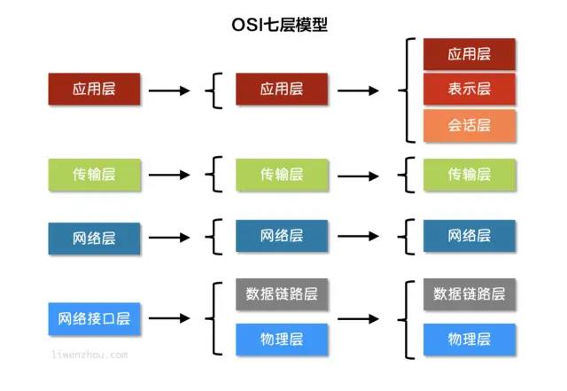
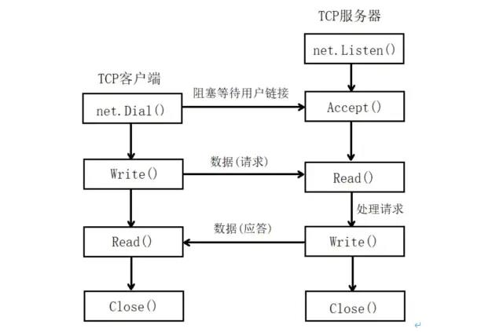
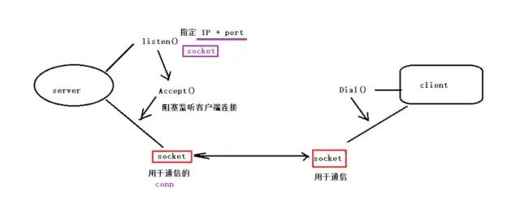

# 1、网络编程

## 1.1 协议

协议可以理解为规则，是数据传输和解释的规则，是通信双方都要遵守的规则

协议存在的意义是为了让双方更好的沟通

在双方之间被遵守的协议称为**原始协议**

## 1.2 分层模型



越下面的层，越靠近硬件；越上面的层，越靠近用户。

**典型协议**
- 应用层：HTTP、FTP
- 传输层：TCP、UDP
- 网络层：IP、ICMP、IGMP
- 网络接口层：ARP、RARP

**物理层**：主要定义物理设备标准，如网线的接口类型、光纤的接口类型、各种传输介质的传输速率等。它的主要作用是传输比特流（由1、0转化为电流强弱来进行传输，到达目的地后再转为1、0，即数模转换与模数转换）。这层的数据叫作比特。

**数据链路层**：定义了如何让格式化数据以帧为单位进行传输，以及如何控制物理介质的访问。这一层通常还提供错误检测和纠正，以确保数据的可靠传输。

**网络层**：再位于不同的地理位置的网络中的两个主机系统之间提供连接和路径选择。Internet的发展使得从世界各站点访问信息的用户数大大增加，而网络层正是管理这种连接的层。

**传输层**：定义了一些传输数据的协议和端口。如：TCP(传输控制协议，传输效率低，可靠性高强，用于传输可靠性要求高，数据量大的数据)，UDP（用户数据报协议，与TCP特性相反，用于传输可靠性要求不高，数据量小的数据）。主要是将从下层接收的数据进行分段和传输，到达目的地后在进行重组。常将这层的数据叫作**段**。

**会话层**：通过传输层（端口号：传输端口和接收端口）建立数据传输的通路。主要在你的系统之间发起会话或者接收会话请求（设备之间需要相互认识可以是IP也可以是MAC或主机名）

**应用层**：最靠近用户的OSI层。这层为用户的应用程序提供网络服务。发送邮件（https）、文件传输（FTP）

**传统的网络应用模型**
- C/S模型：需要在服务端和客户端都安装部署，次啊能完成数据通信。
  - 优势
    - 性能好，因为可以提前把数据缓存到客户端本地，提高用户体验，限制少，可采用的协议相对灵活。
  - 缺点
    - 安装部署客户端，麻烦，并且是在用户主机上安装的，会对用户主机安全性构成威胁
- B/S模型：只要在服务器端安装部署，客户端只需要一个浏览器即可。
  - 优点
    - 移植性非常好，不受平台限制，只需要浏览器就可以打开
  - 缺点
    - 无法提前缓存大量数据到本地，网络受限时，应用的体验非常差，浏览器采用的协议是标准的http协议通信，没有c/s灵活



- net.Listen()设置好了连接方式（tcp还是udp）、IP地址以及端口
- Accept()这时候发起监听，并阻塞等待客户端建立连接
- net.Dail()客户端用来发起访问请求


上述是大致流程，Accept和Dail成功之后都会返回一个socket，也就是上文提到的socket，其实Listen()的时候也会创建一个socket，但是这个socket不是用于通信的，只是创建用于通信的socket，绑定IP地址和端口设置监听的

```go
// 服务端 tcp socket
package main

import (
    "fmt"
    "net"
)

func main() {
    // 指定服务器，通信协议，IP地址，port，创建一个用户监听的socket
    listener, err := net.Listen("tcp", "127.0.0.1:8000")
    if err != nil {
        fmt.Printf("服务器设置监听失败，原因是：%v\n", err)
        return
    }
    defer listener.Close()

    fmt.Println("服务器等待客户端建立连接...")
    // 阻塞监听客户端连接请求，成功建立连接，返回用于通信的socket
    conn, err := listener.Accept()
    fmt.Println("验证是否Accept之后才开始阻塞...")
    if err != nil {
        fmt.Printf("服务器监听失败，原因是：%v\n", err)
    }
    defer conn.Close()

    fmt.Println("服务器与客户端成功建立连接！！！")
    // 读取客户端发送的数据
    buf := make([]byte, 1024)
    n, err := conn.Read(buf)
    if err != nil {
        fmt.Printf("Conn Read() 错误， 原因是：%v\n", err)
    }
    if string(buf[:n]) == "Are you ready?" {
        conn.Write([]byte("I am ready!"))
    }
    // 处理数据
    fmt.Println("服务器读到数据：", string(buf[:n]))
}
```

```go
// 客户端 tcp socket
package main

import (
    "fmt"
    "net"
)

func main() {
    // 指定服务器IP + PORT 创建通信套接字
    conn, err := net.Dial("tcp", "127.0.0.1:8000")
    if err != nil {
        fmt.Printf("net.Dial err: %v\n", err)
        return
    }
    defer conn.Close()

    // 主动写数据给服务器
    _, err = conn.Write([]byte("Are you ready?"))
    if err != nil {
        fmt.Printf("conn.Write err: %v\n", err)
        return
    }
    buf := make([]byte, 1024)
    // 接收服务器回发的数据
    n, err := conn.Read(buf)
    if err != nil {
        fmt.Printf("conn.Read err: %v\n", err)
        return
    }
    fmt.Printf("服务器回发的数据为：%v\n", string(buf[:n]))
}
```
