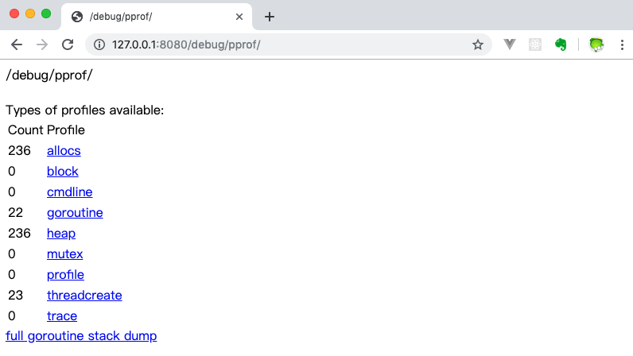
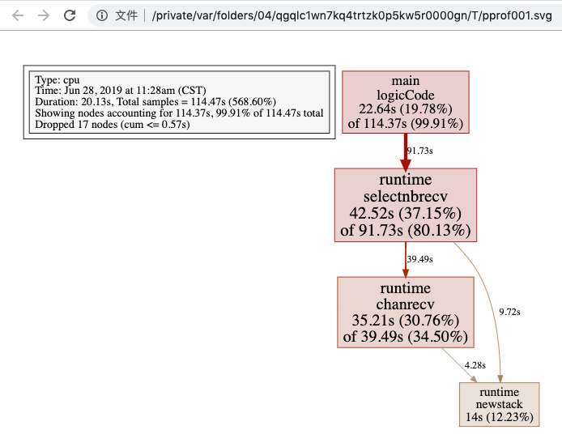
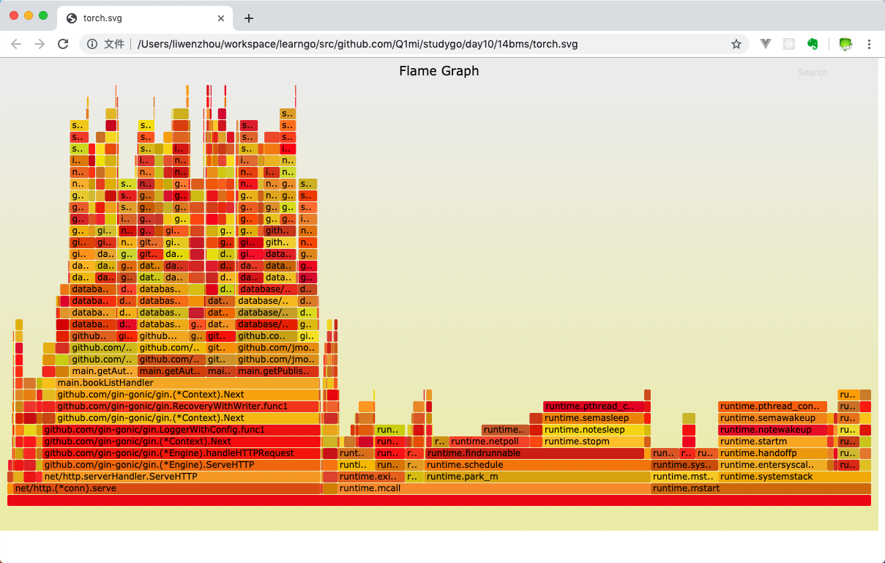

<!-- TOC -->
- [1. Go性能](#1-go性能)
  - [1.1 采集性能数据](#11-采集性能数据)
  - [1.2 工具型应用](#12-工具型应用)
    - [CPU性能分析](#cpu性能分析)
    - [内存性能优化](#内存性能优化)
  - [1.3 服务型应用](#13-服务型应用)
  - [1.4 go tool pprof命令](#14-go-tool-pprof命令)
  - [1.5 具体示例](#15-具体示例)
    - [命令行交互界面](#命令行交互界面)
    - [图形化](#图形化)
  - [1.6 go-torch和火焰图](#16-go-torch和火焰图)
    - [安装go-torch](#安装go-torch)
    - [安装FlameGraph](#安装flamegraph)
    - [压测工具wrk](#压测工具wrk)
    - [使用go-torch](#使用go-torch)
  - [1.7 pprof与性能测试结合](#17-pprof与性能测试结合)
<!-- TOC -->

# 1. Go性能

## 1.1 采集性能数据

Go内置了获取程序的运行数据的工具，包括以下两个标准库：

- `runtime/pprof`：采集工具型应用运行数据进行分析
- `net/http/pprof`：采集服务型应用运行时数据进行分析

pprof开启后，每隔一段时间（10ms）就会收集下当前的堆栈信息，获取各个函数占用的CPU以及内存资源；最后通过对这些采样数据进行分析，形成一个性能分析报告。

## 1.2 工具型应用

若应用程序时运行一段时间就结束退出类型。最好的方法是在应用退出的时候把profiling的报告保存到文件中，进行分析。对于这种情况，可以使用`runtime/pprof`库。

`import "runtime/pprof`

### CPU性能分析

开启CPU性能分析

`pprof.StartCPUProfile(w io.Writer)`

停止CPU性能分析

`pprof.StopCPUProfile()`

应用执行结束后，就会生成一个文件，保存CPU profiling数据。得到采样数据之后，使用`go tool pprof`工具进行CPU性能分析。

### 内存性能优化

记录程序堆栈信息

`pprof.WriteHeapProfile(w io.Writer)`

得到采样数据之后，使用`go tool pprof`工具进行内存性能分析。

`go tool pprof`默认使用`-inuse_space`进行统计，还可以使用`-nuse-objects`查看分配对象的数量

## 1.3 服务型应用

若应用程序是一直运行的，如web应用，可以使用`net/http/pprof`库，它能够在提供HTTP服务进行分析。

如果使用默认的`http.DefaultServeMux`（通常代码直接使用http.ListenAndServe("0.0.0.0:8000", nil)），只需要在web server端代码中导入`net/http/pprof`

`import _ "net/http/pprof"`

如果使用自定义的Mux，则需要手动注册一些路由规则

```go
r.HandleFunc("/debug/pprof/", pprof.Index)
r.HandleFunc("/debug/pprof/cmdline", pprof.Cmdline)
r.HandleFunc("/debug/pprof/profile", pprof.Profile)
r.HandleFunc("/debug/pprof/symbol", pprof.Symbol)
r.HandleFunc("/debug/pprof/trace", pprof.Trace)
```

如果使用gin框架，推荐使用`github.com/gin-contrib/pprof`，在代码中通过以下命令注册pprof相关路由。

`pprof.Register(router)`

HTTP服务都会多出`/debug/pprof`endpoint，访问它会得到类似下面的内容



这个路径下还有几个子页面：

- `/debug/pprof/profile`：这个连接会自动进行CPU profiling，持续30s，并生成一个文件供下载
- `/debug/pprof/heap`：Memory Profiling的路径，访问这个链接会得到一个内存Profiling结果的文件
- `/debug/pprof/block`：block Profiling的路径
- `/debug/pprof/goroutines`：运行的goroutines列表，以及调用关系。

## 1.4 go tool pprof命令

不管是工具型应用环视服务型应用，使用相应的pprof库获取数据之后，下一步都要对这些数据进行分析，我们可以使用`go tool pprof`命令行工具。

`go tool pprof`最简单的使用方式为：

> `go tool pprof [binary] [source]`

其中：

- binary是应用的二进制文件，用来解析各种符号
- source表示profile数据的来源，可以是本地文件，也可以是http地址

**注意事项**：获取的Profiling数据是动态的，想要获取有效的数据，请保证应用处于较大的负载（如正在生成中运行的服务，或通过其他工具模拟访问压力）。否则如果应用处于空闲状态，得到的结果可能没有任何意义。

## 1.5 具体示例

error代码

```go
package main

import (
    "flag"
    "fmt"
    "os"
    "runtime/pprof"
    "time"
)

// 一段有问题的代码
func logicCode() {
    var c chan int
    for {
        select {
        case v := <-c:
            fmt.Printf("recv from chan, value:%v\n", v)
        default:
        }
    }
}

func main() {
    var isCPUPprof bool
    var isMemPprof bool

    flag.BoolVar(&isCPUPprof, "cpu", false, "turn cpu pprof on")
    flag.BoolVar(&isMemPprof, "mem", false, "turn mem pprof on")
    flag.Parse()

    if isCPUPprof {
        file, err := os.Create("./cpu.pprof")
        if err != nil {
            fmt.Printf("create cpu pprof failed, err:%v\n", err)
            return
        }
        pprof.StartCPUProfile(file)
        defer pprof.StopCPUProfile()
    }
    for i := 0; i < 8; i++ {
        go logicCode()
    }
    time.Sleep(20 * time.Second)
    if isMemPprof {
        file, err := os.Create("./mem.pprof")
        if err != nil {
            fmt.Printf("create mem pprof failed, err:%v\n", err)
            return
        }
        pprof.WriteHeapProfile(file)
        file.Close()
    }
}
```

通过flag可以在命令行控制是否开启CPU和Mem的性能分析。将上面的代码保存并编译成`runtime_pprof`可执行文件，执行时加上`-cpu`命令行参数如下

> `./runtime_pprof -cpu`

### 命令行交互界面

使用go工具链中的`pprof`来分析以下

> `go tool pprof cpu.pprof`

执行上述命令，代码会进入交互界面如下

```text
runtime_pprof $ go tool pprof cpu.pprof
Type: cpu
Time: Jun 28, 2019 at 11:28am (CST)
Duration: 20.13s, Total samples = 1.91mins (568.60%)
Entering interactive mode (type "help" for commands, "o" for options)
(pprof)  
```

我们可以在交互界面输入`top3`来查看程序中占用CPU前3位的函数：

```text
(pprof) top3
Showing nodes accounting for 100.37s, 87.68% of 114.47s total
Dropped 17 nodes (cum <= 0.57s)
Showing top 3 nodes out of 4
      flat  flat%   sum%        cum   cum%
    42.52s 37.15% 37.15%     91.73s 80.13%  runtime.selectnbrecv
    35.21s 30.76% 67.90%     39.49s 34.50%  runtime.chanrecv
    22.64s 19.78% 87.68%    114.37s 99.91%  main.logicCode
```

其中

- flat：当前函数占用CPU的耗时
- flat%：当前函数占用CPU的耗时百分比
- sum%：函数占用CPU的耗时累计百分比
- cum：当前函数加上调用当前函数的函数占用CPU的总耗时
- cum%：当前函数加上调用当前函数的函数占用CPU的总耗时百分比
- 最后一列：函数名称

大多情况下，可以通过分析上述所说的五列得到一个应用的运行情况，并对程序进行优化。

可以通过使用`list函数`命令查看具体的函数分析，例如执行`list logicCode`查看编写的函数的详细分析。

```text
(pprof) list logicCode
Total: 1.91mins
ROUTINE ================ main.logicCode in .../runtime_pprof/main.go
    22.64s   1.91mins (flat, cum) 99.91% of Total
         .          .     12:func logicCode() {
         .          .     13:   var c chan int
         .          .     14:   for {
         .          .     15:           select {
         .          .     16:           case v := <-c:
    22.64s   1.91mins     17:                   fmt.Printf("recv from chan, value:%v\n", v)
         .          .     18:           default:
         .          .     19:
         .          .     20:           }
         .          .     21:   }
         .          .     22:}
```

通过分析发现大部分CPU资源被17行占用，我们分析出select语句中的default没有内容会导致上面的`case v:=<-c:`一直执行。我们在default分支添加一行`time.Sleep(time.Second)`即可

### 图形化

mac：

> `brew install graphviz`

Windows：

下载[graphviz](https://graphviz.org/download/)将`graphviz`安装目录下的bin文件夹添加到Path环境变量中。 在终端输入`dot -version`查看是否安装成功。



关于图形的说明： 每个框代表一个函数，理论上框的越大表示占用的CPU资源越多。 方框之间的线条代表函数之间的调用关系。 线条上的数字表示函数调用的次数。 方框中的第一行数字表示当前函数占用CPU的百分比，第二行数字表示当前函数累计占用CPU的百分比。

除了分析CPU性能数据，pprof也支持分析内存性能数据。比如，使用下面的命令分析http服务的heap性能数据，查看当前程序的内存占用以及热点内存对象使用的情况。

```bash
# 查看内存占用数据
go tool pprof -inuse_space http://127.0.0.1:8080/debug/pprof/heap
go tool pprof -inuse_objects http://127.0.0.1:8080/debug/pprof/heap
# 查看临时内存分配数据
go tool pprof -alloc_space http://127.0.0.1:8080/debug/pprof/heap
go tool pprof -alloc_objects http://127.0.0.1:8080/debug/pprof/heap
```

## 1.6 go-torch和火焰图

火焰图（Flame Graph）是 Bredan Gregg 创建的一种性能分析图表，因为它的样子近似 🔥而得名。上面的 profiling 结果也转换成火焰图，如果对火焰图比较了解可以手动来操作，不过这里我们要介绍一个工具：`go-torch`。这是 uber 开源的一个工具，可以直接读取 golang profiling 数据，并生成一个火焰图的 svg 文件。


### 安装go-torch

> go get -v github.com/uber/go-torch

火焰图 svg 文件可以通过浏览器打开，它对于调用图的最优点是它是动态的：可以通过点击每个方块来 zoom in 分析它上面的内容。

火焰图的调用顺序从下到上，每个方块代表一个函数，它上面一层表示这个函数会调用哪些函数，方块的大小代表了占用 CPU 使用的长短。火焰图的配色并没有特殊的意义，默认的红、黄配色是为了更像火焰而已。

go-torch 工具的使用非常简单，没有任何参数的话，它会尝试从`http://localhost:8080/debug/pprof/profile`获取 profiling 数据。它有三个常用的参数可以调整：

- -u –url：要访问的 URL，这里只是主机和端口部分
- -s –suffix：pprof profile 的路径，默认为 /debug/pprof/profile
- –seconds：要执行 profiling 的时间长度，默认为 30s

### 安装FlameGraph

要生成火焰图，需要事先安装 FlameGraph工具，这个工具的安装很简单（需要perl环境支持），只要把对应的可执行文件加入到环境变量中即可。

1. 下载安装perl：https://www.perl.org/get.html
2. 下载FlameGraph：git clone https://github.com/brendangregg/FlameGraph.git
3. 将FlameGraph目录加入到操作系统的环境变量中。
4. Windows平台的同学，需要把go-torch/render/flamegraph.go文件中的GenerateFlameGraph按如下方式修改，然后在go-torch目录下执行go install即可。

```go
// GenerateFlameGraph runs the flamegraph script to generate a flame graph SVG. func GenerateFlameGraph(graphInput []byte, args ...string) ([]byte, error) {
flameGraph := findInPath(flameGraphScripts)
if flameGraph == "" {
    return nil, errNoPerlScript
}
if runtime.GOOS == "windows" {
    return runScript("perl", append([]string{flameGraph}, args...), graphInput)
}
    return runScript(flameGraph, args, graphInput)
}
```

### 压测工具wrk

推荐使用 https://github.com/wg/wrk 或 https://github.com/adjust/go-wrk

### 使用go-torch

使用wrk进行压测

> `go-wrk -n 50000 http://127.0.0.1:8080/book/list`

在上面压测进行的同时，打开另一个终端执行

> `go-torch -u http://127.0.0.1:8080 -t 30`

30秒之后终端会初夏如下提示：`Writing svg to torch.svg`

然后我们使用浏览器打开`torch.svg`就能看到如下火焰图了。



火焰图的y轴表示cpu调用方法的先后，x轴表示在每个采样调用时间内，方法所占的时间百分比，越宽代表占据cpu时间越多。通过火焰图我们就可以更清楚的找出耗时长的函数调用，然后不断的修正代码，重新采样，不断优化。

此外还可以借助火焰图分析内存性能数据：

```text
go-torch -inuse_space http://127.0.0.1:8080/debug/pprof/heap
go-torch -inuse_objects http://127.0.0.1:8080/debug/pprof/heap
go-torch -alloc_space http://127.0.0.1:8080/debug/pprof/heap
go-torch -alloc_objects http://127.0.0.1:8080/debug/pprof/heap
```

## 1.7 pprof与性能测试结合

`go test`命令有两个参数和`pprof`相关，它们分别指定生成的CPU和Memory profiling保存的文件：

- cpuprofile：cpu profiling数据要保存的文件地址
- memprofile：memory profiling数据要报文的文件地址

我们还可以选择将pprof与性能测试相结合，比如：

比如下面执行测试的同时，也会执行 CPU profiling，并把结果保存在 cpu.prof 文件中：

> `go test -bench .-cpuprofile-cpu.prof`

比如下面执行测试的同时，也会执行Mem profiling，并把结果保存在cpu.prof文件中：

> `go test -bech . -memprofile=./mem.prof`

需要注意的是，Profiling 一般和性能测试一起使用，这个原因在前文也提到过，只有应用在负载高的情况下 Profiling 才有意义。
