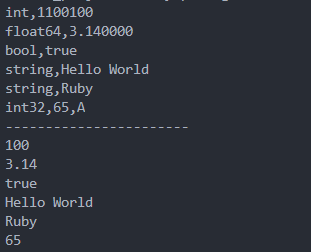

<!-- TOC -->

- [1、Go简介](#1go简介)
  - [1.1 Go语言的核心特性](#11-go语言的核心特性)
  - [1.2 核心特性](#12-核心特性)
  - [1.3 Go语言的特色：](#13-go语言的特色)
  - [1.4 Go的安装](#14-go的安装)
    - [1. Linux下安装（Ubuntu为例）](#1-linux下安装ubuntu为例)
  - [1.5 编码规范](#15-编码规范)
    - [1. 命名规范](#1-命名规范)
    - [2. 注释](#2-注释)
    - [3. 代码风格](#3-代码风格)
- [2、基本语法](#2基本语法)
  - [2.1 变量](#21-变量)
    - [1. 变量的使用](#1-变量的使用)
      - [1、什么是变量](#1什么是变量)
      - [2、声明变量](#2声明变量)
      - [3、注意事项](#3注意事项)
  - [2.2 常量](#22-常量)
    - [1. 常量的使用](#1-常量的使用)
      - [1、常量声明](#1常量声明)
      - [2、iota](#2iota)
  - [2.3 数据类型](#23-数据类型)
    - [1. 基本数据类型](#1-基本数据类型)
      - [1、布尔型bool](#1布尔型bool)
      - [2、数值型](#2数值型)
      - [3、字符串型](#3字符串型)
      - [4、数据类型转换：Type Convert](#4数据类型转换type-convert)
    - [2. 符合类型（派生类型）](#2-符合类型派生类型)
  - [2.4 运算符](#24-运算符)
    - [1. 运算符](#1-运算符)
      - [1、算术运算符](#1算术运算符)
      - [2、关系运算符](#2关系运算符)
      - [3、逻辑运算符](#3逻辑运算符)
      - [4、位运算符](#4位运算符)
      - [5、赋值运算符](#5赋值运算符)
      - [6、运算符优先级](#6运算符优先级)
  - [2.5 键盘输入和打印输出](#25-键盘输入和打印输出)
    - [1. 打印输出](#1-打印输出)
      - [1、fmt包](#1fmt包)
      - [2、导入包](#2导入包)
      - [3、常用打印函数](#3常用打印函数)
  - [2. 键盘输入](#2-键盘输入)
    - [1、fmt包读取键盘输入](#1fmt包读取键盘输入)
    - [2. bufio包读取](#2-bufio包读取)
- [3、分支语句](#3分支语句)
  - [3.1 程序的流程结构](#31-程序的流程结构)
  - [3.2 条件语句](#32-条件语句)
    - [1、if语句](#1if语句)
    - [2、if变体](#2if变体)
    - [3、switch语句](#3switch语句)
    - [4、fallthrough](#4fallthrough)
    - [5、Type Switch](#5type-switch)
- [4、循环语句](#4循环语句)
  - [4.1 for语句](#41-for语句)
  - [4.2 for循环变体](#42-for循环变体)
  - [4.3 跳出循环的语句](#43-跳出循环的语句)
    - [1、break语句](#1break语句)
    - [2、continue语句](#2continue语句)
  - [4.4 goto语句](#44-goto语句)
- [5、数组](#5数组)
  - [5.1 什么是数组](#51-什么是数组)
  - [5.2 数组的语法](#52-数组的语法)
  - [5.3 多维数组](#53-多维数组)
- [6、Slice的使用](#6slice的使用)
- [7、Map的使用](#7map的使用)
- [8、string](#8string)
- [9、函数](#9函数)
- [10、包管理](#10包管理)
- [11、指针](#11指针)
- [12、结构体](#12结构体)
- [13、方法、接口、OOP编程、type](#13方法接口oop编程type)
- [14、错误处理](#14错误处理)

<!-- /TOC -->

# 1、Go简介

## 1.1 Go语言的核心特性

Go语言具有很强的表达能力，它简洁、清晰而高效。得益于其并发机制， 用它编写的程序能够非常有效地利用多核与联网的计算机，其新颖的类型系统则使程序结构变得灵活而模块化。 Go 代码编译成机器码不仅非常迅速，还具有方便的垃圾收集机制和强大的运行时反射机制。 它是一个快速的、静态类型的编译型语言，感觉却像动态类型的解释型语言。

## 1.2 核心特性

1、并发编程

高并发是Golang语言最大的亮点。

golang的并发执行单元是一种称为goroutine的协程。

Golang是语言级别支持协程(goroutine)并发（协程又称为微线程，比线程更轻量、开销更小，性能更高），操作起来非常简单，语言级别提供关键字(go)用于启动协程，并且在同一台机器上可以启动成千上万个协程。协程经常被理解为轻量级线程，一个线程可以包含多个协程，共享堆不共享栈。协程间一般由应用程序显式实现调度，上下文切换无须下到内核层，高效不少。协程间一般不做同步通讯，而golang中实现协程间通讯有两种
1. 共享内存型，即使用全局变量+mutex锁来实现数据共享
2. 消息传递型，即使用一种独有的channel机制进行异步通讯

2、内存回收(GC)

- 内存自动回收，再也不需要开发人员管理内存
- 开发人员专注业务实现，降低了心智负担
- 只需要new分配内存，不需要释放

3、内存分配

初始化阶段直接分配一块大内存区域，大内存被切分成各个大小等级的块，放入不同的空闲list中，对象分配空间时从空闲list中取出大小合适的内存块。内存回收时，会把不用的内存重放回空闲list。空闲内存会按照一定策略合并，以减少碎片。

4、编译

编译涉及到的两个问题
1. 编译速度。目前两种编译器
   1. 建立在GCC基础上的Gccgo
   2. 针对64位X64和32位X86计算机的一套编译器（6g和8g）
2. 依赖管理。绝大多数第三方开源库都在github上，库会默认下载到工程的pkg目录下

5、网络编程

具备去中心化、分布式等特性，具体表现之一就是提供了丰富便捷的网络编程接口，比如socket用net.dial(基于tcp/udp，封装了传统的connect、listen、accept等接口)、http用http.Get/Post()、rpc用client.Call('class_name.method_name', args, &reply)等

6、函数多返回值

7、语言交互性

go语言可以和C程序交互，但不能和C++交互。有两种替代方案
1. 先将C++编译成动态库，再由go调用一段c代码，c代码通过dlfcn库动态调用动态库（记得export LD_LIBRARY_PATH）
2. 使用swig

8、异常处理

golang不支持try...catch这样的结构化的异常解决方式。golang提倡的异常处理方式是：
- 普通异常：被调用方返回error对象，调用方判断error对象
- 严重异常：指的是中断panic（比如除0），使用`defer...recover...panic`机制来捕获处理。严重异常一般由golang内部自动抛出，不需要用户主动抛出。当然，用户也可以使用panic('xxx')主动抛出，只是这样会使这套机制退化称结构化异常机制了。

9、其他特性

- 类型推导：类型定义：支持`var abc = 9`这样语法，看上去有点像动态类型语言，但是golang是强类型的，前面的定义会被自动推导出是int类型
- 一个类型只要实现了某个interface的所有方法，既可以实现该interface，无需显式去继承
- 不能循环应用
- defer机制：通过该关键字指定需要延迟执行的逻辑体，即在函数体return前或出现panic时执行。
- “包”的概念：将相同功能的代码放在一个目录，称之为包。包可以被其它包引用。main包是用来生成可执行文件，每个程序只有一个main包。
- 编程规范：GO语言的编程规范强制集成在语言中，比如明确规定花括号摆放位置，强制要求一行一句，不允许导入没有使用的包，不允许定义没有使用的变量，提供gofmt工具强制格式化代码等等。
- 交叉编译：比如说你可以在运行 Linux 系统的计算机上开发运行 Windows 下运行的应用程序。这是第一门完全支持 UTF-8 的编程语言，这不仅体现在它可以处理使用 UTF-8 编码的字符串，就连它的源码文件格式都是使用的 UTF-8 编码。

## 1.3 Go语言的特色：

- 没有继承多态的面向对象
- 强一致类型
- interface不需要显式声明(Duck Typing)
- 没有异常处理(Error is value)
- 基于首字母的可访问特性
- 不用的import或者变量引起编译错误
- 完整而卓越的标准库包
- Go内置runtime（作用是性能监控、垃圾回收等）

## 1.4 Go的安装

### 1. Linux下安装（Ubuntu为例）

## 1.5 编码规范

### 1. 命名规范

Go在命名时以字母a到Z或a到Z或下划线开头，后面跟着零或更多的字母、下划线和数字(0到9)。Go不允许在命名时中使用@、$和%等标点符号。Go是一种区分大小写的编程语言。
> 1. 当命名（包括常量、变量、类型、函数名、结构字段等等）以一个大写字母开头，如：Group1，那么使用这种形式的标识符的对象就可以被外部包的代码所使用（客户端程序需要先导入这个包），这被称为导出（像面向对象语言中的 public）；
>
> 2. 命名如果以小写字母开头，则对包外是不可见的，但是他们在整个包的内部是可见并且可用的（像面向对象语言中的 private ）

1、包命名

保持package的名字和目录保持一致，尽量采取有意义的包名，简短，有意义，尽量和标准库不要冲突。包名应该为小写单词，不要使用下划线或者混合大小写。

2、文件命名

尽量采取有意义的文件名，简短，有意义，应该为小写单词，使用下划线分隔各个单词。

3、结构体命名

- 采用驼峰命名法，首字母根据访问控制大写或者小写
- struct 申明和初始化格式采用多行，例如下面

```go
// 多行声明
type User struct{
    Username    string
    Email       string
}

// 多行初始化
u := User{
    Username: "astaxie",
    Email:    "astaxie@gmail.com",
}
```

4、接口命名

- 命名规则基本和上面的结构体类型
- 单个函数的结构名以 “er” 作为后缀，例如 Reader , Writer 。

```go
type Reader interface{
    Read(p []byte)(n int, err error)
}
```

5、变量命名
- 和结构体类似，变量名称一般遵循驼峰法，首字母根据访问控制原则大写或者小写，但遇到特有名词时，需要遵循以下规则：
  - 如果变量为私有，且特有名词为首个单词，则使用小写，如 apiClient
  - 其它情况都应当使用该名词原有的写法，如 APIClient、repoID、UserID
  - 错误示例：UrlArray，应该写成 urlArray 或者 URLArray
- 若变量类型为 bool 类型，则名称应以 Has, Is, Can 或 Allow 开头

6、常量命名

常量均需使用全部大写字母组成，并使用下划线分词。

```go
const APP_VER = "1.0"
```

如果是枚举类型的常量，需要先创建相应类型：

```go
type Scheme string

const (
    HTTP  Scheme = "http"
    HTTPS Scheme = "https"
)
```

7、关键字


### 2. 注释

Go提供C风格的/* */块注释和C ++风格的//行注释。行注释是常态；块注释主要显示为包注释，但在表达式中很有用或禁用大量代码。

- 单行注释是最常见的注释形式，你可以在任何地方使用以 // 开头的单行注释
- 多行注释也叫块注释，均已以 /* 开头，并以 */ 结尾，且不可以嵌套使用，多行注释一般用于包的文档描述或注释成块的代码片段

`go`语言自带的 `godoc` 工具可以根据注释生成文档，生成可以自动生成对应的网站（ golang.org 就是使用 `godoc` 工具直接生成的），注释的质量决定了生成的文档的质量。每个包都应该有一个包注释，在package子句之前有一个块注释。对于多文件包，包注释只需要存在于一个文件中，任何一个都可以。包评论应该介绍包，并提供与整个包相关的信息。它将首先出现在`godoc`页面上，并应设置下面的详细文档。

1、包注释

每个包都应该有一个包注释，一个位于package子句之前的块注释或行注释。包如果有多个go文件，只需要出现在一个go文件中（一般是和包同名的文件）即可。包注释应该包含下面基本信息（严格按照这个顺序，简介，创建人，创建时间）：

- 包的基本简介（包名，简介）
- 创建者，格式：创建人：rtx名
- 创建时间，格式：创建时间：yyyyMMdd

例如 util包的注释示例如下

```go
// util包，该包包含了项目共用的一些常量，封装了项目一些公用函数。
// 创建人：xxx
// 创建时间：20201223
```

2、结构（接口）注释

每个自定义的结构体或者接口都应该有注释说明，该注释对结构及逆行简要介绍，放在结构体定义的前一行，格式位：结构体名，结构体说明。同时结构体的每个成员变量要有说明，该说明放在成员变量的后面（注意对齐），实例如下

```go
// User， 用户对象，定义了用户的基础信息
type User struct{
    Username    string  // 用户名
    Email       string  // 邮箱
}
```

3、函数（方法）注释

每个函数，或者方法（结构体或者接口下的函数称为方法）都应该有注释说明，函数的注释应该包括三个方面

- 简要说明，格式说明：已函数名开头，“，”分隔说明部分
- 参数列表：每行一个参数，参数名开头，“，”分隔说明部分
- 返回值：每行一个返回值

示例如下：

```go
// NewattrModel , 属性数据层操作类的工厂方法
// 参数：
//      ctx ： 上下文信息
// 返回值：
//      属性操作类指针
func NewAttrModel(ctx *common.Context) *AttrModel{

}
```

4、代码逻辑注释

对于一些关键位置的逻辑代码，或者局部较为复杂的逻辑，需要有响应的逻辑说明，方便其他开发者阅读该段代码，实例如下

```go
// 从 Redis 中批量读取属性，对于没有读取到的 id ， 记录到一个数组里面，准备从 DB 中读取
```

5、注释风格

统一使用中文注释，对于中英文字符之间严格使用空格分隔，这个不仅仅是中文和英文之间，英文和中文标点之间也都要使用空间分隔，例如：

```go
// 从 Redis 中批量读取属性，对于没有读取到的 id ， 记录到一个数组里面，准备从 DB 中读取
```

- 建议全部使用单行注释
- 和代码的规范一样，单行注释不要过长，禁止炒股过120字符

### 3. 代码风格

1、缩进和折行

- 缩进直接使用gofmt工具格式化即可（gofmt是使用tab缩进的）
- 折行方面，一行最长不超过120个字符，超过的请使用换行展示，尽量保持格式优雅

2、语句的结尾

Go语言不需要类似Java、C、C++的结尾符号，默认一行就是一条数据

如果打算多个语句写在同一行，它们则必须使用`;`符号

3、括号和空格

括号和空格方面，也可以直接使用gofmt工具格式化（go会强制左大括号不换行，换行会报语法错误），所有的运算符和操作数之间要留空格

```go
// 正确的方式
if a > 0 {

}

// 错误的方式
if a > 0    // a, 0 和 > 之间应该空格
{           // 左大括号不可以换行，会报语法错误

}
```

4、import规范

import在多行的情况下，goimports会自动帮助格式化，如果在一个文件里引入了一个package，建议采用如下格式

```go
import (
    "fmt"
)
```

如果你的包引入了三种类型的包，标准库包，程序内部包，第三方包，建议采用如下方式进行组织你的包：

```go
import (
    "encoding/json"
    "strings"

    "myproject/models"
    "myproject/controller"
    "myproject/utils"

    "github.com/astaxie/beego"
    "github.com/go-sql-driver/mysql"
)
```

有顺序的引入包，不同的类型采用空格分离，第一种实标准库，第二是项目包，第三是第三方包。

项目中不要使用相对路径引入包：

```go
// 这是不好的导入
import “../net”

// 这是正确的做法
import “github.com/repo/proj/src/net”
```

但是如果是引入本项目中的其他包，最好使用相对路径。

5、错误处理

- 错误处理的原则就是不能丢弃任何有返回err的调用，不要使用 _ 丢弃，必须全部处理。接收到错误，要么返回err，或者使用log记录下来
- 尽早return：一旦有错误发生，马上返回
- 尽量不要使用panic，除非你知道你在做什么
- 错误描述如果是英文必须为小写，不需要标点结尾
- 采用独立的错误流进行处理

```go
// 错误写法
if err != nil {
    // error handling
} else {
    // normal code
}

// 正确写法
if err != nil {
    // error handling
    return // or continue, etc.
}
// normal code
```

# 2、基本语法

## 2.1 变量

### 1. 变量的使用

#### 1、什么是变量

变量是为存储特定类型的值而提供给内存位置的名称。变量的本质就是一小块内存，用于存储数据，在程序运行过程中数值可以发生改变。

#### 2、声明变量

变量声明的几种方式子

1、指定变量类型，声明后若不赋值，使用默认值

```go
var name type
name = value
```

2、根据值自行判断变量类型（类型推断Type inference）

如果变量有初始值，Go将自动能够使用初始值来推断该变量的类型。因此，如果变量具有初始值，则可以省略变量生命中的类型

```go
var name = value
```

3、省略`var`，注意`:=`左侧的变量不应该是已经声明过的（多个变量同时声明时，至少保证一个是新变量），否则会导致编译错误（简单声明）

```go
name := vlaue

// 例如
var a int = 10
var b = 10
c := 10
```

这种方式只能被用在函数体内，而不可以用于全局变量的声明和赋值

```go
package main

var a = "Hello"
var b string = "world"
var c bool

func main(){
    printIn(a, b, c)
}

// 运行结果
// hello world false
```

4、多变量声明

1)、以逗号分隔，声明与赋值分开，若不赋值，存在默认值

```go
var name1, name2, name3 type
name1, name2, name3 = v1, v2, v3
```

2)、直接赋值，下面的变量类型可以是不同的类型

`var name1, name2, name3 = v1, v2, v3`

3)、集合类型

```go
var (
    name1 type1
    name2 type2
)
```

#### 3、注意事项

- 变量必须先定义才能使用
- go语言是静态语言，要求变量的类型和赋值的类型必须一致
- 变量名不能冲突。（同一个作用域内不能冲突）
- 简短定义方式，左边的变量名至少有一个是新的
- 简短定义凡是，不能定义全局变量
- 变量的零值。也叫默认值
- 变量定义了就要使用，否则无法通过编译

在相同的代码块内，不可以再次对相同名称的变量使用初始化声明，例如：`a:=20`就是不被允许的，编译器会提示错误`no new variables on left side of :=`，但是`a=20`是可以的，因为这是给相同的变量赋予一个新的值。

如果在定义变量a之前使用它，则会提示`undefined: a`错误。如果声明了一个局部变量却没有在相同的代码块中使用它，同样会编译不通过。

在同一个作用域中，已存在同名的变量，则之后的声明初始化，则退化位赋值操作，但是这个前提是，最少要有一个新的变量被定义，且在同一作用域。

```go
package main

import (
    "fmt"
)

func main() {
	x := 100
	println(&x, x)
	x = 200
	println(&x, x)
	x, y := 300, 400
	println(&x, x, y)
}

// 运行结果
// 0xc000041f48 100
// 0xc000041f48 200
// 0xc000041f48 300 400
```

## 2.2 常量

### 1. 常量的使用

#### 1、常量声明

常量是一个简单的标识符，在程序运行时，不会被修改的量

定义语句格式：

`const identifier [type] = value`

```go
// 显式类型定义
const b string = "abc"
// 隐式类型定义
const b = "abc"
```

```go
package main

import (
	"fmt"
)

func main() {
	const LENGTH int = 10
	const WIDTH int = 5
	var area int
	const a, b, c = 1, false, "str" // 多重赋值

	area = LENGTH * WIDTH
	fmt.Println("面积为：%d", area)
	println()
	println(a, b, c)
}

// 运行结果
// 面积为：%d 50
// 
// 1 false str
```

常量可以作为枚举，常量组

```go
const (
    Unknown = 0
    Female = 1
    Male = 2
)
```

常量组中若不指定类型和初始值，则与上一行非空常量右值相同

```go
package main

import (
	"fmt"
)

func main() {
	const (
		x uint16 = 16
		y
		s = "abc"
		z
	)
	fmt.Printf("%T, %v", y, y)
	fmt.Printf("%T, %v", z, z)
}

// 运行结果
// uint16, 16string, abc
```

常量的注意事项：
- 常量中的数据类型只可以是布尔型、数据型（如整数、浮点型和复数）和字符串型。
- 不曾使用的常量，在编译时不会报错
- 显示指定类型的时候，必须确保常量左右值类型一致，需要时可做显示类型转换。

#### 2、iota

iota，特殊常量，可以认为是一个可以被编译器修改的常量

iota可以别用于枚举值

```go
const (
    a = iota
    b = iota
    c = iota
)
```

第一个iota等于0， 每当iota在新的一行被使用时，它的值都会自动加1；所以a=0,b=1,c=2可以简写为如下形式

```go
const (
    a = iota
    b
    c
)
```

iota用法

```go
package main

import "fmt"

func main() {
	const (
		a = iota // 0
		b        // 1
		c        // 2
		d = "ha" // "ha"
		e        // "ha"
		f = 100  // 100
		g        // 100
		h = iota // 7
		i        // 8
	)
	fmt.Println(a, b, c, d, e, f, g, h, i)
}

// 运行结果：
// 0 1 2 ha ha 100 100 7 8
```

如果中断iota自增，则必须显式恢复。且后续自增值按行序递增

自增默认是int类型，可以自行进行显示指定类型

数字常量不会分配存储空间，无须像变量那样通过内存寻址来取值，因此无法获取地址

## 2.3 数据类型

### 1. 基本数据类型

- bool
- Numeric Types
  - int8, int16, int32, int64, int
  - uint8, uint16, uint32, uint64, uint
  - float32, float64
  - complex64, compliex128
  - byte
  - rune
- string

#### 1、布尔型bool

布尔型的值只可以是常量`true`和`false`。

#### 2、数值型

1、整数型

- int8：有符号 8 位整数（-128 ~ 127）长度：8bit
- int16：有符号 16 位整数 (-32768 ~ 32767)
- int32：有符号 32 位整型 (-2147483648 ~ 2147483647)
- int64：有符号 64 位整型 (-9223372036854775808 ~ 9223372036854775807)
- uint8：无符号 8 位整型 (0 ~ 255) 
- uint16：无符号 16 位整型 (0 ~ 65535)
- uint32：无符号 32 位整型 (0 ~ 4294967295)
- uint64：无符号 64 位整型 (0 ~ 18446744073709551615)

> int和uint:根据底层平台，表示32或64位整数。除非需要使用特定大小的整数，否则通常应该使用int来表示整数。 大小:32位系统32位，64位系统64位。 范围:-2147483648到2147483647的32位系统和-9223372036854775808到9223372036854775807的64位系统。

2、浮点型

- float32：IEEE-754 32位浮点型数
- float64：IEEE-754 64位浮点型数
- complex64：32 位实数和虚数
- complex128：64 位实数和虚数

3、其他

- byte：类似uint8
- rune：类似int32
- uint：32或64位
- int：与uint一样大小
- uintptr：无符号整型，用于存放一个指针

#### 3、字符串型

字符串就是一串固定长度的字符连接起来的字符序列。Go的字符串是由单个字节连接起来的。Go语言的字符串的字节使用UTF-8编码表示Unicode文本

```go
var str string
str = "Hello World"
```

#### 4、数据类型转换：Type Convert

语法格式：Type(value)

常数：在有需要的时候，会自动转型

变量：需要手动转型T(v)

注意：兼容类型可以转换

### 2. 符合类型（派生类型）

1. 指针类型（Pointer）
2. 数组类型
3. 结构化类型（struct）
4. Channel类型
5. 函数类型
6. 切片类型
7. 接口类型（interface）
8. Map类型

## 2.4 运算符

### 1. 运算符

#### 1、算术运算符

| 运算符 | 描述 |
| --- | --- |
| + | 加 |
| - | 减 |
| * | 乘 |
| / | 除 |
| % | 求余 |
| ++ | 自增 | 
| -- | 自减 |

#### 2、关系运算符

| 运算符 | 描述 |
| --- | --- |
| == | 等于 | 
| != | 不等于 |
| > | 大于 |
| < | 小于 |
| >= | 大于等于 |
| <= | 小于等于 |

#### 3、逻辑运算符

| 运算符 | 描述 |
| --- | --- |
| && | 逻辑与运算符。如果两个操作数都非零，则条件变为真 |
| \|\| | 逻辑或运算符。如果任何两个操作数都是非零，则条件变为真 |
| ! | 逻辑非运算符。使用反转操作数的逻辑状态。如果条件为真，那么逻辑非操作结果为假。 |

#### 4、位运算符

| A | B | A&B | A\|B | A^B |
| --- | --- | --- | --- | --- |
| 0 | 0 | 0 | 0 | 0 |
| 0 | 1 | 0 | 1 | 1 |
| 1 | 0 | 0 | 1 | 1 |
| 1 | 1 | 1 | 1 | 0 |

`^`只要AB两者都相同的时候为0，其他都为1

设`A=60,B=13`
| 运算符 | 描述 | 示例 |
| --- | --- | --- |
| & | 二进制与操作副本位的结果，如果它存在于两个操作数 | (A & B) = 12, 也就是 0000 1100 |
| \| | 二进制或操作副本，如果它存在一个操作数 | (A | B) = 61, 也就是 0011 1101 |
| ^ | 二进制异或操作副本，如果它被设置在一个操作数就是按位取非 | (A ^ B) = 49, 也就是 0011 0001 |
| &^ | 二进制位清空&^ | (A&^B)=48，也就是110000 |
| << | 二进制左移位运算符。左边的操作数的值向左移动由右操作数指定的位数 | A << 2 =240 也就是 1111 0000 |
| >> | 二进制向右移位运算符。左边的操作数的值由右操作数指定的位数向右移动 | A >> 2 = 15 也就是 0000 1111 |

#### 5、赋值运算符

| 运算符 | 描述 | 示例 |
| --- | --- | --- |
| = | 简单的赋值操作符，分配值从右边的操作数左侧的操作数 | C = A + B 将分配A + B的值到C |
| += | 相加并赋值运算符，它增加了右操作数左操作数和分配结果左操作数 | C += A 相当于 C = C + A |
| -= | 减和赋值运算符，它减去右操作数从左侧的操作数和分配结果左操作数 | 	C -= A 相当于 C = C - A |
| *= | 乘法和赋值运算符，它乘以右边的操作数与左操作数和分配结果左操作数 | C *= A 相当于 C = C * A |
| /= | 除法赋值运算符，它把左操作数与右操作数和分配结果左操作数 | C /= A 相当于 C = C / A |
| %= | 模量和赋值运算符，它需要使用两个操作数的模量和分配结果左操作数 | 	C %= A 相当于 C = C % A |
| <<= | 左移位并赋值运算符 | C <<= 2 相同于 C = C << 2 |
| >>= | 向右移位并赋值运算符 | C >>= 2 相同于 C = C >> 2 |
| &= | 按位与赋值运算符 | C &= 2 相同于 C = C & 2 |
| ^= | 按位异或并赋值运算符 | C ^= 2 相同于 C = C ^ 2 |
| \|= | 按位或并赋值运算符 | C \|= 2 相同于 C = C \| 2 |

#### 6、运算符优先级

二元运算符的运算方向均是从左到右。下标列出所有运算符以及它们的优先级，由上到下代表优先级由高到低：

| 优先级 | 运算符 |
| --- | --- |
| 7 | ~、!、++、-- |
| 6 | *、/、%、<<、>>、&、&^ |
| 5 | +、-、^ |
| 4 | ==、!=、<、<=、>=、> |
| 3 | <- |
| 2 | && |
| 1 | \|\| |

## 2.5 键盘输入和打印输出

### 1. 打印输出

#### 1、fmt包

fmt包实现了类似C语言printf和scanf的格式化I/O。


#### 2、导入包

`import "fmt"`

#### 3、常用打印函数

**打印**：

`func Print(a ...interface{}) (n int, err error)`

**格式化打印**：

`func Printf(format string, a ...interface{}) (n int, err error)`

**打印后换行**：

`func Println(a ...interface{}) (n int, err error)`

格式化打印中的常用占位符：

```text
格式化打印占位符：
			%v,原样输出
			%T，打印类型
			%t,bool类型
			%s，字符串
			%f，浮点
			%d，10进制的整数
			%b，2进制的整数
			%o，8进制
			%x，%X，16进制
				%x：0-9，a-f
				%X：0-9，A-F
			%c，打印字符
			%p，打印地址
```

```go
package main

import (
	"fmt"
)

func main() {
	a := 100           //int
	b := 3.14          //float64
	c := true          // bool
	d := "Hello World" //string
	e := `Ruby`        //string
	f := 'A'
	fmt.Printf("%T,%b\n", a, a)
	fmt.Printf("%T,%f\n", b, b)
	fmt.Printf("%T,%t\n", c, c)
	fmt.Printf("%T,%s\n", d, d)
	fmt.Printf("%T,%s\n", e, e)
	fmt.Printf("%T,%d,%c\n", f, f, f)
	fmt.Println("-----------------------")
	fmt.Printf("%v\n", a)
	fmt.Printf("%v\n", b)
	fmt.Printf("%v\n", c)
	fmt.Printf("%v\n", d)
	fmt.Printf("%v\n", e)
	fmt.Printf("%v\n", f)
}
```

运行结果



## 2. 键盘输入

### 1、fmt包读取键盘输入

常用方法：

```go
func Scan(a ...interface{}) (n int, err error)

func Scanf(format string, a ...interface{}) (n int, err error)

func Scanln(a ...interface{}) (n int, err error)
```

```go
package main

import (
    "fmt"
)

func main(){
    var x int
    var y float64
    fmt.Println("请输入一个整数,一个浮点数")
    fmt.Scanln(&x, &y)  // 读取键盘的输入，通过操作地址，赋值给x和y 阻塞式
    fmt.Printf("x的数值：%d, y的数值：%f\n", x, y)
    fmt.Scanf("%d, %f", &x, &y)
    fmt.Printf("x: %d, y: %f\n", x, y)
}
```

### 2. bufio包读取

https://golang.google.cn/pkg/bufio/

bufio包中都是IO操作的方法：

先创建Reader对象：


然后就可以各种读取了：


```go
package main

import (
	"fmt"
	"os"
	"bufio"
)

func main() {
	fmt.Println("请输入一个字符串：")
	reader := bufio.NewReader(os.Stdin)
	s1, _ := reader.ReadString('\n')
	fmt.Println("读到的数据：", s1)
}
```

# 3、分支语句

## 3.1 程序的流程结构

程序的流程控制结构一共有三种：顺序结构，选择结构，循环结构
- 顺序结构：从上向下，逐行执行
- 选择结构：条件满足，某些代码才会执行。0-1次
  - 分支语句：if，switch，select
- 循环结构：条件满足，某些代码会被反复的执行多次。0-N次
  - 循环语句：for

## 3.2 条件语句

### 1、if语句

语法格式：

```go
if 布尔表达式{
  /* 在布尔表达式为 true 时执行 */
}
```

```go
if 布尔表达式{
  /* 在布尔表达式为 true 时执行 */
} else {
  /* 在布尔表达式为 false 时执行 */
}
```

```go
if 布尔表达式1{
  /* 在布尔表达式1为 true 时执行 */
} else if 布尔表达式2 {
  /* 在布尔表达式2为 true 时执行 */
} else {
  /* 在两个表达式都为false时，执行 */
}
```

实例代码

```go
package main

import "fmt"

func main(){
  /* 定义局部变量 */
  var a int = 10

  /* 使用 if 语句判断布尔表达式 */
  if a < 20{
    /* 如果条件为 true ，则执行下面语句 */
    fmt.Print("a 小于 20\n")
  }
  fmt.Print("a 的值为：%d\n", a)
}
```

### 2、if变体

如果其中包含一个可选的语句组件（在评估条件之前执行），则还有一个变体。它的语法是

```go
if statement; condition{
}

if condition{
}
```

实例代码
```go
package main

import "fmt"

func main(){
  if num := 10; num % 2 == 0{
    fmt.Println(num, "is even")
  } else {
    fmt.Println(num, "is odd")
  }
}
```

### 3、switch语句

switch是一个条件语句，它计算表达式并将其与可能匹配的列表进行比较，并根据匹配执行相应的代码块。它可以以被认为是一种惯用的方式来写多个if else子句。

switch语句用于基于不条件执行不同动作，每一个case分支都是唯一的，从上至下逐一测试，直到匹配为止。switch语句执行的过程从上至下，直到直到匹配项，匹配项后面也不需要再加break。

而若switch没有表达式，它会匹配true。

Go中switch默认相当于每个case最后带有break，匹配成功后不会自动向下执行其他case，而是跳出整个switch，但是可以使用fallthrough强制执行后面的case代码。

变量var1可以是任何类型，而val1和val2则可以是同类型的任意值。类型不被局限于常量或整数，但必须是相同的类型；或者最终结果为相同类型的表达式。可以同时测试多个可能符合条件的值，使用逗号分割它们，例如：case val1, val2, val3。

```go
switch var1 {
  case val1:
    ...
  case val2:
    ...
  default:
    ...
}
```

实例代码
```go
package main

import "fmt"

func main(){
  /* 定义局部变量 */
  var grade string = "B"
  var marks int = 90

  switch marks {
    case 90: grade = "A"
    case 80: grade = "B"
    case 50, 60, 70: grade = "C"
    default: grade = "D"
  }

  switch {
    case grade == "A" :
      fmt.Printf("优秀!\n" )     
    case grade == "B", grade == "C" :
      fmt.Printf("良好\n" )      
    case grade == "D" :
      fmt.Printf("及格\n" )      
    case grade == "F":
      fmt.Printf("不及格\n" )
    default:
      fmt.Printf("差\n" );
  }
  fmt.Printf("你的等级是 %s\n", grade );
}
```

### 4、fallthrough

如果贯通后续的case，就添加fallthrough

```go
package main

import (
  "fmt"
)

type data [2]int

func main(){
  switch x := 5; x{
    default:
      fmt.Println(x)
    case 5:
      x += 10
      fmt.Println(x)
      fallthrough
    case 6:
      x += 20
      fmt.Println(x)
  }
}
```

case中的表达式是可选的，可以省略。如果该表达式被省略，则被认为是switch true，并且每个case表达式都被计算为true，并执行相应的代码块。

示例代码：

```go
package main

import (  
    "fmt"
)

func main() {  
    num := 75
    switch { // expression is omitted
    case num >= 0 && num <= 50:
        fmt.Println("num is greater than 0 and less than 50")
    case num >= 51 && num <= 100:
        fmt.Println("num is greater than 51 and less than 100")
    case num >= 101:
        fmt.Println("num is greater than 100")
    }

}
```

switch的注意事项
1. case后的常量值不能重复
2. case后可以有多个常量值
3. fallthrough应该是某个case的最后一行。如果它出现在中间的某个地方，编译器就会抛出错误。

### 5、Type Switch

switch语句还可以被用于type-switch来判断某个interface变量中实际存储的变量类型。

```go
switch x.(type){
    case type:
        statement(s);
    case type:
        statement(s);
    /* 可以定义任意多个case */
    default:
        statement(s);
}
```

实例代码

```go
package main

import (
    "fmt"
)

func main(){
  var x interface{}

    switch i := x.(type){
      case nil:
        fmt.Printf("x 的类型：%T", i)              
      case int:	  
         fmt.Printf("x 是 int 型")                       
      case float64:
         fmt.Printf("x 是 float64 型")           
      case func(int) float64:
         fmt.Printf("x 是 func(int) 型")                      
      case bool, string:
         fmt.Printf("x 是 bool 或 string 型" )       
      default:
         fmt.Printf("未知型") 
  }
}
```

# 4、循环语句

循环语句表示条件满足，可以反复的执行某些代码

for是唯一的循环语句。（Go没有while循环）

## 4.1 for语句

语法结构

```go
for init; condition; post{}
```

初始化语句只执行一次。在初始化循环之后，将检查该条件。如果条件计算为True，那么{}中的循环体将被执行，然后是post语句。post语句将在循环的每次成功迭代之后执行。在执行post语句之后，该条件将被重新检查。如果它是正确的，循环将继续执行，否则循环终止。

实例代码
```go
package main

import (
  "fmt"
)

func main(){
    for i := 1; i <= 10; i++ {
        fmt.Printf(" %d", i)
    }
}
```

在for循环中声明的变量仅在循环范围内可用。因此，i不能在外部访问循环。

## 4.2 for循环变体

所有的三个组成部分，即初始化、条件和post都是可选的。

```go
for condition {}
```

效果类似while

```go
for {}
```

效果与for(;;)一样

for循环的range格式可以对slice、map、数组、字符串等进行迭代循环

```go
for key, value := range oldMap {
    newMap[key] = value
}
```

实例代码

```go
package main

import "fmt"

func main(){
  var b int = 15
  var a int

  numbers := [6]int{1, 2, 3, 5}

  /* for循环 */
  for a := 0; a < 10; a++ {
    fmt.Printf("a 的值为：%d\n", a)
  }

  for a < b{
    a++
    fmt.Printf("a 的值为：%d\n", a)
  }

  for i, x := range(numbers) {
    fmt.Printf("第 %d 位 x 的值 = %d\n", i,x)
  }
}
```

## 4.3 跳出循环的语句

### 1、break语句

break：跳出循环体。break语句用于在结束其正常执行之前突然终止for循环

实例代码
```go
package main

import "fmt"

func main(){
  for i := 1; i <= 10; i++ {
    if i > 5 {
      break
    }
    fmt.Printf("%d ", i)
  }
  fmt.Printf("\nline arter for loop")
}
```

### 2、continue语句

continue：跳出一次循环。continue语句用于跳出for循环的当前迭代。在continue语句后面的for循环中的所有代码将不会在当前迭代中执行。循环将继续到下一个迭代

实例代码
```go
package main

import (
  "fmt"
)

func main(){
  for i := 1; i <= 10; i++ {
    if i%2 == 0 {
      continue
    }
    fmt.Printf("%d ", i)
  }
}
```

## 4.4 goto语句

goto：可以无条件地转移到过程中指定的行

语法结构：

```go
goto label;
...
...
label: statement;
```

示例代码
```go
package main

import "fmt"

func main(){
  /* 定义局部变量 */
  var a int = 10
  
  /* 循环 */
  LOOP: for a < 20 {
    if a == 15 {
      /* 跳过迭代 */
      a = a + 1
      goto LOOP
    }
    fmt.Printf("a的值为：%d\n", a)
    a++
  }
}
```

# 5、数组

## 5.1 什么是数组

Go语言提供了数组类型的数据结构。数组是具有相同唯一类型的一组已编号且长度固定的数据项序列，这种类型可以是任意的原始类型，例如整型、字符串或者自定义类型。

数组元素可以通过索引（位置）来读取（或者修改），索引从0开始，第一个元素索引为0，第二个索引为1，依次类推。数组的下标取值范围是从0开始，到长度减1.

数组一旦定义后，大小不能更改。

## 5.2 数组的语法

**声明和初始化数组**

需要指明数组的大小和存储的数据类型

```go
var variable_name [SIZE] variable_type
```

实例代码：

```go
var balance [10] float32
var balance  = [5] float32{1000.0, 2.0, 3.4, 7.0, 50.0}
```

初始化数组中 *{}* 中的元素个数不饿能大于 *[]* 中的数字。如果忽略 *[]* 中的数字不设置数组大小，Go语言会根据元素的个数来设置数组的大小。

```go
var balance = []float32 {1000.0, 2.0, 3.4, 7.0, 50.0}
```

数组的其他创建方式

```go
  var a [4] float32 // 等价于：var arr2 = [4]float32{}
  fmt.Println(a) // [0 0 0 0]
  var b = [5] string{"ruby", "王二狗", "rose"}
  fmt.Println(b) // [ruby 王二狗 rose  ]
  var c = [5] int{'A', 'B', 'C', 'D', 'E'} // byte
  fmt.Println(c) // [65 66 67 68 69]
  d := [...] int{1,2,3,4,5}// 根据元素的个数，设置数组的大小
  fmt.Println(d)//[1 2 3 4 5]
  e := [5] int{4: 100} // [0 0 0 0 100]
  fmt.Println(e)
  f := [...] int{0: 1, 4: 1, 9: 1} // [1 0 0 0 1 0 0 0 0 1]
  fmt.Println(f)
```

**访问数组元素**

```go
float32 salary = balance[9]
```

实例代码

```go
package main

import "fmt"

func main() {
	var n [10]int /* n 是一个长度为 10 的数组 */
	var i, j int

	/* 为数组 n 初始化元素 */
	for i = 0; i < 10; i++ {
		n[i] = i + 100
	}

	/* 输出每个数组元素的值 */
	for j = 0; j < 10; j++ {
		fmt.Printf("Element[%d] = %d\n", j, n[j])
	}
}
```
运行结果：
```text
Element[0] = 100
Element[1] = 101
Element[2] = 102
Element[3] = 103
Element[4] = 104
Element[5] = 105
Element[6] = 106
Element[7] = 107
Element[8] = 108
Element[9] = 109
```

**数组的长度**

通过将数组作为参数传递给len函数，可以获取数组的长度

```go
package main

import "fmt"

func main() {
	a := [...]float64{67.7, 89.8, 21, 78}
	fmt.Println("length of a is ", len(a))
}

```
运行结果
```text
length of a is 4
```

设置可以忽略声明中数组的长度并将其替换为`...`，让编译器为你找到长度。

```go
package main

import (  
    "fmt"
)

func main() {  
    a := [...]int{12, 78, 50} // ... makes the compiler determine the length
    fmt.Println(a)  // [12 78 50]
}
```

遍历数组
```go
package main

import "fmt"

func main() {
	a := [...]float64{67.7, 89.8, 21, 78}
	for i := 0; i < len(a); i++ { // lopping from 0 to the length of the array
		fmt.Printf("%d the element of a is %.2f\n", i, a[i])
	}
}
```
运行结果
```text
0 the element of a is 67.70
1 the element of a is 89.80
2 the element of a is 21.00
3 the element of a is 78.00
```

使用range遍历数组
```go
package main

import "fmt"

func main() {
	a := [...]float64{67.7, 89.8, 21, 78}

	sum := float64(0)
	for i, v := range a {
		fmt.Printf("%d the element of a is %.2f\n", i, a[i])
		sum += v
	}
	fmt.Printf("\nsum of all elements of a ", sum)
}
```
运行结果
```text
0 the element of a is 67.70
1 the element of a is 89.80
2 the element of a is 21.00
3 the element of a is 78.00

sum of all elements of a %!(EXTRA float64=256.5)
```

如果只需要值并希望可以忽略索引，那么可以通过使用`_`标识符来替换索引来实现这一点
```go
for _, v := range a{//igores index
}
```

## 5.3 多维数组

Go语言支持多维数组，以下为常用的多维数组声明语法方式：

```go
var bariable_name [SIZE][SIZE2]...[SIZEN] variable_type
```

示例
```go
var threedim [5][10][4]int
```


# 6、Slice的使用
# 7、Map的使用
# 8、string
# 9、函数
# 10、包管理
# 11、指针
# 12、结构体
# 13、方法、接口、OOP编程、type
# 14、错误处理
