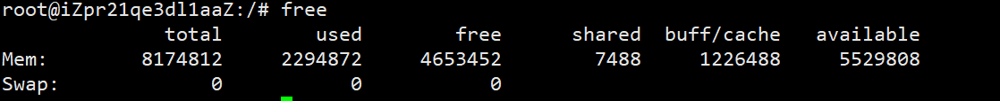
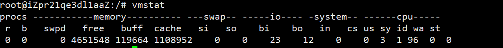

# 内存使用率过高排查

## 内存使用率查看命令

1、free



2、top


3、vmstat



## 产生的原因有
1. 进程占用过多
2. 运行时间太久
3. 被植入木马
4. 内存泄漏

## 检查步骤

1. 查看内存占用率top10的进程`ps aux| grep -v "USER" |sort -n -r -k 4 | awk '{print $11}' | head -n 10`或者使用top命令查看，`top -c`，然后按M
2. 如果进程正常，可以将占用率过多的进程重启，如果有异常进程，考虑是否被植入木马，找到对应的进程脚本，kill掉即可
3. 如果cache太多，共享内存不足，可以在不重启机器的情况下释放缓存

```
root@iZ2zeic9ggky8lb31din1gZ:~# sync
root@iZ2zeic9ggky8lb31din1gZ:~# echo 3> /proc/sys/vm/drop_caches
```

