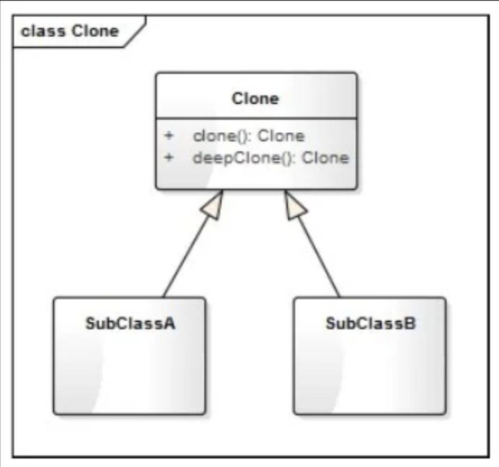
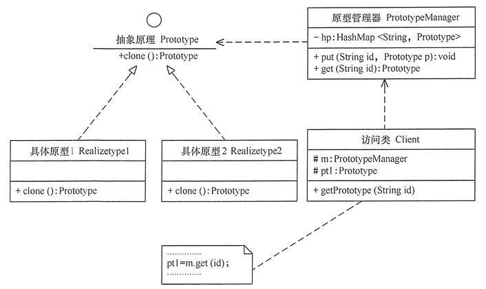

# 原型模式

## 原型模式的代码框架

```python
from copy import copy, deepcopy


class Clone:
    """
    原型的基类
    """

    def clone(self):
        """
        浅拷贝的方式克隆对象
        """
        return copy(self)

    def deepClone(self):
        """
        深拷贝的方式克隆对象
        """
        return deepcopy(self)
```

## 类图



示例

```python
from copy import copy, deepcopy

class Person:
    def __init__(self, name , age):
        self.__name = name
        self.__age = age

    def showMyself(self):
        print('我是{}，年龄{}。'.format(self.__name, self.__age))

    def coding(self):
        print("正在撸代码中...")

    def reading(self):
        print("正在阅读中...")

    def clone(self):
        return copy(self)


if __name__ == '__main__':
    p1 = Person('Tony', 27)
    p1.showMyself()
    p1.coding()

    p2 = p1.clone()
    p2.showMyself()
    p2.reading()
```

## 原型模式的定义与特点

**原型**(Prototype)模式的定义：用一个已经创建的实例作为原型，通过复制该原型对象来创建一个和原型相同或相似的新对象。原型实例指定了要创建的对象的种类。

原型模式的优点：

1. 原型模式通过内存拷贝的方式进行复制，比new的方式创建对象性能更好。
2. 通过深拷贝的方式，可以方便地创建一个具有相同属性和行为的另一个对象，特别是对于复杂对象。

原型模式的缺点：

1. 通过复制的方式创建对象，不会执行类的初始化函数(\_\_init\_\_)

## 原型模式的扩展

原型模式可扩展为带原型管理器的原型模式，它在原型模式的基础上增加了一个原型管理器 PrototypeManager 类。该类用 HashMap 保存多个复制的原型，Client 类可以通过管理器的 get(String id) 方法从中获取复制的原型。


