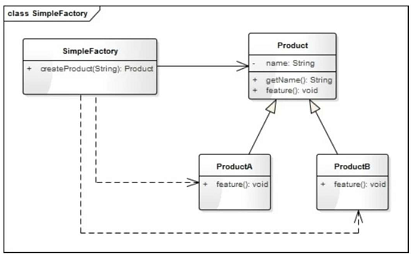
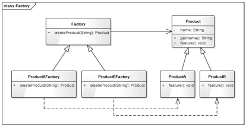
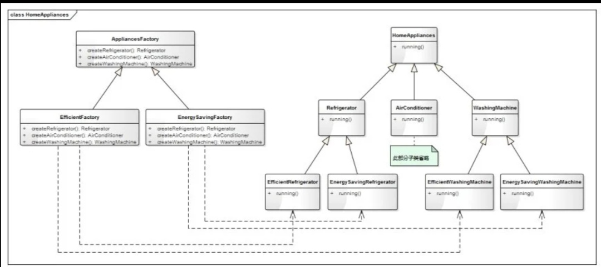
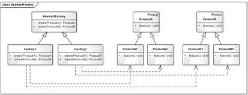

# 工厂模式

## 1. 工厂模式

专门定义一个类来负责创建其他类的实例，根据参数的不同创建不同类的实例，被创建的实例通常具有相同的父类，这个模式叫简单工厂模式(Simple Factory Pattern)。简单工厂模式又称为静态工厂方法模式。

在工厂模式中，用来创建对象的类叫做**工厂类**，被创建的对象的类称为**产品类**。

工厂模式类图


## 2. 简单工厂模式

### 2.1、什么是简单工厂模式

定义一个创建对象(实例化对象)的接口，通过参数来决定创建那个类的实例。

### 2.2、类图



`SimpleFactory`是工厂类，负责创建对象。`Product`是要创建的产品的抽象类，负责定义统一的接口。`ProductA`、`ProductB`是具体的产品类型。

### 2.3、优缺点

1. 优点
   1. 实现简单，结构清晰
   2. 抽象出一个专门的类来负责某类对象的创建，分割出创建的职责，不能直接创建具体的对象，只需传入适当的参数即可。
   3. 使用者可以不关注具体对象的类名称，只需要知道传入什么参数可以创建那些需要的对象
2. 缺点
   1. 不易拓展，只要有新的产品类，就需要修改工厂的创建逻辑。
   2. 当产品类型较多时，工厂的创建逻辑可能过于负责，`switch...case...`(或`if...else...`)判断会变得非常多。一旦出错，可能造成所有产品创建失败，不利于系统维护。

## 3. 工厂方法模式

> 工厂方法模式是简单工厂模式的一个升级。

### 3.1 什么是工厂方法模式

定义一个创建对象(实例化对象)的接口，让子类来决定创建哪个类的实例。工厂方法使一个类的实例化延迟到其子类。

### 3.2 类图



`Product`是创建的产品的抽象类，`ProductA`和`ProductB`是具体的产品类型。`Factory`是所有工厂的抽象类，负责定义统一的接口。`ProductAFactory`、`ProductBFactory`是具体的工厂类，分别负责产品`ProductA`和`ProductB`的创建。

### 3.3 优缺点

1. 优点
   1. 解决了简单工厂模式不符合“开放-封闭”原则的问题，使得程序更容易扩展。
   2. 实现简单。
2. 缺点
   1. 对于有多种分类的产品，或具有二级分类的产品，此模式并不适用。

## 4. 抽象工厂模式

### 4.1 什么是抽象工厂模式

提供一个创建一系列相关或相互依赖的对象的接口，而无须指定它们的具体类。

### 4.2 类图



**AppliancesFactory**是一个抽象的工厂类，定义了三个方法，分别用来生产冰箱(Refrigerator)、空调(Air-conditioner)、洗衣机(WashingMachine)。EfficientFactory和EnergySavingFactory是两个具体的工厂类，分别用来生产高效型的家电和节能型的家电。



### 4.3 优缺点

1. 优点
   1. 解决了具有二级分类的产品的创建
2. 缺点
   1. 如果产品的分类超过二级，如三级甚至更多级，抽象工厂模式将会变得非常臃肿。
   2. 不能解决产品有多种分类、多种组合的问题。

### 4.4 实现

示例

```python
from abc import ABCMeta, abstractmethod
# 引入ABCMeta和abstractmethod来定义抽象类和抽象方法
from enum import Enum


class PenType(Enum):
    """画笔类型"""
    PenTypeLine = 1
    PenTypeRect = 2
    PenTypeEllipse = 3


class Pen(metaclass=ABCMeta):
    """画笔"""
    def __init__(self, name):
        self.__name = name

    @abstractmethod
    def getType(self):
        pass

    def getName(self):
        return self.__name


class LinePen(Pen):
    """直线画笔"""
    def __init__(self, name):
        super().__init__(name)

    def getType(self):
        return PenType.PenTypeLine


class RectanglePen(Pen):
    """矩形画笔"""
    def __init__(self, name):
        super().__init__(name)

    def getType(self):
        return PenType.PenTypeRect


class EllipsePen(Pen):
    """椭圆画笔"""
    def __init__(self, name):
        super().__init__(name)

    def getType(self):
        return PenType.PenTypeEllipse


class PenFactory:
    """画笔工厂类"""
    def __init__(self):
        # 定义一个字典(key:PenType, vlaue:Pen)来存放对象，来确保每一个类型只会有一个对象
        self.__pens = {}

    def getSingleObj(self, penType, name):
        """获取唯一实例的对象"""
        pass

    def createPen(self, penType):
        """创建画笔"""
        if self.__pens.get(penType) is None:
            # 如果该对象不存在，则创建一个对象放到字典中
            if penType == PenType.PenTypeLine:
                pen = LinePen("直线画笔")
            elif penType == PenType.PenTypeRect:
                pen = RectanglePen('矩形画笔')
            elif penType == PenType.PenTypeEllipse:
                pen = EllipsePen('椭圆画笔')
            else:
                pen = Pen("")
            self.__pens[penType] = pen
        # 否者直接返回字典中的对象
        return self.__pens[penType]


def testPenFactory():
    factory = PenFactory()
    linePen = factory.createPen(PenType.PenTypeLine)
    print("创建了 %s, 对象 id：%s, 类型：%s"%(linePen.getName(), id(linePen), linePen.getType))

    rectPen = factory.createPen(PenType.PenTypeRect)
    print("创建了 %s, 对象 id：%s, 类型：%s"%(rectPen.getName(), id(rectPen), rectPen.getType))

    rectPen2 = factory.createPen(PenType.PenTypeRect)
    print("创建了 %s, 对象 id：%s, 类型：%s"%(rectPen2.getName(), id(rectPen2), rectPen2.getType))

    ellipsePen = factory.createPen(PenType.PenTypeEllipse)
    print("创建了 %s, 对象 id：%s, 类型：%s"%(ellipsePen.getName(), id(ellipsePen), ellipsePen.getType))


if __name__ == "__main__":
    testPenFactory()

```
