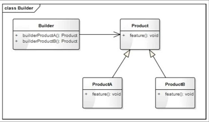
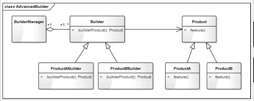

# 建造者模式

## 什么是建造者模式

**建造者**(Builder)模式定义：指将一个复杂对象的构造与它的表示分离，使同样的构建过程可以创建不同的表示。它是将一个复杂的对象分解为多个简单的对象，然后一步一步构建而成。它将变与不变相分离，即产品的组成部分是不变的，但每一部分是可以灵活选择的。

建造者模式核心思想是：将产品的创建过程与产品本身分离开来，使得创建过程更加清晰，能够更加精确地控制复杂对象的创建过程，让使用者可以用相同的创建过程创建不同的产品。

## 与工厂模式的区别

工厂模式关注的是整个产品(整体对象)的生成，即成品的生成；而建造者模式关注的是产品的创建过程和细节，一步一步地由各个子部件构建为一个成品。

## 与组合模式的区别

组合模式关注的是“整体-部分”的关系，也就是关注对象的内部组成结构。

**区别**：组合模式关注的是对象内部的组成结构，强调的是部分与整体的关系。建造者模式关注的是对象的创建过程，即由一个一个的子部件构建一个成品的过程。

**联系**：组合模式和建造者模式其实也经常被一起使用。

## 类图

建造者模式是一个产品或对象的生成器，强调产品的构建过程。



Builder就是一个构建者。Product是要构建成的目标产品的基类。



Product是产品的抽象类(基类)，ProductA和ProductB是具体的产品。Builder是抽象构建类ProductABuilder和ProductBBuilder是对应产品类的具体构建类，而BuilderManager是构建类的管理类，负责管理每一种产品的创建数量和创建顺序。

## 实现

实例-1

```python
from abc import ABCMeta, abstractmethod


class Toy(metaclass=ABCMeta):
    """玩具"""
    def __init__(self, name):
        self._name = name
        self.__components = []

    def getName(self):
        return self._name

    def addComponent(self, component, count=1, unit="个"):
        self.__components.append([component, count, unit])
        print("{} 增加了 {} {}{}".format(self._name, count, unit, component))

    @abstractmethod
    def feature(self):
        pass


class Car(Toy):
    """小车"""
    def feature(self):
        print("我是 %s, 我可以快速奔跑...".format(self._name))


class Manor(Toy):
    """
    庄园
    """
    def feature(self):
        print("我是 {}, 我可供观赏， 也可用来游玩!".format(self._name))


class ToyBuilder:
    """
    玩具构建者
    """
    def buildCar(self):
        car = Car("迷你小车")
        print("正在构建 {}...".format(car.getName()))
        car.addComponent("轮子", 4)
        car.addComponent("车身", 1)
        car.addComponent("发动机", 1)
        car.addComponent("方向盘")
        return car

    def buildManor(self):
        manor = Manor("淘淘小庄园")
        print("正在构建 {}".format(manor.getName()))
        manor.addComponent("客厅", 1, "间")
        manor.addComponent("卧室", 2, "间")
        manor.addComponent("书房", 1, "间")
        manor.addComponent("厨房", 1, "间")
        manor.addComponent("花园", 1, "个")
        manor.addComponent("围墙", 1, "堵")
        return manor


def testBuilder():
    builder = ToyBuilder()
    car = builder.buildCar()
    car.feature()
    print()
    mannor = builder.buildManor()
    mannor.feature()


if __name__ == "__main__":
    testBuilder()
```

示例-2

```python
from abc import ABCMeta, abstractmethod


class Toy(metaclass=ABCMeta):
    """玩具"""
    def __init__(self, name):
        self._name = name
        self.__components = []

    def getName(self):
        return self._name

    def addComponent(self, component, count=1, unit='个'):
        self.__components.append([component, count, unit])

    @abstractmethod
    def feature(self):
        pass


class Car(Toy):
    """小车"""
    def feature(self):
        print("我是 {}，我可以快速奔跑...".format(self._name))


class Manor(Toy):
    """庄园"""
    def feature(self):
        print("我是 {}, 我可供观赏，也可用来游玩！".format(self._name))


class ToyBuilder(metaclass=ABCMeta):
    """玩具构建者"""
    @abstractmethod
    def buildProduct(self):
        pass


class CarBuilder(ToyBuilder):
    """车的构建类"""
    def buildProduct(self):
        car = Car("迷你小车")
        print("正在构建{}...".format(car.getName()))
        car.addComponent("轮子", 4)
        car.addComponent("车身", 1)
        car.addComponent("发动机", 1)
        car.addComponent("方向盘")
        return car


class ManorBuilder(ToyBuilder):
    """庄园的构建类"""
    def buildProduct(self):
        manor = Manor("淘淘小庄园")
        print("正在构建 {}...".format(manor.getName()))
        manor.addComponent("客厅", 1, "间")
        manor.addComponent("卧室", 2, "间")
        manor.addComponent("书房", 1, "间")
        manor.addComponent("厨房", 1, "间")
        manor.addComponent("花园", 1, "个")
        manor.addComponent("围墙", 1, "堵")
        return manor


class BuilderMgr:
    """建构类的管理类"""
    def __init__(self):
        self.__carBuilder = CarBuilder()
        self.__manorBuilder = ManorBuilder()

    def buildCar(self, num):
        count = 0
        products = []
        while(count < num):
            car = self.__carBuilder.buildProduct()
            products.append(car)
            count += 1
            print("建造完成第 {} 辆 {}".format(count, car.getName()))

    def buildManor(self, num):
        count = 0
        products = []
        while(count < num):
            manor = self.__manorBuilder.buildProduct()
            products.append(manor)
            count += 1
            print("建造完成第 {} 个 {}".format(count, manor.getName()))
        return products


def testAdvancedBuilder():
    builderMgr = BuilderMgr()
    builderMgr.buildManor(2)
    print()
    builderMgr.buildCar(4)


if __name__ == '__main__':
    testAdvancedBuilder()

```
