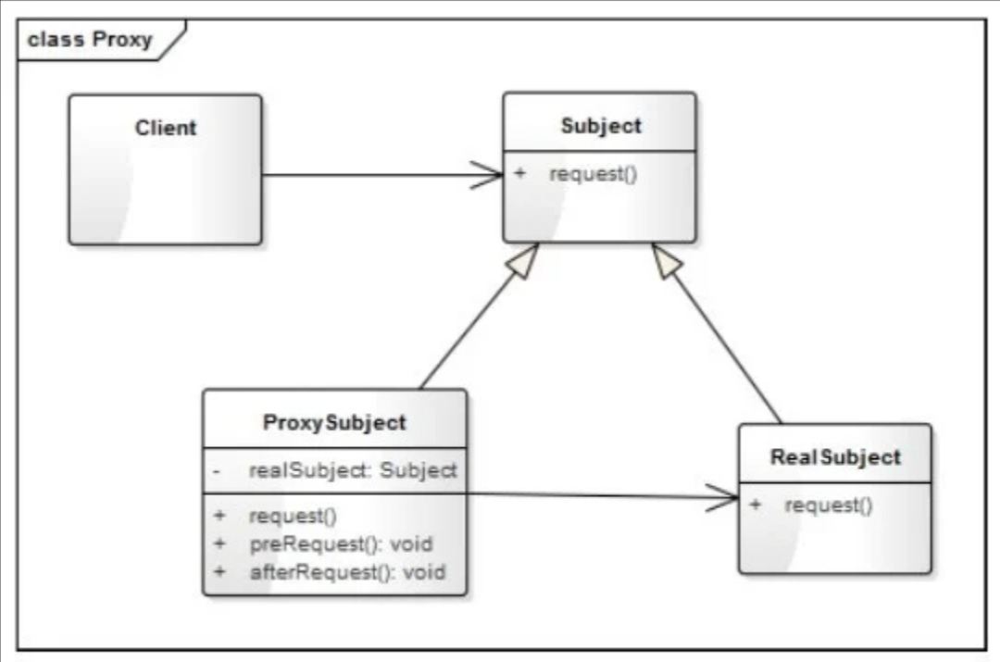

# 代理设计模式

## 什么是代理模式

为其他对象提供一种代理以控制对这个对象的访问。

## 代理模式设计思想

代理模式的核心思想是：使用一个额外的间接层来支持分散的、可控的、只能的访问；增加一个包装和委托来保护真实的组件，以避免过度复杂。

代理模式可以在客户端和目标对象之间起到中间调和的作用，而且可以通过代理对象隐藏不希望被客户端看到的内容和服务，或者添加客户需要的额外任务。

## 代理模式的代码示例

```python
from abc import ABCMeta, abstractmethod


class Subject(metaclass=ABCMeta):
    """主题类"""
    def __init__(self, name):
        self.__name = name

    def getName(self):
        return self.__name

    @abstractmethod
    def request(self, content=""):
        pass


class RealSubject(Subject):
    """真实主题类"""
    def request(self, content):
        print("RealSubject todo something...")


class ProxySubject(Subject):
    """代理主题类"""
    def __init__(self, name, subject):
        super().__init__(name)
        self._realSubject = subject

    def request(self, content=''):
        self.preRequest()
        if self._realSubject is not None:
            self._realSubject.request(content)
        self.afterRequest()

    def preRequest(self):
        print('preRequest')

    def afterRequest(self):
        print('afterRequest')
```

## 代理模式类图



Subject是活动主题的抽象基类，负责定义统一的接口。RealSubject是真实主题，即Subject是具体实现类。ProxySubject是代理主题，代理RealSubject的功能。

代理模式的主要角色

1. 主题（Subject）：定义操作、活动、任务的接口类。
2. 真实主题（RealSubject）：真正完成操作、活动、任务的具体类。
3. 代理主题（ProxySubject）：代替真实主题完成操作、活动、任务的代理类。

## 代理模式的优缺点

1. 优点
   1. 代理模式能够协调调用者和被调用者，在一定程度上降低系统的耦合度，增加了程序的可扩展性。
   2. 可以灵活地隐藏被代理对象的部分功能和服务，也可以增加额外的功能和服务。
2. 缺点
   1. 由于客户端和真实主题之间增加了代理对象，因此有写类型的代理模式可能会造成请求的处理速度变慢
   2. 实现代理模式需要额外的工作，有些代理模式的实现非常复杂。

## 实现

示例

```python
from abc import ABCMeta, abstractmethod


class ReceiveParcel(metaclass=ABCMeta):
    """接收包裹抽象类"""
    def __init__(self, name):
        self.__name = name

    def getName(self):
        return self.__name

    @abstractmethod
    def receive(self):
        pass


class TonyReception(ReceiveParcel):
    """Tony接收"""
    def __init__(self, name, phoneNum):
        super().__init__(name)
        self.__phoneNum = phoneNum

    def getPhoneNum(self):
        return self.__phoneNum

    def receive(self, parcelContent):
        print("货物主人：{}，手机号：{}".format(self.getName(), self.getPhoneNum()))
        print("接收到一个包裹，包裹内容：{}".format(parcelContent))


class WendyReception(ReceiveParcel):
    """Wendy代收"""
    def __init__(self, name, receiver):
        super().__init__(name)
        self.__receiver = receiver

    def receive(self, parcelContent):
        print("我是{}的朋友，我来帮他代收快递！".format(self.__receiver.getName()))
        if self.__receiver is not None:
            self.__receiver.receive(parcelContent)
        print("代收人：{}".format(self.getName()))


def testReceiveParcel():
    tony = TonyReception("Tony", "18512345678")
    print("Tony接收：")
    tony.receive("雪地靴")
    print()

    print("Wendy代收：")
    wendy = WendyReception("Wendy", tony)
    wendy.receive("雪地靴")


if __name__ == "__main__":
    testReceiveParcel()

```
