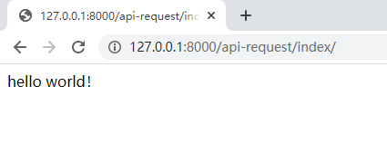

<!-- TOC -->

- [简单包含request的视图函数](#简单包含request的视图函数)
- [Request对象方法和属性](#request对象方法和属性)
- [常用request.META属性](#常用requestmeta属性)
  - [打印request.META所有属性](#打印requestmeta所有属性)
  - [显示用户名，用户ip地址和浏览器的app](#显示用户名用户ip地址和浏览器的app)
  - [获取远程用户的真实IP地址](#获取远程用户的真实ip地址)

<!-- /TOC -->

## 简单包含request的视图函数

```python
# views.py
from django.http import HttpResponse

def index(request):
    return HttpResponse("Hello world")

# urls.py
from django.urls import re_path
from . import views

app_name = "request_demo"
urlpatterns = [
    re_path(r'^index/$', views.index, name="index")
]
```
运行项目，当访问`http://127.0.0.1:8000/api-request/index/`可以看到`hello world`字符。



现在我们将视图函数稍微改下，使用request变量打印出请求路径。

```python
# views.py
from django.http import HttpResponse

def index(request):
    return HttpResponse(f"请求路径：{request.path}")
```
再次访问`http://127.0.0.1:8000/api-request/index/`，这时浏览器中会出现`请求路径：/api-request/index/`字符。


## Request对象方法和属性

| 属性/方法 | 描述 |
| --- | --- |
| request.method | 获取请求方法（如：GET，POST） |
| request.GET or request.POST | 获取GET or POST请求参数，字典形式 |
| request.POST.get('name', default=None) | 获取POST请求参数 |
| request.GET.getlist('name', default=None) | 获取GET参数列表 |
| request.META | 包含当前HTTP请求的Headers头部信息，字典形式。键值KEY都是大写。比如`request.META['REMOTE_ADDR']`可获取用户远程IP地址 |
| request.user | 获取当前访问用户的所有信息 |
| request.path | 获取当前访问路径 |

## 常用request.META属性

`request.META`是一个Python字典，包含了本次HTTP请求的header信息，常用属性有：

| 属性 | 描述 |
| --- | --- |
| REQUEST_METHOD | 当前请求方法， GET或POST |
| HTTP_USER_AGENT | 用户浏览器的字符串，比如`Mozilla/5.0 (Windows NT 10.0; Win64; x64) AppleWebKit/537.36。` |
| REMOTE_ADDR | 客户端IP地址 |
| PATH_INFO | 当前路径信息 |

注意：有些用户的User Agent的字符串获取不了，因此可以使用`request.META.get('HTTP_USER_AGENT', 'unknown')`用来防止异常抛出。

### 打印request.META所有属性

```python
from django.http import HttpResponse


def index(request):
    values = request.META.items()
    html = []
    for k, v in values:
        html.append(f'<tr><td>{k}</td><td>{v}</td></tr>')
    html_str = '\n'.join(html)
    return HttpResponse(f'<table>{html_str}</table>')
```

### 显示用户名，用户ip地址和浏览器的app

```python
# views.py
from django.shortcuts import render

def index(request):
    user = request.user
    user_agent = request.META.get('HTTP_USER_AGENT', 'unknown')
    ip = request.META['REMOTE_ADDR']
    context = {'user': user, 'user_agent': user_agent, 'ip': ip}
    return render(request, 'request_demo/index.html', context)
```
request_demo/index.html
```html

<h3>Simple Django App</h3>
<ul>
    <li>User: {{ user }}</li>
    <li>User Agent: {{ user_agent }}</li>
    <li>IP Address: {{ ip }}</li>
</ul>

```

### 获取远程用户的真实IP地址

一般情况下`request.META['REMOTE_ADDR']`足以获取用户真实IP地址。但是对于部署在负载均衡proxy（如nginx）上的Django应用而言，这种方法就不适用了。因为每个request中的远程IP地址将指向该负载均衡proxy的地址，而不是发起这个request请求的用户的真实ip。负载均衡proxy处理这个问题的方法在特殊的<font color='red'>X-Forwarded-For</font>中设置实际发起请求的IP。因此，需要一个中间件来确保运行在proxy之后的站点也能在request.META['REMOTE_ADDR']中得到正确的IP。

解决方法如下：
1. 在settings.py中添加中间件：`django.middleware.http.SetRemoteAddrFromForwardedFor`
2. 视图views.py中

```python
from django.shortcuts import render

def index(request):
    user = request.user
    user_agent = request.META.get('HTTP_USER_AGENT', 'unknown')
    x_forwarded_for= request.META.get('HTTP_X_FORWARDED_FOR', '')
    
    if x_forwarded_for:
        ip = x_forwarded_for.split(',')[0]
    else:
        ip = request.META.get('REMOTE_ADDR')
    
    context = {'user': user, 'user_agent': user_agent, 'ip': ip}
    return render(request, 'request_demo/index.html', context)
```