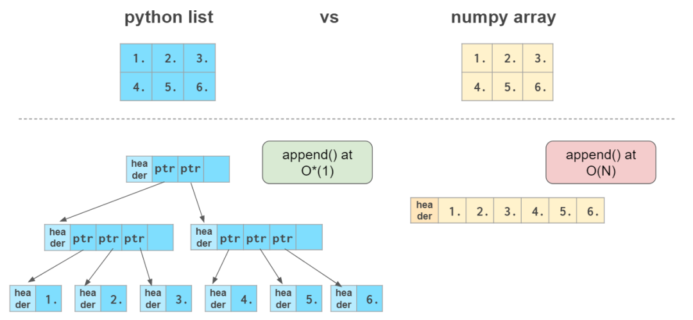

# Numpy数组与Python列表

NumPy数组类似Python列表，它们都可以作容器，具有获取（getting）和设置（setting）元素以及插入和移除元素的功能。

Numpy数组具有的特点：更紧凑，尤其是在一维以上的维度；向量化操作时比Python列表快，但在末尾添加元素比Python列表慢。

在末尾添加元素时，Python列表复杂度为O(1)，NumPy复杂度为O(N)

# 向量运算

## 向量初始化

创建NumPy数组的一种方法是从Python列表直接转换，数组元素的类型与列表元素类型相同。
