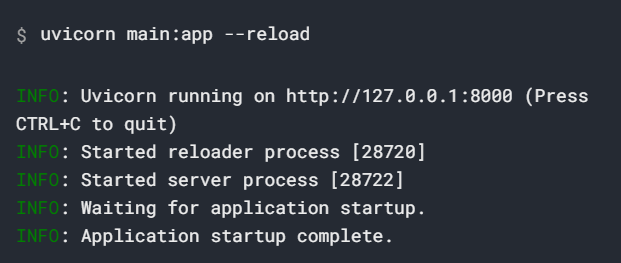

# 1 FastAPI相关介绍

## 1.1 Starlette， Pydantic与FastAPI框架是什么关系

Python的类型提示，基于类型提示type hints

```python
from typing import List

def func(name: str, age: int, l: List):
    print(name, age)
    print(l)
```

Pydantic是一个基于Python类型提示来定义数据验证，序列化和文档（使用JSON模式）库

Starlette是一个轻量级的ASGI框架/工具包，是构建高性能Asyncio服务的理想选择

# 2 FastAPI基础

FastAPI是一个用于构建API的现代、快速（高性能）的web框架

关键特性
- 快速
- 高效编码：提高功能开发速度
- 更少bug：减少认为导致错误
- 智能：极佳的编译器支持
- 简单：设计的易于使用和学习，阅读文档的时间更短
- 简短：使代码重复最小化。通过不同的参数神功实现丰富功能。bug更少
- 健壮：生产可用级别的代码。还有自动生成的交互式文档。
- 标准化：基于（并完全兼容）API的相关开放标准OpenAPI和JSON Schema

## 安装FastAPI
---
> pip install fastapi
> 
> pip install uvicorn

---

## 简单示例

```python
from fastapi import FastAPI

app = FastAPI()

@app.get("/")
async def root():
    return {"message": "Hello world"}

@app.get("/items/{item_id}")
def read_item(item_id: int, q: Optional[str] = None):
    return {"item_id": item_id, "q": q}
```

**运行实时服务器**



`uvicorn main:app --reload`命令含义如下
- `main`：`main.py`文件
- `app`：在`main.py`文件中通过`app = FastAPI()`
- `--reload`：让服务器在更新代码后重启。

**交互式API文档**

访问`http://127.0.0.1:8000/docs`，可以看到自动生成的交互式API文档（由Swagger UI生成）

**可选的API文档**

访问`http://127.0.0.1:8000/redoc`，可以看到另外一个自动生成的文档（由ReDoc生成）

## 示例升级

```python
from typing import Optional
from fastapi import FastAPI
from pydantic import BaseModel

app = FastAPI()


class Item(BaseModel):
    name: str
    price: float
    is_offer: Optional[bool] = None


@app.get("/")
def read_root():
    return {"Hello": "World"}


@app.get("/items/{item_id}")
def read_item(item_id: int, q: Optional[str]=None):
    return {"item_id": item_id, "q": q}


@app.put("/items/{item_id}")
def update_item(item_id: int, item: Item):
    return {"item_name": item.name, "item_id": item_id}
```

# 3 路由Route上参数获取和校验

路由分为静态和动态，静态路由就是参数是固定写死的，即访问地址是写死的；动态地址就是需要动态生成。

```python
from fastapi import FastAPI

app = FastAPI()

@app.get("items/{item_id}")
async def read_item(item_id):
    return {"item_id": item_id}
```
上述示例中的item_id就是一个动态参数，可以随意传一个进来。

对传入的参数进行数据验证的定义

```python
from fastapi import FastAPI

app = FastAPI()

@app.get("/items/{item_id}")
async def read_item(item_id: int):
    return {"item_id": item_id}
```

`item_id：int`这种情况item_id必须是可以转为int类似的数据，否则，肯定会报错

关于路由覆盖问题：如下两个路由地址：

```python
from fastapi import FastAPI

app = FastAPI()

@app.get("/users/me")
async def read_user_me():
    return {"user_id": "the current user"}

@app.get("/users/{user_id}")
async def read_user(user_id: str):
    return {"被优先匹配到：", user_id}
```
上面两个路由同时存在的话，则/users/{user_id} 会覆盖/users/me！

## 3.1 查询路径参数和参数校验

