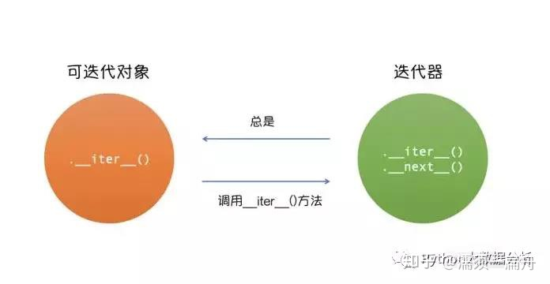
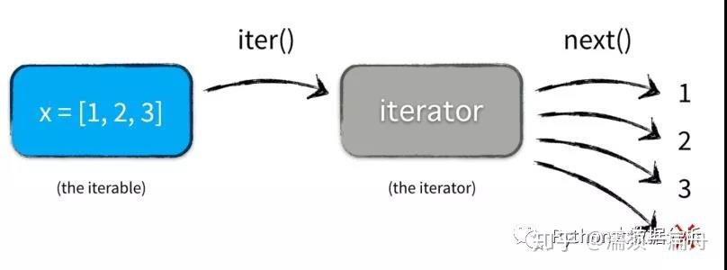

# 1、迭代器和迭代过程

Python中，迭代器是遵循迭代协议的对象。使用iter()从任何序列对象中得到迭代器（如list，tuple，dictionary，set等）。另一种形式的输入迭代器是generator（生成器）。

很多容器（列表，元组）可以使用for循环遍历对象。for语句会调用容器对象中的iter()函数，该函数返回一个定义了`__next__()`方法的迭代器对象，该方法将逐一访问容器中的元素。

Python中，任意对象，定义了`__next__()`方法，它就是一个迭代器。



迭代就是从迭代器中取元素的过程。

```python
# 列表是迭代器
for element in [1, 2, 3]:
    print(element)

# 元组是迭代器
for element in (1, 2, 3):
    print(element)

# 字典是迭代器
for key in {'one': 1, 'two': 2}:
    print(key)

# 字符串是迭代器
for char in '123':
    print(char)

# 打开的text同样是迭代器
for line in open('file.txt', 'r'):
    print(line)
```

for循环替代
1. 先调用容器的iter()函数
2. 再使用`next()`内置函数来调用`__next__()`方法
3. 当元素用尽时，`__next__()`将引发StopIteration异常



```text
In [1]: s = 'abc'

In [2]: it = iter(s)

In [3]: it

Out[3]: <str_iterator at 0x7f40fc40f940>

In [4]: next(it)

Out[4]: 'a'

In [5]: next(it)

Out[5]: 'b'

In [6]: next(it)

Out[6]: 'c'

In [7]: next(it)
---------------------------------------------------------------------------
StopIteration                             Traceback (most recent call last)
<ipython-input-7-bc1ab118995a> in <module>
----> 1 next(it)

StopIteration: 
```

# 2、生成器 Generators

一边循环一边计算的机制，称为生成器（Generator）。

生成器也是一种迭代器，到那时只能对其迭代依次。这是因为他们并没有把所有的值存在内存中，而是在运行时生成值。

通过遍历来使用它们，要么用一个for循环，要么将它们传递给任意可以进行迭代的函数和结构。大多数时候生成器是以函数来实现的。然而，它们并不返回一个值，而是yield(暂且译作“生出”)一个值。

每次对生成器调用 next() 时，它会从上次离开位置恢复执行（它会记住上次执行语句时的所有数据值）。显示如何非常容易地创建生成器的示例如下:

```text
In [1]: def reverse(data): 
   ...:     for index in range(len(data)-1, -1, -1): 
   ...:         yield data[index] 
   ...:

In [2]: for char in reverse('golf'): 
   ...:     print(char) 
   ...:
f
l
o
g

```

# 3、生成器表达式

生成器不一定要用复杂的函数表示，python提供了简介的生成器表达式

从形式上来看，生成器表达式和列表推导式很像，仅仅是将列表推导式中的[]替换为()，但是两者差别挺大，生成器表达式可以说组合了迭代功能和列表解析功能。

生成器表达式可以认为是一种特殊的生成器函数，类似于lambda表达式和普通函数。但是和生成器一样，生成器表达式也是返回生成器generator对象，一次只返回一个值。

```text
In [1]: sum(i*i for i in range(10))
Out[1]: 285

In [2]: xvec = [10, 20, 30]

In [3]: yvec = [7, 5, 3]

In [4]: sum(x*y for x, y in zip(xvec, yvec))
Out[4]: 260

In [5]: from math import pi, sin

In [6]: sine_table = {x:  sin(x*pi/180) for x in range(0, 91)}

In [7]: unique_words = set(word for line in page for word in line.split()) 
```