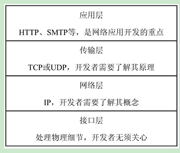

[toc]

# Python高效开发实战-Django、Tornado、Flask、Twisted

## Python基础

### 1. Web编程之网络基础

#### 1.1 TCP/IP网络

> TCP/IP是Transmission Control Protocol/Internet Protocol的简写，中文名为传输控制协议/互联网络协议。

##### 1.1.1 计算机网络综述

**计算机网络**是指将地理位置不同的、具有独立功能的多台计算机及其外部设备，通过通信线路连接起来，在网络操作系统、网络管理软件及网络通信协议的管理和协调下，实现资源共享和信息传递的计算机系统。

**Internet**主要由主机、线路、交换、路由、调制解调器等设备组成。

主机有不同的形式，主要分为两种

- 服务器：在Internet中提供服务的主机
- 客户端

Internet是基于TCP/IP网络而搭建的，TCP/IP将网络分为4层结构，分别是应用层、传输层、网络层、接口层。

TCP/IP网络分层从上到下解释

- 应用层
- 传输层
- 网络层
- 接口层

### 2. 客户端的编程技术

### 3. 数据库及ORM

## Python框架

### 5. Python网络框架纵览
