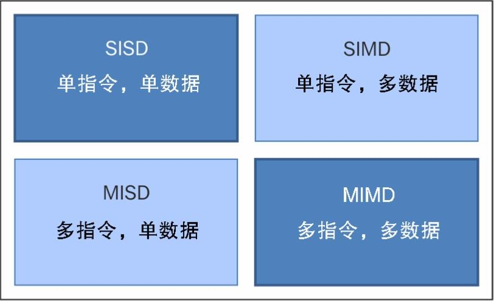
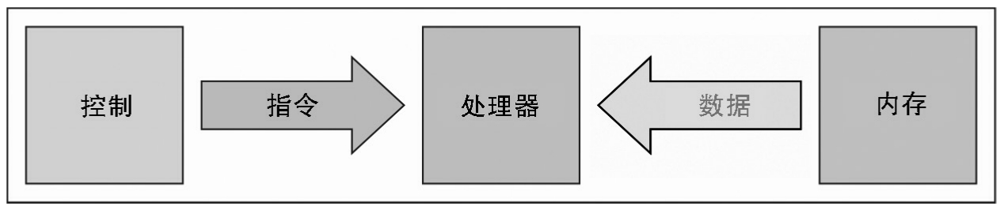
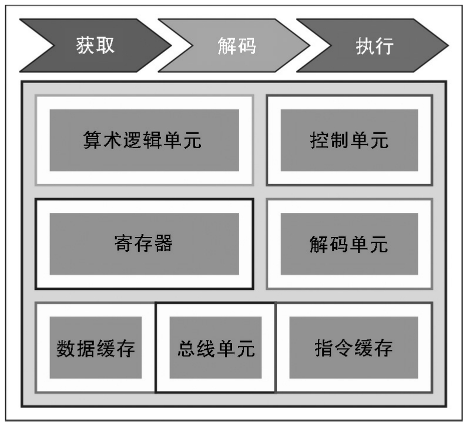
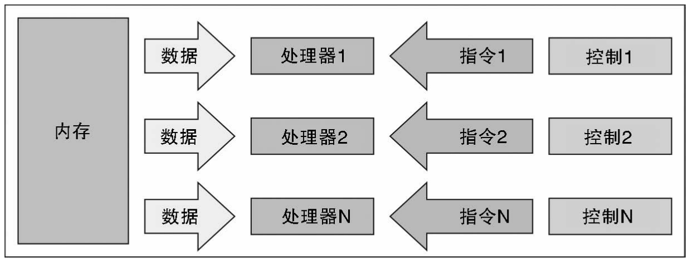
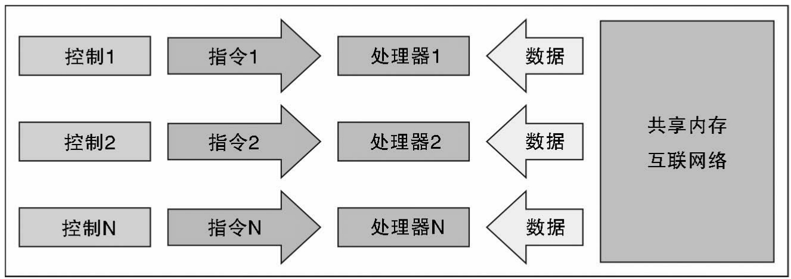
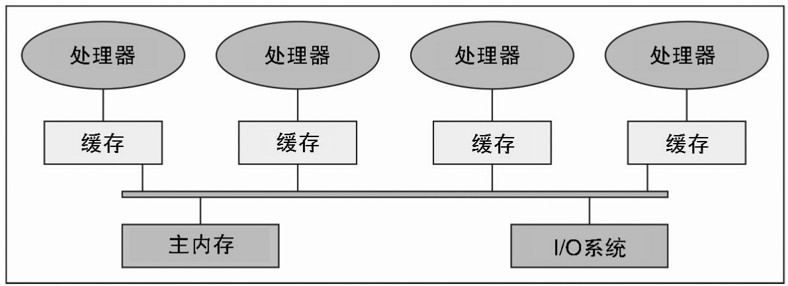
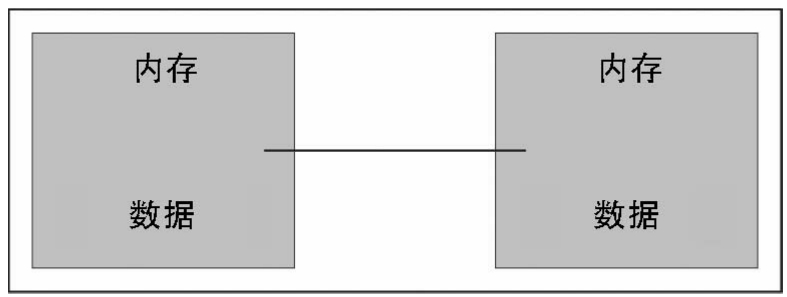
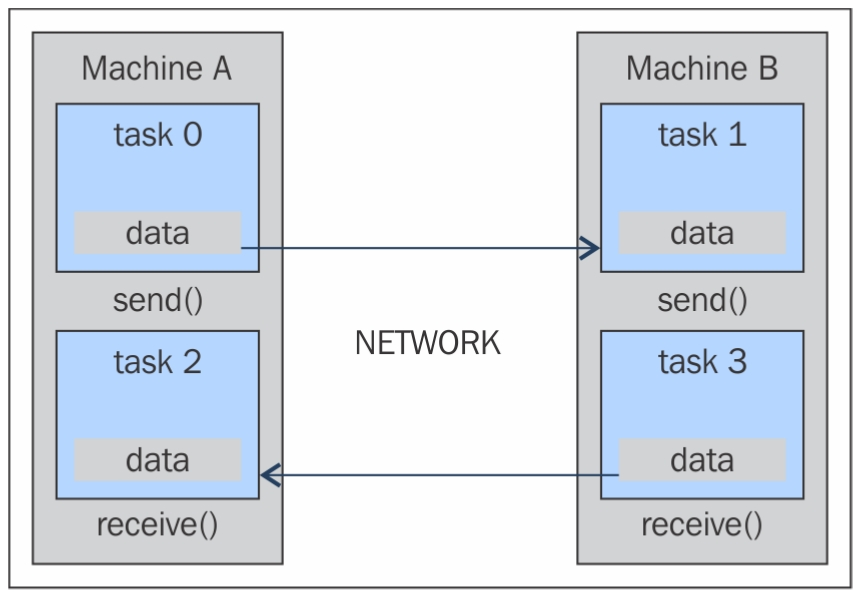
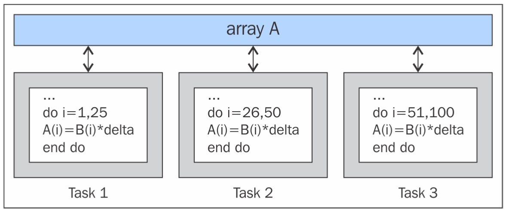

# 1 并行计算与Python起步
## 并行计算内存架构

根据可同时处理的指令数量与数据量的不同，计算机系统可划分位如下4类
- 单指令，单数据（SISD）
- 单指令，多数据（SIMD）
- 多指令，单数据（MISD）
- 多指令，多数据（MIMD）

上述这种分类方式叫做费林分类，如下图

### SISD

SISD计算系统是一个单处理器机器，所执行的每个指令都只会操作单个数据流。机器指令是顺序处理的。

一个时钟周期中，CPU会执行如下操作：
- 获取：CPU从内存区域获取数据域指令，该内存区域叫做寄存器。
- 解码：CPU对指令进行解码
- 执行：指令在数据上得到执行。操作结果会被存储到另一个寄存器中。

执行阶段完成之后，CPU会对自身进行设置，从而开始另一个CPU周期，如下图：

SISD计算机只拥有单个CPU的硬件系统，在这类计算机中执行的算法是顺序的（串行），它们不包含任何并行。

构成这种架构的主要元素有：
- 中央存储单元：用于存储指令与程序数据
- CPU：用于从存储单元中获取指令与（或）数据，它会对指令及进行解码并顺序地执行。
- I/O系统：指的是程序的输入与输出数据。

传统的单处理器计算机被归类为**SISD系统**。下图是在获取、解码与执行阶段中分别用到了CPU的区域

### MISD

这种模型中的n个处理器，每个都有自己的独立控制单元，它们共享同一个存储单元。每个时钟周期内，从内存接收到的数据会被所有处理器同时处理，每个处理器都会按照从其控制单元中所接受到的指令顺序进行处理。在这种情况下，通过对相同的数据执行几个操作实现了并行（指令级并行）。这种架构所能有效解决的问题是相当特殊的，比如说与数据加密相关的问题。

### SIMD

SIMD计算机包含n个相同的处理器，每个处理器都有自己的本地内存，可以用于存储数据。所有数据都处于单个指令流的控制之下；此外，还有n个数据流，分别针对每个处理器。在每个步骤中，处理器都会同时工作并执行相同的指令，不过是在不同的数据元素上执行。这是一种数据级的并行。SIMD架构要比MISD架构更加通用。

### MIMD

MIMD有n个处理器、n个指令流以及n个数据流。每个处理器都有自己的控制单元与本地内存，从计算角度来说，这使得MIMD架构要比SIMD更加强大。每个处理器都是在它自己的控制单元所发出的指令流的控制下来进行操作的；因此，处理器可以对不同的数据执行不同的程序，可以将一个大问题分解为多个不同的子问题，然后加以解决。MIMD架构是通过线程与（或）进程级别的并行的帮助来实现的。这还意味着，处理器通常会异步执行。这类计算机用于解决那些拥有不规则结构的问题，而SIMD则要求问题的结构要规则才行。

## 内存组织

**存储周期时间**是指连续两个操作之间所经过的时间。

当处理器开始传输数据时（向内存传输或是从内存获取），内存将会在整个存储周期内被占用：在这期间，其他设备（I/O控制器、处理器，甚至是发出该请求的处理器自身）都无法使用内存，因为它要对请求做出响应。下图所示为MIMD架构中的内存组织。

共享内存与分布式内存的区别则在于处理器单元的内存访问管理方式。

在一个系统中，共享内存足以在内存中构建数据结构，然后进入并行子程序，它们是该数据结构的引用变量。分布式内存机器必须要在各自的本地内存中复制共享数据。这些副本是通过从一个处理器向另一个处理器发送包含数据的消息来创建的。这种内存组织的一个缺点在于，有时这些消息会非常大，需要花费相对较长的时间来传递。

**共享内存**

共享内存系统的主要特点
- 内存对于所有处理器来说都是一样的，比如，与相同数据结构所关联的所有处理器都会使用同样的逻辑内存地址，这样就会访问到相同的内存位置。
- 同步时通过控制处理器对共享内存的访问来实现的。是实际上，在某一时刻只有一个处理器能够访问到内存资源。
- 当一个任务在访问共享内存时，另一个任务时不可以修改共享内存的位置的
- 数据共享是非常快的；两个任务间通信所需的时间等于读取单个内存位置的时间（取决于内存访问的速度）

共享内存系统中的内存访问
- 统一内存访问（UMA）：该系统的基本特点是，对于每个处理器以及内存的任何区域来说，对内存的访问时间都是恒定的。出于这个原因，这些系统又叫做**对称多处理器(SMP)**。这些系统相对来说比较容易实现，但是可伸缩性不好；程序员需要负责同步的管理，这是通过在管理资源的程序中插入恰当的控制、信号量以及锁来实现。
- 非同一内存访问（NUMA）：该架构将内存区域划分为高速访问区域（分配给每个处理器，是数据交换的公共区域）以及低速访问区域两种。这些系统又叫做分布式共享内存系统（DSM）。其可伸缩性非常好，到那时开发难度打。
- 无远程内存访问（NORMA）：内存在物理上被分配给各个才处理器（本地内存）。所有的本地内存都是私有的，只能为本地处理器所访问。处理器之间的通信时通过用于消息交换的通信协议来实现的，叫作消息传递协议。
- 仅缓存访问（COMA）：这些系统只有缓存。

**分布式内存**

分布式内存系统中，内存与每个处理器关联到了一起，一个处理器只能访问到他自己的内存。系统元素本身时小型且完备的处理器与内存系统。

优点：
- 通信总线或是开关层面上不会再出现冲突。每个处理器都可以使用其字节本地内存的全部带宽而不会妨碍其他处理器。
- 无公共总线意味着对于处理器的数量不会再有固定的限制，系统的大小之受限于连接处理器的网络。
- 不存在缓存一致性问题，每个处理器负责管理自己的数据，不必在考虑副本的更新问题。

缺点
- 处理器之间的通信难以实现。

分布式内存系统的主要特性
- 物理上，内存再处理器之间时分布式的；每个本地内存都只会被其处理器所直接访问
- 同步是通过在处理器间（通信）移动数据（即便只是消息本身亦如此）来实现的。
- 本地内存中数据的分割会影响机器的性能与划分的精确性非常重要，因为这样会将CPU之间的通信降到最低。除此之外，用于协调这些分解与组合操作的处理器必须能与对数据结构的每一部分进行操作的处理器高效通信。
- 使用消息传递协议，这样CPU可以通过数据包的交换来通信。消息是信息的离散单元。

### 工作站集群

工作站集群是基于传统计算机，使它们之间通过通信网络进行连接。

在集群中，将节点定义为集群中的单个计算单元。

集群分类
- 容错集群：这类集群中，节点的活动会被持续监控。当一个节点停止工作时，另一台机器会接管它的活动。其目标旨在通过架构的冗余确保持续的服务。
- 负载均衡集群：这类系统中，工作请求会被发给活动较少的节点。这确保完成整个过程所需的时间会更少一些。
- 高性能计算集群：在该类集群中，每个节点都会被配置以提供非常高的性能。整个过程依然会被划分在多个节点上执行的多个任务。任务时并行的，并且分布在不同的机器上。

## 并行编程模型

并行编程模型是硬件与内存架构的一种抽象。实际上，这些模型并非特定的，也没有指代特定类型的机器或是内存架构。

使用最广泛的并行编程模型
- 共享内存模型
- 多线程模型
- 分布式内存/消息传递模型
- 数据并行模型

**共享内存模型**

在该模型中，任务共享单个共享的内存区域，对共享资源的访问（读写数据）是异步的。有机制可以让程序员控制对共享内存的访问，比如锁或信号量。

优势
- 程序员不必清楚任务间的通信。

缺点
- 从性能角度来说，该模型使理解与管理数据的局部性变得更为困难
- 让数据成为使用它的处理器的局部数据可以减少内存访问、缓存刷新，以及多个处理器使用相同数据时所产生的总线流量。

**多线程模型**

在该模型中，一个进程可以拥有多个执行流，比如，先创建一个顺序部分，随后创建一系列任务并行执行。通常，这种模型会用在共享内存架构中。因此，管理线程间的同步就是非常重要的事情了，因为这些线程会操作共享内存，程序员必须防止多个线程同时更新相同的位置。Posix线程时软件多线程实现的经典例子。英特尔的超线程技术是实现了硬件的多线程。

**消息传递模型**

消息传递模型通常用在每个处理器都有自己的内存（分布式内存系统）的场景下。更多的任务可以驻留在同一台物理机或是任意数量的机器上。程序员负责决定并行以及通过消息所进行的数据交换。

该并行编程模型的实现需要在代码中用到特殊的软件库。

MPI（消息传递接口）模型的设计使用了分布式内存，但却成为并行编程的模型，多个平台也可以使用共享内存机器。消息传递范式模型如下图所示。

**数据并行模式**

在该模型中，多个任务可以操作相同的数据结构，不过每个任务都只会操作数据的不同部分。在共享内存架构中，所有的任务都可以通过共享内存与分布式内存架构来访问数据，其中的数据结构会被分割并驻留在每个任务的本地内存中。为了实现该模型，程序员需要开发一个程序来指定数据的分布与对齐方式。现代GPU在数据对齐的情况下处理速度非常快。数据并行范式模型如下图所示。

# 2 基于线程的并行