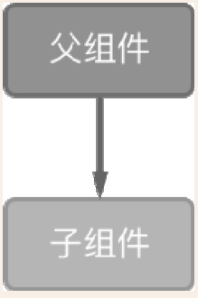
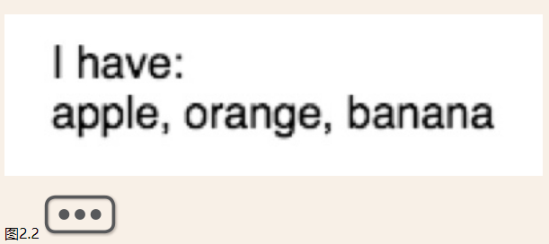
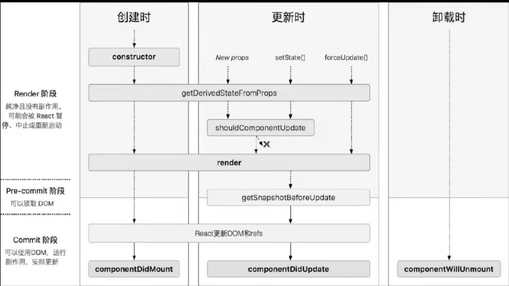

<!-- TOC -->

- [1. React入门](#1-react入门)
  - [1.1 相关安装及准备](#11-相关安装及准备)
    - [1.1.1 下载与使用Node.js和NPM](#111-下载与使用nodejs和npm)
    - [1.1.2 模块打包工具之Webpack](#112-模块打包工具之webpack)
    - [1.1.3 Webpack配置详解](#113-webpack配置详解)
    - [1.1.4 ES6语法](#114-es6语法)
  - [1.2 React简介](#12-react简介)
  - [1.3 React的特征](#13-react的特征)
    - [1.3.1 组件化](#131-组件化)
    - [1.3.2 虚拟DOM](#132-虚拟dom)
    - [1.3.3 单向数据流](#133-单向数据流)
  - [1.4 JSX语法](#14-jsx语法)
    - [1.4.1 JSX简介](#141-jsx简介)
    - [1.4.2 JSX的转义](#142-jsx的转义)
    - [1.4.3 JSX的用法](#143-jsx的用法)
- [2. React的组件](#2-react的组件)
  - [2.1 组件的声明方式](#21-组件的声明方式)
    - [2.1.1 ES5写法：React.createClass()](#211-es5写法reactcreateclass)
    - [2.1.2 ES6写法：React.Component](#212-es6写法reactcomponent)
    - [2.1.3 无状态组件](#213-无状态组件)
  - [2.2 组件的主要成员](#22-组件的主要成员)
    - [2.2.1 状态（state）](#221-状态state)
    - [2.2.2 属性（props）](#222-属性props)
    - [2.2.3 render()方法](#223-render方法)
  - [2.3 组件之间的通信](#23-组件之间的通信)
    - [2.3.1 父组件向子组件通信](#231-父组件向子组件通信)
    - [2.3.2 子组件向父组件通信](#232-子组件向父组件通信)
    - [2.3.3 跨级组件通信](#233-跨级组件通信)
    - [2.3.4 非嵌套组件通信](#234-非嵌套组件通信)
  - [2.4 组件的生命周期](#24-组件的生命周期)
    - [2.4.1 组件的挂载](#241-组件的挂载)
    - [2.4.2 数据的更新过程](#242-数据的更新过程)
    - [2.4.3 组件的卸载（unmounting）](#243-组件的卸载unmounting)
    - [2.4.4 错误处理](#244-错误处理)
    - [2.4.6 生命周期整体流程总结](#246-生命周期整体流程总结)
  - [2.5 React组件分类](#25-react组件分类)
  - [2.5.1 木偶组件和智能组件](#251-木偶组件和智能组件)

<!-- /TOC -->

# 1. React入门

## 1.1 相关安装及准备

### 1.1.1 下载与使用Node.js和NPM

> 下载地址：https://nodejs.org/en/

安装之后可以通过`node -v`来验证Node.js是否安装成功。

NPM(Node Packeage Manager)是Node.js的包管理工具，可以利用npm可以安装第三方插件

> npm install <package_name>

### 1.1.2 模块打包工具之Webpack

Webpack能根据模块的依赖关系递归地构建一个依赖关系图，当中包含了应用程序需要的所有模块，最后打包成一个或多个bundle。

Webpack全局安装命令

> npm install -g webpack webpack-cli

webpack中4个核心概念

- entry（入口）
- output（输出）
- loader（转换器）
- plugins（插件）

1、entry（入口）

entry（入口）用于指引Webpack应该从那个模块开始，它是构建的入口。之后Webpack会自动找出应用内其他相互依赖的内容进行打包。通过在Webpack配置文件中配置entry属性来指定入口。一般情况下，一个项目中只指定一个入口，但是实际中是可以指定多个入口的。

entry配置示例

```js
module.exports = {
  "entry": './src/file.js',
}
```

2、output（出口）

output（出口）告诉Webpack所构建的bundles在哪里输出，默认输出路径是`./dist`

output配置示例

```js
const path = require('path');
module.exports = {
  entry: './src/file.js',
  output: {
    path: path.resolve(__dirname, 'dist'),
    filename: 'bundle.js'
  }
};
```

3、loader（转换器）

loader（转换器）用于配置Webpack处理一些非JS文件，因为Webpack本身只能理解JavaScript。通过loader可以实现import导入的任何类型模块（如.jsx, .css, .less等）

loader配置示例

```js
const path = require('path');
module.exports = {
  entry: './src/file.js',
  output: {
    path: path.resolve(__dirname, 'dist'),
    filename: 'bundle.js'
  },
  module: {
    rules: [
      {test: /\.less$/, use: 'less-loader'}
    ]
  }
};
```

上述配置中，loader的test属性告诉Webpack需要处理的“对象”；use属性告诉Webpack用什么去处理。当Webpack打包的时候会识别所有后缀为.less的文件，并用less-loader去转换。

4、plugins（插件）

plugins（插件）的作用主要是打包优化、压缩等，它的功能同loader一样及其强大，使用任何插件时只需要require()进来即可。

plugins配置示例

```js
const HtmlWebpackPlugin = require('html-webpack-plugin');       // 通过NPM安装
const webpack = require('webpack');                                     // 用于访问内置插件
module.exports = {
  module: {
    rules: [
      { test: /\.less$/, use: 'less-loader' }
    ]
  },
  plugins: [
    new webpack.optimize.UglifyJsPlugin(),
    new HtmlWebpackPlugin({template: './src/index.html'})
  ]
};
```

### 1.1.3 Webpack配置详解

1、模式mode

---
mode: "production",                                             // 生产模式

mode: "development",                                            // 开发模式

---

2、入口entry

```text
entry: "./app/entry",                                           // 入口可以是字符串、对象或数组
entry: ["./app/entry1", "./app/entry2"],
entry: {
    a: "./app/entry-a",
    b: ["./app/entry-b1", "./app/entry-b2"]
},
```

3、出口output

```text
output: {                                                                       // Webpack如何输出结果的相关选项
    path: path.resolve(__dirname, "dist"),      // 字符串
    // 所有输出文件的目标路径
    // 必须是绝对路径（使用Node.js的path模块）
    filename: "bundle.js",                                      // 字符串
    filename: "[name].js",                                      // 用于多个入口点（entry point）
    filename: "[chunkhash].js",                                 // 用于长效缓存
    // 「入口分块(entry chunk)」的文件名模板
    publicPath: "/assets/",                                     // 字符串
    publicPath: "",
    publicPath: "https://cdn.example.com/",
    // 输出解析文件的目录，URL相当于HTML页面
    library: "MyLibrary", // string,
    // 导出库(exported library)的名称
    libraryTarget: "umd",                                       // 通用模块定义
    libraryTarget: "commonjs2",                                 // 作为exports的属性导出
    libraryTarget: "commonjs",                          // 作为exports的属性导出
    libraryTarget: "amd",                                       // 使用amd定义方法来定义
    libraryTarget: "this",                                      // 在this上设置属性
    libraryTarget: "var",                                       // 变量定义于根作用域下
    libraryTarget: "assign",                            // 盲分配（blind assignment）
    libraryTarget: "window",                                    // 在window对象上设置属性
    libraryTarget: "global",                            // 设置global 对象
    libraryTarget: "jsonp",                                                     // jsonp wrapper
    // 导出库(exported library)的类型
    /* 高级输出配置（点击显示） */    pathinfo: true,       // boolean
    // 以文件形式异步加载模块配置项
    chunkFilename: "[id].js",
    chunkFilename: "[chunkhash].js",            // 长效缓存（/guides/caching）
    // 「附加分块(additional chunk)」的文件名模板
    jsonpFunction: "myWebpackJsonp",                                    // string
    // 用于加载分块的 JSONP 函数名
    sourceMapFilename: "[file].map",                            // string
    sourceMapFilename: "sourcemaps/[file].map",         // string
    // 「source map 位置」的文件名模板
    devtoolModuleFilenameTemplate: "webpack:///[resource-path]", // string
    // 「devtool 中模块」的文件名模板
    devtoolFallbackModuleFilenameTemplate: "webpack:///[resource-path]?
        [hash]", // string
    // 「devtool 中模块」的文件名模板（用于冲突）
    umdNamedDefine: true, // boolean
    // 在 UMD 库中使用命名的 AMD 模块
    crossOriginLoading: "use-credentials",                      // 枚举
    crossOriginLoading: "anonymous",
    crossOriginLoading: false,
    // 指定运行时如何发出跨域请求问题
    /* 专家级输出配置（自行承担风险） */  
}
```

4、module模块处理

```text
module: {
    // 关于模块配置
    rules: [
      // 模块规则（配置 loader、解析器等选项）
      {
        test: /\.jsx?$/,
        include: [
          path.resolve(__dirname, "app")
        ],
        exclude: [
          path.resolve(__dirname, "app/demo-files")
        ],
        // 这里是匹配条件，每个选项都接收一个正则表达式或字符串
        // test和include具有相同的作用，都是必须匹配选项
        // exclude 是必不匹配选项（优先于test和include）
        // 最佳实践：
        // - 只在test和文件名匹配 中使用正则表达式
        // - 在include和exclude中使用绝对路径数组
        // - 尽量避免使用exclude，更倾向于使用include
        issuer: { test, include, exclude },
        // issuer 条件（导入源）
        enforce: "pre",
        enforce: "post",
        // 标识应用这些规则，即使规则覆盖（高级选项）
        loader: "babel-loader",
        // 应该应用的 loader，它相对上下文解析
        // 为了更清晰，-loader 后缀在Webpack 2中不再是可选的
        options: {
          presets: ["es2015"]
        },
        // loader的可选项
      },
      {
        test: /\.html$/,
        use: [
          // 应用多个loader和选项
          "htmllint-loader",
          {
            loader: "html-loader",
            options: {
              /* ... */
            }
          }
        ]
      },
      { oneOf: [ /* rules */ ] },
      // 只使用这些嵌套规则之一
      { rules: [ /* rules */ ] },
      // 使用所有嵌套规则（合并可用条件）
      { resource: { and: [ /* 条件 */ ] } },
      // 仅当所有条件都匹配时才匹配
      { resource: { or: [ /* 条件 */ ] } },
      { resource: [ /* 条件 */ ] },
      // 任意条件匹配时匹配（默认为数组）
      { resource: { not: /* 条件 */ } }
      // 条件不匹配时匹配
    ],
/* 高级模块配置（点击展示） */
noParse: [
      /special-library\.js$/
    ],
    // 不解析这里的模块
    unknownContextRequest: ".",
    unknownContextRecursive: true,
    unknownContextRegExp: /^\.\/.*$/,
    unknownContextCritical: true,
    exprContextRequest: ".",
    exprContextRegExp: /^\.\/.*$/,
    exprContextRecursive: true,
    exprContextCritical: true,
    wrappedContextRegExp: /.*/,
    wrappedContextRecursive: true,
    wrappedContextCritical: false,
    // specifies default behavior for dynamic requests
  },
```

5、resolve解析

```text
resolve: {
    // 解析模块请求的选项（不适用于对 loader 解析）
    modules: [
      "node_modules",
      path.resolve(__dirname, "app")
    ],
    // 用于查找模块的目录
    extensions: [".js", ".json", ".jsx", ".css"],
    // 使用的扩展名
    alias: {
      // 模块别名列表
      "module": "new-module",
      // 起别名："module" -> "new-module" 和 "module/path/file" -> "new-
          module/path/file"
      "only-module$": "new-module"
      // 起别名 "only-module" -> "new-module"，但不匹配 "only-module/path/
          file" -> "new-module/path/file"
      "module": path.resolve(__dirname, "app/third/module.js"),
      // 起别名 "module" -> "./app/third/module.js" 和 "module/file" 会导致错误
      // 模块别名相对于当前上下文导入
    },
    /* 可供选择的别名语法（点击展示） */
 alias: [
      {
        name: "module",
        // 旧的请求
        alias: "new-module",
        // 新的请求
        onlyModule: true
        // 如果为true，那么只有module是别名
        // 如果为false，则"module/inner/path" 也是别名
      }
    ],
    /* 高级解析选项（点击展示） */    symlinks: true,
    // 遵循符号链接（symlinks）到新位置
    descriptionFiles: ["package.json"],
    // 从 package 描述中读取的文件
    mainFields: ["main"],
    // 从描述文件中读取的属性
    // 当请求文件夹时
    aliasFields: ["browser"],
    // 从描述文件中读取的属性
    // 以对此 package 的请求起别名
    enforceExtension: false,
    // 如果为 true，请求必不包括扩展名
    // 如果为 false，请求可以包括扩展名
    moduleExtensions: ["-module"],
    enforceModuleExtension: false,
    // 类似 extensions/enforceExtension，但是用模块名替换文件
    unsafeCache: true,
    unsafeCache: {},
    // 为解析的请求启用缓存
    // 这是不安全的，因为文件夹结构可能会改动
    // 但是性能改善是很大的
    cachePredicate: (path, request) => true,
    // predicate function which selects requests for caching
    plugins: [
      ...
    ]
    // 应用于解析器的附加插件
  },
```

6、performance打包后命令行如何展示性能提示，如果超过某个大小时是警告还是报错

```text
performance: {
    hints: "warning",                   // 枚举 hints: "error", // 性能提示中抛出错误
    hints: false,                               // 关闭性能提示
    maxAssetSize: 200000,               // 整数类型（以字节为单位）
    maxEntrypointSize: 400000,  // 整数类型（以字节为单位）
    assetFilter: function(assetFilename) {
      // 提供资源文件名的断言函数
      return assetFilename.endsWith('.css') || assetFilename.endsWith('.js');
    }
  },
```

7、devtool用于配置调试代码的方式，打包后的代码和原始代码存在较大的差异，此选项控制是否生成，以及如何生成sourcemap：

```text
devtool: "source-map",  // enum  devtool: "inline-source-map",
                                                                        // 嵌入到源文件中
  devtool: "eval-source-map",           // 将sourcemap嵌入到每个模块中
  devtool: "hidden-source-map",                 // sourcemap 不在源文件中引用
  devtool: "cheap-source-map",          // 没有模块映射（module mappings）的
                                                                           sourcemap低级变体(cheap-variant)
  devtool: "cheap-module-source-map",   // 有模块映射（module mappings）的
                                                                                   sourcemap低级变体
  devtool: "eval",                              // 没有模块映射，而是命名模块。以牺牲细节达到最快
  // 通过在浏览器调试工具（browser devtools）中添加元信息（meta info）增强调试
  // 牺牲了构建速度的sourcemap是最详细的
```

8、context基础目录，绝对路径，用于从配置中解析入口起点（entry point）和loader：

```text
context: __dirname, // string（绝对路径！）
```

9、target构建目标：

```text
target: "web",                          // 枚举  target: "webworker", // WebWorker
  target: "webworker"                   //webworker
  target: "node",                               // Node.js 通过require加载模块
  target: "async-node",                 // Node.js 通过fs和vm加载分块
  target: "node-webkit",                // 编译为webkit可用，并且用jsonp去加载分块
  target: "electron-main",              // electron，主进程（main process）
  target: "electron-renderer",          // electron，渲染进程（renderer process）
  target: (compiler) => { /* ... */ },       // 自定义
```

10、externals外部拓展：

```text
externals: ["react", /^@angular\//],  externals: "react",   // string（精
                                                                                                                             确匹配）
  externals: /^[a-z\-]+($|\/)/,                                                 // 正则
  externals: {                                                                          // 对象
    angular: "this angular", // this["angular"]
    react: {                                                                            // 使用UMD规范
      commonjs: "react",
      commonjs2: "react",
      amd: "react",
      root: "React"
    }
  },
  externals: (request) => { /* ... */ return "commonjs " + request }
```

11、stats统计信息

```text
stats: "errors-only",  
  stats: { //object
    assets: true,
    colors: true,
    errors: true,
    errorDetails: true,
    hash: true,
    ...
  },
```

12、devServer配置本地运行环境：

```text
devServer: {
    proxy: {                                    // 服务器代理
      '/api': 'http://localhost:3000'
    },
    contentBase: path.join(__dirname, 'public'), // boolean、string或array,
    服务器资源根目录
    compress: true,                             // 启用gzip压缩
    historyApiFallback: true,   // 返回404页面时定向到特定页面
    ...
  },
```

13、plugins插件

```text
plugins: [
    ...
  ],
```

14、其他插件

```text
// 附加插件列表
  /* 高级配置（点击展示） */  
  resolveLoader: { /* 等同于 resolve */ }
  // 独立解析选项的 loader
  parallelism: 1,                                       // number
  // 限制并行处理模块的数量
  profile: true,                                        // boolean数据类型
  // 捕获时机信息
  bail: true, //boolean
  // 在第一个错误出错时抛出，而不是无视错误
  cache: false, // boolean
  // 禁用/启用缓存
  watch: true, // boolean
  // 启用观察
  watchOptions: {
    aggregateTimeout: 1000,                     // in ms毫秒单位
    // 将多个更改聚合到单个重构建（rebuild）
    poll: true,
    poll: 500,                                          // 间隔单位ms
    // 启用轮询观察模式
    // 必须用在不通知更改的文件系统中
    // 即 nfs shares（Network FileSystem）
  },
  node: {
    // Polyfills和mocks可以在非Node环境中运行Node.js环境代码
    // environment code in non-Node environments.
    console: false,                     // boolean | "mock"布尔值或"mock"
    global: true,                       // boolean | "mock"布尔值或"mock"
    process: true,                      // boolean布尔值
    __filename: "mock",                 // boolean | "mock"布尔值或"mock"
    __dirname: "mock",          // boolean | "mock"布尔值或"mock"
    Buffer: true,                       // boolean | "mock"布尔值或"mock"
    setImmediate: true  // boolean | "mock" | "empty"布尔值或"mock"或"empty"
  },
  recordsPath: path.resolve(__dirname, "build/records.json"),
  recordsInputPath: path.resolve(__dirname, "build/records.json"),
  recordsOutputPath: path.resolve(__dirname, "build/records.json"),
  // TODO
}
```

Webpack官方网站：https://webpack.js.org/

### 1.1.4 ES6语法

1、便两个声明let和const

ES6之前，通常是用var关键字来声明变量。无论在任何地方声明，都会被视为在所在函数作用域最顶部（变量提升）。

使用let和const关键词创建的变量或常量的原因有：

1. 可以解决ES5使用var初始化变量时会出现的变量提升问题
2. 可以解决使用闭包时出错的问题
3. ES5只有全局作用域和函数作用域，没有块级作用域
4. 可以解决使用计数的for循环变量时会导致泄露为全局变量的问题。

let命令表示被声明的变量值在作用域内生效，也不允许重复声明。

**暂时性死区** 就是只要一进入当前作用域，所要使用的变量就已经存在了，但是不可获取。只有等到声明变量的那一行代码出现，才可以获取和使用该变量。

2、解构赋值

按照一定模式从数组或对象中提取值，对变量进行赋值，叫做解构赋值（Destructuring）。

示例

```js
const cat = {
    name: 'Tom',
    sex: 'male',
    age: 3
};
let {name, sex, age} = cat;
console.log(name, sex, age);    // Tom male 3
```

3、拓展运算符（spread）...

拓展运算符（spread）是3个点（…）。可以将它比作rest参数的逆运算，将一个数组转为用逗号分隔的参数序列。

（1）、合并数组

```js
let a = [1, 2];
let b = [3, 4];
[...a, ...b];   // [1,2,3,4]

let x = ['a', 'b'];
let y = ['c', 'd'];
x.push(...y); // ['a', 'b', 'c', 'd']
```

（2）、数组复制

```js
const x = ['a', 'b'];
const x1 = x;
x[0]; // 'a'
x1[0] = 'c';
x; // ['c', 'b']
```

（3）、与解构赋值结合

拓展运算符可以和解构赋值相结合用于生成新数组：

```js
const [arr1, ...arr2] = [1, 2, 3, 4];
arr1;           // 1
arr2            // [2, 3, 4]
```

注意，使用拓展运算符给数组赋值时，必须放在参数最后的位置，不然会报错。

（4）箭头函数

ES 6对于函数的拓展中增加了箭头函数=>，用于对函数的定义。

箭头函数语法很简单，先定义自变量，然后是箭头和函数主体。箭头函数相当于匿名函数并简化了函数定义。

不引入参数的箭头函数示例：

```js
var sum = () => 1+2;

// 等同于
var sum = function() {
  return 1 + 2;
}
```

引入参数的箭头函数示例：

```js
// 单个参数
var sum = value => value;            // 可以不给参数value加小括号
// 等同于
var sum = function(value) {
 return value;
};
// 多个参数
var sum = (a, b) => a + b;
// 等同于
var sum = function(a, b) {
 return a + b;
};
```

花括号{}内的函数主体部分写法基本等同于传统函数写法。

注意： 如果箭头函数内要返回自定义对象，需要用小括号把对象括起来。例如：

```js
var getInfo = id =>({
 id: id,
 title: 'Awesome React'
});
// 等同于
var getInfo = function(id) {
 return {
  id: id,
  title: 'Awesome React'
 }
}
```

箭头函数与传统的JavaScript函数主要区别如下：

- 箭头函数内置this不可改变；
- 箭头函数不能使用new关键字来实例化对象；
- 箭头函数没有arguments对象，无法通过arguments对象访问传入的参数。

## 1.2 React简介

A JavaScript library for building user interfaces，这是React官网给React的一句话概括。

简单来说，React就是一个使用JavaScript构建可组合的用户界面引擎，主要作用在于构建UI。

## 1.3 React的特征

### 1.3.1 组件化

React书写的一切用户界面都是基于组件的。组件具备良好的封装性。

简单的组件示例：

```js
import React, {Component} from 'react';
import { render } from 'react-dom';

export default class MyComponent extends React.Component {
  render(){
    return (
      <div>Hello, I am {this.props.name}</div>
    )
  }
}
```

自定义组件后，在其他需要使用这个组件的地方就可以像使用HTML标签一样去引用了

```js
import React, {Component} from 'react';
import {render} from 'react-dom';

import MyComponent from './myComponent';

export default class a extends React.Component{
    render(){
        return(
            <MyComponent name="react"/>
        )
    }
}
```

### 1.3.2 虚拟DOM

虚拟DOM就是利用JS去构建真实DOM树，用于在浏览器中展示。没当有数据更新时，将重新计算整个虚拟DOM树，并和旧DOM树进行依次对比。对发生变化的部分进行最小程度的更新，从而避免了大范围的页面重排导致的性能问题。虚拟DOM树时内存中的数据，所以本身操作性能高很多。

### 1.3.3 单向数据流

React中，数据流时单向的。

数据的流向是从父组件流向子组件，至上而下。这样能让组件之间的关系变得简单且可预测。



props和state是React组件中两个非常重要的概念。props是外来的数据，state是组件内部的数据。一个组件内，可以接受父组件传递给它的数据，如果props改变了，React会递归地向下遍历整棵组件树，在使用到这个属性的组件中重新渲染；同时组件本身还有属于自己的内部数据，只能在组件内部修改。`this.props`就是传递给构造函数的参数，`this.state`就是私有属性。

## 1.4 JSX语法

### 1.4.1 JSX简介

JSX（JavaScript XML），是JavaScript的一种拓展语法。可以在JavaScript代码中编写更像XML写法的代码。使用JSX代替常规的JavaScript，可以让代码更直观，达到更高的可读性。

Before：使用原生的JS实现hello world

```js
class HelloMessage extends React.Component{
    render(){
        return React.createElement(
            "div",
            null,
            "hello React"
        );
    }
}
ReactDOM.render(React.createElement(HelloMessage, null), mountNode);
```

after：使用JSX实现helloReact

```js
class HelloMessage extends React.Component{
    render(){
        return (<div>Hello React</div>);
    }
}
ReactDOM.render(<HelloMessage />, mountNode);
```

### 1.4.2 JSX的转义

JSX代码是不能被浏览器直接运行的，需要将其转译为JavaScript之后才能运行。转译之后的代码功能相同。

### 1.4.3 JSX的用法

1、JSX嵌套

定义标签时，最外层只允许有一个标签

```js
const MesssageList = () =>(
    <div>
        <div>Hello React!</div>
        <ul>
            <li>List1</li>
            <li>List2</li>
            <li>List3</li>
        </ul>
    </div>
)
```

2、属性表达式

```js
const element = <div id='test-id' className="test-class"></div>

// 动态设置属性值
// 注意class写为className
const element = <div id={this.state.testId} className={this.state.testClass}> </div>;
const element = </img>;
```

3、注释

JSX语法中的注释沿用JavaScript的注释方法，唯一需要注意的是，在一个组件的子元素位置使用注释需要用{}括起来

```js
class App extends React.Component {
  render() {
    return (
    <div>
      {/* 注释内容 */}
      <p>Hi, man</p>
    </div>
    )
  }
}
```

4、Boolean属性

Boolean的属性值，JSX语法中默认为true。要识别为false就需要使用{}，这类标签常出现在表单元素中，如disable、checked和readOnly等。例如：

`<checkbox checked />`等价于`<checkbox checked={true} />`，但要让checked为false，必须这么写：`<checkbox checked={false} />`。

5、条件判断

在JavaScript中可以使用判断条件的真假来判断对DOM节点进行动态显示或选择性显示。通常，在HTML中处理这样的问题比较麻烦，但对于JavaScript而言则轻而易举，这给开发者带来了极大的方便。3种条件判断分别是三目运算符、逻辑与（&&）运算符和函数表达式。

(1)三目运算符示例：

```js
class App extends React.Component {  
  constructor(){
    super();
    this.state={
      visible: false
    }
  }
  render() {
    return (
    <div>
      {
        this.state.visible ? <span>visible为真</span> : <span>visible为真</span>
      }
    </div>
    )
  }
}
ReactDOM.render(<App />, document.querySelector("#app"))
```

(2)逻辑与（&&）运算符示例：

```js
class App extends React.Component {  
  constructor(){
    super();
    this.state={
      visible: false
    }
  }
  render() {
    return (
    <div>
      {
       !this.state.visible && <span>visible为真</span>
      }
    </div>
    )
  }
}
ReactDOM.render(<App />, document.querySelector("#app"))
```

(3) 函数表达式示例：

style样式：

```css
.red{
  color: red;
}
.blue{
  color: blue;
}
```

JSX：用JSX语法定义一个名为App的组件，用于在页面中渲染一个div节点。

```js
class App extends React.Component {  
  constructor(){
    super();
    this.state={
      isRed: true
    }
  }
  getClassName(){
 return this.state.isRed?"red":"blue"
  }
  render() {
    return (
    <div className={this.getClassName()}>
      Hello React!
    </div>
    )
  }
}
ReactDOM.render(<App />, document.querySelector("#app"))
```

6、非DOM属性

React中几个特殊的属性

(1)key（键）

是一个可选的唯一标识符。

```js
const todoItems = todos.map((todo) =>
    <li key={todo.id}>
        {todo.text}
    </li>
);
```

(2)refs（引用）

任何组件都可以附加这个属性，该属性可以是字符串或回调函数。当refs是一个回调函数时，函数接受底层DOM元素或实例作为参数。这样就可以直接访问这个DOM或组件的节点了。但此时获取到的不是真实的DOM，而是React用来创建真实DOM的描述对象。

```js
<input ref="myInput" />
```

然后就可以通过`this.refs.myInput`访问DOM或组件的节点了

refs适用场景：处理焦点、文本选择、媒体控制、触发强制动画和集成第三方DOM库等。

(3)dangerouslySetInnerHTML

它接受一个对象，可以通过字符串形式的HTML来正常显示

```js
<div dangerouslySetInnerHTML={{__html:'<span>First &middot; Second</span>'}}></div>
```

7、样式属性

样式（style）属性接受一个JavaScript对象，用于改变DOM的样式

```js
let styles = {
    fontSize: "14px",
    color: "#red"
};
function AppComponent(){
    return <div style={styles}>hell world!!</div>
}
```

# 2. React的组件

## 2.1 组件的声明方式

React中创建组件的方式有3种

- ES5写法：React.createClass()
- ES6写法：React.Component
- 无状态的函数式写法，又称为纯组件SFC

### 2.1.1 ES5写法：React.createClass()

React.createClass()是React刚出现时官方推荐的创建组件的方式，它使用ES5原生的JavaScript来实现React组件。React.createClass()这个方法构建一个组件“类”，它接受一个对象为参数，对象种必须声明一个render()方法，render()方法将返回一个组件实例。

```js
var Input = React.createClass({
    // 定义传入props中的各种属性类型
    propTypes: {
      initialValue: React.PropTypes.string
    },
    // 组件默认的props对象
    defaultProps: {
      initialValue: ''
    },
    // 设置initial state
    getInitialState: function(){
      return{
        text: this.props.initialValue || 'placeholder'
      };
    },
    handleChange: function(event){
      this.setState({
        text: event.target.value
      });
    },
    render: function() {
      return (
        <div>
          Type something: <input onChange={this.handleChange} value={this.state.text} />
        </div>
      );
    }
});
```

createClass()本质上时一个工厂函数。createClass()声明的组件方法的定义使用半角逗号隔开，因为createClass()本质上是一个函数，传递给它的是一个Object。通过propTypes对象和getDefaultProps()方法来升值props类型和获取props。

### 2.1.2 ES6写法：React.Component

React.Component是以ES6的形式来创建组件

```js
class Input extends React.Component{
  constructor(props){
    super(props);
    // 设置initial state
    this.state = {
      text: props.initialValue || 'placholder'
    };
    // ES6 类中的函数必须手动绑定
    this.handleChange = this.handleChange.bind(this);
  }
  handleChange(event) {
    this.setSate({
      text: event.target.value
    });
  }
  render(){
    return (
      <div>
        Type something: <input onChange={this.handleChange} value={this.state.text} />
      </div>
    );
  }
}
```

React.Component创建的组件，函数成员不会自动绑定this，需要手动绑定，否则this无法获取当前组件的实例对象。除了上述示例代码中在constructor()中绑定this外，最常见的还有两种方式

- 通过箭头函数来绑定this

```js
// 使用arrow function来绑定
<div onClick={()=>this.handleClick()}></div>
```

- 在方法中直接使用bind(this)来绑定this

```js
// 使用bind来绑定
<div onClick={this.handClick.bind(this)}></div>
```

### 2.1.3 无状态组件

如果一个组件不需要管理state，只是单纯地展示，那么就可以定义成无状态组件。这种方式声明的组件可读性好，能减少代码量。无状态函数式组件可以搭配箭头函数来写，更简洁，他没有React的生命周期和内部state。

无状态函数式组件示例：

```js
const HelloComponent = (props) => (
  <div>Hello {props.name}</div>
)
ReactDOM.render(<HelloComponent name="marlon" />, mountNode)
```

无状态函数式组件在需要生命周期时，可以搭配高阶组件(HOC)来实现。无状态组件作为高阶组件的参数，高阶组件内存需要的生命周期和状态，其他只负责展示的组件都使用无状态函数式的组件来写。

有生命周期的函数式组件实例：

```js
import React from 'react';
export const Table = (ComponsedComponent) => {
  return class extends React.Component {
    constructor(props){
      super(props);
    }
    componentDidMount(){
      console.log('componentDidMount');
    }
    render(){
      return (
        <ComposedComponent {...this.props} />
      )
    }
  }
}
```

## 2.2 组件的主要成员

### 2.2.1 状态（state）

每个React组件都有自己的状态，相比于props，state只存在于组件自身内部，用来影响视图的展示。可以使用React内置的setState()方法修改state，每当使用setState()时，React会将需要更新的state合并后放入状态队列，触发调和过程(Reconciliation),而不是立即更新state，然后根据新的状态结构重新渲染UI界面，最后React会根据差异对界面进行最小化重新渲染。

React通过this.state访问状态，调用this.setState()方法来修改状态

React访问状态示例

```js
class App extends React.Component{
  constructor(props){
    super(props);
    this.state = {
      data: 'world'
    }
  }
  render(){
    return (
      <div>Hell, {this.state.data}</div>
    )
  }
}
ReactDOM.render(
  <App />,
  document.querySelector("#app")  // App组件挂载到ID为app的DOM元素上
)
```

React修改状态示例

```js
class App extends React.Component{
  constructor(props){
    super(props);
    this.state = {
      data: "world"
    }
  }
  handleClick = () => {
    this.setState({
      data: 'Redux'
    })
  }
  render(){
    return (
      <div>
        Hello, {this.state.data}
        <button onClick={this.handleClick}>更新</button>
      </div>
    );
  }
}
ReactDOM.render(<App />, document.querySelector('#app'))
```

### 2.2.2 属性（props）

props是连接各个组件信息互通的“桥梁”。React本身是单向数据流，所以在props中数据的流向非常直观，并且props是不可改变的。props的值只能从默认属性和父组件中传递过来，如果尝试修改props，React将会报出类型错误的提示。

```js
function Welcome(props){
  return <p>Hello, {props.name}</p>
}
function App(){
  return (
    <Welcome name='world' /> // 应用Welcome组件，name为该组件的属性
  )
}
ReactDOM.render(
  <App />,
  document.querySelector('#app')
)
```

class定义一个组件

```js
class Welcome extends React.Component{
  render(){
    return <p>Hello, {this.props.name}</p>
  }
}
```

### 2.2.3 render()方法

render()方法用于渲染虚拟DOM，返回ReactElement类型。

元素是React应用的最小单位，用于描述界面展示的内容。元素只是组件的构成，一个元素可以构成一个组件，多个元素也可以构成一个组件。render()方法是一个类组件必须拥有的特性，其返回一个JSX元素，并且外层一定要使用一个单独的元素将所有内容包裹起来。

```js
render() {
   return(
       <div>
        <div>a</div>
        <div>b</div>
        <div>c</div>
     </div>
 )
  }
```

1、render()返回元素数组

React 16版本之后无须将列表项包含在一个额外的元素中了，可以在render()方法中返回元素数组。需要注意的是，返回的数组跟其他数组一样，需要给数组元素添加一个key来避免key warning。

render()方法返回元素数组示例：

```js
render(){
  return[
    <div key='a'>a</div>,
    <div key='b'>b</div>,
    <div key='c'>c</div>,
  ];
}
```

除了使用数组包裹多个同级子元素外，还有另外一种写法如下：

```js
import React from 'react';
export default function () {
    return (
        <>
            <div>a</div>
            <div>b</div>
            <div>c</div>
        </>
    );
}
```

简写的<></>其实是React 16中React.Fragment的简写形式，不过它对于部分前端工具的支持还不太好，建议使用完整写法，具体如下：

```js
import React from 'react';
export default function () {
    return (
        <React.Fragment>
            <div>a</div>
            <div>b</div>
            <div>c</div>
        </React.Fragment>
    );
}
```

最后输出到页面的标签也能达到不可见的效果，也就是在同级元素外层实际上是没有包裹其他元素的，这样能减少DOM元素的嵌套。

2、render()返回字符串

render方法返回字符串示例

```js
render(){
  return 'hello world';
}
```

3、render()方法中的变量于运算符&&

render()方法中可以使用变量有条件地渲染要展示的页面。常见做法是通过花括号{}包裹代码，在JSX中嵌入任何表达式，比如逻辑与&&。

render()方法中使用运算符示例

```js
const fruits = ['apple', 'orange', 'banana']
function Basket(props){
  const fruitsList = props.fruits;
  return (
    <div>
      <p> I have: </p>
      {fruitsList.length > 0 &&
        <span>{fruitsList.join(', ')}</span>
      }
    </div>
  )
}
ReactDOM.render(<Basket fruits={fruits}/>, document.querySelector("#app"))
```

上述代码表示，如果从外部传入Basket组件的数组不为空，也就是表达式左侧为真，&&右侧的元素就会被渲染。展示效果如图2.2所示。如果表达式左侧为false，&&右侧元素就会被React忽略渲染。



4、render()方法中的三目运算符

在render()方法中还能使用三目运算符 condition?true:false

在render()方法中使用三目运算符示例

```js
class App extends React.Component{
  constructor(props){
    super(props);
    this.state = {
      isUserLogin: false
    }
  }
  render(){
    const {isUserLogin} = this.state;
    return (
      <div>
      {isUserLogin ? <p>已登录</p>:<p>未登录</p>}
      </div>
    );
  }
}
ReactDOM.render(<App/>, document.querySelector("#app"))
```

## 2.3 组件之间的通信

### 2.3.1 父组件向子组件通信

React的数据是单向流动的，只能从父级向子级流动，父级通过props属性向子级传递信息。

父组件向子组件通信示例

```js
class Child extends React.Component{
  render(){
    return (
      <div>
        <h1>{this.props.fatherToChild}</h1>
      </div>
    );
  }
}
class App extends React.Component{
  render(){
    let data = 'This message is from Dad!'
    return (
      <Child fatherToChild={data} />
    )
  }
}
```

 注意： 父组件可以通过props向子组件传递任何类型。

### 2.3.2 子组件向父组件通信

虽然React数据流是单向的，但是呢，子组件向父组件通信是不受影响的。通过父组件可以向子组件传递函数这一特性，利用回调函数来实现子组件向父组件通信。也可以利用自定义事件机制来实现这种通信。

子组件向父组件通信示例

```js
class Child extends React.Component{
  render(){
    return <input type='text' onChange={(e)=>this.props.handleChange(e.target.value)} />
  }
}

class App extends React.Component{
  constructor(props){
    super(props);
    this.state = {
      data: ''
    }
  }
  handleChange = text => {
    this.setState({
      data: text
    })
  }
  render(){
    return(
      <div>
        <p>This message is from Child: {this.state.data} </p>
        <Child handleChange={this.handleChange} />
      </div>
    )
  }
}
ReactDOM.render(
  <App />,
  document.querySelector('#app')
)
```

上述代码中定义了两个组件，分别是：子组件Child和父组件App。子组件被组件引用，在父组件中定义了一个handleChange事件，并通过props传给子组件调用该方法。子组件接收到来自父组件的handleChange方法，当子组件input框内输入的值Value发生变化时，就会触发handleChange方法，将该值传递给父组件，从而达到子组件对父组件的通信。

 注意： 一般情况下，回调函数会与setState()成对出现。

### 2.3.3 跨级组件通信

当组件层层嵌套时，要实现跨组件通信，首先想到的时利用props一层层的传递信息。这种方式虽然可以实现信息传递，但是写法显得优点“啰嗦”。这种场景下，一般会使用context来实现跨级父子组件通信。

context的设计目的就是为了共享对于一个组件树而言是“全局性”的数据，可以尽量减少逐层传递，但是不建议使用context。因为当结构太复杂时，会追溯不到context的源头，不知道是从哪里传递的。

context适用的场景是全局性信息，且不可变的，如用户信息、界面颜色和主体制定等。

context实现跨级组件通信示例

```js
import React from "react";
import PropTypes from 'prop-types';

// 子（孙）组件
class Button extends React.Component{
    render(){
        return(
            <button style={{background: this.context.color}}>
                {this.props.children}
            </button>
        );
    }
}

// 声明contextTypes用于访问MessageList中定义的context数据
Button.contextTypes = {
    color: PropTypes.string
};

// 中间件
class Message extends React.Component{
    render(){
        return(
            <div>
                <Button>Delete</Button>
            </div>
        );
    }
}

// 父组件

class MessageList extends React.Component{
    // 定义context需要实现的方法
    getChildContext(){
        return {
            color: 'orange'
        };
    }
    render(){
        return <Message />
    }
}

MessageList.childContextTypes = {
    color: PropTypes.string
};

export default MessageList;
```

上述代码中，MessageList为context的提供者，通过在MessageList中添加childContextTypes和getChildContext()和MessageList。React会向下自动传递参数，任何组织只要在它的子组件中（这个例子中是Button），就能通过定义contextTypes来获取参数。如果contextTypes没有定义，那么context将会是个空对象。

注意： 不要仅仅为了避免在几个层级下的组件传递props而使用context，context可用于多个层级的多个组件需要访问相同数据的情景中。

### 2.3.4 非嵌套组件通信

非嵌套组件就是没有包含关系的组件。这类组件的通信可以考虑通过事件的发布-订阅模式或者采用context来实现。

context就是利用组件的共同的context对象进行通信。利用父级实现中转传递会增加子组件和父组件之间的耦合度，如果组件层次嵌套较深，不易找到父组件。

非嵌套组件通信示例：

1、安装一个现成的events包；

---
`npm install events --save`

---

2、新建公共文件events.js,引入events包，并向外提供一个事件对象，供通信时各个组件使用

```js
import {EventEmitter} from "events";
export default new EventEmitter();
```

3、组件App.js

```js
import React, {Component} from 'react';
import ComponentA from "./ComponentA";
import ComponentB from "./ComponentB";
import "./App.css";
export default class App extends Component{
  render(){
    return(
      <div>
        <ComponentA />
        <ComponentB />
      </div>
    );
  }
}
```

4、组件ComponentA

```js
import React, {Component} from 'reacct';
import emitter from './events';
export default calss ComponentA extends Component{
  constructor(props){
    super(props);
    this.state = {
      data: 'React',
    };
  }
  componentDidMount(){
    // 组件加载完成以后声明一个自定义事件
    // 绑定callMe事件，处理函数为addListener()的第2个参数
    this.eventEmitter = emitter.addListener("callMe", (data)=>{
      this.setState({
        data
      })
    });
  }
  componentWillUnmount(){
    //组件销毁前移除事件监听
    emitter.removeListener(this.eventEmitter);
  }
  render(){
    return(
      <div>
        Hello, {this.state.data}
      </div>
    );
  }
}
```

5、组件ComponentB

```js
import React, {Component} from 'reacct';
import emitter from './events';
export default calss ComponentB extends Component{
  render(){
    const cb = (data) => {
      return () => {
        //触发自定义事件
        // 可传多个参数
        emitter.emit("callMe", "World")
      }
    }
    return (
      <div>
        <button onClick={cb("hey")}>点击</button>
      </div>
    );
  }
}
```

当在非嵌套组件B内单击按钮后，会触发emitter.emit()，并且将字符串参数world传给callMe。组件A展示的内容由Hello, React变为Hello, World。

## 2.4 组件的生命周期

### 2.4.1 组件的挂载

React将组件渲染->构造DOM元素->展示到页面的过程称为组件的挂载。一个组件的挂载会经历如下几个过程：

- constructor();
- static getDerivedStateFromProps();
- render();
- componentDidMount()

组件的挂载示例

```js
class App extends React.Component{
  constructor(props){
    super(props);
    console.log("constructor");
  }
  static getDerivedStateFromProps(){
    console.log("getDerivedStateFromProps");r
    return null;
  }
  render(){
    console.log("render");
    return "Test";
  }
  // render()之后构建DOM元素插入页面
  componentDidMount(){
    console.log("componentDidMount")
  }
}
ReactDOM.render(
  <App />,
  document.querySelector("#app")
)
```

控制台输出内容

```txt
constructor
getDerivedStateFromProps
render
componentDidMount
```

constructor()是ES 6中类的默认方法，通过new命令生成对象实例时自动调用该方法。其中的super()是class方法中的继承，它是使用extends关键字来实现的。子类必须在constructor()中调用super()方法，否则新建实例会报错。如果没有用到constructor()，React会默认添加一个空的constructor()。

getDerivedStateFromProps()在组件装载时，以及每当props更改时被触发，用于在props（属性）更改时更新组件的状态，返回的对象将会与当前的状态合并。

componentDidMount()在组件挂载完成以后，也就是DOM元素已经插入页面后调用。而且这个生命周期在组件挂载过程中只会执行一次，通常会将页面初始数据的请求在此生命周期内执行。

### 2.4.2 数据的更新过程

组件在挂载到DOM树之后，当界面进行交互动作时，组件props或state改变就会触发组件的更新。如果如组件render()被调用，无论此时props是否有改变，在render()中被渲染的子组件就会经历更新经历。一个组件的数据更新会经历下面几个过程：

- static getDerivedStateFromProps();
- shouldComponentUpdate();
- componentWillUpdate()/UNSAFE_componentWillUpdate();
- render();
- getSnapshotBeforeUpdate();
- componentDidUpdate()

数据更新可以分为下面两种情况

1、组件自身state更新

组件自身state更新会一次执行：

> shouldComponentUpdate() -> render() -> getSnapBeforeUpdate() -> componentDidUpdate()

2、父组件props更新

父组件props更新会依次执行

> static getDerivedStateFromProps() —> shouldComponentUpdate()—> render()—>  getSnapBeforeUpdate()—> componentDidUpdate()

相对于自身state更新，这里多了一个getDerivedStateFromProps()方法，它的位置是组件在接收父组件props传入后和渲染前setState()的时期，当挂载的组件接收到新的props时被调用。此方法会比较this.props和nextProps并使用this.setState()执行状态转换。

上面两种更新的顺序情况基本相同，下面来看看它们分别有何作用和区别：

- shouldComponentUpdate(nextProps,nextState)：用于判断组件是否需要更新。它会接收更新的props和state，开发者可以在这里增加判断条件。手动执行是否需要去更新，也是React性能优化的一种手法。默认情况下，该方法返回true。当返回值为false时，则不再向下执行其他生命周期方法。
- componentDidUpdate(object nextProps,object nextState)：很容易理解，从字面意思就知道它们分别代表组件render()渲染后的那个时刻。componentDidUpdate()方法提供了渲染后的props和state。

### 2.4.3 组件的卸载（unmounting）

React提供了一个方法：componentWillUnmount()。当组件将要被卸载之前调用，可以在该方法内执行任何可能需要清理的工作。比如清除计时器、事件回收、取消网络请求，或清理在componentDidMount()中创建的任何监听事件等。

组件的卸载示例：

```js
import React, {Component} from "react";
export default class Hello extends Component{
  componentDidMount(){
    this.timer = setTimeout(()=>{
      console.log("挂在this上的定时器");
    }, 500);
  }
  componentWillUnmount(){
    this.timer && clearTimeout(this.timer);
  }
}
```

### 2.4.4 错误处理

在渲染期间，声明周期方法或构造函数constructor()中发生错误时将会调用componentdDidCatch()方法。

React错误处理示例

```js
import ErrorBoundary extends React.Component{
  constructor(props){
    super(props);
    this.state = {hasError: false}
  }
  static getDerivedStateFromError(error){
    return {hasError: true};
  }
  conponentDidCatch(error, info){
    this.setSate({
      hasError: true
    });
  }
  render(){
    if(this.state.hasError){
      return <h1>这里可以自定义一些展示，这里的内容能正常渲染。</h1>;
    }
    return this.props.children;
  }
}
```

在componentDidCatch()内部把hasError状态设置为true，然后在渲染方法中检查这个状态，如果出错状态是true，就渲染备用界面；如果状态是false，就正常渲染应该渲染的界面。

- 错误边界不会捕获下面的错误：
  - 错误边界本身错误，而非子组件抛出的错误。
  - 服务端渲染（Server side rendering）。
  - 事件处理（Event handlers），因为事件处理不发生在React渲染时，报错不影响渲染）。
  - 异步代码。

### 2.4.6 生命周期整体流程总结



## 2.5 React组件分类

## 2.5.1 木偶组件和智能组件

木偶组件和智能组件

```js
class CommentList extend React.Component{
  constructor(props){
    super(props);
  }
  render(){
    console.log(this.props);
    return(
      <ul>
        {this.props.languages.map(function(language){
          return(
            <ul key={language.id}>
              <li>{language.name}</li>
            </ul>
          );
        })}
      </ul>
    );
  }
}

// 智能组件
class CommentContainer extends React.Component{
  constructor(){
    super();
    this.state = {
      languages: []
    };
  }
  componentDidMount(){
    $.ajax({
      url: "data.json",
      dataType: 'json',
      success: function(language){
        this.setSate({languages: language});
      }.bind(this)
    });
  }
  render(){
    return <CommentList languages={this.state.languages} />
  }
}
```

木偶组件和智能组件也称作呈现组件(Presentational Component)和容器组件(Container Component)。

木偶组件的特点：只关注UI呈现，不关心数据操作及来源，更像是一个UI接口。通常没有自己的state属性，数据主要通过props来获取。

智能组件的特点：只关注事务逻辑操作，有自己的state，并且不关注UI怎么呈现。
