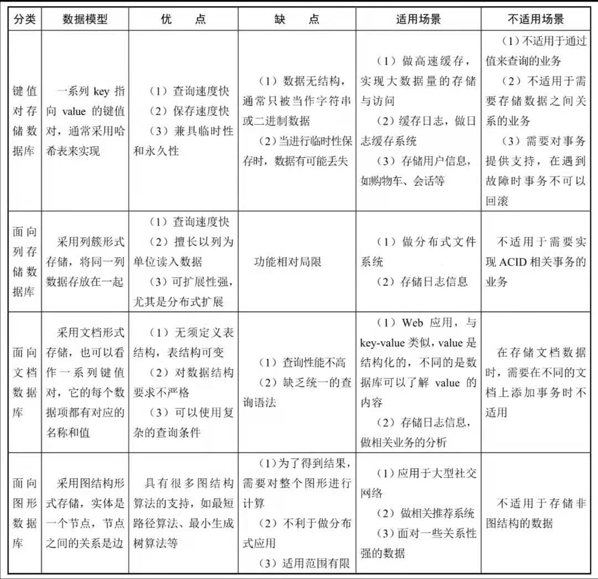
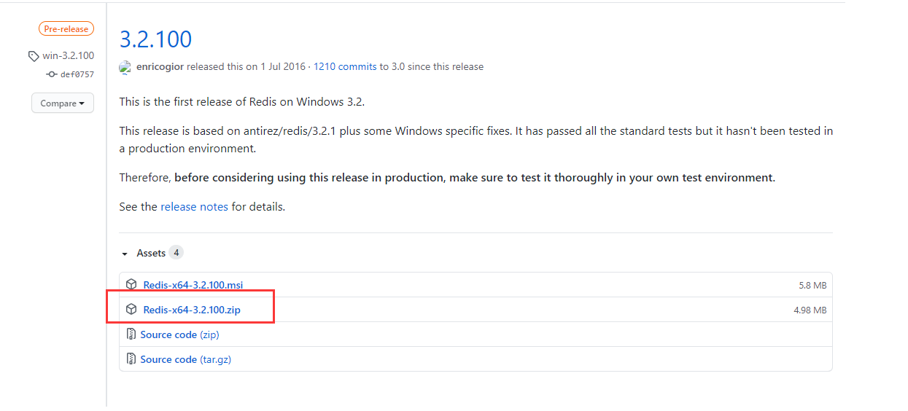
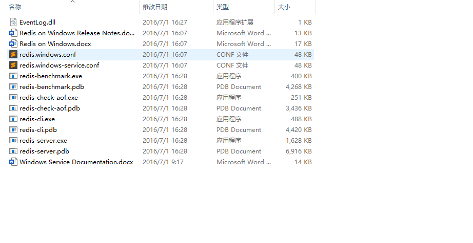
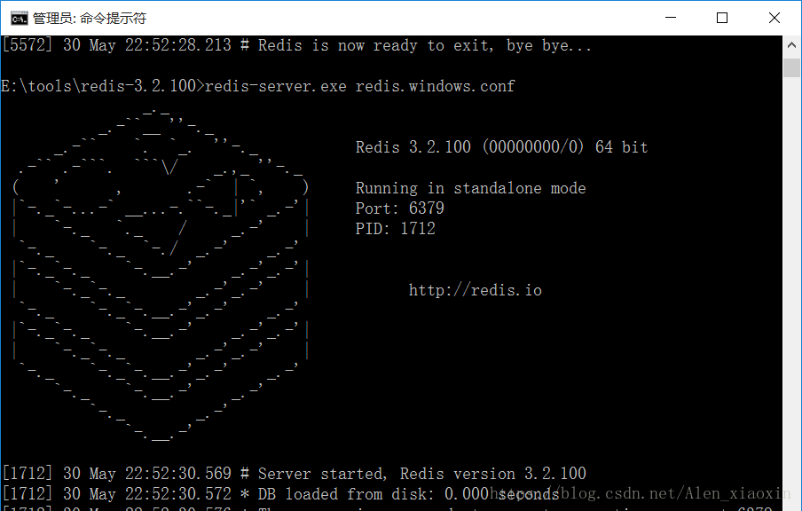

# 1. 初识NoSQL

## 1.1 什么是NoSQL

NoSQL是Not Only SQL的缩写，也是众多非关系型数据库的统称。NoSQL和关系型数据库一样，也是用来存储数据的仓库。

1. NoSQL解决了高并发读/写问题
2. NoSQL解决了海量数据的高效存储和访问问题
3. NoSQL实现了高可用性及高扩展性

NoSQL具有如下特点：
- 容易扩展，方便使用，数据之间没有关系
- 数据模型非常灵活，无须提前为要存储的数据建立字段类型，随时可以存储自定义的数据格式。
- 适合大量数据、高性能的存储
- 具有高并发读/写、高可用性

## 1.2 NoSQL与传统关系型数据库的比较

| | NoSQL | 关系型数据库 |
| --- | --- | --- |
| 使用成本 | 使用简单，易搭建，大部分是开源软件，比较廉价 | 通常需要安装部署，开源比较少，使用成本高。
| 存储形式 | 具有丰富的存储形式，如key-value(键值对)形式、图形结构形式、文档形式、列簇形式等，可以存储各种类型的数据 | 采用关系型数据模型来组织的，是行列表结构，通过行与列的二元形式表示出来，数据之间具有很强的关联性。采用二维表结构的形式对数据进行持久存储。 |
| 查询速度 | 将数据存储在系统缓存中，不需要经过SQL层的解析，查询效率很高 | 将数据存储在系统的硬盘中，在查询时需经过SQL层的解析，然后读入内存，实现查询，因此查询效率较低 |
| 扩展性 | 去掉了传统关系型数据表与字段之间的关系，实现了真正意义上的扩展。采用键值对的形式存储数据，消除了数据之间的耦合性 | 由于采用关系型数据模型来存储数据，数据与数据之间的关联性较强，存在耦合性，不易扩展 |
| 是否支持ACID特性 | 一般不支持ACID特性，它实现了最终一致性 | 支持ACID特性，具有严格的数据一致性 |
| 是否支持SQL语句 | 不支持 | 支持 |

**注意**
1. ACID特性是指数据库事务的执行要素，包括原子性、一致性、隔离性、持久性。
2. SQL是结构化查询语言、数据操纵语言、数据定义语言。

## 1.3 NoSQL使用场景

1. 对于大数据量、高并发的存储系统及相关应用
2. 对于一些数据模型比较简单的相关应用
3. 对数据一致性要求不是很高的业务场景
4. 对于给定key来映射一些复杂值得环境
5. 存储用户信息，如大型电商系统得购物车、会话等。
6. 对于多数据源的数据存储。
7. 对易变化、热点高频信息、关键字等信息的存储。

## 1.4 NoSQL的数据模型

关系型数据库的数据模型由数据结构、数据操作及完整性约束条件组成。

NoSQL的4种数据模型如下
- 键值对数据模型
  - 键值对数据模型就是采用键值对形式将数据存储在一张哈希表种的一类数据库，这张哈希表具有一个特定的键和一个指向特定数据的指针。键值对存储中的值可以是任意类型的值，如数字、字符串，也可以是封装在对象中的新的键值对。
- 列数据模型
  - 列数据模型就是将数据按照列簇形式来存储的一类数据库，通常用于存储分布式系统的海量数据。它也有键，这些键指向多个列，由数据库的列簇来统一安排。
- 文档数据模型
  - 文档数据模型以文档形式进行存储，它是键值对数据模型的升级版，是版本化的文档。它可以使用模式来指定某个文档结构，通常采用特定格式来存储半结构化的文档，最常使用的存储格式是XML、JSON。每个文档都是自包含的数据单元，是一系列数据项的集合。
- 图数据模型
  - 图数据模型采用图结构形式存储数据，它是最复杂的NoSQL，常被用于存储一些社交网络的社交关系，适用于存储高度互联的数据。它是由多个节点和多条边组成，节点表示实体，边表示两个实体之间的关系。

键值对数据模型、列数据模型、文档数据模型统称为聚合模型，它们有一个共同特点：可以把一组相互关联的对象看作一个整体单元来操作，通常把这个单元称为一个聚合。

## 1.5 NoSQL数据库的分类

### 1、NoSQL数据库大致可分为四大类

1、键值对存储数据库

主要采用键值对形式存储数据的一类数据库。

典型代表：Redis(由C/C++语言开发)、Memcached、Voldemort、Berkeley DB、Tokyo Cabinet/Tyrant等。当采用该类数据库存储数据时，需要定义数据结构（半结构化）才能进行存储。

2、面向列存储数据库

主要按照列存储数据的一类数据库

典型代表：HBase（Java开发）、Cassandra（Java开发）、Riak（Erlang、C及JavaScript组合开发）等。当采用该类数据库存储数据时，需要定义数据结构（半结构化）才能进行存储。

3、面向文档数据库

主要用于存储文档的一类数据库。文档也是它最小单元，同一张表中存储的文档属性可以是多样化的，数据可以采用XML、JSON、JSONB等多种格式存储。

典型代表：MongoDB（由C++开发）、CouchDB（Erlang开发）、RavenDB等。当采用该类数据库存储数据时，不需要定义数据结构（非结构化）就可以存储。

4、面向图形数据库

主要用于存储图片信息的一类数据库

典型代表：Neo4j（Java开发）、infoGrid、infinite Graph等。

### 2、各类NoSQL数据库的比较




# 2. 认识Redis

## 2.1 Redis简介

### 1、什么是Redis

Redis是用C语言开发的一款开源的、高性能的键值对存储数据库，采用了BSD协议，为了适应不同场景下的存储需求，提供了多种键值数据类型。

Redis支持的键值数据类型有字符串、列表、有序集合、散列和集合等。

### 2、Redis特性

1. 支持多种计算机编程语言
2. 具有丰富的数据类型，如String、List、Set、Hash、Sorted Set等
3. 支持多种数据结构，如哈希、集合、位图(多用于活跃用户数等的统计)、HyperLogLog（超小内存唯一值计数，由于只有12KB，因而是有一定误差范围的）、GEO（地理信息定位）。
4. 读/写速度快，性能高。
5. 支持持久化。Redis的持久化也就是备份数据，每隔一段时间将内存种的数据保存在磁盘中，在重启的时候会再次加载到内存中，从而实现数据持久化。Redis的持久化方式是RDB和AOF。
6. 简单且功能强大。
7. 实现高可用主从复制，主节点做数据副本。
8. 实现分布式集群和高可用。Redis Cluster支持分布式，进而可以实现分布式集群；Redis Sentinel支持高可用。

### 3、Redis使用场景

1. 做缓存。
2. 做计数器应用。
3. 实现消息队列系统。
4. 做实时系统、消息系统
5. 实现排行榜应用
6. 做数据过期处理
7. 做大型社交网络。
8. 分布式集群架构中的session分离。

## 2.2 搭建Redis环境

Windows环境下载地址：https://github.com/MicrosoftArchive/redis/releases

Linux环境下载地址：http://www.redis.net.cn/download/

### 1、Windows环境下搭建

1、下载Redis安装包



2、解压压缩包



**注意**：也可以下载`.msi`文件，直接双击打开进行安装。

文件介绍：
- redis-server.exe：服务端程序，提供 redis 服务
- redis-cli.exe: 客户端程序，通过它连接 redis 服务并进行操作
- redis-check-dump.exe：RDB 文件修复工具
- redis-check-aof.exe：AOF 文件修复工具
- redis-benchmark.exe：性能测试工具，用以模拟同时由 N 个客户端发送 M 个 SETs/GETs 查询 (类似于 Apache 的 ab 工具)
- redis.windows.conf： 配置文件，将 redis 作为普通软件使用的配置，命令行关闭则 redis 关闭
- redis.windows-service.conf：配置文件，将 redis 作为系统服务的配置

3、运行cmd，cd进入解压目录，执行

> redis-server.exe redis.windows.conf



4、安装redis到Windows服务

> redis-server --service-install redis.windows.conf

- 启动服务：`redis-server --service-start`
- 停止服务：`redis-server --service-stop`

### 2、Linux环境下搭建

```
root@iZpr21qe3dl1aaZ:~# cd /usr/local     # 进入/usr/localmul
root@iZpr21qe3dl1aaZ:~# mkdir redis       # 创建redis目录
root@iZpr21qe3dl1aaZ:~# cd redis          # 进入redis目录
root@iZpr21qe3dl1aaZ:~# wget http://download.redis.io/releases/redis-4.0.9.tar.gz
root@iZpr21qe3dl1aaZ:~# tar -zxvf redis-4.0.9.tar.gz    # 解压压缩包
root@iZpr21qe3dl1aaZ:~# cd redis-4.0.9      # 进入目录
root@iZpr21qe3dl1aaZ:~# make                # 进行编译
root@iZpr21qe3dl1aaZ:~# make install        # 进行安装
```

## 2.3 Redis客户端

### 1、命令行客户端

Redis的命令行客户端`redis-cli`(Redis Command Line Interface)是Redis自带的基于命令行的客户端，主要用于与服务器端进行交互。

### 2、可视化客户端

Redis可视化客户端也称远程客户端，可以连接远程Redis数据库进行操作。

两款可视化工具：
- [Redis Desktop Manager(RDM)](https://redisdesktop.com/download)
- [TreeSoft数据库管理系统TreeDMS](http://www.treesoft.cn/dms.html)


# 3. Redis数据类型

> 目前redis数据库支持5种数据类型，分别是String(字符串)、Hash(哈希)、List(列表)、Set(集合)及Sorted Set(有序集合)

## 3.1 字符串（String）命令


## 3.2 哈希（Hash）命令


## 3.3 列表（List）命令

## 3.4 集合（Set）命令

## 3.5 有序集合（Sorted Set）


# 4. Redis必备命令

# 5. Redis数据库