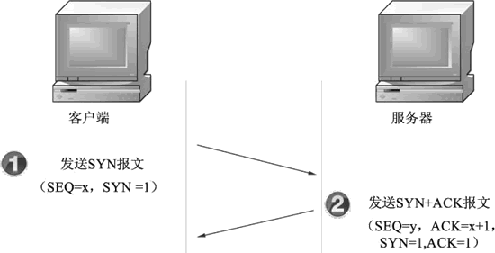
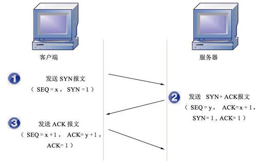

# TCP三次握手建立连接的过程

## 第一次握手

第1次握手建立连接时，客户端向服务端发送SYN报文(SEQ=x, SYN=1)，并进入SYN_SENT状态，等待服务器确认

## 第2次握手

第2次握手分为两部分完成的，即SYN + ACK(请求和确认)报文

- 服务器收到客户端的请求，向客户端回复一个确认信息(ACK=x+1)
- 服务器再向客户端发送一个SYN包(SEQ=y)建立连接的请求，此时服务器进入SYN_RECV状态

## 第3次握手

第3次握手，是客户端收到服务器的回复(SYN+ACK报文)。此时，客户端也要向服务器发送确认包(ACK)。此包发送完毕客户端和服务器进入ESTABLISHED状态，完成3此握手

