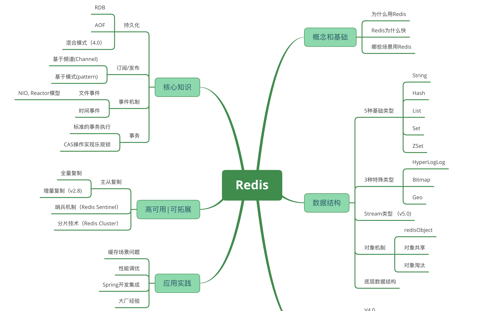

<!-- TOC -->

- [1. Redis概念和基础](#1-redis概念和基础)
  - [1.1 为什么用Redis](#11-为什么用redis)
  - [1.2 Redis为什么快](#12-redis为什么快)
  - [1.3 Redis应用场景](#13-redis应用场景)

<!-- /TOC -->

# 1. Redis概念和基础

## 1.1 为什么用Redis

## 1.2 Redis为什么快

## 1.3 Redis应用场景