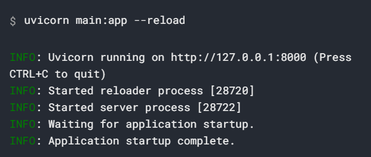

# FastAPI基础
## 安装FastAPI
---
> pip install fastapi
> 
> pip install uvicorn

---

## 简单示例

```python
from fastapi import FastAPI

app = FastAPI()

@app.get("/")
async def root():
    return {"message": "Hello world"}

```

运行实时服务器



`uvicorn main:app --reload`命令含义如下
- `main`：`main.py`文件
- `app`：在`main.py`文件中通过`app = FastAPI()`
- `--reload`：让服务器在更新代码后重启。

查看

打开浏览器访问`http://`