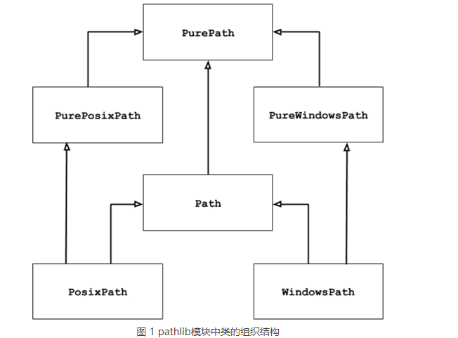

# pathlib模块用法

pathlib模块中包含的一些类的继承关系



上图中可以看出，`PurePosixPath`、`PureWindowsPath`和`Path`是`PurePath`的子类。

`pathlib`模块的操作对象是各种操作系统中使用的路径（例如指定文件位置的路径，包括绝对路径和相对路径）

- `PurePath`类会将路径看做是一个普通的字符串，它可以实现将多个指定的字符串拼接成适用的路径格式，同时能判断两个路径是否相等。注：PurePath操作路径，并不会关心该路径是否真实有效。
- `PurePosixPath`和`PureWindowsPath`是`PurePath`的子类，前者用于操作UNIX(包括Mac OS X)风格的路径，后者用于操作Windows风格的路径。
- `Path`类操作的地址一定是真实有效的。它提供了判断路径是否真实存在的方法。
- `PosixPath`和`WindowsPath`是`Path`的子类，前者用于操作UNIX(包括Mac OS X)风格的路径，后者用于操作Windows风格的路径。

**注意**：UNIX操作系统和Windows操作系统在路径的格式上是完全不同的，主要的区别在于根路径和路径分隔符，UNIX系统的根路径是斜杠(/)，而Windows系统的根路径是盘符(C:)；UNIX路径使用的分隔符是斜杠(/)，而Windows使用的是反斜杠(\\)。

## PurePath类的用法

### PurePath类构造方法

如果在Windows系统上使用`PurePath`创建对象，该类的构造方法返回的是`PureWindowsPath`对象；反之，若在UNIX或MAC OS X系统上使用`PurePath`创建对象，该类返回的是`PurePosixPath`对象。

实例1

```ipython
In [1]: from pathlib import PurePath

In [2]: # 创建PurePath实例，实际上使用PureWindowsPath

In [2]: path = PurePath('my_file.txt')

In [3]: print(type(path))
<class 'pathlib.PureWindowsPath'>
```

`PurePath`在创建对象时，支持传入多个路径字符串，它们会被拼接成一个路径格式的字符串。

```ipython
In [1]: from pathlib import PurePath

In [2]: path = PurePath('http:', 'www.baidu.com')

In [3]: print(path)
http:\www.baidu.com
```

**注意**：若使用`PurePath`类创建实例时，不传入任何参数，则等同于传入'.'(表示当前路径)作为参数。

```ipython
In [1]: from pathlib import PurePath

In [2]: path = PurePath()

In [3]: print(path)
.

In [4]: path = PurePath('.')

In [5]: print(path)
.
```

若传入`PurePath`构造方法中的多个参数中，包含多个路径，则只会有最后一个根路径及后面的子路径生效。

```ipython
In [1]: from pathlib import PurePath

In [2]: path = PurePath('C://', "D://", 'file.txt')

In [3]: print(path)
D:\file.txt
```

**注意**：如果传给`PurePath`构造方法的参数中包含多余的斜杠或者点，会被直接忽略(..不会被忽略)

`PurePath`类还重载了各种比较运算符，对于同种风格的路径字符串来说，可以判断是否相等，也可以比较大小(本质上是比较字符串的大小)；对于不同风格的路径来说，只能判断是否相等，但不能比较大小。

`PurePath`类对象支持直接使用斜杠(/)作为等多个字符串之间的连接符

```ipython
In [1]: from pathlib import PurePath

In [2]: path = PurePath('C://')

In [3]: print(path / 'file.txt')
C:\file.txt
```

## PurePath类实例属性和实例方法

| 类实例属性和实例方法名 | 功能描述 |
| :---: | :--- |
| PurePath.parts | 返回路径字符串中所包含的各部分 |
| PurePath.drive | 返回路径字符串中的驱动器盘符 |
| PurePath.root | 返回路径字符串中的根路径 |
| PurePath.anchor | 返回路径字符串中的盘符和根路径 |
| PurePath.parents | 返回当前路径的全部父路径 |
| PurePath.parent | 返回当前路径的上一级路径，相当于parents[0]的返回值 |
| PurePath.name | 返回当前路径中的文件名 |
| PurePath.suffixes | 返回当前路径中的文件所有后缀名 |
| PurePath.suffix | 返回当前路径中的文件后缀名。相当于suffixes属性返回的列表的最后一个元素 |
| PurePath.stem | 返回当前路径中的主文件名 |
| PurePath.as_posix() | 将当前路径转换成UNIX风格的路径 |
| PurePath.as_uri() | 将当前路径转换成URL。只有绝对路径才能进行转换，否则会引发ValueError |
| PurePath.is_absolute() | 判断当前路径是否为绝对路径 |
| PurePath.joinpath(*other) | 将多个路径连接在一起，作用类似于斜杠(/)连接符 |
| PurePath.match(pattern) | 判断当前路径是否匹配指定通配符 |
| PurePath.relative_to(*other) | 获取当前路径中去除基准路径之后的结果 |
| PurePath.with_name(name) | 将当前路径中的文件名替换成新文件名。如果当前路径没有文件名，引发ValueError |
| PurePath.with_suffix(suffix) | 将当前路径中的文件后缀名替换成新的后缀名。如果当前路径中没有后缀名，则会添加新的后缀名。 |
