# 1、查找算法

查找的方法可以分为两种：比较查找法与计算式查找法。

比较查找法基于两种数据结构：线性表和树。

查找还可以分为静态查找和动态查找。

# 2、顺序查找

顺序查找是所有查找方法中最基础也是最简单的一种，一般用于对线性表的查找。它是按照数据在查找表中原有的顺序进行遍历查询的算法。由于需要遍历整个查找表，所以顺序查找的时间复杂度为*O(n)*。

```python
arr = [1, 3, 5, 4, 2, 4, 6, 5, 9, 8, 7]
key = int(input())  # 输入查询关键字
for i in arr:
    if i == key:
        print(i)
        break   # 保证在查找到第一个就退出循环
print(-1)
```

# 3、二分查找

二分查找，也叫做折半查找，是一种适用于顺序存储结构的查找方法。时间复杂度为*O(lg n)*。

```python
arr = [2, 5, 6, 8, 12, 15, 17, 23, 27, 31, 39, 40, 45, 56, 79, 90]
num = int(input())
left, right = 0, len(arr) - 1
while left < right:
    mid = (left + right + 1) // 2
    print(left, mid, right)
    if num > arr[mid]:
        left = mid
    else:
        right = mid - 1
print(left)

```

# 4、树

树是一种由n个元素组成的集合，元素之间具有层次关系。如下图，这种数据结构叫作“树”，是因为它就像一颗倒过来的树，叶子在下面，根在最上面。

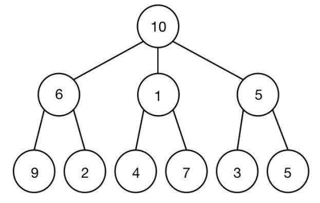

当`n=0`时，树被称作空树。

当`n>0`时，树被称作非空树。

对于非空树，有以下几个概念
- 树中的每个元素被称为节点
- 树最顶层的节点称为根节点；比当前节点深度小但与当前节点之间相连的节点称为节点的前驱；每棵树只有一个特定的根节点，他没有直接前驱。
- 当`n>1`时，根节点及其之下的所有节点构成原树，而根节点之外的节点可以被划分为m个互不相交的有限集T1, T2, ..., Tm。每个集合Ti本身也是一棵树，被称为根的子树。
- 所有非根节点有且只有一个父亲节点。
- 具有相同父亲节点的两个节点称为**兄弟节点**。
- 没有孩子节点的节点，称作**叶子节点**。
- 一个节点连接的孩子节点数量称为**度**。
- 一棵树中，所有节点里最大的度称为**树的度**。
- **树的高度**即为数中节点的最大层次。
- 若干棵互不重合的树构成的集合，称作**森林**。
- 对于树中的每个节点而言，其所有子树的集合就为森林。
- 树的分类
  - 有序树
    - 有序树中的节点有顺序关系，不能轻易改变其中的排列.
  - 无序树
    - 而无序树中的节点没有顺序关系，也称作**自由树**。

## 4.1、二叉树

**二叉树**是一种特殊的树，最直观地体现是它的每个节点之多有两个子节点。

每个二叉树的节点至多有两颗子树，它们又分为左子树和右子树。二叉树的形态有如下几种

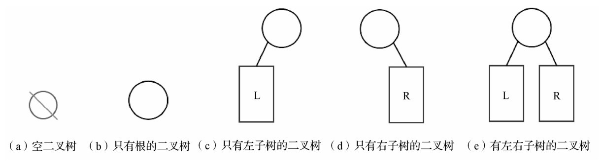

### 1、二叉树的性质

- 在二叉树的第*i*层上至多有$2^{i-1}$次方个节点， i ≥1。
- 深度为*k*的二叉树中至多有$2^k-1$个节点。
- 非空二叉树上叶子节点的数量等于双分支节点的数量+1，即$n_0=n_2 + 1$

### 2、满二叉树

**满二叉树**指每一层都达到了最大节点的二叉树，也就是深度为k且有$2^k-1$个节点的二叉树。它可以按从左到右、从上到下的顺序编号。

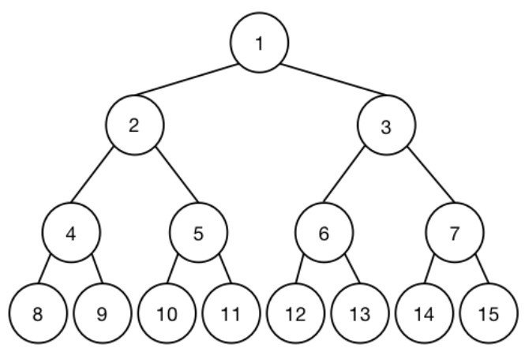

### 3、完全二叉树

在深度为*k*的完全二叉树中，所有的节点也按从左到右、从上到下的顺序编号。每个节点的编号都与深度为*k*的满二叉树中相应位置的节点一一对应。

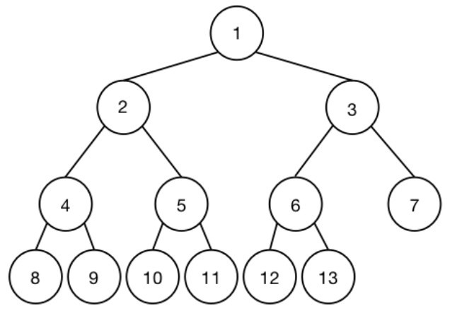

完全二叉树的叶子节点只出现在最底部的两侧，而左右子树的深度要么相等，要么相差1。

当完全二叉树有n个节点时，它的深度为$\lfloor log_2n+1 \rfloor$

父亲节点和孩子节点的编号的关系为：当父亲节点的编号为*i*时，左孩子节点编号为*2i*，右孩子节点的编号为*2i+1*。

### 4、创建二叉树

二叉树有两种表示形式，一种是以列表的形式存储，所有元素的下标从1开始依次向后排列，编号为*i*的元素的左孩子编号为*2i*，右孩子编号为*2i+1*。另一种表示形式不需要元素按顺序存储，而是在存储每个元素的同时存储左右孩子的位置。

```python
# 类的定义
class TreeNode:     # 二叉树节点的定义
    def __init__(self, val):
        self.val = val      # 二叉树的值
        self.left = None    # 左孩子节点
        self.right = None   # 右孩子节点

Input = []     # Input列表用于存储输入
tree = []      # tree列表用于存储节点
Input = Input + input().split()
cnt = 1
for item in Input:
    tmp = TreeNode(item)
    tree.append(tmp)
for item in tree:
    if item.val == 'null':  # 若节点为 'null' 则不加入tree中
        continue
    if 2 * cnt < len(Input) and tree[2*cnt].val != 'null':  # 找到每个节点的左子节点
        item.left = tree[2*cnt]
    if 2 * cnt + 1 < len(Input) and tree[2*cnt+1].val != 'null':   # 找到每个节点的右子节点
        item.right = tree[2*cnt+1]
    cnt += 1
```

### 5、遍历二叉树

二叉树的遍历分为3种
1. 先序遍历
   1. 最先遍历节点本身，然后再遍历节点左子树，最后遍历右子树
2. 中序遍历
   1. 最先遍历节点的左子树，然后遍历节点本身，最后遍历右子树
3. 后序遍历
   1. 最先遍历节点的左子树，然后遍历节点右子树，最后遍历节点本身

列表下表表示的二叉树的遍历

```python
# 先序遍历
def preorder(i):
    if tree[i] == 0:
        return
    print(tree[i])
    preorder(2*i)
    preorder(2*i+1)


# 中序遍历
def inorder(i):
    if tree[i] == 0:
        return
    preorder(2*i)
    print(tree[i])
    preorder(2*i+1)


# 后序遍历
def postorder(i):
    if tree[i] == 0:
        return
    preorder(2*i)
    preorder(2*i+1)
    print(tree[i])
```

以存储左右孩子地址来表示的二叉树

```python
class TreeNode:
    def __init__(self, x):
        self.val = x
        self.left = None
        self.right = None


class BST:
    def __init__(self, tlist):
        self.root = TreeNode(tlist[0])
        for i in tlist[1:]:
            self.insert(i)

    def preorder(self, node):   # 先序遍历
        if node is None:
            return
        print(node.val)
        self.preorder(node.left)
        self.preorder(node.right)

    def inorder(self, node):   # 中序遍历
        if node is None:
            return
        self.preorder(node.left)
        print(node.val)
        self.preorder(node.right)

    def postorder(self, node):   # 后序遍历
        if node is None:
            return
        self.preorder(node.left)
        self.preorder(node.right)
        print(node.val)

    def insert(tlist):
        cnt = 1
        tree = [0]
        for item in tlist:
            tree.append(TreeNode(item))
        for item in tlist:
            if item.val == 'null':  # 若节点为 'null' 则不加入tree中
                continue
            if 2 * cnt < len(tlist) and tree[2*cnt].val != 'null':  # 找到每个节点的左子节点
                item.left = tree[2*cnt]
            if (2 * cnt + 1) < len(tlist) and tree[2*cnt+1].val != 'null':   # 找到每个节点的右子节点
                item.right = tree[2*cnt+1]
            cnt += 1

```

# 5、二叉搜索树

二叉搜索树是一种特殊的二叉树，数中的元素排列符合二叉搜索树性质。二叉搜索树中，每个节点存储的元素称为该节点的键值，二叉搜索树也称为二叉查找树。

## 5.1 二叉搜索树基础

二叉搜索树可以是一颗空树，也可以是具有如下几条性质的一颗二叉树。
- 若任意一个节点的左子树非空，那么左子树中所有的元素都小于当前节点存储的元素。
- 若任意一个节点的右子树非空，那么右子树中所有的元素都大于当前节点存储的元素。
- 任意一个节点的左右子树也为二叉搜索树
- 二叉搜索树中没有两个节点具有相同的键值。

一般来说，二叉搜索树可以用3个列表模拟存储，它们分别是left、right和key。这3个列表中，下标相同的位置属于同一个节点。编号为i的节点的左孩子用`left[i]`表示，右孩子用`right[i]`表示，而键值用`key[i]`表示。

## 5.2 二叉搜索树的操作

二叉搜素树支持的操作有
1. 建立二叉搜索
2. 插入键值为x的节点
3. 查询键值为x的节点再二叉搜索树中的排名
4. 删除键值为x的节点
5. 求键值为x的节点的前驱与后继

```python
# 树节点的定义
class TreeNode:
    def __init__(self, value):
        self.value = value
        self.left = None
        self.right = None


# 二叉搜索树定义
class BST:
    def __init__(self, tlist):
        self.root = TreeNode(tlist[0])      # 第一个元素建立为根节点
        for i in tlist[1:]:     # 按顺序将剩下元素插入二叉搜索树中
            self.insert(i)

    def search(self, node, parent, data):
        """
        在二叉搜索树中查找是否有键值为val的节点。
        : node: 当前节点
        : parent: 父亲节点
        : data: 要查询的值
        ：return：tuple类型(当前节点是否存在，节点本身，父节点)
        """
        if node is None:    # 当前节点为空，没有找到查找的元素
            return False, node, parent
        elif data == node.value:    # 查找到元素
            return True, node, parent
        elif data < node.value:     # 查找元素小于当前节点数据，进入左子树查找
            self.search(node.left, node, data)
        else:       # 查找元素大于当前节点数据，进入右子树查找
            self.search(node.right, node, data)

    def insert(self, data):
        """
        插入数据
        : data: 要插入的数据
        """
        # 查询要插入的数据是否已经存在
        exist, n, p = self.search(self.root, self.root, data)
        if exist:   # 数据节点已经存在，不需要插入
            return
        else:   # 不存在
            new_node = TreeNode(data)   # 新建节点
            if data > p.value:
                p.right = new_node
            else:
                p.left = new_node

    def getlast(self, node, data, maxn):
        """
        查找前驱
        """
        if node is None:    # 当前位置为空，仍没有找到data相等元素
            return False, maxn  # 返回目前及格过路径上最大的符合前驱要求的数
        elif data == node.value:    # 找到了与data相等的元素
            if node.left is None:   # 没有左子树
                return True, maxn
            else:   # 值为value的节点有左子树
                tmp = node.left
                while tmp.right is not None:
                    tmp = tmp.right
                return True, tmp    # 返回左子树中最大的数
        elif data < node.value:     # data小于当前节点数据，进入左子树
            self.getlast(node.left, data, maxn)
        else:   # data大于当前节点的数据，进入右子树
            if maxn.data < node.value:  # 如果当前数值已经比maxn中的前驱都大，更新maxn
                maxn = node
            return self.getlast(node.right, data, maxn)

    def getnext(self, node, data, minn):
        if node is None:    # 如果当前的位置为空，但仍没有查找到与data相等的元素
            return 0, minn  # 返回目前经过路径上最小的符合后继要求的数
        elif data == node.data:     # 找到了与data相等的元素
            if node.right is None:  # 值为data的节点没有右子树
                return 1, minn  # 返回目前经过路径上最小的符合后继要求的数
            else:   # 值为data的节点有右子树
                tmp = node.right    # 进入右子树后找到右子树中最小的数
                while tmp.left is not None:
                    tmp = tmp.left
                return 1, tmp   # 返回右子树中最小的数（最左边的数）
        elif data < node.data:  # data小于当前节点的数据，进入左子树
            if minn.data > node.data:  # 如果当前数据比已经存储在minn中的后继要小，更新minn
                minn = node
                return self.getlast(node.left, data, minn)
            else:   # data大于当前节点的数据，进入右子树
                return self.getlast(node.right, data, minn)

    def delete(self, root, data):
        """
        删除
        """
        exist, n, p = self.search(root, root, data)
        if not exist:   # 不存在
            print('data is not exist')
        else:
            if n.left is None:  # 要删除的节点左子树为空
                if n == p.left:     # 如果n是左孩子，把p的左孩子赋值为n的右孩子
                    p.left = n.right
                else:   # 如果n是右孩子，把p的右孩子复制为n的右孩子
                    p.right = n.right
                del n
            elif n.right is None:   # 要删除的节点右子树为空
                if n == p.left:     # 如果n是左孩子，把p的左孩子赋值为n的右孩子
                    p.left = n.left
                else:   # 如果n是右孩子，把p的右孩子复制为n的右孩子
                    p.right = n.left
                del n
            else:   # 左右子树都不为空
                tmp = n.right   # 进入n的右子树
                if tmp.left is None:    # 如果n的右孩子没有左子树，则n的右孩子就是n的后继
                    n.value = tmp.value
                    n.right = tmp.right
                else:
                    next = tmp.left
                    while next.left is not None:    # 在右子树中查找n的后继
                        tmp = next
                        next = next.left
                    n.value = next.value
                    tmp.left = next.right
                    del next

```

# 6、平衡二叉树

平衡二叉树又称为AVL树，它维持二叉搜索树平衡的根本在于持续维护一个性质：二叉搜索树中，每一个节点的左右子树深度差的绝对值不大于1

每个节点的平衡因子即为节点左子树的深度减去右子树的深度得到的差。在符合 AVL 性质的情况下，平衡因子只能取-1、0、1。

如果一棵平衡二叉树中的节点发生了变化，使二叉树不再平衡，此时需要采用平衡化旋转来调整树的结构，使得在不破坏二叉搜索树性质的情况下，让二叉树重新达到平衡。

平衡化旋转分为两种
- 单向旋转
- 双向旋转

## 单向旋转

如果回溯路径中当前节点以及下两层节点处于一条直线上，就可以采用单向旋转。

如果在下两层的节点中，每一个节点都是父亲节点的右孩子，那么如下图所示，此时采用单向左旋。

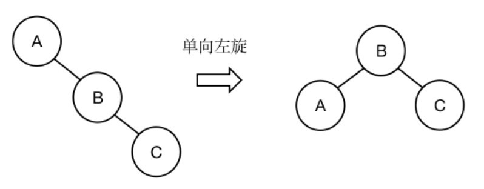

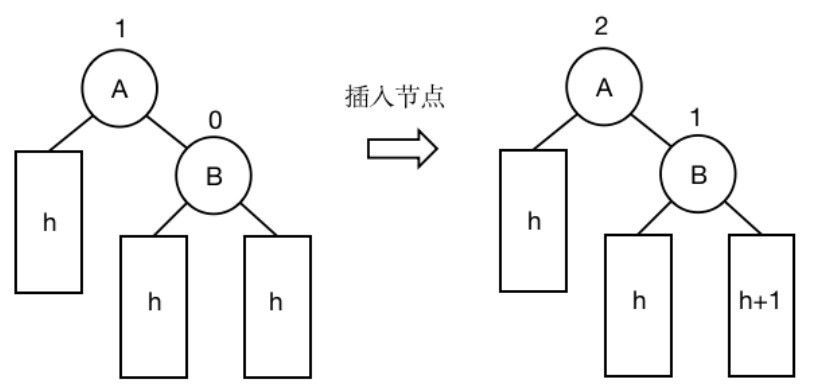

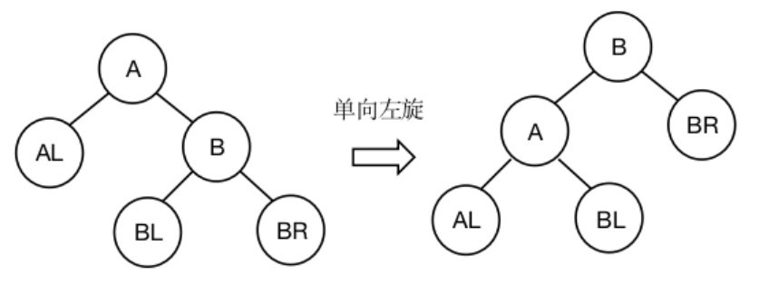


单向右旋


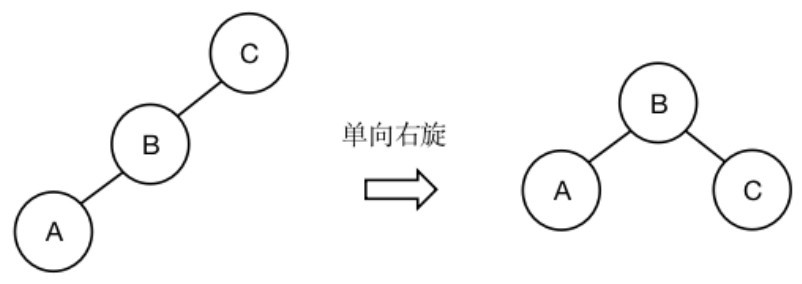

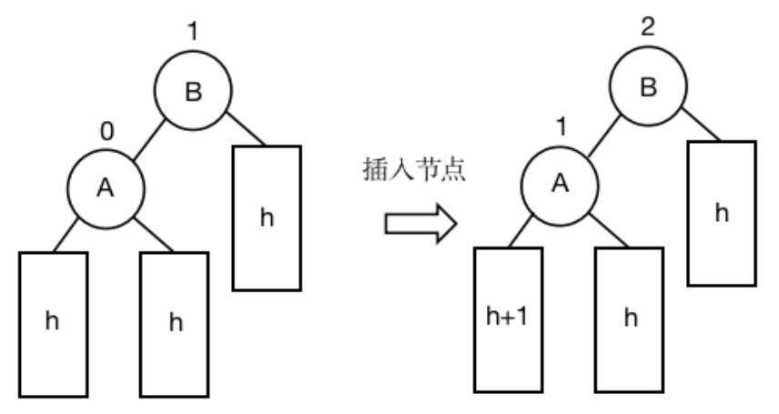

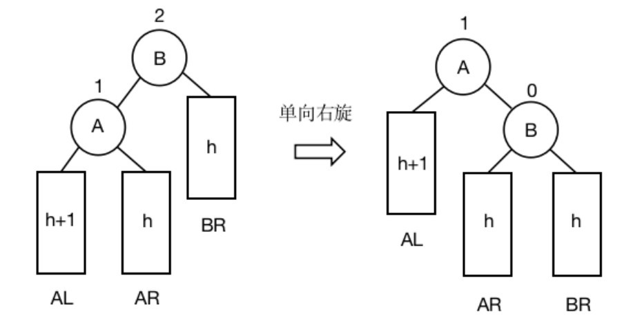

```python
# 单向左旋函数，其中parent是p的父节点
def SingleTurnL(parent, p):
    q = p.right # 找到下一层的节点
    # 重新连接子树的位置
    p.right = q.left
    q.left = p
    if p == parent.left:    # 将q连接到原来p的父节点
        parent.left = q
    else:
        parent.right = q


# 单向右旋函数，其中parent是p的父节点
def SingleTurnR(parent, p):
    q = p.left # 找到下一层的节点
    # 重新连接子树的位置
    p.left = q.right
    q.right = p
    if p == parent.left:    # 将q连接到原来p的父节点
        parent.left = q
    else:
        parent.right = q

```

## 双向旋转

双向旋转实际上是进行两次不同方向的单向旋转操作。在当前节点以及下两层的节点构成折线形状时，需要进行双向旋转。根据进行不同方向单向旋转的先后顺序，双向旋转也被分为两类：先左后右双向旋转和先右后左双向旋转。

### ***先左后右双向旋转图解***

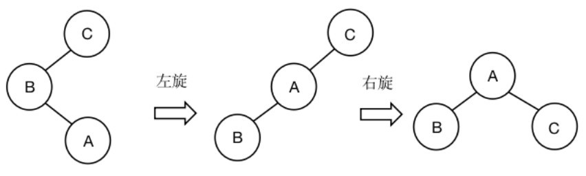

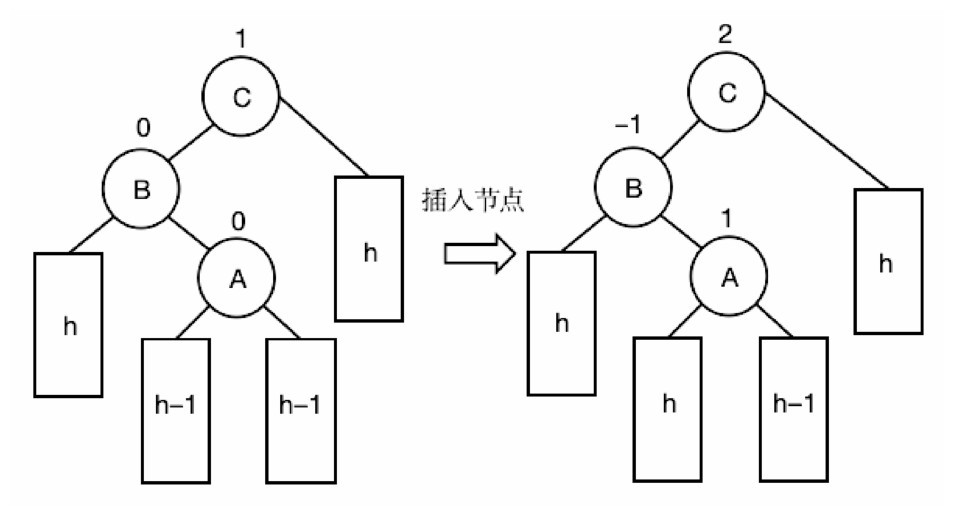

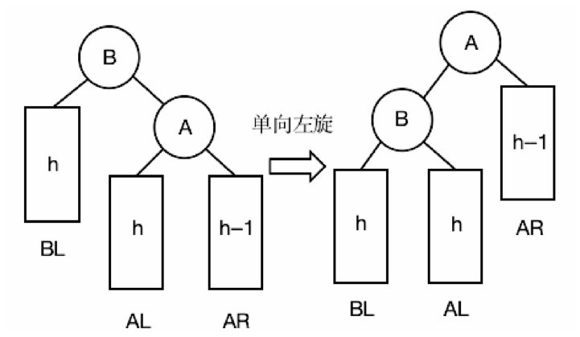

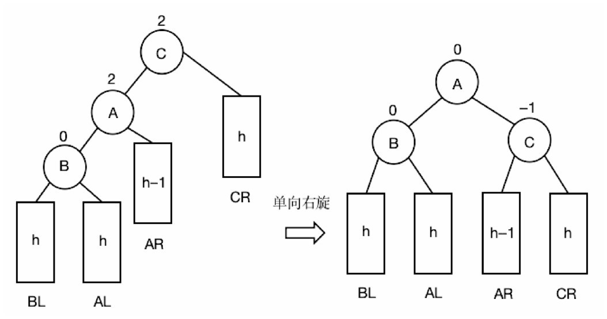

### ***先右后左双向旋转图解***

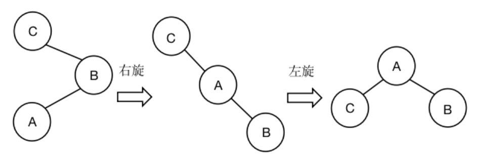

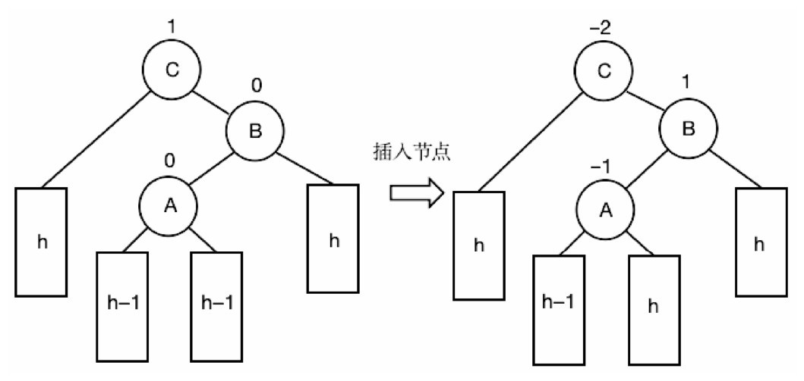

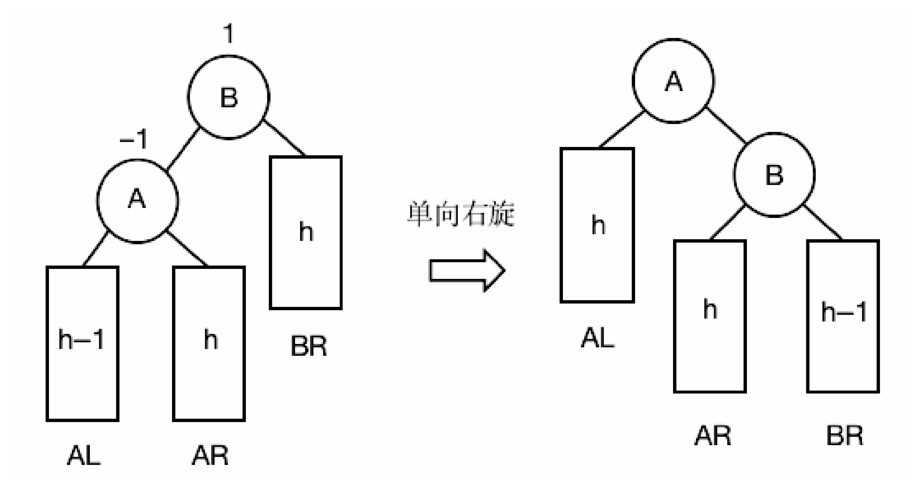

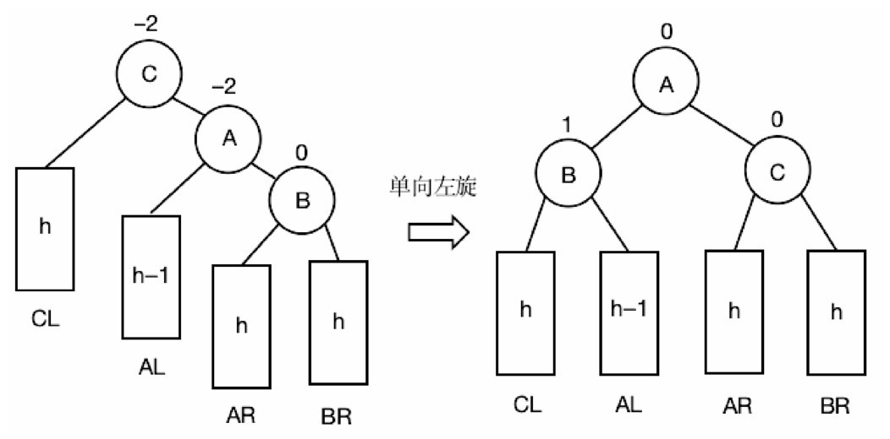


### 代码实现

```python
#先左后右双向旋转，fa是p父节点的位置，p是当前节点
def DoubleLR(fa,p):
    SingleTurnL(p,left[p]) #调用单向左旋函数
    SingleTurnR(fa,p) #调用单向右旋函数


#先右后左双向旋转，fa是p父节点的位置，p是当前节点
def DoubleRL(fa,p):
    SingleTurnR(p,right[p]) #调用单向右旋函数
    SingleTurnL(fa,p) #调用单向左旋函数
```