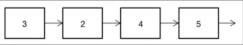
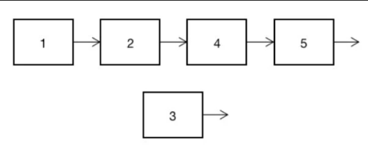
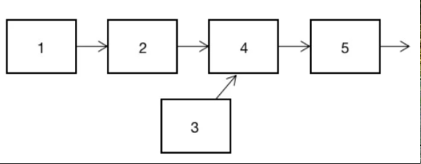
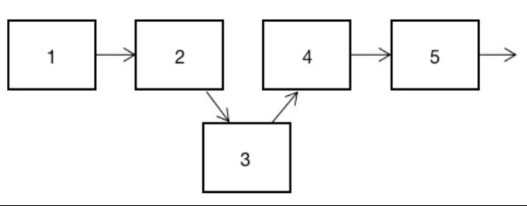
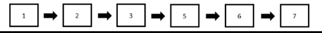
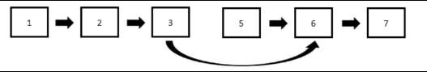

# 1、单链表

链表是用指针链接的用于存储数据的数组。

## 1.1 建立单链表

链表的每个元素不仅仅存储这个元素的值，还要存储与它相连的元素的地址，起到链接元素的效果。这个存储在元素中的地址就是指向下一个元素的指针。单链表的每个元素包含本身的值和一个指向下一个元素的指针。链表的最后一个元素没有下一个元素，所以它的指针称为空指针。

单链表示例



链表的第一个元素并不一定处于列表下标为0的位置。所以，往往还需要一个单独的指针变量来存储第一个元素的位置，这个指针被称为头指针。

## 1.2 遍历单链表

```python
listValue = [1, 5, 6, 2, 4, 3]
listPointer = [3, 2, -1, 5, 1, 4]

head = 0    # head是指向链表第一个元素的指针，需要自己定义
next = head     # 给next赋值
while next != -1:   # next是指向下一个元素的指针，不等于-1代表后面还有元素
    print(listValue[next])  # 输出下一个元素中存储的值
    next = listPointer[next]    # 把指针变为下一个元素中存储的指针
```

## 1.3 插入单链表

单链表插入元素流程







代码实现

```python
listValue = [1, 4, 5, 2]
listRight = [3, 2, -1, 1]
head = 0    # 初始化头指针
num = 3     # 要插入的元素
next, last = head, head     # 初始化表示插入位置的下一个元素和上一个元素的指针

def output():
    # 定义链表输入函数
    next = head
    while next != -1:
        print(listValue[next])
        next = listRight[next]

output()

while listValue[next] <= num and next != -1:
    last = next
    next = listRight[next]
listVlaue.append(num)
listRight.append(listRight[last])
listRight[last] = len(listValue) - 1
output
```

## 1.4 删除单链表第n个数

单链表删除元素流程





代码实现

```python
listValue = [1, 5, 6, 2, 7, 3]
listPoint = [3, 2, 4, 5, -1, 1]
head = 0    # 头指针
prepos = 5  # 要删除的元素的前一个位置
listPoint[prepos] = listPoint[listPoint[prepos]]
```

# 双指针

## 1. 数组合并

```python
arr1 = [3, 6, 9, 12, 15]
arr2 = [2, 4, 7, 13, 14]

ans = []  # 排序后的列表
i, j = 0, 0     # 初始指针
while i < len(arr1) and j < len(arr2):
    if arr1[i] <= arr2[j]:
        ans.append(arr1[i])
        i += 1
    else:
        ans.append(arr2[j])
        j += 1
if i == len(arr1):
    ans += arr2[j:]
else:
    ans += arr1[i:]
```

## 2. 删除单链表倒数第n个数

```python
# 节点定义
class ListNode:
    def __init__(self, v):
        self.val = v
        self.next = None


def removeLastNth(head, n):
    temp = ListNode(0)
    temp.next = head
    fast = slow = temp
    c = 0
    while c < n:
        fast = fast.next
        c += 1
    while fast.next:
        fast = fast.next
        slow = slow.next
        slow.next = slow.next.next
    return temp.next
```
