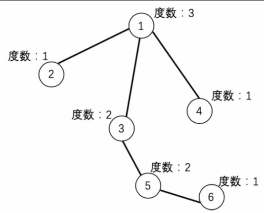
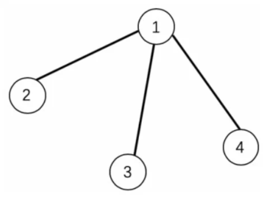
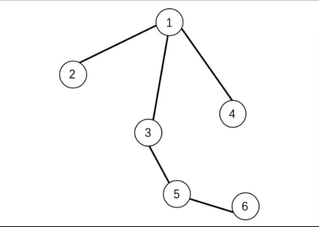
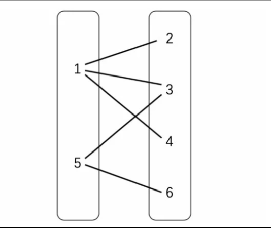

# 深度优先搜索算法

## 1、图上的深度优先搜索

### 1.1 无向图

**无向图**是图的一个分支，在无向图的模型中，图中的边仅仅是两个顶点之间的连接，并没有方向的属性，称之为无向图。其定义是：由一组顶点和一组能够将两个顶点相连而没有方向的边组成的图。

### 1.2 图的术语

**邻接点**：当两个顶点通过一条边相连时，我们称这两个顶点是相邻的，也可以说这两个顶点互为邻接点，并称这条边依附于这两个顶点，与这两个顶点相关联。

**度**：对于无向图而言，顶点$V$的度是指与$V$相关联的边的个数。即，度数等于依附于它的边的总数。

有向图中，度有入度和出度之分，入度指方向指向某顶点$V$的所有与顶点$V$相关联的边的数量；出度指从顶点$V$出发的所有与顶点$V$相关联的边的数量。



**子图**：子图是指在一幅图中所有边的一个子集以及它们所依附的所有顶点组成的图。



**路径和环**：路径是由边顺序连接的一系列顶点的集合，简单路径则是一条没有重复顶点的路径。*环*是一条至少含有一条边且起点和重点相同的路径。简单环是一个没有重复顶点和边的环（除起点和重点重复外）。路径或者环的长度都等于其所包含的边的长度。

当两个顶点之间存在一条连接双方的路径时，我们称一个顶点和另一个顶点是连通的。

**无环图**：无环图是指一种不包含环的图。

**权和网**：实际中，图上的边往往是有权值的，这些权值具有一定的意义，将这种每条边都带有权值的图称为“网”。

**图的密度**：图的密度是指已经连接的顶点对占所有可能被连接的顶点对的比例。**稀疏图**中，已连接的顶点对很少；**稠密图**中，基本所有顶点之间都有边相连接。一般来说，如果一幅图中不同的边的数量在顶点总数为$V$的一个小的常数倍以内，那么就认为这幅图是稀疏的，否则是稠密的。有时会以$VlgV$为分界线来区分稀疏图和稠密图。

**二分图**：如果一个图能将所有顶点分为两个分离的顶点集合，其中图的每条边所连接的两个顶点都分别属于不同的集合中，则其是一个二分图。二分图的两个顶点集合中的每一个顶点都和相同集合中的顶点不相连接。





### 1.3 图上的搜索

搜索一幅图，只需要一个递归方法来遍历素有顶点。在访问其中一个顶点时：
1. 将它标记为已访问
2. 递归地访问它的所有没有被标记过的邻居顶点。

重复上述两个步骤，这种方法称为图上的**深度优先搜索（DFS）。深度优先搜索算法的本质以遍历的深度为最优先的因素进行搜索。

### 经典例题-最大油田

```python
# 最大油田代码
def MaxAreaOflsland(grid):    # grid为二维数组，其中存储地理信息
    row = len(grid)     # row记录二维数组的行数，也是地图的y轴长度
    col = len(grid[0])  # col记录二维数组的列数，也是地图的x轴长度
    arrived = [[False for j in range(col)] for i in range(row)]     # arrived为一个二维数组，存储一块土地是否被访问
    ans = 0     # 记录油田最大面积

    # 深度优先代码
    def DFS(x, y):    # grid为二维数组，其中存储地理信息
        if 0 <= x < row and 0 <= y < col and not arrived[x][y] and grid[x][y] == 1:
            arrived[x][y] = True
            return 1 + DFS(x-1, y) + DFS(x+1, y)+DFS(x, y-1) + DFS(x, y+1)
        else:
            return 0

    for i in range(row):
        for j in range(col):
            area = DFS(i, j)
            if area > ans:
                ans = area
    return ans


if __name__ == "__main__":
    grid = [
        [0, 0, 0, 0, 1, 1, 0],
        [0, 1, 1, 0, 1, 1, 0],
        [0, 1, 1, 0, 0, 0, 0],
        [0, 0, 1, 0, 0, 1, 1],
        [0, 0, 0, 0, 0, 0, 0],
        [0, 0, 1, 1, 0, 0, 0],
        [0, 0, 0, 1, 0, 0, 1],
    ]
    ret = MaxAreaOflsland(grid)
    print(ret)

```

## 2、二叉树上的深度优先搜索

### 2.1、二叉树相关术语

| 术语 | 解释 |
| :---: | :---:|
| 度 | 节点的子树个数 |
| 根 | 二叉树的源头节点 |
| 深度 | 二叉树的层数 |
| 叶子节点 | 度为零的节点 |
| 分支节点 | 度不为零的节点 |
| 孩子节点 | 节点下一层的两个子节点 |
| 双亲节点 | 节点上一层的源头节点 |
| 兄弟节点 | 继承于同一个双亲节点的节点 |

### 2.2、二叉树上的搜索

二叉树属于一种无环连通图，所以深度搜索也可以在二叉树中进行。搜索从根节点开始，以树的深度为标准向叶子节点搜索。

若有一棵树要求从根节点v出发开始进行深度搜索，则算法会遍历父节点的每一个边。深度优先搜索算法在找到第一条父节点通往子节点的边时，不会直接继续寻找通往其他子节点的边，而是直接以找到的子节点为起点，继续遍历已知子节点的子节点，如此反复，直到当前子节点已经没有子节点（或叶子节点）。待遍历到叶子节点后，深度优先搜索算法会回溯到叶子节点的父节点，继续遍历没有遍历过的子节点，直到该父节点的所有子节点均被遍历完，在回溯到当前父节点的父节点，遍历其没有遍历过的子节点。最后直到回到根节点，并把所有节点遍历完。

### 经典例题-员工派对


