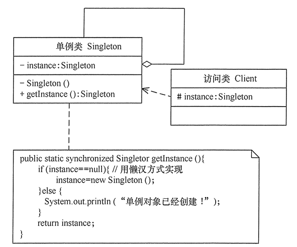
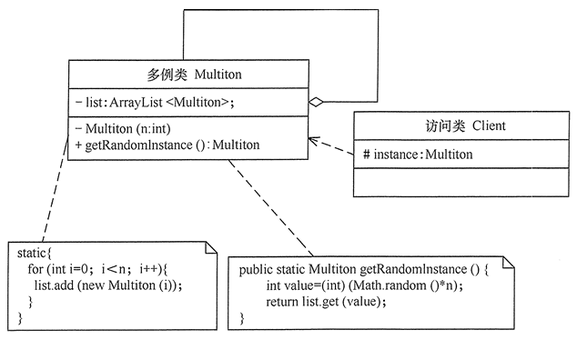

# 单例模式

## 单例模式的定义与特点

单例(Singleton)模式的定义：指一个类只有一个实例，且该类能自行创建这个实例的一种模式。

单例模式3个特点

1. 单例类只有一个实例对象
2. 该单例对象必须由单例类自行创建
3. 单例类对外提供一个访问该单例的全局访问点

## 单例模式的优点和缺点

单例模式的优点

- 单例模式可以保证内存里只有一个实例，减少了内存的开销
- 可以避免对资源的多重占用
- 单例模式设置全局访问点，可以优化和共享资源的访问

单例模式的缺点

- 单例模式一般没有接口，扩展困难。如果要扩展，则除了修改原理的代码，没有第二种方法，违背了开闭原则
- 在开发测试中，单例模式不利于代码调式。在调试过程中，如果单例中代码没有执行完，也不能模式生成一个新的对象。
- 单例模式的功能代码通常写在一个类中，如果功能设计不合理，则很容易违背单一职责原则。

## 单例模式的应用场景

- 需要频繁创建一些类，使用单例可以降低系统的内存压力，减少GC
- 某类只要求生成一个对象的时候
- 某些类创建实例时占用资源较多，或实例化耗时较长，且经常使用
- 某类需要频繁实例化，而创建的对象由频繁被销毁的时候，如多线程的线程池，网络连接池等。
- 频繁访问数据库或文件的对象
- 对于一些控制硬件级别的操作，或者从系统上来讲当是单一控制逻辑的操作，如有多个实例，则系统会完全乱套。
- 当对象需要被共享的场合。由于单例模式只允许创建一个对象，共享该对象可以节省内存，并加快对象访问速度。如Web中的配置对象、数据库的连接池等

## 单例模式的结构与实现

单例模式是设计模式中最简单的模式之一。通常，普通类的构造函数是公有的，外部类可以通过“new 构造函数()”来生成多个实例。但是，如果将类的构造函数设为私有的，外部类就无法调用该构造函数，也就无法生成多个实例。这时该类自身必须定义一个静态私有实例，并向外提供一个静态的公有函数用于创建或获取该静态私有实例。

### 1. 单例模式的结构

单例模式的主要角色

- 单例类：包含一个实例且能自行创建这个实例的类
- 访问类：使用单例的类



### 2. 单例模式的实现

简单示例

```python
class Singleton1:
    _instance = None

    def __new__(cls, *args, **kwargs):
        if not cls._instance:
            cls._instance = super().__new__(cls)
        return cls._instance

    def getInstance(self):
        print('id ==> {}'.format(id(self)))
        return self._instance


if __name__ == '__main__':
    s1 = Singleton1()
    s2 = Singleton1()
    print('*' * 20)
    print(s1.getInstance())
    print(s2.getInstance())
    print('*' * 20)
    print(id(s1.getInstance()), id(s2.getInstance()))
    print(Singleton1.__dict__)
```

#### 1、重写\_\_new\_\_和\_\_init\_\_方法

\_\_new\_\_方法是一个类方法，负责对象的创建；\_\_init\_\_方法是一个对象方法，负责对象初始化。

示例

```python
class Singleton:
    _instance = None
    _isFirstInit = False

    def __new__(cls, *args, **kwargs):
        if not cls._instance:
            cls._instance = super().__new__(cls)
        return cls._instance

    def __init__(self, name):
        if not self._isFirstInit:
            self._name = name
            print('First created {}'.format(self._name))
            Singleton._isFirstInit = True
        else:
            print('Not First created {}'.format(name))

    def getInstance(self):
        print('唯一真神: {}'.format(self._name))


if __name__ == '__main__':
    s1 = Singleton('s1')
    s2 = Singleton('s2')
    s1.getInstance()
    s2.getInstance()
    print(id(s1), id(s2))
    print(id(s1) == id(s2))

```

对比Java中此种方式的实现

```java
/**
 *  java中单例模式的实现，未考虑线程安全
 */
public class Singleton{
    private static Singleton instance = null;

    private String name;

    private Singleton(String name){
        this.name = name;
    }

    public static Singleton getInstance(String name){
        if (instance == null){
            instance = new Singleton(name);
        }
        return instance;
    }
}
```

#### 自定义metaclass

```python
class Singleton3(type):
    """
    单例实现方式 - metaclass
    """
    def __init__(cls, what, bases=None, dict=None):
        super().__init__(what, bases, dict)
        cls._instance = None    # 初始化全局变量cls._instance为None

    def __call__(cls, *args, **kwargs):
        # 控制对象的创建过程，如果cls._instance为None，则创建，否则直接返回
        if cls._instance is None:
            cls._instance = super().__call__(*args, **kwargs)
        return cls._instance


class CustomClass(metaclass=Singleton3):
    """
    用户自定义的类
    """
    def __init__(self, name):
        self.__name = name

    def getName(self):
        return self.__name


if __name__ == '__main__':
    tony = CustomClass('Tony')
    karry = CustomClass('Karry')
    print(tony.getName(), karry.getName())
    print('id(tony): ', id(tony), 'id(karry): ', id(karry))
    print('tony == karry :', tony == karry)
```

#### 装饰器方式

```python
def SingletonDecorator(cls, *args, **kwargs):
    """
    定义单例装饰器
    """
    instance = {}

    def wrapperSingleton(*args, **kwargs):
        if cls not in instance:
            instance[cls] = cls(*args, **kwargs)
        return instance[cls]

    return wrapperSingleton


@SingletonDecorator
class Singleton4:
    """
    使用单例装饰器修饰一个类
    """
    def __init__(self, name):
        self.__name = name

    def getName(self):
        return self.__name


if __name__ == '__main__':
    tony = Singleton4('Tony')
    karry = Singleton4('Karry')
    print(tony.getName(), karry.getName())
    print('id(tony): ', id(tony), 'id(karry): ', id(karry))
    print('tony == karry :', tony == karry)
    print('#' * 20)
```

### 单例模式的扩展

单例模式可扩展为有限的多例(Multitcm)模式，这种模式可生成有限个实例并保存在ArrayList中，客户需要时可随机获取。


