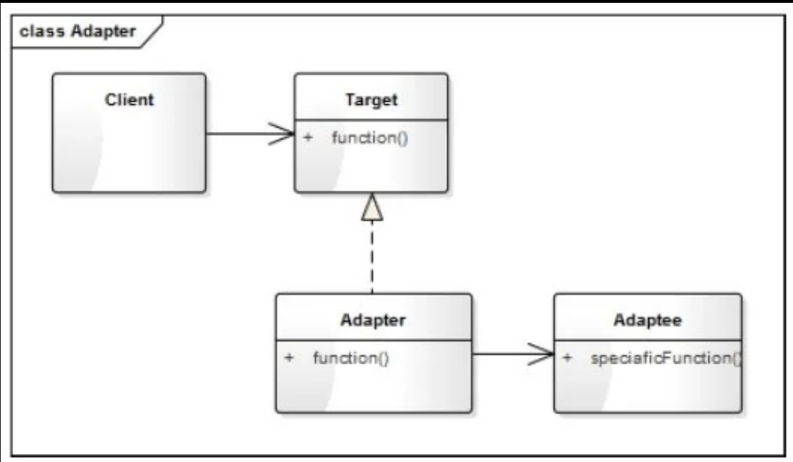
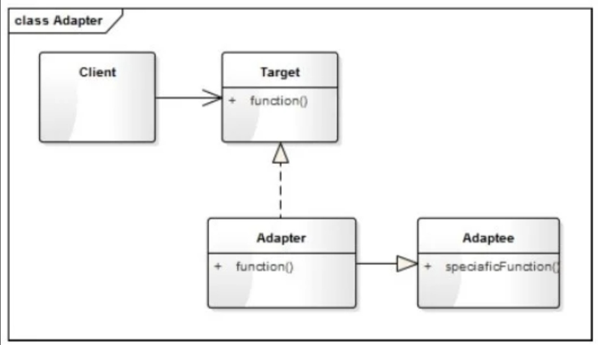

# 适配器模式

## 什么是适配器模式

将一个类的接口变成客户端所期望的另一种接口，从而使原本因接口不匹配而无法一起工作的两个类能够在一起工作。适配器模式分为类结构模式和对象结构模式两种，前者类之间的耦合度比后者高，且要求了解现有组件库中的相关组件，因此应用相对应较少。

适配器模式的作用

1. 接口转换，将原有的接口（或方法）转换成另一种接口
2. 用新的接口包装一个已有的类
3. 匹配一个老的组件到一个新的接口

## 设计思想

适配器模式又叫变压器模式，也叫包装模式(Wrapper)，其核心思想是：将一个对象经过包装或转换后使它符合指定的接口，使得调用方可以像使用接口的一般对象一样使用它。

## 代码框架

```python
from abc import ABCMeta, abstractmethod


class Target(metaclass=ABCMeta):
    """目标类"""
    @abstractmethod
    def function(self):
        pass


class Adaptee:
    """源对象类"""
    def speciaficFunction(self):
        print("被适配对象的特殊功能")


class Adapter(Adaptee, Target):
    """适配器"""
    def function(self):
        print('进行功能的转换')
```

## 类图

适配器的实现有两种方式：一种是组合方式，另一种是继承方式

组合方式实现


继承方式实现


## 适配器模式的结构

适配器模式主要有三个角色

1. 目标(Target)：即期望的目标接口，要转换成的接口
2. 源对象（Adaptee）：即要被转换的角色，要把谁转换成目标角色
3. 适配器(adapter)：适配模式的核心角色，负责把源对象转换和包装成目标对象

## 适配器模式优缺点

1. 优点
   1. 可以让两个没有关联的类一起运行，其中间转换的作用
   2. 提高了类的服用率
   3. 灵活性好，不会破坏原有系统
2. 缺点
   1. 如果原有系统没有设计好(如Target不是抽象类或接口，而是一个实体类)，适配模式将很难实现
   2. 过多地使用适配器，容易使代码结构混乱

```python
from abc import ABCMeta, abstractmethod
import os


class Page:
    """
    电子书一页的内容
    """
    def __init__(self, pageNum):
        self.__pageNum = pageNum

    def getContent(self):
        return "第{}页的内容...".format(self.__pageNum)


class Catalogue:
    """
    目录结构
    """
    def __init__(self, title):
        self.__title = title
        self.__chapters = []

    def addChapter(self, title):
        self.__chapters.append(title)

    def showInfo(self):
        print("书名：{}".format(self.__title))
        print('目录：')
        for chapter in self.__chapters:
            print("     ".format(chapter))


class IBook(metaclass=ABCMeta):
    """电子书文档的接口类"""
    @abstractmethod
    def parseFile(self, filePath):
        """解析文档"""
        pass

    @abstractmethod
    def getCatalogue(self):
        """获取目录"""
        pass

    @abstractmethod
    def getPageCount(self):
        """获取页数"""
        pass

    @abstractmethod
    def getPage(self, pageNum):
        """获取第pageNum页的内容"""
        pass


class TextBook(IBook):
    """TXT解析类"""
    def parseFile(self, filePath):
        # 模拟文档的解析
        print(filePath + " 文件解析成功")
        self.__title = os.path.splitext(filePath)[0]
        self.__pageCount = 500
        return True

    def getCatalogue(self):
        catalogue = Catalogue(self.__title)
        catalogue.addChapter("第一章 标题")
        catalogue.addChapter("第二章 标题")
        return catalogue

    def getPageCount(self):
        return self.__pageCount

    def getPage(self, pageNum):
        return Page(pageNum)


class EpuBook(IBook):
    """EpuBook解析类"""
    def parseFile(self, filePath):
        # 模拟文档的解析
        print(filePath + " 文件解析成功")
        self.__title = os.path.splitext(filePath)[0]
        self.__pageCount = 800
        return True

    def getCatalogue(self):
        catalogue = Catalogue(self.__title)
        catalogue.addChapter("第一章 标题")
        catalogue.addChapter("第二章 标题")
        return catalogue

    def getPageCount(self):
        return self.__pageCount

    def getPage(self, pageNum):
        return Page(pageNum)


class OutLine:
    """第三方PDF解析库的目录类"""
    def __init__(self):
        self.__outlines = []

    def addOutline(self, title):
        self.__outlines.append(title)

    def getOutlines(self):
        return self.__outlines


class PDFPage:
    """PDF页"""
    def __init__(self, pageNum):
        self.__pageNum = pageNum

    def getPageNum(self):
        return self.__pageNum


class ThirdPdf:
    """第三方PDF解析库"""
    def __init__(self):
        self.__pageSize = 0
        self.__title = ''

    def open(self, filePath):
        print("第三方库解析PDF文件：{}".format(filePath))
        self.__title = os.path.splitext(filePath)[0]
        self.__pageCount = 1000
        return True

    def getOutline(self):
        outline = OutLine()
        outline.addChapter("第一章 标题")
        outline.addChapter("第二章 标题")
        return outline

    def pageSize(self):
        return self.__pageSize

    def page(self, index):
        return PDFPage(index)


class PdfAdapterBook(ThirdPdf, IBook):
    """对第三方的PDF重新进行包装"""
    def __init__(self, thirdPdf):
        self.__thirdPdf = thirdPdf

    def getCatalogue(self):
        outline = self.getOutline()
        print("将Outline目录的结构转换成Catalogue结构的目录")
        catalogue = Catalogue(self.__thirdPdf.getTitle())
        for title in outline.getOutlines():
            catalogue.addChapter(title)
        return catalogue

    def getPageCount(self):
        return self.__thirdPdf.pageSize

    def getPage(self, pageNum):
        page = self.page(pageNum)
        print("将pdfPage的面对象转换成Page的对象")
        return Page(page.getPageNum())


class Reader:
    """阅读器"""
    def __init__(self, name):
        self.__name = name
        self.__filePath = ""
        self.__curBook = None
        self.__curPageNum = - 1

    def __initBook(self, filePath):
        self.__filePath = filePath
        extName = os.path.splitext(filePath)[1]
        if (extName.lower() == '.epub'):
            self.__curBook = EpuBook()
        elif extName.lower() == '.txt':
            self.__curBook = TextBook()
        elif extName.lower() == '.pdf':
            self.__curBook = PdfAdapterBook()
        else:
            self.__curBook = None

    def openFile(self, filePath):
        self.__initBook(filePath)
        if self.__curBook is not None:
            rtn = self.__curBook.parseFile(filePath)
            if rtn:
                self.__curPageNum = 1
            return rtn
        return False

    def closeFile(self):
        print("关闭{}文件".format(self.__filePath))
        return True

    def showCatalogue(self):
        catalogue = self.__curBook.getCatalogue()
        catalogue.showInfo()

    def prePage(self):
        print("往前一页：", end='')
        return self.gotoPage(self.__curPageNum - 1)

    def nextPage(self):
        print("往后一页：")
        return self.gotoPage(self.__curPageNum + 1)

    def gotoPage(self, pageNum):
        if pageNum > 1 and pageNum < self.__curBook.getPageCount() - 1:
            self.__curPageNum = pageNum

        print("显示第{}页".foramt(self.__curPageNum))
        page = self.__curBook.getPage(self.__curPageNum)
        page.getContent()
        return page


def testReader():
    reader = Reader('阅读器')
    if not reader.openFile('平凡世界.txt'):
        return
    reader.showCatalogue()
    reader.prePage()
    reader.nextPage()
    reader.nextPage()
    reader.closeFile()

```
